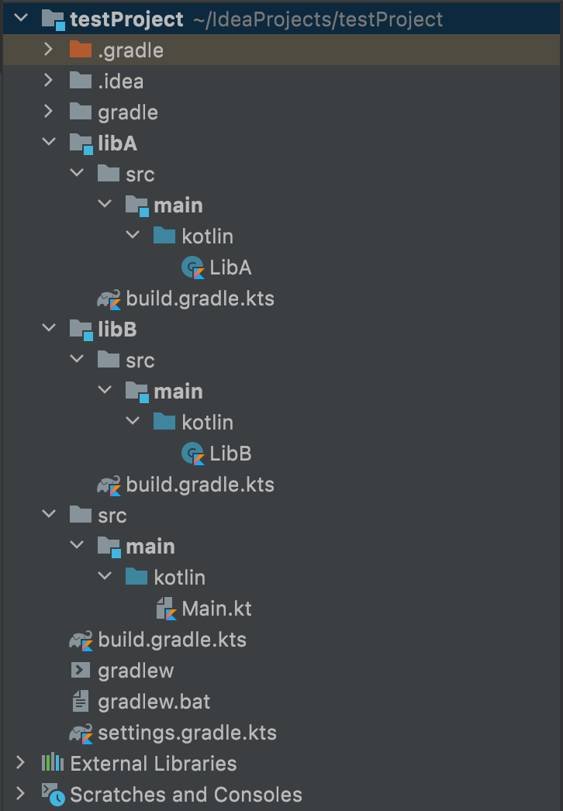

# Dependency configurations

## О конфигурации зависимостей

Каждая зависимость, объявленная для проекта Gradle, применяется к определенной области. Например, некоторые зависимости должны использоваться для компиляции исходного кода, в то время как другие должны быть доступны только во время выполнения. 

:::important

Gradle представляет область зависимости с помощью конфигураций!

:::

Подробнее о конфигурации зависимостей в Gradle можете прочитать [тут](https://docs.gradle.org/current/userguide/declaring_dependencies.html).
За регистрацию конфигураций зависимостей отвечают gradle-плагины. Например, Java плагин по умолчанию добавляет `implementation` и `api` конфигурации. 

## Implementation vs Api

Посмотрим на разницу `implementation` и `api` на примере небольшого проекта.



Создадим два подпроекта: `LibA` и `LibB`. В директории каждого из этих подпроекта создадим собственный `build.gradle.kts` файл для настройки сборки. А в рутовом `build.gradle.kts` подключим плагин `kotlin-jvm`:

```kotlin
/*
*   project/build.gradle.kts
*/

// подключение плагина
plugins {
    kotlin("jvm") version ("1.5.21")
}

// указывает в каких репозиториях
// искать нужные зависимости
allprojects {
    repositories {
        mavenCentral()
    }
}
```

В директории каждого из наших подпроектов создадим директории `src/main/kotlin`. А уже внутри этой директории создадим файл `LibA.kt` или `LibB.kt` соответствующий конкретному модулю:

```kotlin
/* 
*   project/LibA/src/main/kotlin/LibA.kt
*/

class LibA {
    fun hello() = println("Hello!!!")
}
```

```kotlin
/* 
*   project/LibA/src/main/kotlin/LibB.kt
*/

class LibB {
    fun hello(): Unit = LibA().hello()
    fun getLibA(): LibA = LibA()
}
```

Для корректной сборки с конфигурациями `api` и `implementation` нужно подключить jvm-плагин в каждый из наших подпроектов, причем `LibB` будет зависеть от `LibA` типом `implementation`:

```kotlin
/* 
*   project/LibA/src/main/kotlin/build.gradle.kts
*/

plugins {
    kotlin("jvm")
}
```

```kotlin
/* 
*    project/LibB/src/main/kotlin/build.gradle.kts
*/

plugins {
    kotlin("jvm")
}

dependencies {
    implementation(project(":libA"))
}
```

В корне нашего проекта заведем директорию `src/main/kotlin` с файлом `Main.kt`, которая и будет входной точкой нашего приложения:
```kotlin
/*
*   project/src/main/kotlin/Main.kt
*/

fun main() {
    // code
}
```

Чтобы использовать классы из подпроекта в исходном коде основного проекта нужно прописать зависимость в рутовом `build.gradle.kts`:

```kotlin
/*
*   project/build.gradle.kts
*/

// ...

dependencies {
    implementation(project(":libB"))
}
```

Теперь напишем немного кода в нашем `Main.kt`:

```kotlin
/*
*   project/src/main/kotlin/Main.kt
*/

fun main() {
    LibB().hello() // good
    val libA = LibB().getLibA() // error
}
```

После запуска вашего кода вы увидите такую ошибку:


Зависимость с конфигурацией `implementation`, с помощью которой мы подключили `LibA` к `LibB`, используется во время компиляции и во время выполнения для текущего модуля, но не предоставляется для компиляции других модулей. Именно из-за этого исходный код нашего приложения не видит класс из подпроекта `LibA`. 

Если же в `build.gradle.kts` подпроекта `LibB` указать тип конфигурации `api` для подключения подпроекта `LibA`, то ошибки не будет.

```kotlin
/* 
*    project/LibB/src/main/kotlin/build.gradle.kts
*/

plugins {
    kotlin("jvm")
}

dependencies {
    api(project(":libA"))
}
```


Тип зависимости `api` используется как во время компиляции, так и во время выполнения и экспортируется пользователям библиотек.

Наглядную разницу между этими двумя типами конфигурации зависимостей можете увидеть на диаграмме:


## Classpath

Если вашему скрипту сборки необходимо использовать внешние зависимости, вы можете добавить их в путь к классам в самом сценарии сборки. В корневом `build.gradle.kts` как раз используется блок `buildscript`. Объявить путь к классам сценария сборки вы можете использовав метод `classpath`. 

Для мультипроектной сборки, зависимости, объявленные с помощью метода `buildscript()`, доступны для сценариев сборки всех его подпроектов.

Рассмотрим небольшой пример, в котором мы подключим уже знакомый нам плагин `kotlin-jvm`, но не через метод `plugins()`.

```kotlin
/*
*   project/build.gradle.kts
*/

buildscript {
    repositories {
        gradlePluginPortal()
    }
    dependencies {
        classpath("org.jetbrains.kotlin.jvm:org.jetbrains.kotlin.jvm:gradle.plugin:1.5.20")
    }
}
```

Мы подключили тот же самый плагин, но уже через путь до артефакта, лежащего в репозитории [gradle plugins](https://plugins.gradle.org/plugin/org.jetbrains.kotlin.jvm).

Для проверки корректного подключения плагина к проекту можете выполнить таску `buildEnvironment` из терминала или IDE:

```bash
gradle buildEnvironment
```

Вы увидите такую архитектуру зависимостей:

```bash
------------------------------------------------------------
Root project 'testProject'
------------------------------------------------------------
classpath
+--- org.jetbrains.kotlin.jvm:org.jetbrains.kotlin.jvm.gradle.plugin:1.5.21
|    \--- org.jetbrains.kotlin:kotlin-gradle-plugin:1.5.21
|         +--- org.jetbrains.kotlin:kotlin-gradle-plugin-api:1.5.21
|         |    +--- org.jetbrains.kotlin:kotlin-native-utils:1.5.21
|         |    |    \--- org.jetbrains.kotlin:kotlin-util-io:1.5.21
|         |    |         \--- org.jetbrains.kotlin:kotlin-stdlib:1.5.21 -> 1.4.31
|         |    |              +--- org.jetbrains.kotlin:kotlin-stdlib-common:1.4.31
|         |    |              \--- org.jetbrains:annotations:13.0
|         |    \--- org.jetbrains.kotlin:kotlin-project-model:1.5.21
|         |         \--- org.jetbrains.kotlin:kotlin-stdlib:1.5.21 -> 1.4.31 (*)
|         +--- org.jetbrains.kotlin:kotlin-gradle-plugin-model:1.5.21
|         +--- org.jetbrains.kotlin:kotlin-util-klib:1.5.21
|         |    +--- org.jetbrains.kotlin:kotlin-stdlib:1.5.21 -> 1.4.31 (*)
|         |    \--- org.jetbrains.kotlin:kotlin-util-io:1.5.21 (*)
|         +--- org.jetbrains.kotlin:kotlin-klib-commonizer-api:1.5.21
|         |    +--- org.jetbrains.kotlin:kotlin-stdlib:1.5.21 -> 1.4.31 (*)
|         |    \--- org.jetbrains.kotlin:kotlin-native-utils:1.5.21 (*)
|         +--- org.jetbrains.kotlin:kotlin-tooling-metadata:1.5.21
|         |    +--- org.jetbrains.kotlin:kotlin-stdlib:1.5.21 -> 1.4.31 (*)
|         |    \--- com.google.code.gson:gson:2.8.6
|         +--- org.jetbrains.kotlin:kotlin-project-model:1.5.21 (*)
|         +--- com.google.code.gson:gson:2.8.6
|         +--- com.google.guava:guava:29.0-jre
|         |    +--- com.google.guava:failureaccess:1.0.1
|         |    +--- com.google.guava:listenablefuture:9999.0-empty-to-avoid-conflict-with-guava
|         |    +--- com.google.code.findbugs:jsr305:3.0.2
|         |    +--- org.checkerframework:checker-qual:2.11.1
|         |    +--- com.google.errorprone:error_prone_annotations:2.3.4
|         |    \--- com.google.j2objc:j2objc-annotations:1.3
|         +--- de.undercouch:gradle-download-task:4.1.1
|         +--- com.github.gundy:semver4j:0.16.4
|         +--- org.jetbrains.kotlin:kotlin-compiler-embeddable:1.5.21
|         |    +--- org.jetbrains.kotlin:kotlin-stdlib:1.5.21 -> 1.4.31 (*)
|         |    +--- org.jetbrains.kotlin:kotlin-script-runtime:1.5.21
|         |    +--- org.jetbrains.kotlin:kotlin-reflect:1.5.21 -> 1.4.31
|         |    |    \--- org.jetbrains.kotlin:kotlin-stdlib:1.4.31 (*)
|         |    +--- org.jetbrains.kotlin:kotlin-daemon-embeddable:1.5.21
|         |    \--- org.jetbrains.intellij.deps:trove4j:1.0.20181211
|         +--- org.jetbrains.kotlin:kotlin-annotation-processing-gradle:1.5.21
|         |    +--- org.jetbrains.kotlin:kotlin-stdlib:1.5.21 -> 1.4.31 (*)
|         |    \--- org.jetbrains.kotlin:kotlin-compiler-embeddable:1.5.21 (*)
|         +--- org.jetbrains.kotlin:kotlin-android-extensions:1.5.21
|         |    \--- org.jetbrains.kotlin:kotlin-compiler-embeddable:1.5.21 (*)
|         +--- org.jetbrains.kotlin:kotlin-compiler-runner:1.5.21
|         |    +--- org.jetbrains.kotlin:kotlin-build-common:1.5.21
|         |    +--- org.jetbrains.kotlin:kotlin-daemon-client:1.5.21
|         |    |    +--- org.jetbrains.kotlinx:kotlinx-coroutines-core:1.3.8
|         |    |    |    +--- org.jetbrains.kotlin:kotlin-stdlib:1.3.71 -> 1.4.31 (*)
|         |    |    |    \--- org.jetbrains.kotlin:kotlin-stdlib-common:1.3.71 -> 1.4.31
|         |    |    \--- org.jetbrains.kotlin:kotlin-reflect:1.5.21 -> 1.4.31 (*)
|         |    +--- org.jetbrains.kotlinx:kotlinx-coroutines-core:1.3.8 (*)
|         |    \--- org.jetbrains.kotlin:kotlin-compiler-embeddable:1.5.21 (*)
|         +--- org.jetbrains.kotlin:kotlin-scripting-compiler-embeddable:1.5.21
|         |    +--- org.jetbrains.kotlin:kotlin-scripting-compiler-impl-embeddable:1.5.21
|         |    |    +--- org.jetbrains.kotlin:kotlin-scripting-common:1.5.21
|         |    |    |    +--- org.jetbrains.kotlin:kotlin-stdlib:1.5.21 -> 1.4.31 (*)
|         |    |    |    \--- org.jetbrains.kotlinx:kotlinx-coroutines-core:1.3.8 (*)
|         |    |    +--- org.jetbrains.kotlin:kotlin-scripting-jvm:1.5.21
|         |    |    |    +--- org.jetbrains.kotlin:kotlin-script-runtime:1.5.21
|         |    |    |    +--- org.jetbrains.kotlin:kotlin-stdlib:1.5.21 -> 1.4.31 (*)
|         |    |    |    \--- org.jetbrains.kotlin:kotlin-scripting-common:1.5.21 (*)
|         |    |    +--- org.jetbrains.kotlin:kotlin-stdlib:1.5.21 -> 1.4.31 (*)
|         |    |    \--- org.jetbrains.kotlinx:kotlinx-coroutines-core:1.3.8 (*)
|         |    \--- org.jetbrains.kotlin:kotlin-stdlib:1.5.21 -> 1.4.31 (*)
|         \--- org.jetbrains.kotlin:kotlin-scripting-compiler-impl-embeddable:1.5.21 (*)
+--- org.jetbrains.kotlin:kotlin-stdlib:{strictly 1.4.31} -> 1.4.31 (c)
+--- org.jetbrains.kotlin:kotlin-reflect:{strictly 1.4.31} -> 1.4.31 (c)
+--- org.jetbrains.kotlin:kotlin-stdlib-common:{strictly 1.4.31} -> 1.4.31 (c)
\--- org.jetbrains:annotations:{strictly 13.0} -> 13.0 (c)
```

Проверим, появлись ли таски, которые предосталяет подключенный нами плагин, для этого можете выполнить задачу
`tasks` из терминала или IDE:

```bash
gradle tasks
```

Вывод будет примерно таким: 
```bash
------------------------------------------------------------
Tasks runnable from root project 'testProject'
------------------------------------------------------------

Build Setup tasks
-----------------
init - Initializes a new Gradle build.
wrapper - Generates Gradle wrapper files.

Help tasks
----------
buildEnvironment - Displays all buildscript dependencies declared in root project 'testProject'.
dependencies - Displays all dependencies declared in root project 'testProject'.
dependencyInsight - Displays the insight into a specific dependency in root project 'testProject'.
help - Displays a help message.
javaToolchains - Displays the detected java toolchains.
kotlinDslAccessorsReport - Prints the Kotlin code for accessing the currently available project extensions and conventions.
outgoingVariants - Displays the outgoing variants of root project 'testProject'.
projects - Displays the sub-projects of root project 'testProject'.
properties - Displays the properties of root project 'testProject'.
tasks - Displays the tasks runnable from root project 'testProject' (some of the displayed tasks may belong to subprojects).
```

Таски не появились, т.к плагин подключенный при помощи `classpath` сразу не применяется. 
Чтобы заюзать этот плагин в нашем рутовом `build.gradle.kts` необходимо использовать метод `apply()`. В подпроктах же вы можете подключить этот плагин
используя привычный метод `plugins()`. Это происходит из-за того, что сборщик gradle не может проиндексировать id плагина,
 подключенного в том же build-файле, в котором он добавляется в classpath.

 ```kotlin
/*
*   project/build.gradle.kts
*/

buildscript {
    // ...
}

apply(plugin = "org.jetbrains.kotlin.jvm")
```

```kotlin
/*
*   project/libA/build.gradle.kts
*/

plugins {
    id("org.jetbrains.kotlin.jvm")
}
```

Снова запустим задачу `tasks` и увидим пополненый список тасок: 

```bash
> Task :tasks
------------------------------------------------------------
Tasks runnable from root project 'testProject'
------------------------------------------------------------

Build tasks
-----------

# ...

Build Setup tasks
-----------------

# ...

Documentation tasks
-------------------
javadoc - Generates Javadoc API documentation for the main source code.

Help tasks
----------

# ...

Verification tasks
------------------
check - Runs all checks.
test - Runs the unit tests.

# ...
```

## boilerplate-проект

Перейдем к boilerplate-шаблону для того, чтобы понять как подключаются зависимости на наших проектах.

```kotlin
/*
*   mobile-moko-boilerplate/build.gradle.kts
*/

buildscript {
    // указание репозиториев, в которых он будет искать указанные в зависимостях модули
    repositories {
        mavenCentral()
        google()
        gradlePluginPortal()

        jcenter {
            content {
                includeGroup("org.jetbrains.trove4j")
            }
        }
    }
    // добавление зависимостей в выполнение gradle скриптов
    // как мы уже выяснили они действительны для любых подпроектов
    dependencies {
        classpath("dev.icerock.moko:resources-generator:0.16.1")
        classpath("dev.icerock.moko:network-generator:0.16.0")
        classpath("dev.icerock.moko:units-generator:0.6.1")
        classpath("org.jetbrains.kotlin:kotlin-serialization:1.5.20")
        classpath("com.google.firebase:firebase-crashlytics-gradle:2.7.1")
        classpath("com.google.gms:google-services:4.3.8")
        classpath("com.google.dagger:hilt-android-gradle-plugin:2.35")
        classpath(":build-logic")
    }
}

allprojects {
    // принудительное использование coroutines-native-mt
    configurations.configureEach {
        resolutionStrategy {
            val coroutines: MinimalExternalModuleDependency = rootProject.libs.coroutines.get()
            val forcedCoroutines: ModuleVersionSelector = DefaultModuleVersionSelector.newSelector(
                coroutines.module,
                coroutines.versionConstraint.requiredVersion
            )
            force(forcedCoroutines)
        }
    }
}

// таска на очистку билдов проекта
tasks.register("clean", Delete::class).configure {
    group = "build"
    delete(rootProject.buildDir)
}
```

Теперь посмотрим на `build.gradle.kts` файлы, которые лежат в `build-logic` и `mpp-library`:

```kotlin
/*
*   mobile-moko-boilerplate/build-logic/build.gradle.kts
*/

plugins {
    `kotlin-dsl`
}

// репозитории для поиска нужных зависимостей
repositories {
    mavenCentral()
    google()

    gradlePluginPortal()
}

// подключение зависимостей к композитному проекту
// предоставляющий функционал внутренних библиотек
dependencies {
    api("dev.icerock:mobile-multiplatform:0.12.0")
    api("org.jetbrains.kotlin:kotlin-gradle-plugin:1.5.21")
    api("com.android.tools.build:gradle:4.2.1")
    api("io.gitlab.arturbosch.detekt:detekt-gradle-plugin:1.15.0")
}
```


Для дальнейшего изучения нужно понимать, что такое sourceset'ы, о них вы можете прочитать [тут](https://kotlinlang.org/docs/mpp-dsl-reference.html#source-sets). 

Если мы хотим использовать зависимости для конкретного sourceset'а мы можем воспользоваться следующим шаблоном:

```kotlin
<sourceSetName><dependencyType>(...)
```

Эти методы как раз генерирует плагин `kotlin-multiplatform`.

```kotlin
/*
*   mobile-moko-boilerplate/mpp-library/build.gradle.kts
*/

dependencies {
    // зависмотсти, нужные для внутренней логики модуля
    // подключаются к sourceset'у commonMain
    commonMainImplementation(libs.coroutines)
    commonMainImplementation(libs.kotlinSerialization)
    commonMainImplementation(libs.ktorClient)
    commonMainImplementation(libs.ktorClientLogging)

    // зависимости, нужные для внутренней логики модуля в android source-set'е
    androidMainImplementation(libs.lifecycleViewModel)

    // зависимости нужные для sourceset'а commonMainсамого модуля 
    // и для пользователей библиотеки
    commonMainApi(projects.mppLibrary.feature.auth)
    commonMainApi(libs.multiplatformSettings)
    commonMainApi(libs.napier)
    commonMainApi(libs.mokoParcelize)
    commonMainApi(libs.mokoResources)
    commonMainApi(libs.mokoMvvmCore)
    commonMainApi(libs.mokoMvvmLiveData)
    commonMainApi(libs.mokoMvvmState)
    commonMainApi(libs.mokoUnits)
    commonMainApi(libs.mokoFields)
    commonMainApi(libs.mokoNetwork)
    commonMainApi(libs.mokoErrors)
    commonMainApi(libs.mokoNetworkErrors)
    commonMainApi(libs.mokoCrashReportingCore)
    commonMainApi(libs.mokoCrashReportingCrashlytics)
    commonMainApi(libs.mokoCrashReportingNapier)

    // зависимости, нужные для внутренней логики модуля в тестовом source-set'е
    commonTestImplementation(libs.mokoTestCore)
    commonTestImplementation(libs.mokoMvvmTest)
    commonTestImplementation(libs.mokoUnitsTest)
    commonTestImplementation(libs.multiplatformSettingsTest)
    commonTestImplementation(libs.ktorClientMock)
}
```

## Материалы

- [Документация - Multiplatform Gradle DSL reference](https://kotlinlang.org/docs/mpp-dsl-reference.html)
- [Документация - Gradle declaring dependencies](https://docs.gradle.org/current/userguide/declaring_dependencies.html)
- [Документация - MPP Dependencies](https://kotlinlang.org/docs/mpp-add-dependencies.html)
