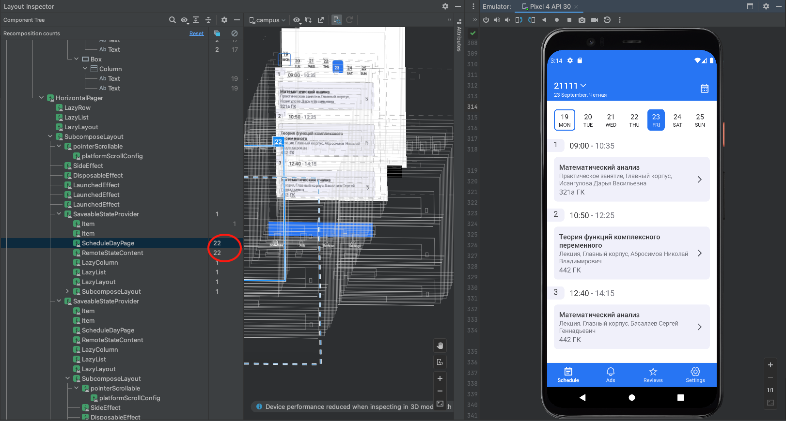
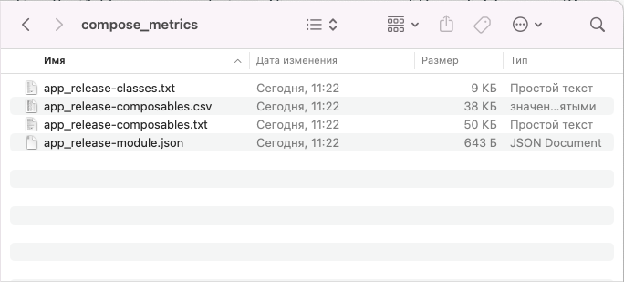
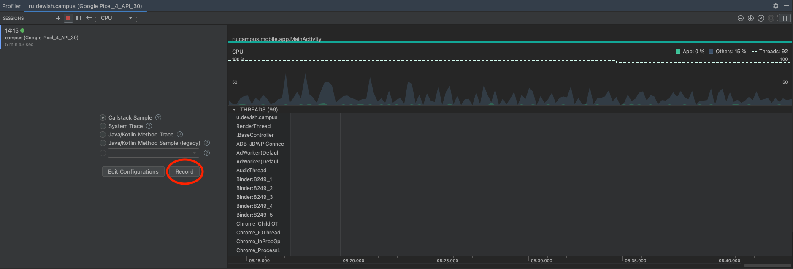
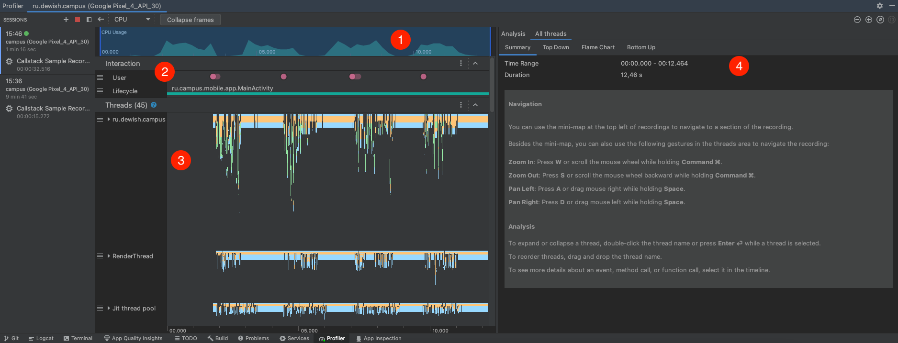
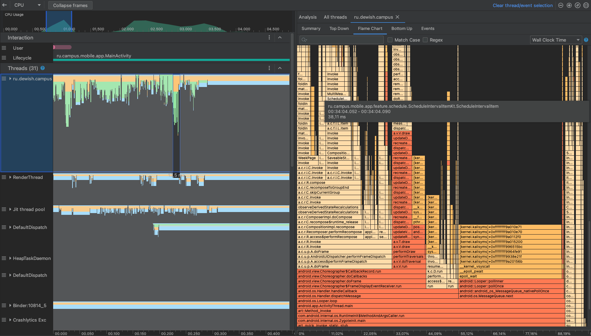

# Профилирование Jetpack Compose

## Оптимизируй или сдохни

Когда в гуглплее посыпятся жалобы на зависания и заторможенность вашего новенького, свеженького
приложения на композе(а они возникнут), вам пригодятся советы по оптимизации и профилированию,
описанные в данной статье.

Разберем эти советы на примере приложения Кампус - приложения для просмотра расписания занятий.
Основная фича это экран расписания, состоящий из
двух [Pager'ов](https://google.github.io/accompanist/pager/) для недели и дня, свайпы по которым
вызывали зависания у пользователей.

## Рекомпозиции

Первое, на что нужно обратить внимание -
понятие [рекомпозиции](https://developer.android.com/jetpack/compose/mental-model#recomposition).

Рендер экрана в Compose состоит из прохода по
графу [composable](https://developer.android.com/reference/kotlin/androidx/compose/runtime/Composable)
функций. Если состояние вершины графа меняется - меняются аргументы composable метода, значения
MutableState или анимации, то вызывается перестроение подграфа, т.е. повторный вызов функций, это
перестроение называется **рекомпозицией**. Перестроения выполняются быстро, и не должны вызывать
проблем, но частые рекомпозиции могут вызывать подтормаживания.

Это одновременно и главная особенность композа, и его подводный камень. Ведь разработчик может
доспустить ошибки, которые могут привести к излишним рекомпозициям, например пересоздавать объект
вместо переиспользования. Это приведет к излишним вычислениям и проблемам с производительностью.

На больших проектах эти ошибки можно не заметить невооруженным глазом, поэтому Android Studio
предлагает вооружить наш глаз
тулзой [Recomposition Counts](https://developer.android.com/jetpack/compose/performance#recomposition-counts)

## Recomposition Counts

Вы можете использовать Layout Inspector для проверки, как часто composable функция вызывается заново
или пропускается.
Следуйте [инструкции](https://developer.android.com/jetpack/compose/tooling#recomposition-counts),
чтобы открыть необходимую статистику.

После добавления recomposition counts в инспекторе у нас появятся два столбца, отвечающие за число
рекомпозиций и пропусков каждого composable метода.

На примере Кампуса проверим, есть ли у нас излишние рекомпозиции, запустим проект на симуляторе и
перейдем в Layout Inspector:
Заметили, что при cвайпе на следующий день метод ``ScheduleDayPage`` и ``RemoteStateContent``
рекомпозируются по 3 раза и не пропускаются вовсе(по логике он должен рекомпозироваться один раз)




Таким образом нам удалось локализовать проблему, мы зафиксировали метод, которому следует уделить
пристальное внимание:

```kotlin
@Composable
fun ScheduleDayPage(
    state: RemoteState<ScheduleDay>,
    onItemClick: (ScheduleDetails) -> Unit,
    viewAds: (ScheduleDay.Lesson) -> Unit,
    clickOnAds: (ScheduleDay.Lesson) -> Unit
) {
}
```

## Стабильные типы

Чтобы понять почему метод рекомпозируется несколько раз нужно познакомиться с
понятием [стабильности](https://developer.android.com/reference/kotlin/androidx/compose/runtime/Stable)
.

Стабильность это гарантия компилятору что тип не будет изменяться, либо уведомит о своем изменении.
Компилятор не будет запускать проверку на изменение состояния composable метода, если все его
агрументы будут стабильными.

Следовательно **Стабильными типами** данных называют типы, инстансы которых неизменяемы, либо
уведомляют композицию об изменении своего состояния.
Помимо стабильных и нестабильных типов выделяют третий тип: иммутабельный. Это более строгий класс,
который гарантирует, что обьект не будет изменен вообще.

Более строгое определение стабильного типа выглядит так:

**Стабильный тип** должен соответствовать следующим требованиям:

1. Результат вызова equals для двух инстансов будет всегда одинаков;
2. Если публичное поле класса изменяется, то композиция об этом узнает;
3. Все публичные поля имеют стабильный тип.

Чтобы третье условие соблюдалось, требуется наличие стабильных типов, которые разработчики могут
использовать для создания собственных типов данных. Jetpack Compose Compiler считает стабильными
следующие типы:
Примитивные типы,
String,
Функциональные типы,
Перечисления.

В [статье](https://medium.com/@denisgolubev1999/jetpack-compose-под-капотом-рекомпозиция-и-стабильные-типы-9598f8b62006)
, которую я рекомендую для более глубокого понимания определений рекомпозиции и стабильных типов,
приведен следующий пример:

```kotlin
// Все поля класса неизменяемы. StableClass1 стабильный
class StableClass1(
    val immutableValue: Int
)

// Композиция узнает об изменении состояния благодаря MutableState. StableClass2 стабильный
class StableClass2(
    val mutableState: MutableState<String>
)

// Имеются изменяемые поля. UnstableClass1 нестабильный
class UnstableClass1(
    var immutableValue: String
)

// Тип поля unstableTypeField нестабильный. UnstableClass2 нестабильный
class UnstableClass2(
    val unstableTypeField: UnstableClass1
)
```

:::info
Так же разработчики могут помечать классы аннотациями ``@Stable`` и ``@Immuatable``.
:::

## Composable metrics

Для выявления стабильных и нестабильных типов, а так же пропускаемых и перезапускаемых методов,
которые мы обнаружили с помощью **recomposition counts**, можно воспользоваться
тулзой [composable metrics](https://chris.banes.dev/composable-metrics/).

Для получения статистики по проекту нужно добавить таску в `app/build.gradle.kts` и запустить
релизную сборку с активным флажком, согласно статье.



В результате в папке `build/compose_metrics` мы обнаружим 4 файла, которые содержат соответственно:

- app_release-classes.txt - информацию по стабильности классов

```text
unstable class MigrationScreen {
  unstable val navController: NavController
  <runtime stability> = Unstable
}
stable class ExpandedStateStrings {
  stable val expandString: String
  stable val collapseString: String
  <runtime stability> = Stable
}
```

- app_release-composables.txt - информацию рекомпозируемый метод или пропускаемый

```text
restartable skippable scheme("[androidx.compose.ui.UiComposable]") fun TopAppBarTitle(
  stable modifier: Modifier? = @static Companion
  stable name: String
  stable date: String
  stable weekName: String?
  stable menuExpanded: MutableState<Boolean>
)
```

- app_release-composables.csv - тот же файл только в виде таблицы
- app_release-module.json - общую информацию по проекту

```text
{
"skippableComposables": 693,
"restartableComposables": 838,
"readonlyComposables": 0,
"totalComposables": 882,
...
}
```

Вернемся к Кампусу, нам был интересен метод ``ScheduleDayPage``, для поиска информации по нему
перейдем в файл `app_release-composables.txt`

```text
restartable scheme("[androidx.compose.ui.UiComposable]") fun ScheduleDayPage(
unstable state: RemoteState<ScheduleDay>
stable onItemClick: Function1<ScheduleDetails, Unit>
stable viewAds: Function1<Lesson, Unit>
stable clickOnAds: Function1<Lesson, Unit>
)
```

Как мы уже поняли, этот метод не является ``skippable`` и будет рекомпозироваться при любом удобном
случае. Так же можем видеть, что аргумент ``state`` является нестабильным.

Для того чтобы поправить это, можем добавить аннотацию ``@Immutable`` классам ``RemoteState``
и ``ScheduleDay``, убедившись, что данные классы не будут меняться после создания.

:::caution
Не следует вешать эту аннотацию классам с var полями или содержащим списки
:::

Это решило проблему нестабильного класса, но с этим методом еще не все окончено. Он уже помечен в
метрике, как `skippable`, однако в инспекторе мы все еще замечаем ненужные рекомпозиции.

## Нестабильные лямбды

У нашего класса ``ScheduleDayPage`` в качестве аргументов также идут функции, с которыми нужно быть
осторожным в композе. Перейдем к месту инициализации метода:

```kotlin
@Composable
internal fun ScheduleScreenContent(
    selectedDate: LocalDate,
    onDateSelected: (LocalDate) -> Unit,
    onItemClick: (ScheduleDetails) -> Unit,
    viewAds: (LocalDate, ScheduleDay.Lesson) -> Unit,
    clickOnAds: (LocalDate, ScheduleDay.Lesson) -> Unit,
    scheduleDayForDate: (LocalDate) -> StateFlow<RemoteState<ScheduleDay>>
) {
    CalendarDayPager(
        selectedDate = selectedDate,
        onDateSelected = onDateSelected,
        dayContent = { date ->
            val scheduleDayFlow: StateFlow<RemoteState<ScheduleDay>> = remember(date) {
                scheduleDayForDate(date)
            }
            val scheduleDay: RemoteState<ScheduleDay> by scheduleDayFlow.collectAsState()
            ScheduleDayPage(
                state = scheduleDay,
                onItemClick = onItemClick,
                viewAds = { lesson -> viewAds(date, lesson) },
                clickOnAds = { lesson -> clickOnAds(date, lesson) }
            )
        }
    )
}
```

Следует обратить внимание на то, как предаются функции в наш метод ``ScheduleDayPage``.

В Compose есть такое понятие, как **нестабильные лямбды**, которое было хорошо описано
в [данной статье](https://multithreaded.stitchfix.com/blog/2022/08/05/jetpack-compose-recomposition/)

В статье следует обратить внимание на то, как компилятор обрабатывает лямбды, а именно создает
анонимный класс с методом ``invoke()``, в котором находится содержимое лямбды. Иными словами, каждый
раз при передаче лямбды мы создаем объект анонимного класса, который при этом не имеет хэша, по
которому компилятор сравнил бы его на шаге перестройки. Следовательно компилятор посчитает, что
состояние узла графа поменялось и нужно провести рекомпозицию.

:::caution
Следовательно **composable metrics** не отметит лямбды, как ``Unstable``, но рекомпозиция проведена
будет.
:::

Кроме того у лямбды помимо передаваемых аргументов, есть аргументы извне, такие как контекст, из-за
которых нагенерированные компилятором классы будут отличаться.

В той же статье приводится 4 решешния данной ошибки:

### 1. Ссылки на методы

Использовать ссылки на методы вместо лямбды, так мы предотвратим создание нового класса. Ссылки на
методы являются ``Stable`` функциональными типами и будут оставаться эквивалентными между
композициями.

```kotlin
// Вместо лямбды
{ lesson ->
    viewModel.playHooky(lesson)
}
// использовать ссылку на метод
viewmodel::playHooky
```

### 2. Использование remember

Другой вариант - запоминать экземпляр лямбды между композициями. Это гарантирует, что точно такой же
экземпляр лямбды будет повторно использоваться при дальнейших композициях.

```kotlin
// Создать запоминаемый объект и передавать при инициализации его
val playHookyRemember: (Lesson) -> Unit = remember { { viewModel.playHooky(it) } }
```

:::info
Документация
Android [советует](https://developer.android.com/jetpack/compose/performance#use-remember) не
забывать про remember
:::

### 3. Статичные функции

Если лямбда-выражение просто вызывает функцию верхнего уровня, то компилятор посчитает лямбду
стабильной, тк функции верхнего уровня не получают аргументы извне, такие как контекст.

### 4. Использование @Stable в лямбде

Пока выражение в лямбде затрагивает только другие стабильные типы, оно не будет перестраиваться
компилятором при рекомпозиции графа.

```kotlin
var skippedLessons by remember { mutableStateOf(listOf("Biology", "Geography", "Chemistry")) }
Schedule(
    playHooky = { lesson ->
        skippedLessons += lesson
    }
)
```

Вернувшись к Кампусу, используя полученные знания, можем исправить неправильные передачи лямбды
следующим образом:

```kotlin
@Composable
internal fun ScheduleScreenContent(
    selectedDate: ComposeDate,
    onDateSelected: (LocalDate) -> Unit,
    onItemClick: (ScheduleDetails) -> Unit,
    viewAds: (LocalDate, ScheduleDay.Lesson) -> Unit,
    clickOnAds: (LocalDate, ScheduleDay.Lesson) -> Unit,
    scheduleDayForDate: (LocalDate) -> StateFlow<RemoteState<ScheduleDay>>
) {
    CalendarDayPager(
        selectedDate = selectedDate,
        onDateSelected = onDateSelected,
        dayContent = { date ->
            val scheduleDayFlow: StateFlow<RemoteState<ScheduleDay>> = remember(date) {
                scheduleDayForDate(date.toLocalDate())
            }
            val scheduleDay: RemoteState<ScheduleDay> by scheduleDayFlow.collectAsState()

            // Вынесли лямбду в отдельный объект используя remember 
            val viewAdsRemember: (ScheduleDay.Lesson) -> Unit =
                remember(date) { { lesson -> viewAds(date.toLocalDate(), lesson) } }

            // Вынесли лямбду в отдельный объект используя remember 
            val clickOnAdsRemember: (ScheduleDay.Lesson) -> Unit =
                remember(date) { { lesson -> clickOnAds(date.toLocalDate(), lesson) } }

            ScheduleDayPage(
                state = scheduleDay,
                onItemClick = onItemClick,
                viewAds = viewAdsRemember,
                clickOnAds = clickOnAdsRemember
            )
        }
    )
}
```

## CPU Profiling

Самым весомым оружием в борьбе с зависаними
является [профилирование CPU](https://developer.android.com/studio/profile/cpu-profiler), а
оптимизация использования процессора вашего приложения имеет много преимуществ, таких как
обеспечение более быстрого и плавного взаимодействия с пользователем и сохранение времени автономной
работы устройства.

Вы можете использовать профилировщик ЦП для проверки использования ЦП вашего приложения и активности
потоков в режиме реального времени во время взаимодействия с вашим приложением.

Как запусить профилирование хорошо описано
в [статье](https://medium.com/androiddevelopers/spot-your-ui-jank-using-cpu-profiler-in-android-studio-9a4c41a54dab)
, разберем какие возможности дает нам эта статистика на примере Кампуса.

Запустим проект на симуляторе и перейдем во вкладку ``Profiler``.


После запуска приложения появится графики ``CPU``, ``MEMORY``, ``ENERGY``. Нас интересует статистика
для ``CPU``, в детальном виде статистики вы должны увидеть следующее:



Чтобы создать запись статистики щелкните ``Record``, позаимодействуйте с приложением и
нажмите ``Stop``.

После создания записи вы должны увидеть следующее окно с графиком загрузки процессора на записанном
интервале ``CPU Usage`` (1), статистикой по взаимодействиям с приложением ``Interaction`` (2),
потоками ``Threads`` (3) и детальной
статистикой по потоку ``Analysis`` (4).



Нас дальше будет интересовать вкладка **Flame Chart**, в которой находится график, представляющий
собой граф вызовов функций с занимаемым ими временем работы процессора. С помощью него
удобно находить выделяющиеся по времени процессы, которые можно оптимизировать.

Для начала выберем интересующий нас интервал. В моем случае записаны 4 свайпа по экрану расписания
Кампуса, выберу один из них в окне ``CPU Usage``.

Далее его можно приблизить более детально в окне ``Threads``.



**На что обращать внимание:** 

:::info
Более подробную информацию по возможностям профилировщика ЦП можно найти
в [статье](https://russianblogs.com/article/9627812896/)
:::