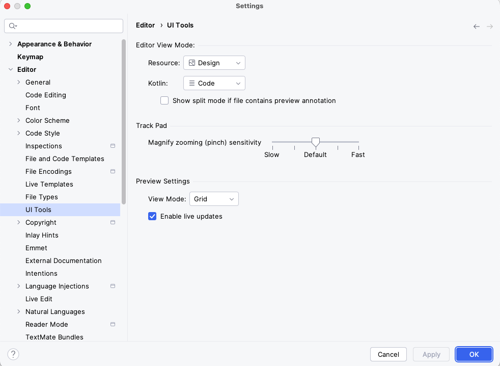

# Tips

## Режим редактора по умолчанию

Если вас раздражает стандартный режим редактирования "Split" для Compose c Preview, вы можете изменить его поведение.
Перейдите Settings → Editor → UI Tools и снимите галку в пункте "Show split mode if file contains preview annotation"

