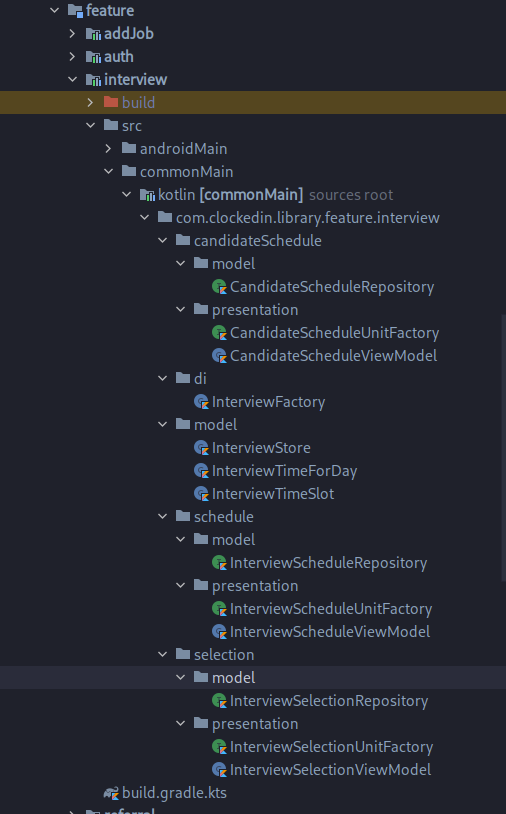

# Структура фичи

Фича разделяется на под-фичи, которые используют:
- одну и ту же фабрику
- общие модели данных в рамках фичи

Пример, как реализовано в ClockedIn:  

Большая фича **interview** содержит под-фичи: **candidateSchedule**, **schedule**, **selection**, имеющие свои репозитории и view-компоненты.