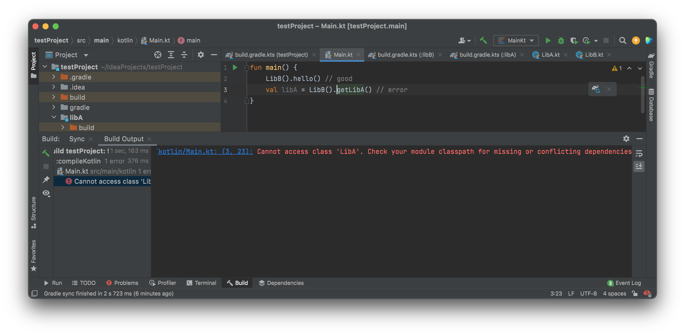
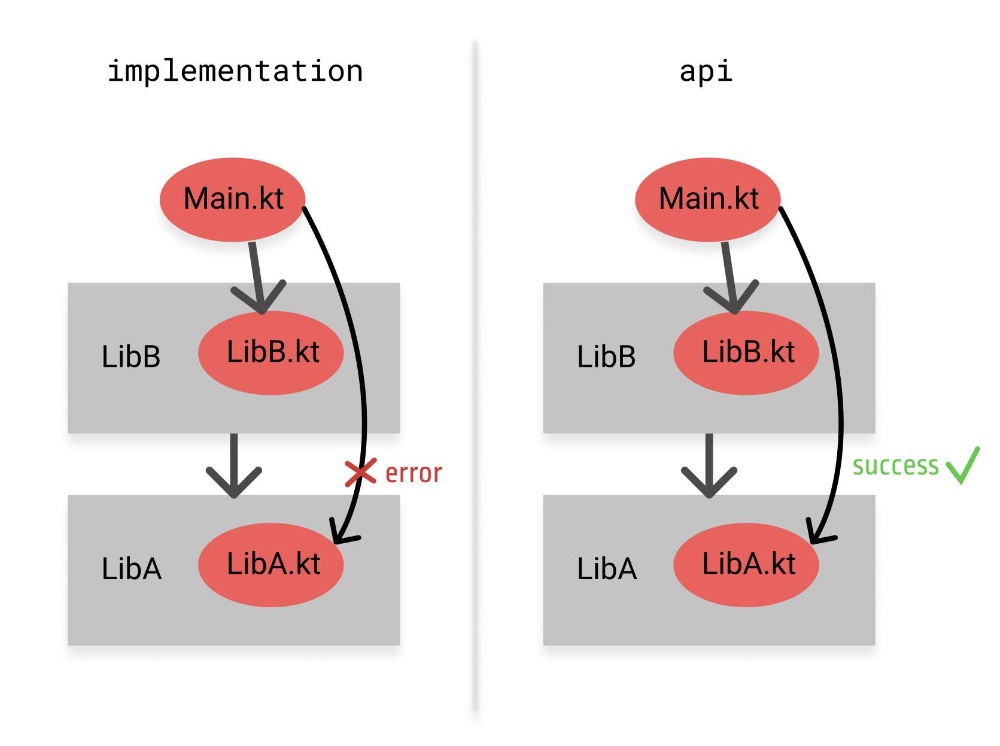

# Dependency configurations

Каждая зависимость, объявленная для проекта Gradle, применяется к определенной области. Например, некоторые зависимости должны использоваться для компиляции исходного кода, в то время как другие должны быть доступны только во время выполнения. 

:::important

Gradle представляет область зависимости с помощью конфигураций!

:::

Подробнее о конфигурации зависимостей в Gradle можете прочитать [тут](https://docs.gradle.org/current/userguide/declaring_dependencies.html).
За регистрацию конфигураций зависимостей отвечают gradle-плагины. Например, Java плагин по умолчанию добавляет `implementation` и `api` конфигурации. 

<!-- Рассмотрим какие конфигурации регистрируются плагином `kotlin-multiplatform`. -->

Посмотрим на разницу `implementation` и `api` на примере небольшого проекта.


Создадим два подпроекта: `LibA` и `LibB`. В директории каждого из этих подпроекта создадим собственный `build.gradle.kts` файл для настройки сборки. А в рутовом `build.gradle.kts` подключим плагин `kotlin-jvm`:

```kotlin
/*
*   project/build.gradle.kts
*/

// подключение плагина
plugins {
    kotlin("jvm") version ("1.5.21")
}

// указывает в каких репозиториях
// искать нужные зависимости
allprojects {
    repositories {
        mavenCentral()
    }
}
```

В директории каждого из наших подпроектов создадим директории `src/main/kotlin`. А уже внутри этой директории создадим файл `LibA.kt` или `LibB.kt` соответствующий конкретному модулю:

```kotlin
/* 
*   project/LibA/src/main/kotlin/LibA.kt
*/

class LibA {
    fun hello() = println("Hello!!!")
}
```

```kotlin
/* 
*   project/LibA/src/main/kotlin/LibB.kt
*/

class LibB {
    fun hello(): Unit = LibA().hello()
    fun getLibA(): LibA = LibA()
}
```

Для корректной сборки с конфигурациями `api` и `implementation` нужно подключить jvm-плагин в каждый из наших подпроектов, причем `LibB` будет зависеть от `LibA` типом `implementation`:

```kotlin
/* 
*   project/LibA/src/main/kotlin/build.gradle.kts
*/

plugins {
    kotlin("jvm")
}
```

```kotlin
/* 
*    project/LibB/src/main/kotlin/build.gradle.kts
*/

plugins {
    kotlin("jvm")
}

dependencies {
    implementation(project(":libA"))
}
```

В корне нашего проекта заведем директорию `src/main/kotlin` с файлом `Main.kt`, которая и будет входной точкой нашего небольшого приложения:
```kotlin
/*
*   project/src/main/kotlin/Main.kt
*/

fun main() {
    // code
}
```

Чтобы использовать классы из подпроекта в исходном коде основного проекта нужно прописать зависимость в рутовом `build.gradle.kts`:

```kotlin
/*
*   project/build.gradle.kts
*/

// ...

dependencies {
    implementation(project(":libB"))
}
```

Теперь напишем немного кода в нашем `Main.kt`:

```kotlin
/*
*   project/src/main/kotlin/Main.kt
*/

fun main() {
    LibB().hello() // good
    val libA = LibB().getLibA() // error
}
```

После запуска вашего кода вы увидите такую ошибку:


Зависимость с конфигурацией `implementation`, с помощью которой мы подключили `LibA` к `LibB`, используется во время компиляции и во время выполнения для текущего модуля, но не предоставляется для компиляции других модулей. Именно из-за этого исходный код нашего приложения не видит класс из подпроекта `LibA`. 

Если же в `build.gradle.kts` подпроекта `LibB` указать тип конфигурации `api` для подключения подпроекта `LibA`, то ошибки не будет.

```kotlin
/* 
*    project/LibB/src/main/kotlin/build.gradle.kts
*/

plugins {
    kotlin("jvm")
}

dependencies {
    api(project(":libA"))
}
```


Тип зависимости `api` используется как во время компиляции, так и во время выполнения и экспортируется пользователям библиотек.

Наглядная разница между этими двумя типами конфигурации зависмостей можете увидеть на диаграмме:


Если вашему скрипту сборки необходимо использовать внешние библиотеки, вы можете добавить их в путь к классам сценария в самом сценарии сборки. Вы делаете это с помощью метода `buildscript()`, передавая блок, который объявляет путь к классам сценария сборки.

В корневом `build.gradle.kts` как раз используется блок `buildscript`. Объявить путь к классам сценария сборки вы можете использовав метод `classpath` в своем сценарии сборки.

Для мультипроектной сборки, зависимости, объявленные с помощью метода `buildscript()`, доступны для сценариев сборки всех его подпроектов.


```kotlin
buildscript {
    // ...
    dependencies {
        // подключение зависимостей из Maven репозиториев
        classpath("dev.icerock.moko:resources-generator:0.16.1")
        classpath("dev.icerock.moko:network-generator:0.16.0")
        classpath("dev.icerock.moko:units-generator:0.6.1")
        classpath("org.jetbrains.kotlin:kotlin-serialization:1.5.20")
        classpath("com.google.firebase:firebase-crashlytics-gradle:2.7.1")
        classpath("com.google.gms:google-services:4.3.8")
        classpath("com.google.dagger:hilt-android-gradle-plugin:2.35")
        // подключаем ресурсы из нашего композитного проекта
        classpath(":build-logic")
    }
}
```

Теперь посмотрим на `build.gradle.kts` лежащий в проекте `build-logic`:

```kotlin
dependencies {
    api("dev.icerock:mobile-multiplatform:0.12.0")
    api("org.jetbrains.kotlin:kotlin-gradle-plugin:1.5.21")
    api("com.android.tools.build:gradle:4.2.1")
    api("io.gitlab.arturbosch.detekt:detekt-gradle-plugin:1.15.0")
}
```

Тут используется корфигурация `api`, т.к в общедоступном API добавляемых в зависимость модулей используется какой-либо тип зависимости. 

:::note

Тип зависимости `api` используется как во время компиляции, так и во время выполнения и экспортируется пользователям библиотек.

:::

Теперь же посмотрим как устроены зависимости в `build.gradle.kts` нашей общей библиотеки `mpp-library`:

```kotlin
dependencies {
    // зависмотсти, нужные для внутренней логики модуля
    commonMainImplementation(libs.coroutines)
    commonMainImplementation(libs.kotlinSerialization)
    commonMainImplementation(libs.ktorClient)
    commonMainImplementation(libs.ktorClientLogging)

    // зависимости, нужные для внутренней логики модуля в android source-set'е
    androidMainImplementation(libs.lifecycleViewModel)

    // зависимсоти нужные для самого модуля и для тех, кто его использует
    commonMainApi(projects.mppLibrary.feature.auth)
    commonMainApi(libs.multiplatformSettings)
    commonMainApi(libs.napier)
    commonMainApi(libs.mokoParcelize)
    commonMainApi(libs.mokoResources)
    commonMainApi(libs.mokoMvvmCore)
    commonMainApi(libs.mokoMvvmLiveData)
    commonMainApi(libs.mokoMvvmState)
    commonMainApi(libs.mokoUnits)
    commonMainApi(libs.mokoFields)
    commonMainApi(libs.mokoNetwork)
    commonMainApi(libs.mokoErrors)
    commonMainApi(libs.mokoNetworkErrors)
    commonMainApi(libs.mokoCrashReportingCore)
    commonMainApi(libs.mokoCrashReportingCrashlytics)
    commonMainApi(libs.mokoCrashReportingNapier)

    // зависимости, нужные для внутренней логики модуля в тестовом source-set'е
    commonTestImplementation(libs.mokoTestCore)
    commonTestImplementation(libs.mokoMvvmTest)
    commonTestImplementation(libs.mokoUnitsTest)
    commonTestImplementation(libs.multiplatformSettingsTest)
    commonTestImplementation(libs.ktorClientMock)
}
```

:::note

Зависимость с типом `implementation` используется во время компиляции и во время выполнения для текущего модуля, но не предоставляется для компиляции других модулей, которые находятся в зависимости `implementation`.

:::

:::info

Кроме того, вы можете указать зависимости на верхнем уровне с именем конфигураций используя следующий шаблон: `<sourceSetName><dependencyType>(...)`

Подробнее [тут](https://kotlinlang.org/docs/gradle.html#dependency-types).

::: 


