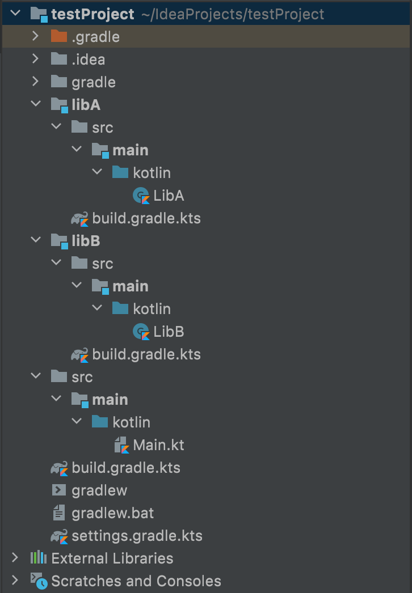
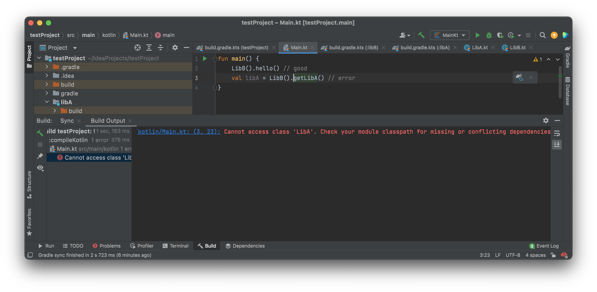
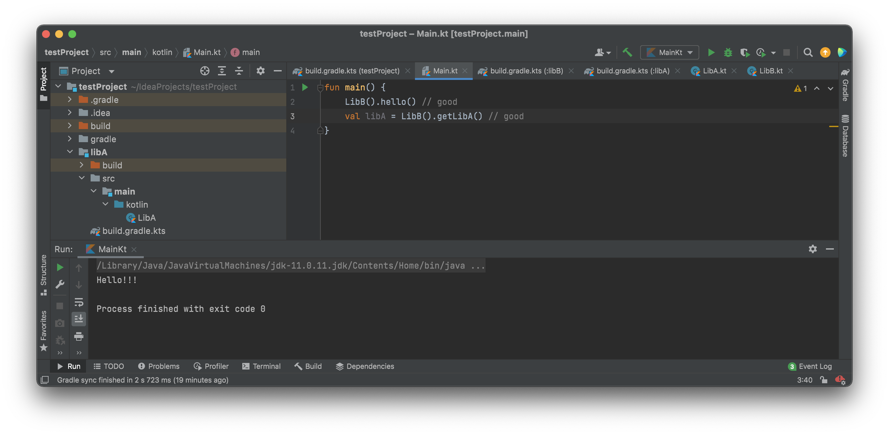
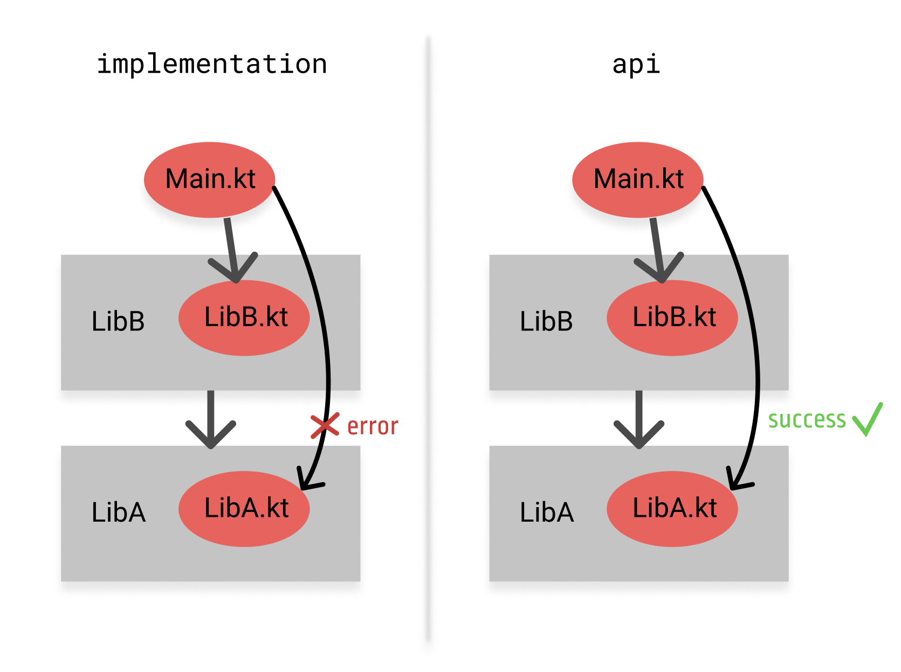

# Dependency configurations

## О конфигурации зависимостей

Каждая зависимость, объявленная для проекта Gradle, применяется к определенной области.
Например, некоторые зависимости должны использоваться для компиляции исходного кода, в то время как другие
должны быть доступны только во время выполнения. 

:::important

Gradle представляет область зависимости с помощью конфигураций!

:::

Подробнее о конфигурации зависимостей в Gradle можете прочитать
[тут](https://docs.gradle.org/current/userguide/declaring_dependencies.html).
За регистрацию конфигураций зависимостей отвечают gradle-плагины. Например, Java плагин по умолчанию
добавляет `implementation` и `api` конфигурации. 

## Implementation vs Api

Посмотрим на разницу `implementation` и `api` на примере небольшого проекта.



Создадим два подпроекта: `LibA` и `LibB`. В директории каждого из этих подпроектов создадим собственный
`build.gradle.kts` файл для настройки сборки. А в рутовом `build.gradle.kts` подключим плагин `kotlin-jvm`:

```kotlin
/*
*   project/build.gradle.kts
*/

// подключение плагина
plugins {
    kotlin("jvm") version ("2.1.10")
}

// указывает в каких репозиториях
// искать нужные зависимости
allprojects {
    repositories {
        mavenCentral()
    }
}
```

В директории каждого из наших подпроектов создадим директории `src/main/kotlin`. А уже внутри этой директории
создадим файл `LibA.kt` или `LibB.kt`, соответствующий конкретному модулю:

```kotlin
/* 
*   project/LibA/src/main/kotlin/LibA.kt
*/

class LibA {
    fun hello() = println("Hello!!!")
}
```

```kotlin
/* 
*   project/LibA/src/main/kotlin/LibB.kt
*/

class LibB {
    fun hello(): Unit = LibA().hello()
    fun getLibA(): LibA = LibA()
}
```

Для корректной сборки с конфигурациями `api` и `implementation` нужно подключить jvm-плагин в каждый
из наших подпроектов, причем `LibB` будет зависеть от `LibA` типом `implementation`:

```kotlin
/* 
*   project/LibA/src/main/kotlin/build.gradle.kts
*/

plugins {
    kotlin("jvm")
}
```

```kotlin
/* 
*    project/LibB/src/main/kotlin/build.gradle.kts
*/

plugins {
    kotlin("jvm")
}

dependencies {
    implementation(project(":libA"))
}
```

В корне нашего проекта заведем директорию `src/main/kotlin` с файлом `Main.kt`, которая и будет входной точкой нашего приложения:
```kotlin
/*
*   project/src/main/kotlin/Main.kt
*/

fun main() {
    // code
}
```

Чтобы использовать классы из подпроекта в исходном коде основного проекта, нужно прописать зависимость в рутовом `build.gradle.kts`:

```kotlin
/*
*   project/build.gradle.kts
*/

// ...

dependencies {
    implementation(project(":libB"))
}
```

Теперь напишем немного кода в нашем `Main.kt`:

```kotlin
/*
*   project/src/main/kotlin/Main.kt
*/

fun main() {
    LibB().hello() // good
    val libA = LibB().getLibA() // error
}
```

После запуска вашего кода вы увидите такую ошибку:


Зависимость с конфигурацией `implementation`, с помощью которой мы подключили `LibA` к `LibB`, используется во время
компиляции и во время выполнения для текущего модуля, но не предоставляется для компиляции других модулей.
Именно из-за этого исходный код нашего приложения не видит класс из подпроекта `LibA`. 

Если же в `build.gradle.kts` подпроекта `LibB` указать тип конфигурации `api` для подключения подпроекта `LibA`, то ошибки не будет.

```kotlin
/* 
*    project/LibB/src/main/kotlin/build.gradle.kts
*/

plugins {
    kotlin("jvm")
}

dependencies {
    api(project(":libA"))
}
```


Тип зависимости `api` используется как во время компиляции, так и во время выполнения и экспортируется пользователям библиотек.

Наглядную разницу между этими двумя типами конфигурации зависимостей можете увидеть на диаграмме:


## Classpath

Если вашему скрипту сборки необходимо использовать внешние зависимости, вы можете добавить их в путь
к классам в самом сценарии сборки. В корневом `build.gradle.kts` как раз используется блок `buildscript`.
Объявить путь к классам сценария сборки вы можете, использовав метод `classpath`. 

Для мультипроектной сборки, зависимости, объявленные с помощью метода `buildscript()`, доступны для сценариев сборки всех его подпроектов.

Рассмотрим небольшой пример, в котором мы подключим уже знакомый нам плагин `kotlin-jvm`, но не через метод `plugins()`.

```kotlin
/*
*   project/build.gradle.kts
*/

buildscript {
    repositories {
        gradlePluginPortal()
    }
    dependencies {
        classpath("org.jetbrains.kotlin.jvm:org.jetbrains.kotlin.jvm:gradle.plugin:2.1.10")
    }
}
```

Мы подключили тот же самый плагин, но уже через путь до артефакта, лежащего в репозитории
[gradle plugins](https://plugins.gradle.org/plugin/org.jetbrains.kotlin.jvm).

Для проверки корректного подключения плагина к проекту можете выполнить таску `buildEnvironment` из терминала или IDE:

```bash
gradle buildEnvironment
```

Вы увидите список зависимостей в classpath. А чтобы проверить, какие задачи появились у плагина — выполните `tasks` из терминала или IDE:

```bash
gradle tasks
```

Вывод будет примерно таким: 
```bash
------------------------------------------------------------
Tasks runnable from root project 'testProject'
------------------------------------------------------------

Build Setup tasks
-----------------
init - Initializes a new Gradle build.
wrapper - Generates Gradle wrapper files.

Help tasks
----------
buildEnvironment - Displays all buildscript dependencies declared in root project 'testProject'.
dependencies - Displays all dependencies declared in root project 'testProject'.
dependencyInsight - Displays the insight into a specific dependency in root project 'testProject'.
help - Displays a help message.
javaToolchains - Displays the detected java toolchains.
kotlinDslAccessorsReport - Prints the Kotlin code for accessing the currently available project extensions and conventions.
outgoingVariants - Displays the outgoing variants of root project 'testProject'.
projects - Displays the sub-projects of root project 'testProject'.
properties - Displays the properties of root project 'testProject'.
tasks - Displays the tasks runnable from root project 'testProject' (some of the displayed tasks may belong to subprojects).
```

Таски не появились, т.к. плагин, подключенный при помощи `classpath`, сразу не применяется. 
Чтобы применить этот плагин в нашем рутовом `build.gradle.kts`, необходимо использовать метод `apply()`.
В подпроектах же вы можете подключить этот плагин, используя привычный метод `plugins()`.
Это происходит из-за того, что сборщик Gradle не может проиндексировать ID плагина,
подключенного в том же build-файле, в котором тот добавляется в classpath.

```kotlin
/*
*   project/build.gradle.kts
*/

buildscript {
    // ...
}

apply(plugin = "org.jetbrains.kotlin.jvm")
```

```kotlin
/*
*   project/libA/build.gradle.kts
*/

plugins {
    id("org.jetbrains.kotlin.jvm")
}
```

Снова запустим задачу `tasks` и увидим пополненный список тасок:

```bash
> Task :tasks
------------------------------------------------------------
Tasks runnable from root project 'testProject'
------------------------------------------------------------

Build tasks
-----------

# ...

Build Setup tasks
-----------------

# ...

Documentation tasks
-------------------
javadoc - Generates Javadoc API documentation for the main source code.

Help tasks
----------

# ...

Verification tasks
------------------
check - Runs all checks.
test - Runs the unit tests.

# ...
```

## boilerplate-проект

Перейдем к boilerplate-шаблону, чтобы понять, как подключаются зависимости на наших проектах.

```kotlin
/*
*   mobile-moko-boilerplate/build.gradle.kts
*/

buildscript {
    // указание репозиториев, в которых он будет искать указанные в зависимостях модули
    repositories {
        mavenCentral()
        google()
        gradlePluginPortal()
        maven(url = "https://jitpack.io")
    }
    // добавление зависимостей в выполнение gradle скриптов
    dependencies {
        classpath(libs.moko.resourcesGeneratorGradle)
        classpath(libs.moko.networkGeneratorGradle)
        classpath(libs.kotlinSerializationGradle)
        classpath(libs.firebaseCrashlyticsGradle)
        classpath(libs.googleServicesGradle)
        classpath(libs.navigationPlugin)
        classpath(":build-logic")
    }
}

// таска на очистку билдов проекта
tasks.register("clean", Delete::class).configure {
    group = "build"
    delete(rootProject.layout.buildDirectory)
}
```

Теперь посмотрим на `build.gradle.kts` файлы, которые лежат в `build-logic` и `mpp-library`:

```kotlin
/*
*   mobile-moko-boilerplate/build-logic/build.gradle.kts
*/

plugins {
    `kotlin-dsl`
}

// репозитории для поиска нужных зависимостей
repositories {
    mavenCentral()
    google()
    gradlePluginPortal()

    maven { url = uri("https://jitpack.io") }
}

// подключение зависимостей к композитному проекту,
// предоставляющему функционал внутренних библиотек
dependencies {
    api(libs.moko.multiplatformPlugin)
    api(libs.kotlinGradlePlugin)
    api(libs.androidGradlePlugin)
    api(libs.detektGradlePlugin)
    api(libs.skieGradle)
    api(libs.composeGradlePlugin)
}
```

Для дальнейшего изучения нужно понимать, что такое sourceset'ы, о них вы можете прочитать
[тут](https://kotlinlang.org/docs/multiplatform-dsl-reference.html#source-sets).

Если мы хотим использовать зависимости для конкретного sourceset'а, мы можем воспользоваться следующим шаблоном:

```kotlin
<sourceSetName><dependencyType>(...)
```

Эти методы как раз генерирует плагин `kotlin-multiplatform`.

```kotlin
/*
*   mobile-moko-boilerplate/mpp-library/build.gradle.kts
*/

plugins {
    id("multiplatform-library-convention")
    id("org.jetbrains.kotlin.native.cocoapods")
    id("kotlinx-serialization")
}

kotlin {
    cocoapods {
        framework {
            baseName = "MultiPlatformLibrary"
            export(libs.multiplatformSettings)
            export(libs.napier)
            export(libs.moko.resources)
        }
    }
}

dependencies {
    commonMainImplementation(libs.coroutines)
    commonMainImplementation(libs.kotlinSerialization)
    commonMainImplementation(libs.ktorClient)
    commonMainImplementation(libs.ktorClientLogging)
    commonMainImplementation(libs.ktorClientAuth)
    commonMainImplementation(libs.moko.network)

    // зависимости, нужные для androidMain sourceset'а
    androidMainImplementation(libs.lifecycleViewModel)

    // зависимости, которые видны пользователям библиотеки (commonMainApi)
    commonMainApi(libs.multiplatformSettings)
    commonMainApi(libs.napier)
    commonMainApi(libs.moko.resources)

    // модули проекта
    commonMainApi(projects.mppLibrary.utils)

    // тесты
    commonTestImplementation(projects.mppLibrary.testUtils)
}
```

## Материалы

- [Документация - Multiplatform Gradle DSL reference](https://kotlinlang.org/docs/multiplatform-dsl-reference.html)
- [Документация - Gradle declaring dependencies](https://docs.gradle.org/current/userguide/declaring_dependencies.html)
- [Документация - MPP Dependencies](https://kotlinlang.org/docs/multiplatform-add-dependencies.html)
