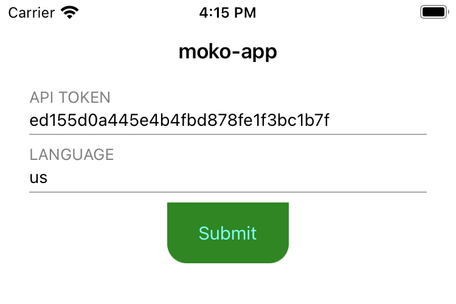

# Layer corners

Чтобы задать какой либо вью скругленные края, нужно у его layer'а, поменять значение поля `cornerRadius` на радиус скругления. Пример:
```swift
submitButton.layer.cornerRadius = 16
```
В итоге получаем следующую картину:


Но что делать, если необходимо, чтобы скругления были только снизу или сверху. Начиная с iOS 11.0 у CALayer появилось свойство `maskedCorners`, оно позволяет выбрать список углов, которые надо скруглить.

`maskedCorners` имеет тип CACornerMask и может принимать значения:
- layerMaxXMaxYCorner -> Правый нижний угол
- layerMaxXMinYCorner -> Правый верхний угол 
- layerMinXMaxYCorner -> Левый нижний угол
- layerMinXMinYCorner -> Левый верхний угол

При этом можно выбрать любое количество углов. Примеры:

Так можно задать скругления только снизу:
```swift
submitButton.layer.cornerRadius = 16
submitButton.layer.maskedCorners = [.layerMaxXMaxYCorner, .layerMinXMaxYCorner]
```


А так можно задать скругление только левого верхнего угла:
```swift
submitButton.layer.cornerRadius = 16
submitButton.layer.maskedCorners = .layerMinXMinYCorner
```


Однако есть случаи, когда этого недостаточно. Например, если добавить кнопке `backgroundImage`, то скругления пропадут.
```swift
submitButton.setBackgroundImage(UIImage(named: "balearic-islands-31_1280")!, for: .normal)
submitButton.layer.cornerRadius = 16
submitButton.layer.maskedCorners = [.layerMaxXMaxYCorner, .layerMinXMaxYCorner]
```


Это происходит по причине того, что по дефолту скругления не применяются к картинкам внутри леера (о чем написано в [документации](https://developer.apple.com/documentation/quartzcore/calayer/1410818-cornerradius)). Для того чтобы скругления применялись к картинкам, необходимо присвоить свойству `masksToBounds` значение `true`.
```swift
submitButton.setBackgroundImage(UIImage(named: "balearic-islands-31_1280")!, for: .normal)
submitButton.layer.cornerRadius = 16
submitButton.layer.maskedCorners = [.layerMaxXMaxYCorner, .layerMinXMaxYCorner]
submitButton.layer.masksToBounds = true
```
После добавления `maskToBounds`, скругленные края появляются вновь:


Рассмотрим еще один случай. К той же самой кнопке, помимо всего прочего, добавим еще и тень вокруг кнопки:
```swift
submitButton.setBackgroundImage(UIImage(named: "balearic-islands-31_1280")!, for: .normal)
submitButton.layer.cornerRadius = 16
submitButton.layer.maskedCorners = [.layerMaxXMaxYCorner, .layerMinXMaxYCorner]
submitButton.layer.masksToBounds = true

submitButton.layer.shadowColor = UIColor.black.cgColor
submitButton.layer.shadowOffset = CGSize(width: 0, height: 2)
submitButton.layer.shadowRadius = 10
submitButton.layer.shadowOpacity = 0.5
```

Тень вокруг кнопки не появилась потому, что она обрезается свойством `masksToBounds`. Можно выключить маску и тогда тень появится, но перестанет обрезаться картинка на фоне.
Итак, как же выйти из сложившейся ситуации, в интернете есть множество разных вариантов решения данной проблемы, я же приведу только один, который мне больше нравится.
Убираем добавление `backgroundImage` и `masksToBounds` для кнопки. Вместо этого создаем свой собственный `CALayer`, задаем ему размер как у кнопки, а контент делаем равным нашему изображению. И уже этому слою выставляем `masksToBounds = true`.
```swift
        submitButton.layer.cornerRadius = 16
        submitButton.layer.maskedCorners = [.layerMaxXMaxYCorner, .layerMinXMaxYCorner]
        submitButton.layer.shadowColor = UIColor.black.cgColor
        submitButton.layer.shadowOffset = CGSize(width: 0, height: 2)
        submitButton.layer.shadowRadius = 10
        submitButton.layer.shadowOpacity = 0.5
        
        let backgroundLayer = CALayer()
        backgroundLayer.frame = submitButton.bounds
        backgroundLayer.contents = UIImage(named: "balearic-islands-31_1280")!.cgImage
        backgroundLayer.cornerRadius = 16
        backgroundLayer.maskedCorners = [.layerMaxXMaxYCorner, .layerMinXMaxYCorner]
        backgroundLayer.masksToBounds = true
        submitButton.layer.insertSublayer(backgroundLayer, at: 0)
```
В результате получаем кнопку с тенью, фоновым изображением и закругленными краями.


На этом у меня все, более подробно про работу с `Layer`'ами можно прочитать в статье [UIKit ты вообще про UI?](https://habr.com/ru/company/skyeng/blog/591423/).

<div style={{textAlign:"right"}}>Автор: <a href="https://github.com/Dorofeev">@Dorofeev</a></div>