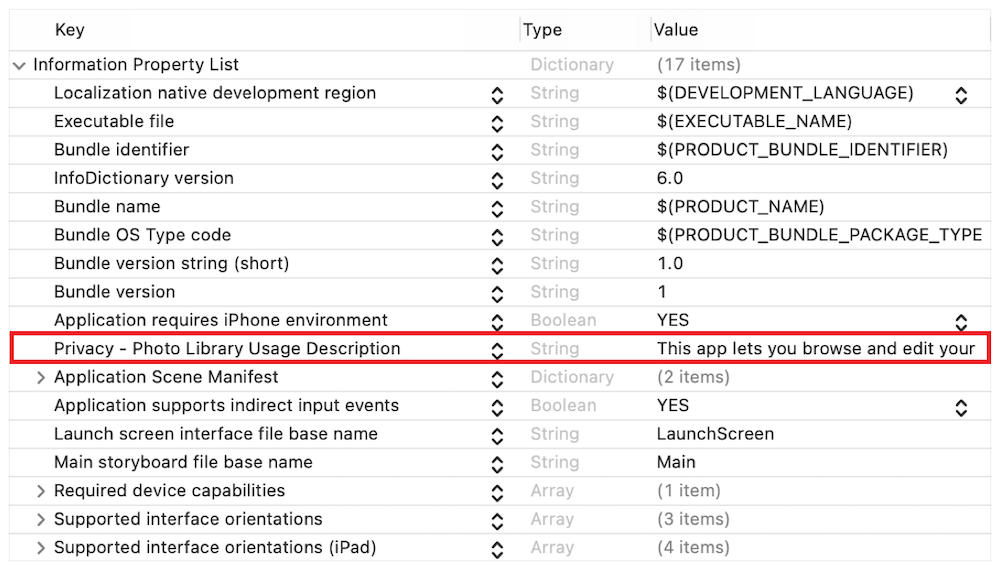
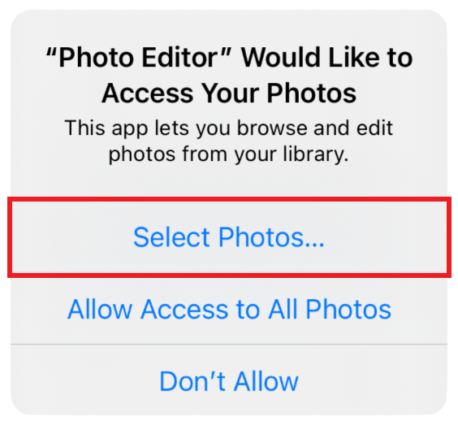
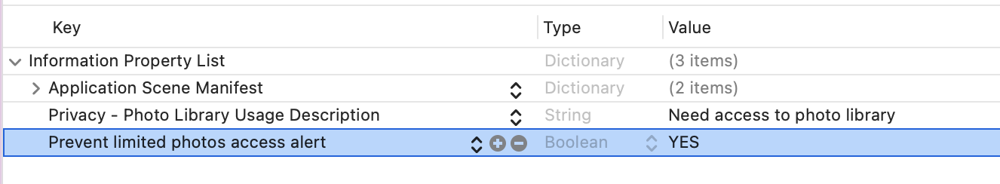
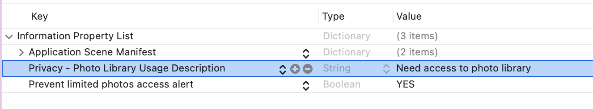
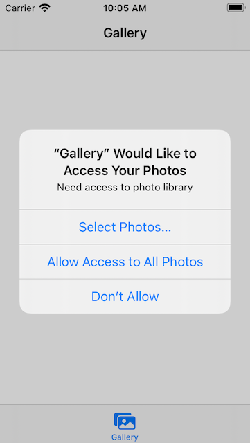

# Лимитированная библиотека фото в iOS 14

**iOS 14 с новой настройкой конфиденциальности:**

Фотографии и видео пользователя являются одними из самых личных данных, которые он хранит на своих устройствах. Благодаря встроенной защите конфиденциальности приложение может получить доступ к библиотеке фотографий пользователя только в том случае, если оно явно разрешит ему это сделать. Начиная с iOS 14, PhotoKit еще больше улучшает контроль конфиденциальности пользователей с добавлением ограниченной библиотеки "Фото", которая позволяет пользователям выбирать конкретные ресурсы (фото, видео) для совместного использования с приложением.

*Важно:<br>
Ограниченная библиотека фотографий затрагивает все приложения, которые используют PhotoKit в iOS 14, включая те, которые уже опубликованы в App Store. Оцените поведение вашего приложения, чтобы убедиться, что оно работает должным образом при запуске в ограниченном библиотечном режиме.*

**PHPickerViewController**

Также с выходом iOS 14 был представлен PHPickerViewController - новый controller для работы с библиотекой пользователя. Его пользовательский интерфейс соответствует интерфейсу приложения "Фото", поддерживает поиск и множественный выбор фотографий и видео, а также обеспечивает плавное масштабирование контента. Поскольку система управляет своим жизненным циклом в отдельном процессе, по умолчанию она является частной, поэтому пользователю не нужно явно разрешать приложению выбирать фотографии (тут имеется ввиду, что если ваше приложение не сохраняет ничего в приложение "Фото», а только может брать оттуда ресурсы, то явно запрашивать доступ не нужно).

[Познакомьтесь с новым сборщиком фотографий](https://developer.apple.com/videos/play/wwdc2020/10652/)

*Важно:<br>
Но, так как iOS 14 с новой настройкой конфиденциальности и PHPickerViewController были представлены практически в одно время, то PHPickerViewController внес немалую путаницу для разработчиков, так как многие подумали, что именно PHPickerViewController должен показывать ограниченную библиотеку фотографий, на самом деле это не так. PHPickerViewController позволяет только выбрать ресурсы (фото, видео) - открыть интерфейс управления для ограниченной библиотеки, но саму ограниченую библиотеку вам нужно сделать самостоятельно (создать собственный ViewController, отвечающий за показ ограниченной библиотеки).*

Если вашему приложению требуются расширенные функции PhotoKit, такие как получение ресурсов и коллекций или обновление библиотеки, пользователь должен явно разрешить ему доступ к этим функциям, то предоставьте локализуемое сообщение, описывающее, как ваше приложение взаимодействует с библиотекой фотографий.



*Важно:<br>
Система представляет это локализуемое сообщение пользователю, когда предлагает ему авторизовать ваше приложение для доступа. Попытка доступа к библиотеке фотографий без действительного описания использования приводит к сбою вашего приложения.*

**Работа с ограниченной библиотекой:**

В предыдущих выпусках iOS пользователи либо разрешали, либо запрещали полный доступ к своей библиотеке. Большинство пользователей не хотят предоставлять приложениям полный доступ к своим личным данным, и начиная с iOS 14, они могут делиться ограниченным подмножеством своих фотографий и видео. Когда приложение запрашивает авторизацию, система запрашивает у пользователя диалоговое окно, подобное показанному ниже.



В дополнение к кнопкам, разрешающим или запрещающим доступ, есть новая опция выбора фотографий, которую пользователь может нажать, чтобы открыть интерфейс управления ограниченной библиотекой. Этот интерфейс позволяет пользователю выбрать ресурсы для совместного использования с вашим приложением. Выбранные элементы представляют собой ограниченный выбор библиотеки пользователя, ваше приложение может получить доступ только к этим ресурсам.

API PhotoKit в основном работают одинаково независимо от того, взаимодействует ли ваше приложение с полной библиотекой фотографий или только с ограниченным выбором библиотеки пользователя. Однако имейте в виду следующие исключения:
• Система автоматически добавляет ресурсы, которые ваше приложение создает с помощью PHAsset, в ограниченный выбор библиотеки пользователя.

• Вы не можете создавать или извлекать пользовательские альбомы. Если вашему приложению требуется эта функция, вам нужно будет соответствующим образом обновить его поведение и пользовательский интерфейс, когда статус авторизации вашего приложения PHAuthorization.limited

По умолчанию система автоматически предлагает пользователю обновить ограниченный выбор библиотек один раз за жизненный цикл приложения. Эта автоматическая презентация не является предпочтительным пользовательским интерфейсом для большинства приложений. Вместо этого приложения должны подавить автоматическое приглашение и представить его программно:



Чтобы представить селектор ограниченных библиотек программно, добавьте доступность в свой пользовательский интерфейс (кнопка и т.п.), чтобы пользователь мог обновить свой ограниченный выбор библиотеки. Когда пользователь нажимает на этот интерфейс, модально откроется селектор для выбора ресурсов для ограниченной библиотеки, как показано в следующем коде:
```swift
let viewController = // UIViewController с которого модально откроется селектор для выбора ресурсов ограниченной библиотеки.
PHPhotoLibrary.shared().presentLimitedLibraryPicker(from: viewController)
```

**Наблюдение за изменением библиотеки:**

Чтобы отслеживать изменения в ограниченном выборе библиотеки пользователя, используйте стандартный API наблюдателя изменений, [как описано в разделе наблюдение за изменениями в библиотеке фотографий](https://developer.apple.com/documentation/photokit/phphotolibrary/observing_changes_in_the_photo_library) Зарегистрируйте свое приложение, чтобы получать уведомления и обновлять пользовательский интерфейс, поскольку система уведомляет его об изменениях состояния.

**Какие локализуемые сообщения в Info.plist нужно использовать и в каких случаях:**

• Если вы используете новый PHPickerViewController и вам не нужна лимитированная библиотеку фотографий, а вашему приложению нужно, например, просто брать изображения из приложения "Фото" и сохранять в ваше приложение, то никаких локализуемых запросов делать не нужно.

• Если вы используете старый UIImagePickerController, то вам следует использовать: "Privacy - Photo Library Additions Usage Description = "Need access to photo library for save" (лимитированная библиотека с этим доступом не работает)


В этом случае на экране вы увидите следующее:


• Если вы используете PHPickerViewController и вам нужна лимитированная библиотека, следует использовать: Privacy - Photo Library Usage Description = "Need access to photo library", при этом предпочтительно следует использовать "Prevent limited photos access alert = YES" (прочитайте еще раз об этом выше "Работа с ограниченной библиотекой")



В этом случае на экране вы увидите следующее:



## Ссылки:

**AccessPhotoLibraryManager:**

По этой ссылке вы можете ознакомиться с AccessPhotoLibraryManager, который работает с новым PHPhotoLibrary.requestAuthorization для iOS 14, а также с его старой версией.<br>
[AccessPhotoLibraryManager](https://github.com/bullinnyc/PhotoGallery/blob/main/Gallery/Services/AccessPhotoLibraryManager.swift)

**PhotoManager:**

По этой ссылке вы можете ознакомиться с PhotoManager, который получает ресурсы для лимитированной библиотеки. Особое внимание стоит уделить PHImageRequestOptions, в нем можно управлять настройками получения ресурсов.<br>
[PhotoManager](https://github.com/bullinnyc/PhotoGallery/blob/main/Gallery/Services/PhotoManager.swift)

**GalleryApp:**

Ссылка на проект с готовой галлереей, поддерживающей лимитированную библиотеку. Ресурсы берутся из приложения "Фото" пользователя. Здесь можно поэкспериментировать c настройками, запросами и более подробно понять как работает лимитированная галерея.<br>
[GalleryApp](https://github.com/bullinnyc/PhotoGallery)

**Источник:**

[Delivering an Enhanced Privacy Experience in Your Photos App](https://developer.apple.com/documentation/photokit/delivering_an_enhanced_privacy_experience_in_your_photos_app)
