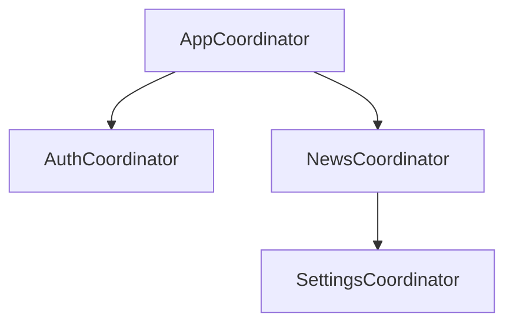

# Навигация

В основе навигации лежат координаторы. Каждый координатор покрывает логически связанный блок
функционала, который чаще всего состоит из нескольких экранов. При этом между собой они независимы и
отвечают только за цепочку переходов внутри себя. Также имеют возможность получать настройку
действия, которое должно быть выполнено после завершения блока ответственности координатора.

## Пример

Предположим, что у нас есть приложение с авторизацией и списком новостей, с которого
можно перейти к детальному просмотру каждой новости и в раздел настроек для конфигурации отображения новостей.

Это разобьётся на 4 координатора:



- AppCoordinator
  - Стартовый координатор. Всегда является первой входной точкой, определяет, куда должен выполниться дальнейший переход при запуске приложения
  - Если юзер не авторизован - запустит координатор авторизации и в качестве completionHandler-а укажет ему переход на список новостей в случае успешной авторизации
  - Если юзер уже авторизован - запустит координатор просмотра списка новостей
- AuthCoordinator
  - Запустит процесс авторизации
  - Будет совершать переходы по всем требуемым шагам - например ввод логина/пароля, смс-кода, установки никнейма и т.п.
  - По итогу успешной авторизации вызовет переданный ему на вход completionHandler.
- NewsCoordinator
  - Отвечает за показ списка новостей
  - Реализовывает переход в детали конкретной новости внутри этого же координатора
  - При переходе в настройки создаёт координатор настроек, в качестве completionHandler-а может передать ему логику обновления своего списка новостей. Если в настройках изменились параметры - обновляет список
- SettingsCoordinator
  - Отвечает за работу с экраном настроек
  - При завершении работы и применении настроек вызывает completion, чтобы новости обновились

# BaseCoordinator

Чтобы работать с координаторами было проще, используется базовый класс, от которого наследуются
остальные. В директории `Common/Coordinator` вы найдете файлы `CoordinatorProtocol.swift` и `BaseCoordinator.swift`. Первый несет в себе протокол, под который подписан `BaseCoordinator` и описывает обязательные методы и поля:

```swift
protocol Coordinator: AnyObject {
    var completionHandler: (()->())? { get }
    func start()
    func clear()
}
```

По сути он должен иметь ровно три вещи - completionHandler, который вызовется при завершении его логической зоны ответственности. Функцию start, при вызове которой он начинает запускать свой флоу таким образом, каким считает нужным, и функцию clear, которая чистит сам координатор и все дочерние.

Ну а второй несет сам класс базового координатора, который реализует этот протокол:

```swift
class BaseCoordinator: NSObject, Coordinator, UINavigationControllerDelegate {
    var childCoordinators: [Coordinator] = []
    var completionHandler: (() -> ())?
    
    let window: UIWindow
    let factory: SharedFactory
    
    var navigationController: UINavigationController?
    
    init(window: UIWindow, factory: SharedFactory) { ... }
    
    func addDependency<Child>(_ coordinator: Child, completion: (() -> Void)? = nil) -> Child where Child : BaseCoordinator { ... }
    
    func clear() { ... }
    
    //Cases
    //1. Initial with window - create NV, etc..
    //2. Exists navcontroller,
    
    func start() {
        //
    }
    
    func beginInNewNavigation(_ controller: UIViewController) -> UINavigationController { ... }
    
    func beginInExistNavigation(_ controller: UIViewController) { ... }
    
    func currentViewController() -> UIViewController { ... }
}

```

Для инициализации необходим window и factory. Также можно указать NavigationController с предыдущего
координатора, для сохранения общей навигации.

:::note

Координаторам нужен factory для доступа к фабрикам фичей из общей библиотеки.

:::

Добавление и удаление зависимостей нужны для корректной очистки связей и памяти при построении
цепочек координаторов.

Также есть вспомогательные методы, которые позволяют получить текущий контроллер -
currentViewController и совершить переход назад - popBack.

:::caution
От проекта к проекту базовый координатор может изменяться, обеспечивая дополнительные нужды проекта.
:::

## AppСoordinator

Теперь когда мы поняли принцип работы координаторов, посмотрим на класс `AppCoordinator`:

```swift
class AppCoordinator: BaseCoordinator {
    override func start() {
        let vc = UIViewController()
        vc.view.backgroundColor = .green
        self.window.rootViewController = vc
    }
}
```

В данном случае, главный координатор совсем простой - создает контроллер зелёного цвета и делает его главным экраном window.

Теперь посмотрим где происходит создание главного координатора. Идём в `AppDelegate.swift`: 

```swift    
    // ....

    // переменная координатора
    private (set) var coordinator: AppCoordinator!

    func application(_ application: UIApplication, 
        didFinishLaunchingWithOptions launchOptions: [UIApplication.LaunchOptionsKey: Any]? = nil) -> Bool {

        //...

        // его инициализация
        coordinator = AppCoordinator.init(
            window: self.window!,
            factory: AppComponent.factory
        )
        // запуск коррдинатора
        coordinator.start()

        // ....
    }
```

Теперь дальнейшая логика переходов зависит от текущего контроллера и действий юзера на нём.

После данного разбора у вас должно сформироваться представление о том, какие подходы мы используем
для реализации навигации в iOS-приложении.

## Материалы

- [Статья - How to use the coordinator pattern in iOS apps](https://www.hackingwithswift.com/articles/71/how-to-use-the-coordinator-pattern-in-ios-apps)
- [Статья - Coordinator Tutorial for iOS: Getting Started](https://www.raywenderlich.com/158-coordinator-tutorial-for-ios-getting-started)
- [Видео-разбор](https://www.youtube.com/watch?v=Pt9TGFzLVzc) использования `ApplicationCoordinator` для навигации между экранами
