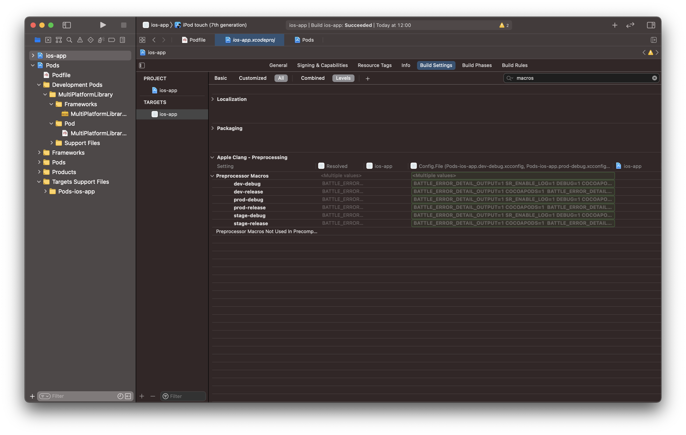
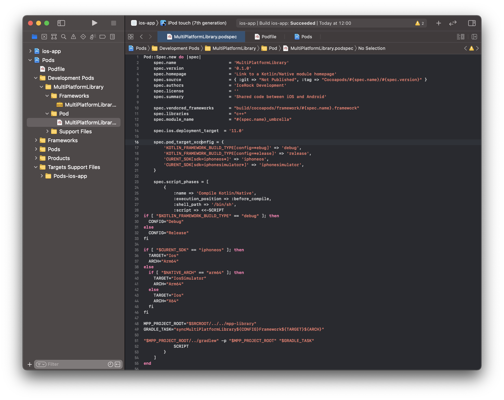
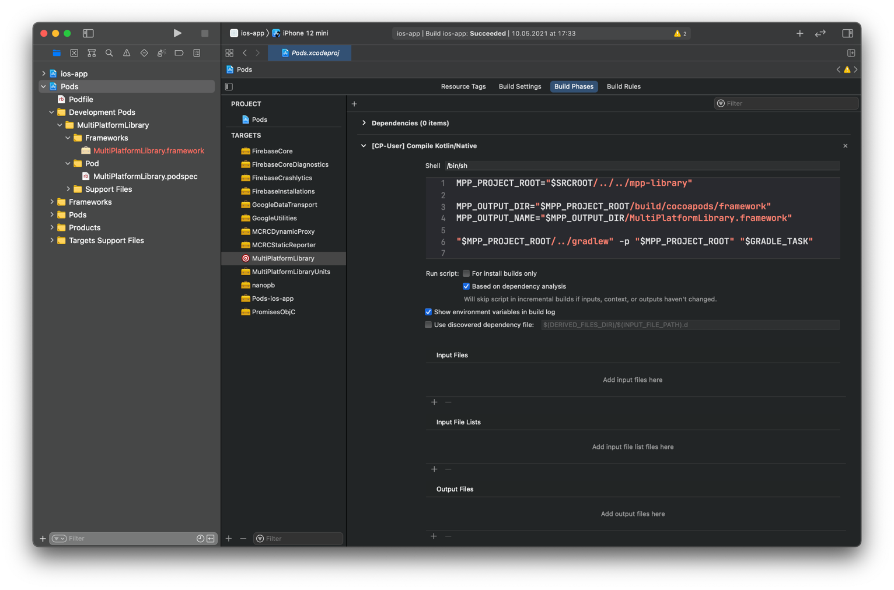

# CocoaPods

[CocoaPods](https://cocoapods.org/) - это менеджер зависимостей для iOS-приложения.

Зависимости и конфигурации для ваших проектов задаются в одном текстовом файле, называемом [подфайлом](https://guides.cocoapods.org/using/the-podfile.html). CocoaPods разрешит зависимости между библиотеки, извлечет полученный исходный код, а затем свяжет его вместе в рабочей области Xcode для создания вашего проекта.

## Что происходит на практике

В нашим Xcode проектах имеется зависимость на CocoaPod `MultiPlatformLibrary`.

Данный CocoaPod имеет особенную реализацию - он не содержит исходного кода, а вместо фазы компиляции Source файлов он имеет фазу запуска shell команды. Именно в этой фазе происходит запуск Gradle для компиляции `MultiPlatformLibrary.framework` из Kotlin кода. Когда скрипт завершится, Xcode продолжит сборку iOS проекта уже с использованием готового скомпилированного фреймворка от Kotlin библиотеки.

Рассмотрим процесс детальнее. Для начала посмотрим, что происходит после установки зависимостей через CocoaPods: помимо файла проекта -  `ios-app.xcodeproj` мы получаем еще один файл - `ios-app.xcworkspace`.
Разберемся в разнице между ними:

- `ios-app.xcodeproj` - файл нашего ios проекта, содержит все настройки проекта, список файлов проекта, фазы сборки и прочее. В нем также указано, что наш iOS проект теперь зависит от `Pods_ios_app.framework` - фреймворка подключающего все CocoaPods зависимости.
  
  При попытке скомпилировать проект через `ios-app.xcodeproj` мы получим ошибку о том что фрейворки, от которых зависит проект, не найдены.
- `ios-app.xcworkspace` - файл с объединением нескольких Xcode проектов вместе. Если открыть его в Xcode, то в левой панели мы увидим не только `ios-app` проект, но и `Pods`, в котором находятся все необходимые для проекта зависимости. При работе через `xcworkspace` мы можем успешно скомпилировать проект, так как зависимость `ios-app` проекта будет найдена в `Pods` проекте. Необходимые зависимости для `ios-app` будут автоматически скомплированы также в `Pods`.
  

Теперь, понимая как `ios-app` связан с зависимостями, установленными CocoaPods, посмотрим детальнее на `MultiPlatformLibrary` CocoaPod. Находится данный Pod в `Pods/Development Pods/MultiPlatformLibrary`.

Только этот CocoaPod находится в `Development Pods`, так как он единственный в `Podfile`, который подключен по локальному пути (`:path =>`). 

:::info
Все CocoaPod'ы, подключенные по локальному пути, будут находиться в `Development Pods` разделе, вместо `Pods`.
:::


## Podfile

Разберемся что здесь к чему:

```bash
# указываем откуда будем скачивать зависимости - с официального репозитория cocoapods
source 'https://cdn.cocoapods.org/'

# скрывает предупреждения от библиотек CocoaPods.
inhibit_all_warnings!

# использование динамических фреймворков вместо статических библиотек для модулей
use_frameworks!
# указывает платформу и ее версию, нужно для проверки всех зависимостей на поддержку этой версии этой платформы
platform :ios, '12.0'

# маппинг конфигураций
project 'ios-app',
  'dev-debug' => :debug, 'dev-release' => :release,
  'stage-debug' => :debug, 'stage-release' => :release,
  'prod-debug' => :debug, 'prod-release' => :release

# обходной путь для https://github.com/CocoaPods/CocoaPods/issues/8073
# нужно для корректного отключения невалидного кеша MultiPlatformLibrary.framework
install! 'cocoapods', :disable_input_output_paths => true

# объявление зависимостей для конкретного таргета
target 'ios-app' do
  # зависимость нашей библиотеки, о ней дальше
  pod 'MultiPlatformLibrary', :path => '../mpp-library'
  # moko поды
  pod 'MultiPlatformLibraryUnits/Core',
    :git => 'https://github.com/icerockdev/moko-units.git', :tag => 'release/0.6.1'
  pod 'MCRCDynamicProxy',
    :git => 'https://github.com/icerockdev/moko-crash-reporting.git', :tag => 'release/0.2.0'
  pod 'MCRCStaticReporter',
    :git => 'https://github.com/icerockdev/moko-crash-reporting.git', :tag => 'release/0.2.0'

  # остальные поды, которые могут понадобиться во время разработки
  # pod 'Firebase', '~> 6.33.0'
  # pod 'R.swift', '~> 5.3.1'           # Code generation for resources  https://github.com/mac-cain13/R.swift
  # pod 'ProgressHUD', '~> 2.70'        # Loading animation https://github.com/relatedcode/ProgressHUD
  # pod 'Toast-Swift', '~> 5.0.1'       # Showing toasts https://github.com/scalessec/Toast-Swift
  # pod 'XLPagerTabStrip', '~> 9.0'     # Tabs controller like an Android PagerTabStrip
  # pod 'AlamofireImage', '~> 3.6.0'    # Image loader with cache https://github.com/Alamofire/AlamofireImage
  # pod 'Down', '~> 0.10.0'             # Markdown rendering https://github.com/johnxnguyen/Down
  # pod 'RxKeyboard', '~> 1.0.0'        # Reactive way of observing keyboard frame changes https://github.com/RxSwiftCommunity/RxKeyboard
  # ...
end
```

:::important
Всегда указывайте версию используемой зависимости, чем точнее тем лучше. Иначе со временем может
прийти такой апдейт зависимости, который не совместим с вашим кодом.
:::

**Что такое маппинг конфигураций?**

:::important
Эмпирическое правило состоит в том, что поды и наш таргет должны иметь одинаковые настройки макросов препроцессора. 
:::
Всякий раз, когда вы создаете пользовательскую конфигурацию сборки, Xcode спрашивает, хотите ли вы дублировать `Debug` или `Release` конфигурацию.

В `Podfile` есть способ указать какая конфигурация сборки была скопирована с какой, это второй аргумент "таргетного" параметра `project <path> <[String => symbol]>`. 

По умолчанию Xcode предосталяет 2 типа конфигруации сборки: 
- `Debug`;
- `Release`;

В [нашем же проекте](./configuration#как-делаем-мы) их 6, и, как мы видим, благодаря верно указанным ключам для каждой конфигурации, в `Build Settings` у нас различные макросы для препрцессора на каждый тип конфигурации:



## Podspec

Из чего устроена данная зависимость `MultiPlatformLibrary`, подключеная по локальному пути (`:path =>`):


Во-первых, в директории `Frameworks` отражается сам скомпилированный фреймворк - `MultiPlatformLibrary.framework`.

Во-вторых - `MultiPlatformLibrary.podspec`, который как раз и ищет CocoaPods при подключении через `:path =>` по пути `mpp-library/MultiPlatformLibrary.podspec`.

`Podspec` файл является описанием зависимости для CocoaPods. В нем мы определяем имя, версию и прочую метаинформацию о нашем пакете, исходные файлы и прочие настройки таргета, которые будет сгенерирован в проекте `Pods` при `pod install`. В нашем `podspec` мы определили несколько важных моментов:

1. `spec.vendored_frameworks` - путь до заранее скомпилированного framework'а, который и будет предоставляться как зависимость `ios-app` проекту. Именно по этому пути Gradle складывает итоговый фреймворк при запуске любой из `syncMultiPlatformLibrary**` задач;
2. `spec.pod_target_xcconfig` - [настройки конфигурации](./configuration), которые определяют переменные окружения, доступные нам во время выполнения сборки данного таргета. Мы определили имя библиотеки, без каких либо условий, а также указали переменную `GRADLE_TASK`, которая имеет разные значения при разных условиях. Например: `GRADLE_TASK` будет равна `syncMultiPlatformLibraryDebugFrameworkIosX64` , когда переменная `KOTLIN_FRAMEWORK_BUILD_TYPE` будет равна `debug`, `CURENT_SDK` будет равна `iphonesimulator`, а `NATIVE_ARCH` будет равна `x86_64`;
3. `spec.script_phases` - определяем специальную фазу сборки с запуском shell скрипта, в котором мы запускаем Gradle задачу, сохраненную в переменной окружения `GRADLE_TASK`. Правильный подбор варианта компиляции мы получаем основываясь на схеме ios приложения, которую мы собираем, и на условиях, обозначенных в `xcconfig`. Именно этот скрипт позволяет делать сборку общего модуля автоматически, не требуя от разработчика дополнительных действий перед комплияцией iOS проекта.

При выполнении `pod install` данный podspec файл считывается и на основе этой информации создается Target в проекте `Pods`:



Видно, что таргет `MultiPlatformLibrary` отличается от всех остальных иконкой - это потому, что он не содержит исходного кода, а вместо этого содержит кастомный скрипт.

По настройкам Xcode также видно, что `ios-app` не имеет прямой зависимости от `MultiPlatformLibrary`. Зависимость есть от `Pods-ios-app`. Это оптимизация количества изменений в файле основного проекта, сделанная CocoaPods. Все легко объясняется когда посмотрим на сам таргет `Pods-ios-app`.


Данный таргет содержит в зависимостях все CocoaPods, а значит когда `ios-app` запрашивает сборку `Pods-ios-app`, тот затребует сборку всех этих зависимостей и в результате мы получим сборку всего что нам нужно.

После данного разбора у вас должно сформироваться представление о том как происходит компиляция iOS приложения использующего Kotlin библиотеку с [интеграцией через CocoaPods](../kotlin-native/cocoapods).

## Материалы

- [Документация - Podfile Syntax Reference](https://guides.cocoapods.org/syntax/podfile.html)
- [Документация - Podspec Syntax Reference](https://guides.cocoapods.org/syntax/podspec.html)
- [Документация - Command-Line Reference](https://guides.cocoapods.org/terminal/commands.html)
