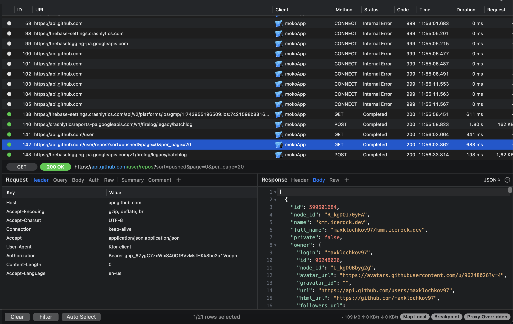
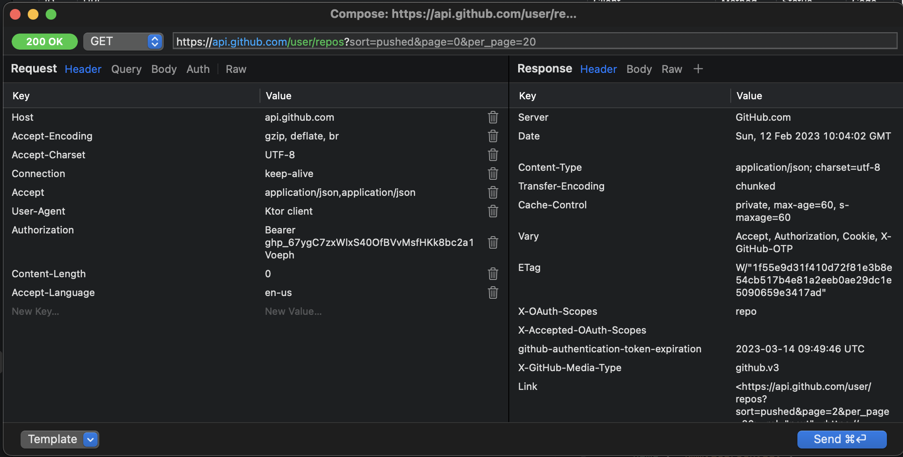
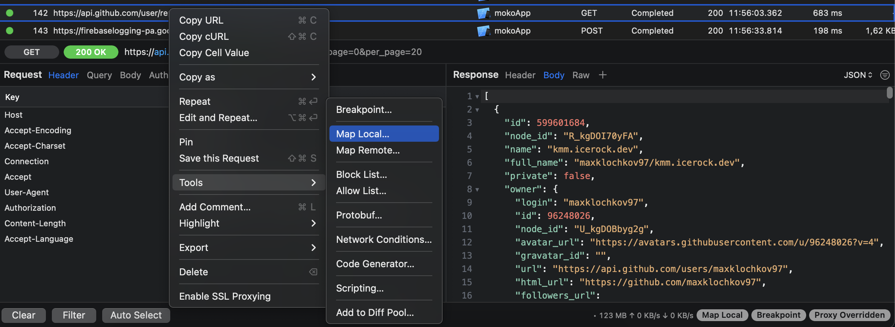
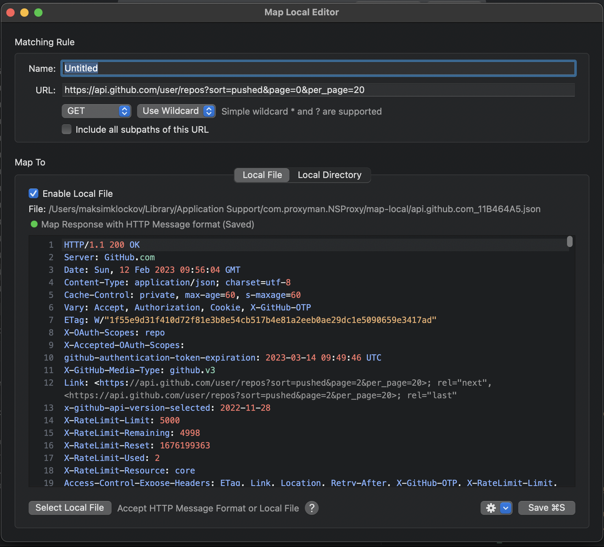
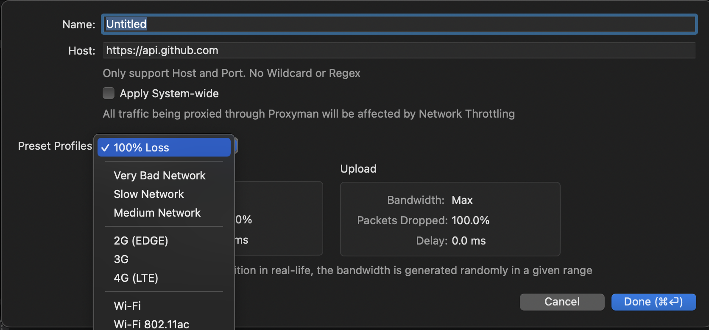

# Proxyman - tutorial

Данная программа используется тестировщиками, но она также полезна и для IOS разработчиков. Она позволяет видеть все запросы, что отправляет наше приложение в сеть и менять их в реальном времени, видя результат изменений прямо в симуляторе. 

_Конечно, это не все доступные функции, но мы разберем именно те, которые будут полезны при разработке. Возможно вы найдете и другой полезный функционал, экспериментируйте)_ 

## Перед началом работы:

1. Скачать приложение по [ссылке](https://proxyman.io)

2. Установить Proxyman Certificate. Выберите ваше приложение на панеле слева, справа в углу будет кнопка “Install certificate”. Это нужно делать для каждого нового приложения.  [Инструкция](https://docs.proxyman.io/debug-devices/ios-simulator) 

Готово, теперь вы должны видеть что-то вроде этого.
 

_Если у вас в поле Response нет информации и висит закрытый замок, то нажмите Enable all domains for ВАШЕ ПРИЛОЖЕНИЕ_

## Просмотр всех запросов
Если вы проделали предыдущие шаги по установке, то при выборе вашего приложения вы будете видеть все запросы, что оно делает в сеть в реальном времени.
 

## Изменение Request

1. Выбрать нужный запрос и нажать на него ПКМ, выбрать опцию Edit and Repeat
 

2. В открывшемся окне мы можем менять все параметры нашего Request, включая Header. Как только поставим все, что нам нужно, нажимаем Send и приложение отправляет запрос еще раз, но уже с указанными вами параметрами. Результат увидим в симуляторе.
 

## Изменение Response

1. Выбрать нужный запрос и нажать на него ПКМ, выбрать опцию Tools, далее Map local
 

2. В открывшемся окне мы можем создать локальную опцию на изменение запроса, она будет работать все время пока мы вручную не снимем галочку или не удалим ее. Тут мы можем менять весь ответ, который нам приходит. Включая HTTP код, например если мы хотим протестировать как наше приложение реагирует на 401 ошибку, то начинаем ее вводить вместо 200 кода и выбираем вариант в подсказке. Также тут можно полностью менять структуру ответа, добавлять новые данные, менять старые и так далее. Поэкспериментируйте) 
 

## Изменение или полное выключение интернет соединения.

1. Выбрать нужный запрос и нажать на него ПКМ, выбрать опцию Tools, далее Network conditions.
 

2. В открывшемся окне мы увидим список настроек для имитации интернет соединения, мы можем как полностью выключить его, так и сделать очень медленным. Эта опция будет работать, пока вы вручную ее не выключите, либо не удалите настройку.
 

Благодаря этим опциям вы сможете тестировать ваше приложение быстрее и удобнее, а также поменьше будете дергать админку фейковыми данными =) 
