# Статические и динамические библиотеки/фреймворки в iOS

### Введение
При разработке приложений на любой платформе (в том числе и iOS) мы сталкиваемся с тем, что нам приходится использовать сторонний код или упаковывать свой собственный код, чтобы потом его переиспользовать.

Почти все iOS разработчики в какой-то мере работают или работали со статическими и динамическими фреймворками, но не до конца понимают их особенности.

### Определения

Разберемся для начала с основными понятиями данной статьи.
**Библиотека** - это кодовая база, строительный элемент программы, скомпилированный под одну или несколько архитектур.

Коротко разберем что такое **статические** и **динамические** библиотеки. 

В случае **статических библиотек (*.a)** код, используемый приложением, копируется в исполняемый файл во время компиляции. То есть после компиляции исполняемый файл не нуждается в поддержке внешним кодом или бинарниками, т.к все используемые функции уже находятся в нем. Конечно это будет и минусом статической библиотеки, ведь если кодовая база изменится, то для работаспособности исполняемого файла его придется заново перекомпилировать.

**Динамические библиотеки (.dylib)** же отличаются от **статических** тем, что они "линкуются" с исполняемым бинарником, т.е код нашей библиотеки не попадает в исполняемый файл, а подгружается во время выполнения. В результате размер исполняемого бинарника меньше, а так как код загружается только в момент обращения к нему, то время запуска обычно уменьшается; но если все динамические библиотеки загружаются при запуске приложения то это может сильно повлиять на время запуска приложения. 

При попытке отправить ресурсы (такие как строковые файлы, изображения и т. д.) библиотеки iOS/macOS доставляются вместе с пакетами (Bundle's), содержащими эти ресурсы, об этом можете почитать ниже в разделе Материалы.

### Статические и динамические библиотеки в iOS
Статическая библиотека будет связана с приложением при компиляции, и весь необходимый код будет "вшит" в финальный исполняемый файл. 

Динамически связанные библиотеки не будут изменяться при компиляции - связанные с исполняемым кодом методы загружаются только во время работы программы

Динамически связываются большинство системных фреймворков — при создании приложения с помощью `UIKit` двоичный файл приложения ссылается на модуль `UIKit`, но не включает его символы. Система «знает», что версия `UIKit` будет доступна во время выполнения (и использует `dyld`  для ее загрузки). Эта версия используется всеми приложениями и поставляется как часть ОС.

Откуда система загружает динамическую библиотеку?

На большинстве других платформ (например, Linux) динамические библиотеки можно использовать для совместного использования между различными приложениями, совместного использования исполняемых файлов, что значительно экономит память. 

На iOS же до версии 8 Apple не позволяли динамически подгружать сторонние фреймворки, но на поздних версиях разработчикам было разрешено создавать и использовать условно "динамические" фреймворки. Почему условно? Дело все в том, что хоть это и динамическая структура, но отличная от системной. Динамическая библиотека, созданная с помощью Cocoa Touch Framework, будет помещена в корневой каталог основного пакета приложения, когда приложение упаковано, а запущена в "песочница" вместо системы. 

Другими словами основное отличие iOS от остальных платформ, так это то, что разработчик не может установить свои динамические модули в общем месте и использовать их из разных приложений. Это связано с тем, что приложения работают как бы в «песочнице» и не могут устанавливать модули в другие части системы. Получается если несколько разных приложений на телефоне используют один и тот же фреймворк, все равно на устройстве будет несколько его копий, загруженных, упакованных и, возможно, подписанных по отдельности. 

Однако, из-за всех этих ограничений, функция расширения приложения никуда не делась - вы все еще можете создавать подключаемый модуль для приложения, с совместным использованием динамических библиотек между модулем и приложением. 
Но есть одно важное замечание: в таком случае вы обязательно должны встроить все нужные зависимости в свое приложение. Об этом мы поговорим чуть позже.

### Фреймворки

Фреймворк - это **пакет (.framework)**, который может содержать в себе предварительно скомпилированный код (библиотеку) c файлами заголовов (.h), а так же различные ресурсы: файлы локализации, xib'ки, изображения, storyboard'ы, bundl'ы. Фреймворки в iOS и MacOS организованы в [Bundle's](https://developer.apple.com/library/archive/documentation/CoreFoundation/Conceptual/CFBundles/AboutBundles/AboutBundles.html#//apple_ref/doc/uid/10000123i-CH100-SW1). К ним можно получить доступ через одноименный класс из кода.

Если фреймворк содержит другой(-ие) фреймворк(-и), то такой фреймворк называют зонтичным (umbrella-framework). Apple настоятельно не рекомендует создавать свои зонтичные фреймворки, но менеджер зависимостей **CocoaPods** для интеграции активно использует эту концепцию.  


### Линковка
Линковщик или Компоновщик - это программа, которая берет один или несколько объектных файлов (сгенерированных компилятором) и объединяет их в один исполняемый файл, библиотечный файл или другой «объектный» файл.

Если вы смотрите журнал сборки Xcode, вы увидите что такая задача как `Build target <AppName>`
содержит несколько шагов: компиляция исходного кода, а за ней идет линковка, если развернуть команду линковки то можно увидеть следующее:

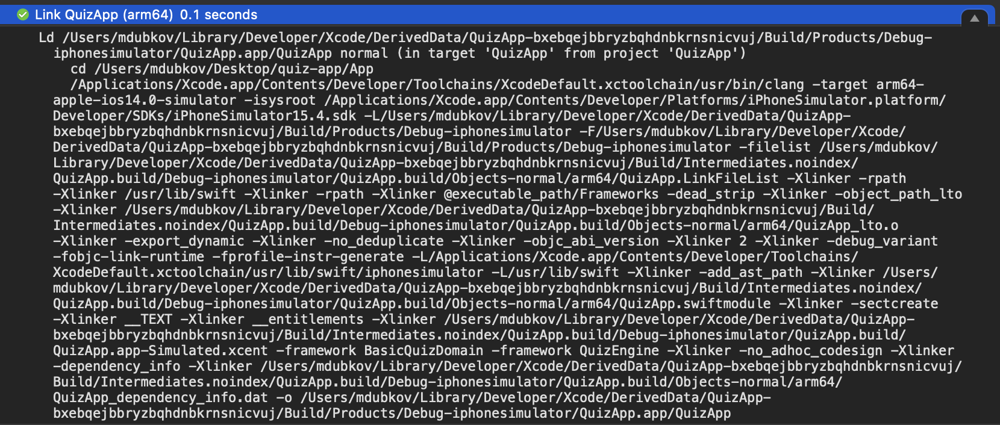

Увидеть наглядно разницу между работой **Динамического** и **Статического** линковщика очень просто. Увидим это на примере создания статической библиотеки (.o) в Xcode:  `File` -> `New` -> `Project` -> `Static Library`

После мы увидим следующий код: 

Подключим через SPM модуль `swift-algorithms`.  В функции `foo()` используем какой-либо функционал из подключенной зависимости.
Сбилдим бинарник с разным значением `Project` -> `Current Target` -> `BuildSettings` -> `Mach-O Type` : Dynamic или Static Library.

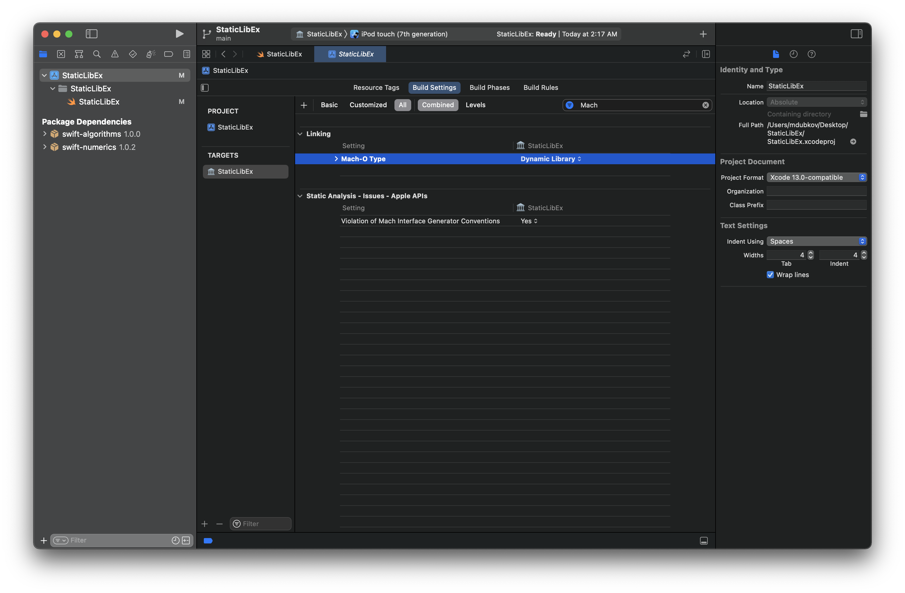
Получили две разные статические библиотеки:

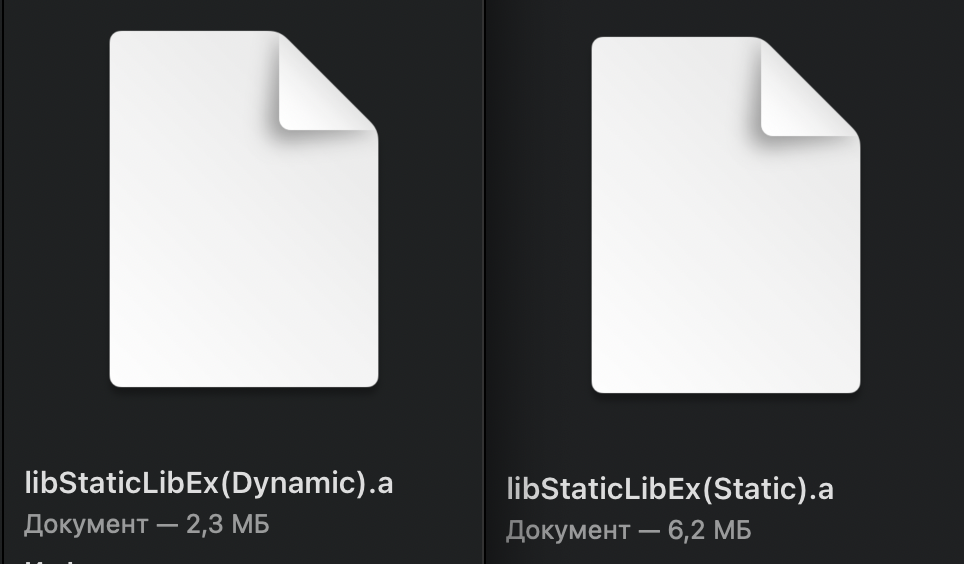

В статически слинкованный файл "вшит" код из-из подключенной нами зависимости, из-за этого он имеет наибольший размер. Данный пример является бесполезным, т.к подключение динамически слинкованной библиотеки без необходимой зависимости в нужном таргете приложения вызовет краш приложения в рантайме. Но он все же наглядно демострирует работу статической и динамической линковки.

Чтобы узнать является ли бинарный файл динамически или статически слинкованным достаточно вызвать команду `file <binary file>` 

### Встраивание модулей в файл приложения
Выбрав встраивание модуля в свое приложение в разделе `Project` -> `Targets` -> `Framework, Libraries and Embedded Content` вы активируете этап сборки `Embed Frameworks`, который копирует модули в ваше приложение (`.app` файл будет содержать папку `Frameworks` со всеми встроенными модулями)

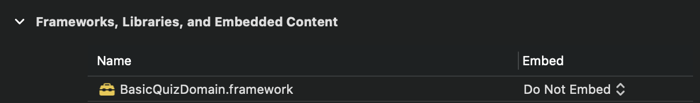

Если же вы используете менеджер зависимостей **CocoaPods** то эта задача выполняется в одной из `Build Phases`: 

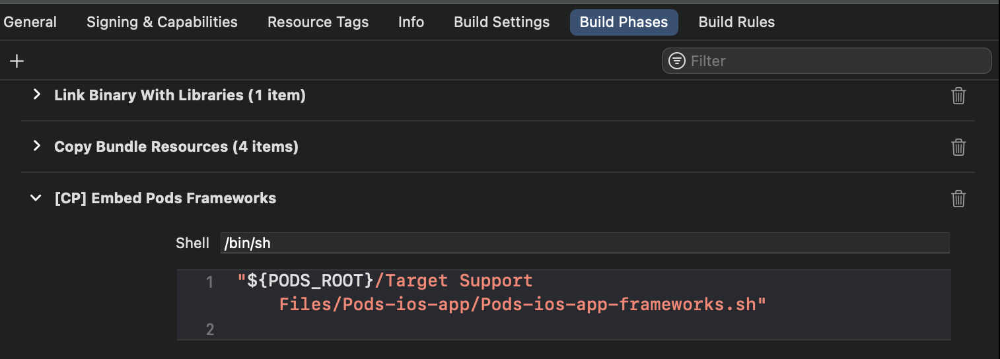


### Ключевые особенности

Для начало немного терминов: 
**Холодный** запуск — это когда приложение давно завершило свою работу и было удалено из кэша операционной системы. Холодный запуск всегда происходит после перезагрузки приложения и, в принципе, так WWDC рекомендует моделировать его в своих тестах. **Теплый** запуск — это когда приложение было завершено недавно и данные о запуске не до конца выгружены из памяти.

Запуск приложения: 
- Динамические библиотеки влияют на время холодного запуска приложения, в то время как использование статических библиотек может быть хорошей оптимизацией этого процесса.
- Apple [рекомендовала на WWDC 2016](https://youtu.be/PxV34oZxGLM?t=1781) использовать не более 6 динамических фреймворков, но с того времени уже прошло не мало времени и производительность устройств увеличилась. Поэтому советую рассчитывайте это количество так, чтобы
время запуска приложение было оптимальным.

Размер: 
-   Самый большой размер приложения: использование динамической компоновки + встраивание модулей в приложение (компилятор не может оптимизировать, все символы должны быть включены).
-  Когда статическая библиотека связана, она будет полностью скопирована в исполняемый файл. Если несколько модулей используют одну и ту же статическую библиотеку, то код будет попусту копироваться. 

Безопасность запуска: 
-  Весь статически связанный код проверяется и копируется во время сборки, поэтому у нас есть гарантия, что он работает. Код приложения не может рассинхронизироваться с API используемой библиотеки. 
- Если несколько модулей используют одну и ту же статическую библиотеку, то это может вызвать проблемы из-за дублирования символов в модуле.

### Пример дублирования символов

Самый простой пример дублирования символов в исполняемом файле:
есть проект приложения, динамическая библиотека и статическая библиотека (воспользуемся GMaps, т.к они поставляют свою зависимость в виде статического фреймворка). Подключаем GMaps к нашей динамической библиотеке и приложению, а саму динамическую библиотеку подключаем тоже к приложению как показано здесь: 


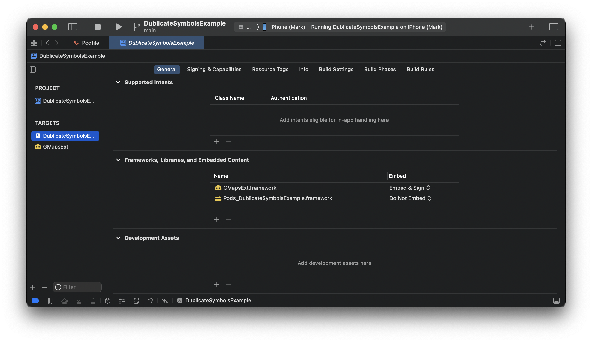

После запуска приложения вы увидите ошибку:

```
objc[36567]: Class GMSMapsClearcutClient is implemented in both /private/var/containers/Bundle/Application
495A9139-C4DA-4E4E-8677-0E7E49A3B4B6/DublicateSymbolsExample.app/Frameworks/GMapsExt.framework/GMapsExt (0x107580090) and /private/var
containers/Bundle/Application/495A9139-C4DA-4E4E-8677-0E7E49A3B4B6/DublicateSymbolsExample.app/DublicateSymbolsExample (0x104e0d660). One
of the two will be used. Which one is undefined.


objc[36567]: Class GMSAPIClientParameters is implemented in both /private/var/containers/Bundle/Application
495A9139-C4DA-4E4E-8677-0E7E49A3B4B6/DublicateSymbolsExample.app/Frameworks/GMapsExt.framework/GMapsExt (0x1075800e0) and /private/var
containers/Bundle/Application/495A9139-C4DA-4E4E-8677-0E7E49A3B4B6/DublicateSymbolsExample.app/DublicateSymbolsExample (0x104e0d6b0). One
of the two will be used. Which one is undefined.


objc[36567]: Class GMSAddress is implemented in both /private/var/containers/Bundle/Application/495A9139-C4DA-4E4E-8677-0E7E49A3B4B6
DublicateSymbolsExample.app/Frameworks/GMapsExt.framework/GMapsExt (0x107580130) and /private/var/containers/Bundle/Application
495A9139-C4DA-4E4E-8677-0E7E49A3B4B6/DublicateSymbolsExample.app/DublicateSymbolsExample (0x104e0d700). One of the two will be used. Which
one is undefined.


objc[36567]: Class GMSAsyncInitServices is implemented in both /private/var/containers/Bundle/Application
495A9139-C4DA-4E4E-8677-0E7E49A3B4B6/DublicateSymbolsExample.app/Frameworks/GMapsExt.framework/GMapsExt (0x107580180) and /private/var
containers/Bundle/Application/495A9139-C4DA-4E4E-8677-0E7E49A3B4B6/DublicateSymbolsExample.app/DublicateSymbolsExample (0x104e0d750). One
of the two will be used. Which one is undefined.

...
```

Такое предупреждение говорит о том, что в исполняемом файле дублируются символы, что может привести к некорректной работе приложения.

### Пример

Так что же происходит с собранным приложением в реальном проекте с многомодульной / многоцелевой структурой. Рассмотрим пример: 

У нас есть приложение `QuizApp`, в таргете которого мы видим зависимости на два фреймворка: 

Как можно заметить, таргет фреймворка может находиться в рамках одного или нескольких проектов Xcode. Также сам файл фреймворка вы можете встраивать в ваше целевое приложение - Embed (With Signing, Without Signing). 

Чтоб изменить способ линковки фреймворка, например QuizEngine, необходимо перейти в `Build Settings -> Mach-O type` и выбрать способ линковки.
 Эксперементируя с разными способами линковки и с тем, нужно ли встраивать фреймворк в целевое приложение или нет, вы можете получить 4 варианта собранного приложения: 
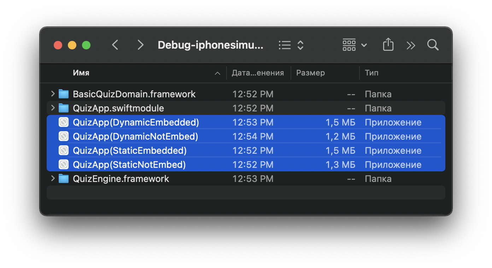 
- Статический, встроенный (Embeded) - Приложение в котором команды из QuizEngine будут вшиты в исполняемый файл и наше приложение будет содержать в себе фреймворк.
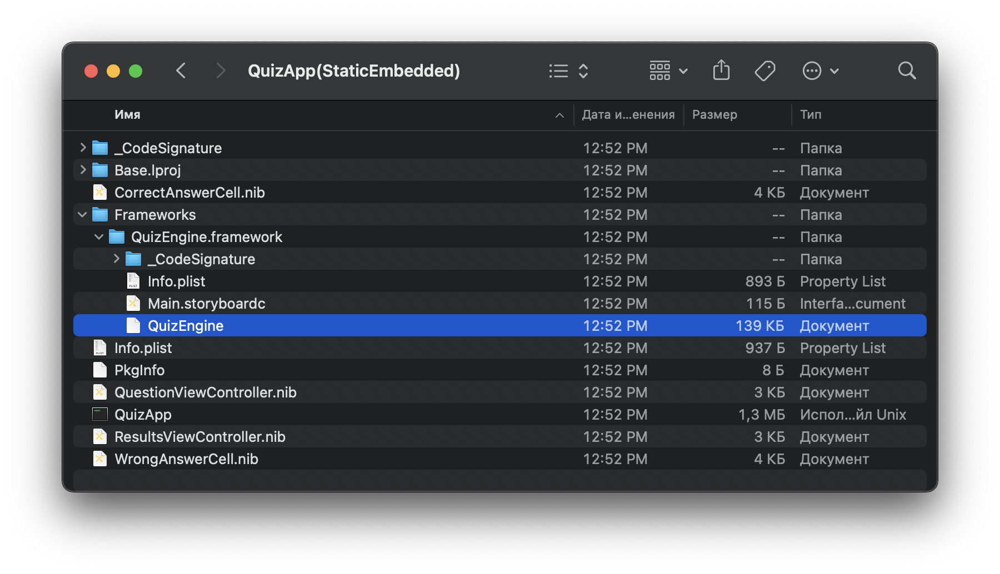 
- Статический, не встроенный (Not Embed) - Приложение в котором команды из QuizEngine будут вшиты в исполняемый файл, но уже оно не будет содержать фреймворк.
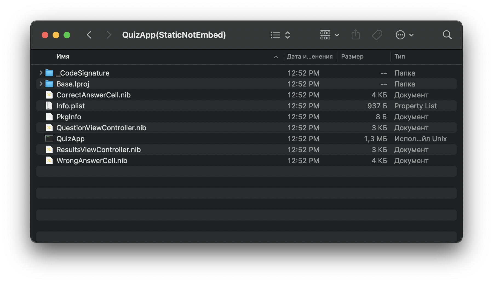 
- Динамический, встроенный - код подтягивается во время выполения, из-за чего исполняемый бинарник меньше, фреймворк включен.
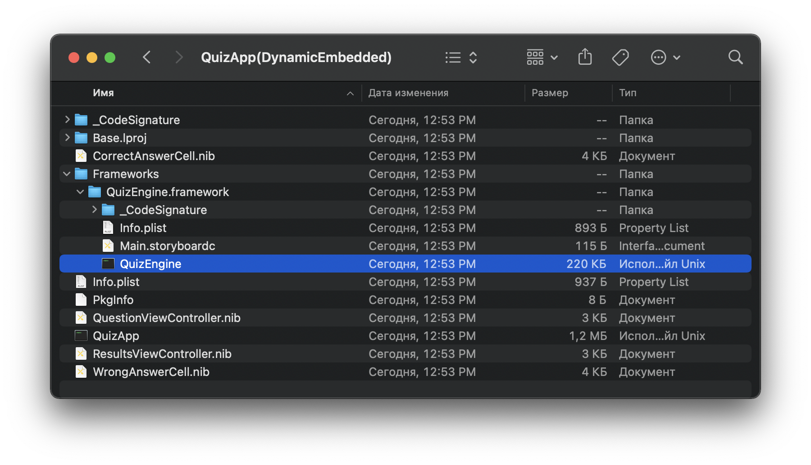 
- Статический, не встроенный - код подтягивается во время выполнения, но скомпилированной динамической библиотеки, на которую будет ссылаться исполняемый файл, нет, поэтому во время выполнения будет ошибка.
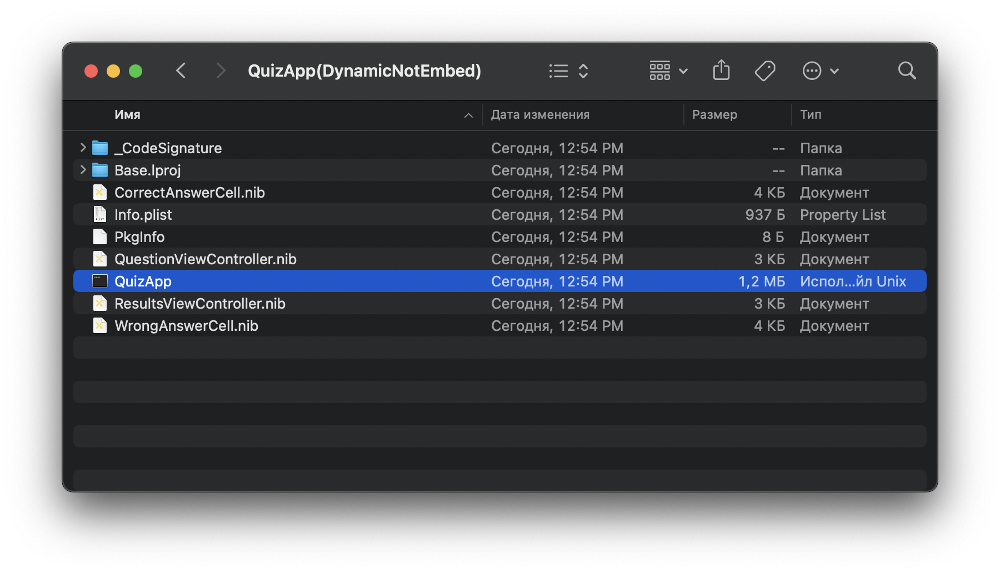 

### CocoaPods

По умолчанию CocoaPods (без упоминания `use_frameworks!`) будет создавать и связывать все зависимости как статические библиотеки. Если мы добавим  атрибут `use_frameworks!` в Podfile, **CocoaPods** вместо этого создаст и свяжет отмеченные зависимости как динамические фреймворки.
С появлением XCFramework пояивлась возможность указывать тип линковки для конкретных таргетов. 
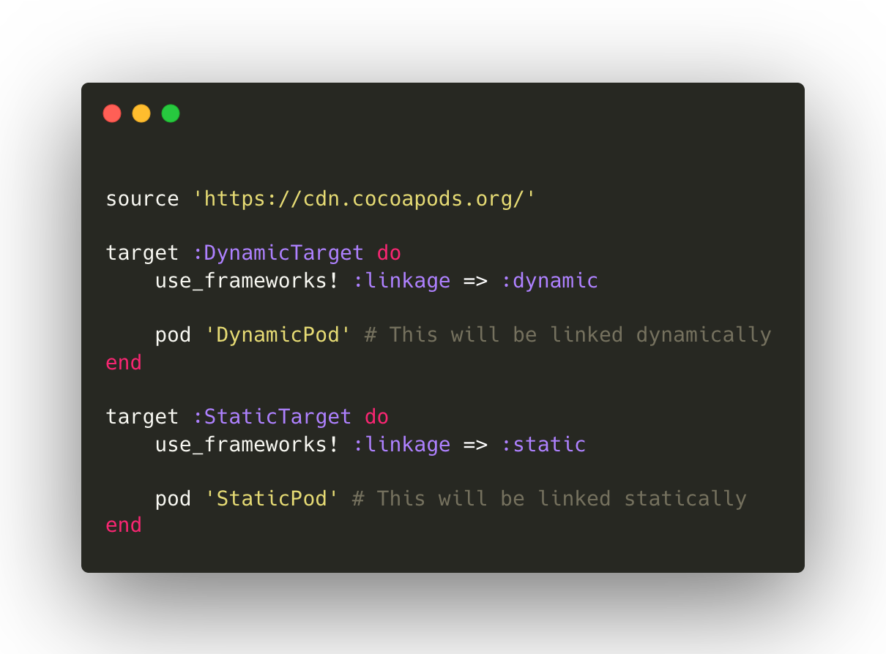 
Это все связано только с зависимостями, которые CocoaPods создает из исходного кода. Если вы ссылаетесь на уже скомпонованный модуль, то CocoaPods никак не может изменить способ линковки данного модуля. 

### Выводы
После ознакомления со статьей вы наверное уже догадались, что единствено правильного способа устраивать зависимости в iOS проекте нет, и вам нужно выбирать то, что лучше поможет вам решить поставленную перед вами задачу.

### Материалы
 - [Essential Developer - # Differences in Dynamic & Static Frameworks/Libraries](https://www.youtube.com/watch?v=IqsKGyklmL0)
 - [Example Sources](https://github.com/essentialdevelopercom/quiz-app)

 - [Mixing static and dynamic linking in CocoaPods](https://medium.com/microsoft-mobile-engineering/mixing-static-and-dynamic-linking-in-cocoapods-83b6d4252c59#:~:text=CocoaPods%20pod%2Dlinkage%20plugin&text=In%20SwiftKey%2C%20we%20have%20a,app%20and%20keyboard%20extension%20too.)
 - [Статическая/динамические библиотеки в iOS ](https://russianblogs.com/article/71841604682/)
 - [Resource Bundles & Static Library in iOS](https://09mejohn.medium.com/resource-bundles-in-ios-static-library-beba3070fafd)
 - [Введение в статические и динамические библиотеки и фреймворки на iOS](https://bpoplauschi.github.io/2021/10/24/Intro-to-static-and-dynamic-libraries-frameworks.html)

