# Жизненный цикл SwiftUI

Жизненный цикл — это серия событий, которые происходят от создания представления SwiftUI до его уничтожения.

**ViewGraph**

ViewGraph управляет иерархией представлений, отображаемой и не отображаемой. Их соответствующие имена — DisplayList и ViewList:

• Иерархия без рендеринга — это определение того, что должно отображаться на экране. SwiftUI создает его, используя тела структур представления, которые мы предоставляем. При каждом обновлении пользовательского интерфейса SwiftUI просматривает предыдущие и новые снимки иерархии без рендеринга для расчета изменений. Он использует AttributeGraph для представления атрибутов представления и выполнения различий.  
• SwiftUI использует иерархию рендеринга для создания реального рисунка. Представления из этой иерархии имеют свои собственные идентификаторы, а их время жизни соответствует тому, как долго они отображаются на экране.  

**View hierarchy**

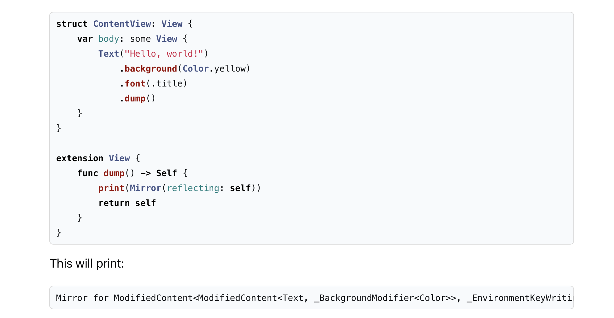

*Будет распечатано*

```swift
Mirror for ModifiedContent<ModifiedContent<Text, _BackgroundModifier<Color>>, _EnvironmentKeyWritingModifier<Optional<Font>>>
```

**View Lifecycle**

Каждое представление в SwiftUI имеет жизненный цикл, который мы можем наблюдать и манипулировать им на трех основных фазах. Три фазы — появление, обновление и исчезновение. Они показаны на диаграмме ниже:


Помимо трех фаз жизненного цикла, существует две фазы рендеринга: Layout и Commit (макет и фиксация)

На фазе Layout (макета) SwiftUI инициализирует иерархию представлений без рендеринга, вычисляет фреймы, соединяет представления с состоянием, вычисляет различия, которые необходимо зафиксировать на экране.

Фаза Layout (макета) должна возвращать view, иначе будет ошибка.

```swift
struct ContentView: View {
    @State private var count = 0
    
    var body: some View {
        count += 1 // side effect
        // ...
    }
}

```

На этапе Commit (фиксации) SwiftUI обновляет иерархию представлений рендеринга, фиксирует все изменения на экране и уничтожает все представления, которые больше не нужны.

**Appearing**

Появление означает вставку представления в view graph (граф представления). На этом этапе представление инициализируется, подписывается на состояние и отображается в первый раз.

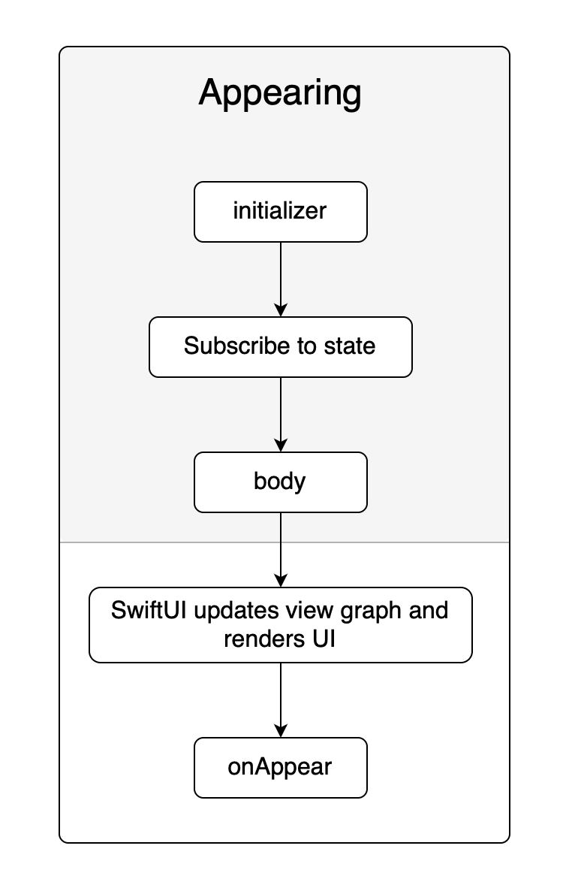

• Во время инициализации представление не связано с состоянием. Это удешевляет построение представлений, поскольку вся иерархия представлений строится заранее.  
• После инициализации и до вычисления тела представление подключается к состоянию.  
• Тело представления вызывается впервые.  
• Обновляется view graph и отображаются изменения.  
• Метод onAppear() вызывается сверху вниз: от родительского представления к дочернему.  

**Updating**

Обновление выполняется в ответ на внешнее событие или мутацию состояния.


**Note:** *External event* означает издателя Combine, который является единой абстракцией для представления внешних изменений в SwiftUI

• Действие пользователя вызывает изменение состояния или SwiftUI обнаруживает данные, отправленные издателем, наблюдаемые через метод .onReceive().  
• Представление, владеющее измененным состоянием или получившее внешнее событие, и все его дочерние элементы сравниваются со своим предыдущим снимком. На этом этапе мы можем предоставить собственное определение равенства представлений, согласовав наше представление с протоколом Equatable и обернув его в EquatableView.  
• SwiftUI аннулирует изменение представления, если изменений не обнаружено.  
• Если изменение есть, то обновляется view graph и отображаются изменения. Все обновления проходят вниз по иерархии представлений.  

В SwiftUI представления перерисовываются на основе изменений состояния (**@State, @Binding, @ObservedObject** и так далее) и данных, связанных с этими состояниями. Если представление не зависит от изменений состояния или данных, связанных с состоянием, то оно не будет перерисовываться при изменениях состояния.
Это одно из ключевых преимуществ SwiftUI - эффективная перерисовка только тех представлений, которые фактически зависят от изменений данных. Если SwiftUI не обнаруживает изменений в данных, связанных с представлением, оно не будет перерисовывать это представление, что может значительно улучшить производительность.
Однако, внимание следует обращать на правильное использование состояний и данных в SwiftUI. Ненужные или неправильные связи с состоянием могут привести к избыточной перерисовке или неожиданному поведению в приложении. Важно убедиться, что связи между состоянием и представлениями настроены так, чтобы перерисовка происходила только в тех местах, где это действительно необходимо для отображения актуальных данных.


В SwiftUI представления будут перерисовываться только тогда, когда изменяется состояние, связанное с этими представлениями, и новое значение состояния фактически отличается от предыдущего значения.
Если новое значение состояния точно совпадает с предыдущим значением (например, это две одинаковые строки или числа), SwiftUI не выполнит перерисовку этого представления, так как он считает, что ничего не изменилось и перерисовка не требуется. Это одна из оптимизаций, которые позволяют снизить избыточную перерисовку и улучшить производительность приложения.


Важно отметить, что метод **onAppear()** вызовется вновь, если представление будет перерисовано вследствие изменений данных или состояния, и станет видимым на экране после перерисовки. SwiftUI вызывает **onAppear()** каждый раз, когда представление становится видимым на экране, независимо от того, были ли какие-либо изменения данных или состояния, которые вызвали перерисовку.
Это может быть полезным, если вам нужно выполнить какие-либо действия при каждом появлении представления, включая его первое появление и последующие перерисовки (.opacity = 1 не приводит к вызову данного метода, например через if else, switch, ForEach - метод будет вызываться многократно).

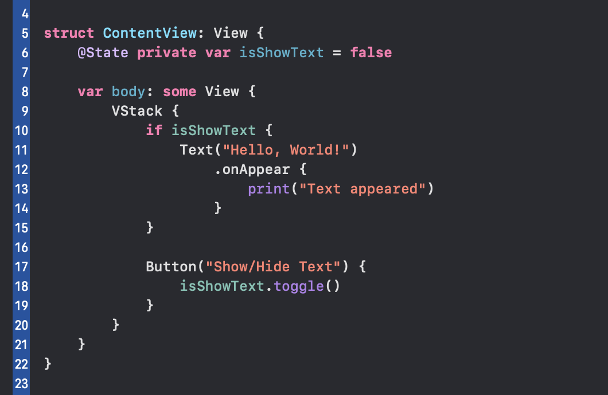

**Disappearing**

Исчезновение означает удаление представления из иерархии или когда представление больше не активно.


Метод onDisappear() вызывается после удаления представления из иерархии или когда представление больше не активно (например при переходе вперед по навигации). Подобно onAppear(), onDisappear() вызывается сверху вниз: от родительского представления к дочернему.


Важно отметить, что метод **onDisappear()** подобно **onAppear()** вызовется вновь после удаления представления из иерархии или когда представление больше не активно (.opacity = 0 не приводит к вызову данного метода, например через if else, switch, ForEach -  метод будет вызываться многократно).


# Ответы на вопросы:

**1. Как оптимальнее выносить куски кода: через @ViewBuilder функцию, через @ViewBuilder переменную или через отдельную структуру.**

Для начала немного о **@ViewBuilder**.
@ViewBuilder в SwiftUI - это по сути EmptyView(), если вычисляемое свойство или метод явно возвращают view, то писать @ViewBuilder не нужно. Если в вычисляемом свойстве или методе view может возвращаться разная, то компилятор попросит добавить @ViewBuilder.
Но есть исключение, если if, switch обернуть, например, в ZStack или внутри if блоков или кейсов сделать return, то @ViewBuilder не требуется.

*Примеры:*

```swift
@ViewBuilder
private var text: some View {
    if isShow {
        Text(«Title1»)
    } else {
        Text(«Title2»)
    }
}

private var text: some View {
    ZStack {
        if isShow {
            return Text(«Title1»)
        } else {
            return Text(«Title2»)
        }
    }
}

private var text: some View {
    if isShow {
        return Text(«Title1»)
    } else {
        return Text(«Title2»)
    }
}
```
Переиспользумые view (например кнопки, текстфилды и т.д.) лучше выносить в отдельные структуры. Если элемент больше нигде не используется, то лучше использовать вычисляемое свойство или метод чтобы избежать «лесенок» в view, так код будет структурированым и более читаемым.

**2. Как лучше хранить классы наследники ObservableObject: как @EnvironmentObject, как @StateObject или @ObservedObject.**

**@StateObject** и **@ObservedObject** - это два различных свойства в SwiftUI, которые используются для управления данными и обновлением представлений. Они оба связаны с наблюдаемыми объектами, но есть существенные различия в их использовании.

**@StateObject** используется для создания и хранения экземпляра объекта в представлении. Этот объект создается только один раз при первой инициализации представления и сохраняется в нем на протяжении жизни представления. Когда объект обновляется, SwiftUI автоматически обновляет представление, чтобы отобразить новые данные. Обычно используется для создания и хранения состояния в представлении.

**@ObservedObject** используется для связывания существующего наблюдаемого объекта с представлением. Этот объект может быть передан извне представления и обновляться вне представления (например, в другом представлении). Когда объект обновляется, SwiftUI также автоматически обновляет представление, чтобы отобразить новые данные. Обычно используется для связи с данными, которые могут изменяться вне данного представления.

Основное отличие между @StateObject и @ObservedObject заключается в том, что @StateObject используется для хранения и управления объектами внутри представления, в то время как @ObservedObject используется для связи с объектами извне представления.

**@EnvironmentObject** - это еще одно свойство в SwiftUI, которое используется для общего доступа к объектам в представлениях, без необходимости передавать их явно через параметры представлений (как в случае передачи по цепочке представлений свойства @ObservedObject). Это особенно полезно для передачи данных и состояния между различными представлениями.

Главные преимущества использования @EnvironmentObject включают:

• Общий доступ к данным: можно создать экземпляр объекта в верхнем уровне иерархии представлений (например, в корневом представлении) и передать его дочерним представлениям с использованием @EnvironmentObject. Это позволяет всем дочерним представлениям иметь доступ к одному и тому же экземпляру объекта, что упрощает обмен данными и состоянием между представлениями.  
• Упрощение передачи данных: без использования @EnvironmentObject нужно передавать данные через параметры представлений на множество уровней иерархии, что не всегда оправданно - например, в этой цепочке это свойство может никак не использоваться, за исключением передачи его след. представлению.  
• Автоматическое обновление: когда объект, связанный с @EnvironmentObject, обновляется, все представления, которые его используют, автоматически обновляются для отображения новых данных.  

*Что лучше использовать для связывания существующего наблюдаемого объекта с представлением - @ObservedObject или @EnvironmentObject?*

Наиболее лучшим подходом для передачи viewModel в дочерние представления будет @ObservedObject, но в некоторых случаях, например для передачи на множество уровней иерархии представлению, где в промежутках не используется данная viewModel, лучше подойдет @EnvironmentObject.

@EnvironmentObject лучше использовать для настроек, сервисов и т.п.

**3. Про infinity впринципе понятно, шо это не очень, но чем заменить не понятно, чет я не уверен в предложении с GeometryReader.  
Хотелось бы наглядно увидеть разницу между Инфинити шириной у фрейма и другими подходами. Может выраженную в времени в миллисикендах на расчет, или в чем удобно.**

Само по себе использование frame(maxWidth: .infinity, maxHeight: .infinity) не несет в себе ничего плохого, важно понимать, что не следует использовать этот подход, если размер представления можно сделать фиксированным, например ширина или высота у кнопки, иконка и т.д. При неоптимальном использовании .infinity в фреймах для представлений, которые на самом деле не нуждаются в этом, может привести к избыточной перерисовке
Важно отметить, что при использовании GeometryReader можно произойти то же самое. GeometryReader  будет вызывать перерисовку, когда изменяются размеры его контейнера или окружающих представлений. Поэтому, если он используется в месте, где размеры часто изменяются без необходимости, это также может привести к избыточной перерисовке.

Чтобы рассмотреть разницу в их работе, был создан тестовый проект, в котором по нажатию на кнопку меняется шрифт в ParentView и далее происходит изменение размера ChildView. С помощь метода .dump() можно отслеживать работу ViewGraph. Из теста можно заметить, что в ChildViewWithGeometry, GeometryReader пересчитывает размер своего контейнера при каждом изменении в ParentView и заполняет собой все пространство, в то время как .infinity фрейм просто заполняет собой все пространство, не требуя дополнительных расчетов. Весьма интересными становятся результаты теста с использованием Binding и callback.


```swift
import SwiftUI

extension View {
    func dump() -> Self {
        print(Mirror(reflecting: self))
        return self
    }
}

struct ParentView: View {
    @State private var isTrue = true
    
    var body: some View {
        VStack {
            let _ = print("Updated ParentView")
            
            Text("Parent")
                .font(.custom("Seravek", size: isTrue ? 80 : 40))
            
            Button("Change font size") {
                isTrue.toggle()
            }
            .padding()
            .background(Color.yellow)
            
            ChildView()
            
            ChildViewWithGeometry()
        }
        .background(Color.mint)
        .dump()
    }
}

struct ChildView: View {
    var body: some View {
        let _ = print("Updated ChildView")
        
        Text("Child with infinity")
            .font(.custom("Seravek", size: 40))
            .frame(maxWidth: .infinity, maxHeight: .infinity)
            .background(Color.red)
            .dump()
    }
}

struct ChildViewWithGeometry: View {
    var body: some View {
        ZStack {
            let _ = print("Updated ChildViewWithGeometry")
            
            GeometryReader { geometry in
                let _ = print("Updated ChildViewWithGeometry into GeometryReader")

                Text("Child with geometry")
                    .font(.custom("Seravek", size: 40))
                    .frame(
                        width: geometry.size.width,
                        height: geometry.size.height
                    )
                    .background(Color.red)
            }
        }
        .dump()
    }
}

#Preview {
    ParentView()
}
```

# Способы передачи данных в SwiftUI

Правильный выбор использования передачи данных оптимизирует излишнюю перерисовку view. Подробно рассмотрим все доступные варианты и некоторые рекомендации относительно того, когда и какой механизм следует использовать.

**От родителя к прямому дочернему— используйте инициализатор**

Самый распространенный способ передачи данных в SwiftUI — из родительского представления в его прямой дочерний элемент. Родитель просто создает экземпляр дочернего элемента и передает данные его инициализатору.

Учитывая приложение todo со следующей иерархией представлений:


Вот как мы можем отправить список задач из ContentView в TodoListView:

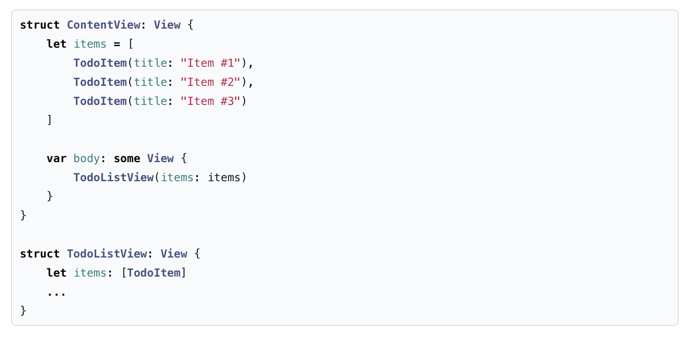

Аналогичным образом мы можем передать TodoItem из списка в отдельную строку:

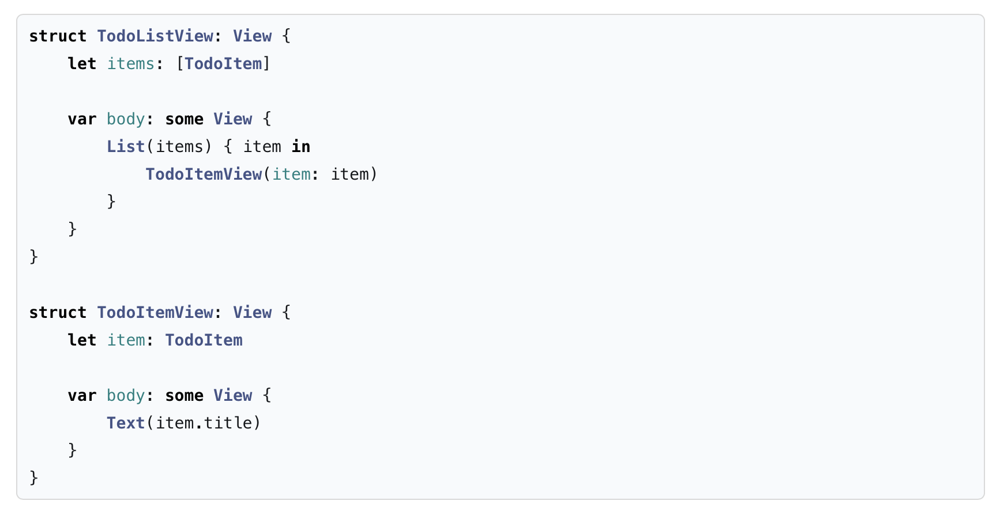

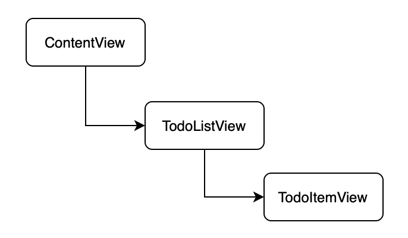

**От родителя к отдаленному дочернему – используйте Environment**

Часто у нас есть зависимости, которые требуются некоторым представлениям в иерархии, но не всем. Представьте, что нам нужно передать кеш изображений из корня композиции приложения (он же SceneDelegate) в TodoItemDetail:

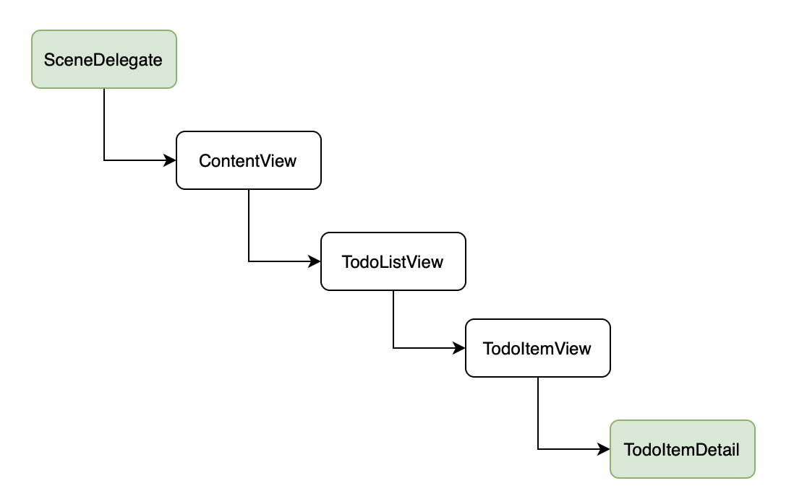

Если мы передадим кеш изображений через инициализатор, мы создадим 3 ненужных уровня косвенности и соединим все промежуточные представления с кешем изображений. Это звучит плохо.

К счастью, SwiftUI предлагает готовое решение. Познакомьтесь с средой, которая по сути представляет собой словарь с настройками для всего приложения. SwiftUI автоматически передает его из родительского представления своим дочерним элементам. Среда позволяет нам вставлять произвольные значения в иерархию представлений и читать их только при необходимости.

Давайте посмотрим, как мы можем внедрить кеш изображений в среду. Это реализуется следующим образом:

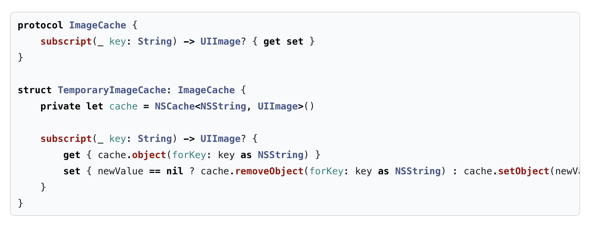

Теперь добавьте кеш изображений в среду:

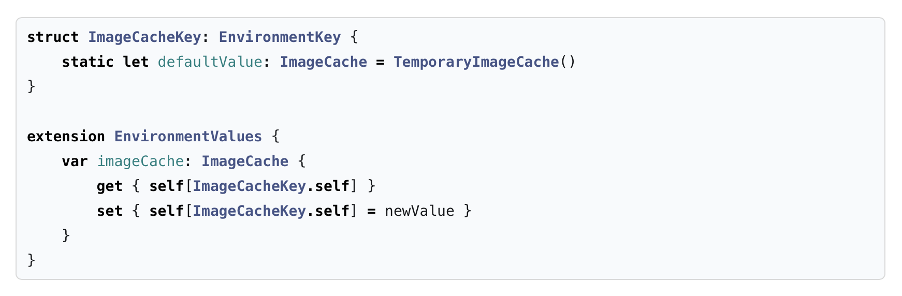

Мы можем прочитать значение из среды, используя оболочку свойства @Environment:

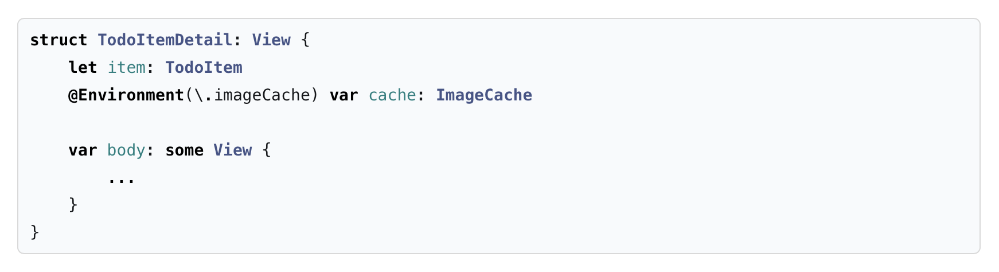

Обратите внимание, что кэш изображений по умолчанию будет создан при первом доступе к нему через @Environment.

**От дочернего к прямому родителю — используйте @Binding и callback**

Существует два способа передачи данных от дочернего элемента к его прямому родителю — с использованием @Binding и callback. Вот несколько аргументов, которые помогут сделать выбор:

• Когда нам нужно передать данные одним способом — используйте callback.  
• Когда нам нужно передать данные двумя способами — используйте @Binding.  

*Callback*

Очевидный вариант использования механизма обратного вызова — кнопки. Допустим, мы хотим добавить информационную кнопку в строку списка дел:


И обработайте действие кнопки в строке списка задач:

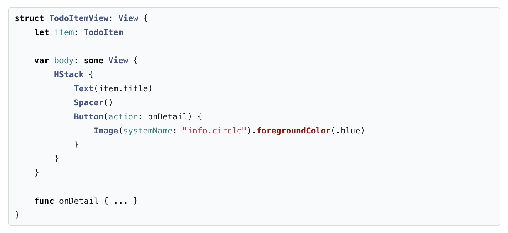

Или мы можем решить обрабатывать события касания в списке задач:

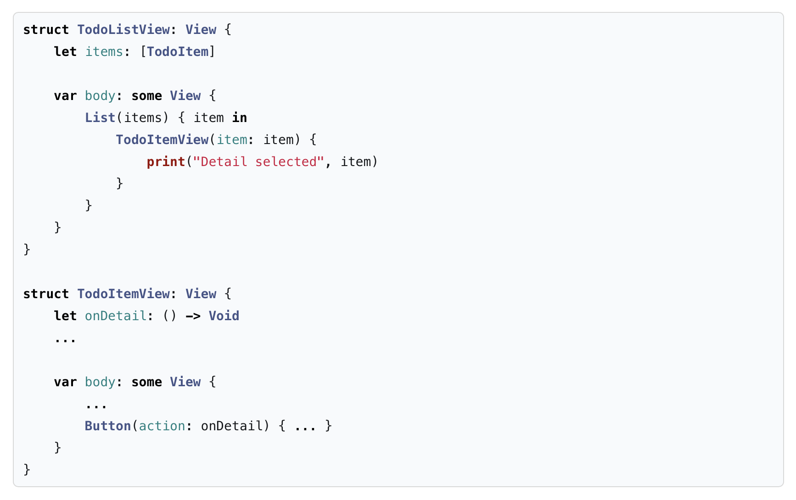

Цепочка вызовов выглядит следующим образом:


*Binding*

@Binding позволяет нам объявить свойство, которое принадлежит родителю, но может быть изменено как родителем, так и дочерним элементом, эффективно передавая эти изменения туда и обратно.

Для API, использующего привязку, мы рассмотрим метод List(item:content:), который представляет модальный лист. Вот как мы можем использовать его для отображения подробностей элемента задачи:

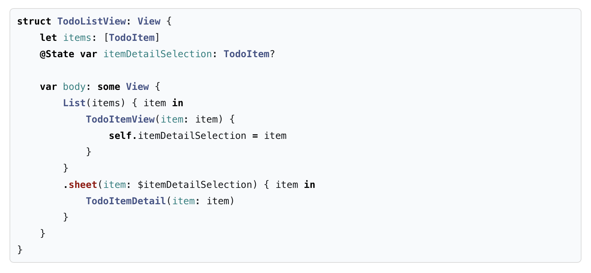

**От дочернего к отдаленному родителю – используйте PreferenceKey**

SwiftUI имеет систему предпочтений, которая позволяет нам передавать пары ключ-значение вверх по иерархии представлений. Процесс следующий:

Реализуйте собственный PreferenceKey, который представляет собой именованное значение, создаваемое представлением.
В дочернем представлении прикрепите пару ключ-значение.
В родительском представлении прикрепите обратный вызов, который отслеживает изменения этого предпочтения.
В качестве примера рассмотрим, как мы можем использовать настройки представления SwiftUI для отображения оповещения. Начнем с реализации ключа предпочтения:

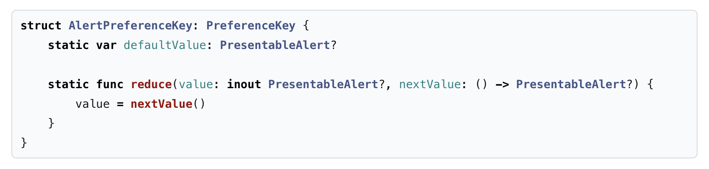

Протокол PreferenceKey предъявляет два требования. Мы должны предоставить значение по умолчанию для предпочтения и метод reduce(), который объединяет все дочерние значения в одно, видимое их родительскому элементу. Поэтому в методе reduce() мы сохраняем последнее предоставленное значение.

PresentableAlert определяется следующим образом:

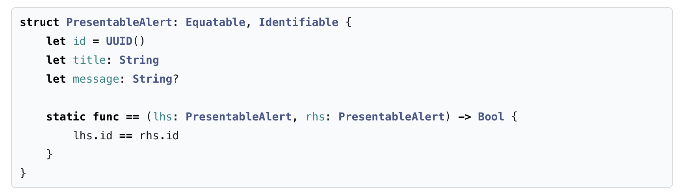

Соответствие протоколу Equatable важно, поскольку оно позволяет SwiftUI определять различия и вызывать родительский элемент только при изменении предпочтений. Имея AlertPreferenceKey, мы теперь можем использовать параметр Preference(key:value:) для передачи оповещения вверх по дереву представления:

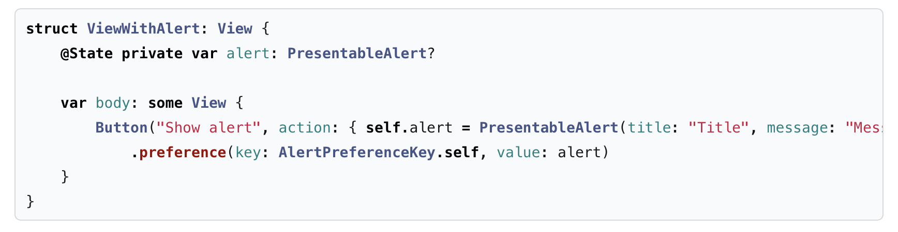

Теперь мы можем использовать onPreferenceChange() для чтения оповещения из текущего дерева представления. Обратите внимание, что ContentView является дальним родителем ViewWithAlert:

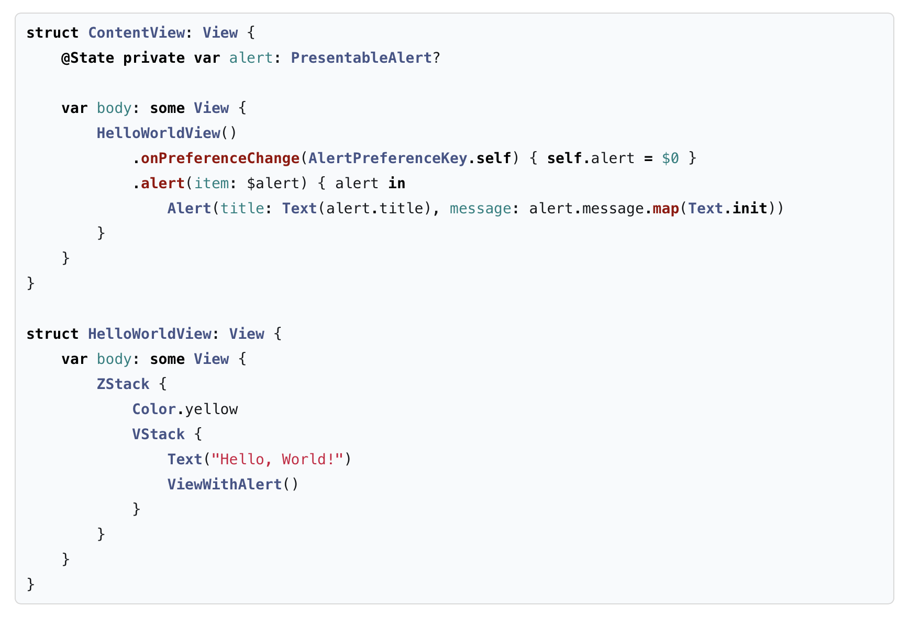

**Между дочерними – используйте @State**

Чтобы передавать данные между дочерними представлениями, нам нужно поднять состояние на один уровень выше и использовать их родительское представление в качестве посредника.

В качестве примера мы рассмотрим Toggle и Button с синхронизированным состоянием:

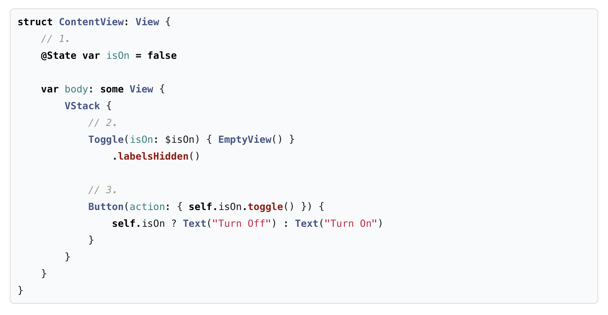

Вот что мы делаем:

1. Создайте @State в родительском представлении.
2. Используйте @Binding, чтобы передать состояние переключателю и позволить переключателю изменять состояние.
3. Используйте инициализатор, чтобы передать состояние кнопке. Используйте callback, чтобы передать событие касания обратно.

Поток общения выглядит следующим образом:


*Давайте подытожим шаблоны взаимодействия между представлениями SwiftUI:*

От родителя к прямому дочернему — используйте инициализатор.
От родителя к удаленному дочернему — используйте @Environment.
От дочернего к прямому родителю — используйте @Binding и callback.
От дочернего к отдаленному родителю — используйте PreferenceKey.
Между дочерними – используйте @State.

Количество механизмов, доступных для передачи данных между представлениями SwiftUI, на первый взгляд может показаться огромным. Но как только мы систематизируем их, все они будут иметь уникальные требования и варианты использования.
