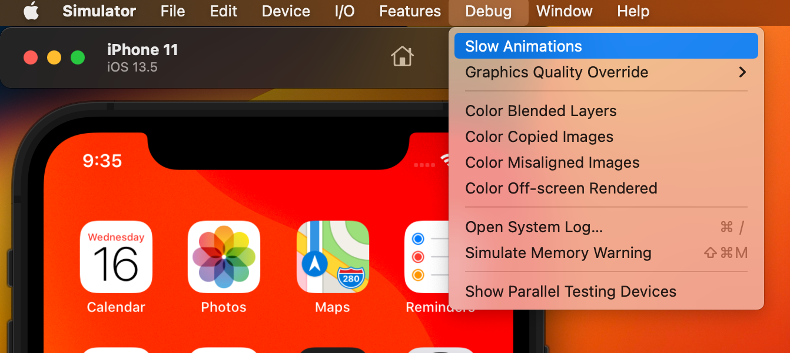
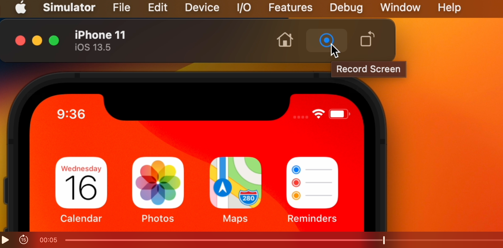
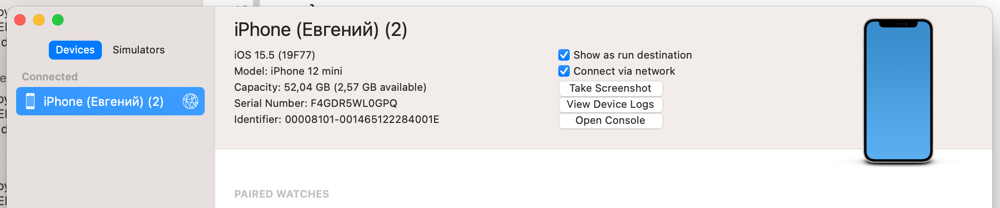
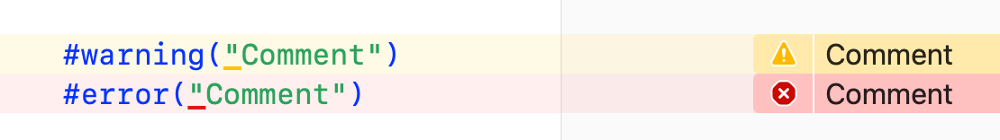
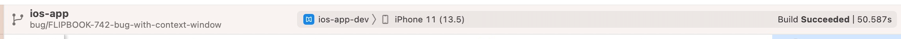
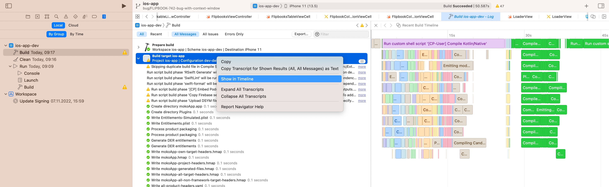

# Xcode: Tips and Tricks

## Курсор: 
 * `Shift` + `Control` + `Клик` в нужное место в коде: 
 Множественный курсор с возможностью выбрать все нужные места 
 * `Alt` + `провести зажатой мышкой / тачпадом вертикально по строкам кода`: 
 Множественный курсор подряд по всем строкам
 * `Alt` + `Shift` + `Перемещение влево / вправо`: 
 Выделение текста пословно 
 * `Cmd` + `Shift` + `Перемещение влево / вправо`: 
 Выделение текста построчно
 * `Alt` + `Выделение области`: 
 Выделяет конкретную область кода без обязательного выделения предыдущей строки

## Вложение / Текст: 
 * `Выделить текст` + `Закрывающая / открывающая круглая скобка`: 
 Оборачивает выделенный текст в круглые скобки
 * `Выделить текст` + `Кавычки`: 
 Оборачивает выделенный текст в кавычки
 * `Выделить текст` + `Закрывающая / открывающая фигурная скобка`: 
 Помещает код внутрь фигурных скобок
 * `Control` + `I`: 
 Выравнивание выделенной области текста (выравниваются отступы по оси x, ньюлайны не исправляет)
 * `Клик на закрывающую скобку` (фигурную / круглую): 
 Подсвечивает открывающую, и наоборот
 * `Двойной клик по закрывающей или открывающей скобке`: 
 Выделает весь вложенный код (работает как с круглыми, так и с фигурными скобками)

## Навигация: 
 * `Shift` + `Cmd` + `J`: 
 Выделение и переход к файлу, в котором мы сейчас находимся (в дереве файлов) 
 * `Control` + `Cmd` + `J`: 
 Провалиться внутрь любого типа, можно вместо `J` - кликнуть на имя типа
 * `Свайп двумя пальцами по трекпаду влево / вправо`: 
 Перемещение по истории файлов, в т.ч. по строкам, где задерживались

## Рефакторинг: 
 * `Правая кнопка на имени` -> `Refactor` -> `Rename`: 
 Переименование типа во всех местах упоминания
 * `Выделить имя переменной / типа` -> `Cmd` + `Control` + `E`: 
 Переименование выделенного в области видимости 

## Симулятор: 
 * `Переходим в симулятор` -> `Debug` -> `Slow animation`: 
 Включает медленную анимацию для ее отладки

 * `Зажать Option` на симуляторе: 
 Включает возможность записи видео с него (кнопка скриншота меняется на запись) 

 * `Window` -> `devices and simulators` -> `connect via network`: 
 Эта галочка позволяет запускать проект на девайсе по сети

## Разное: 
 * `#warning("Текст")`: 
 Оставляет вам комментарий о доработках, который отображается как предупреждение (желтый восклицательный знак) 
 * `#error("Текст")`: 
 Оставляет вам комментарий о доработках, который отображается как ошибка, и не дает компилировать проект

## Билд: 
 * `defaults write com.apple.dt.Xcode ShowBuildOperationDuration YES`: 
 Ввод этой команды через терминал, включает отображение общего времени сборки билда в икскоде (справа сверху)
 

 * `Build` -> `Show report navigator` -> `Build target` -> `Show timeline`: 
 Показывает весь билд диаграммой Ганта
 

## Ассеты: 
 * `Переходим в Assets` -> `Выделяем иконку приложения` -> `Включаем параметр Single size`
 После этого вы можете загружать одно изображение 1024, и остальные размеры Xcode сделаем сам.
  

Автор: <a href="https://github.com/EvelDevel">@EvelDevel</a>

