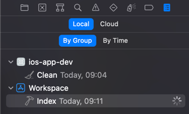

# Xcode

## Вывод логов процесса индексации

IDE выполняет индексацию проекта чтобы выполнять подсветку ошибок, предупреждений и делать подсказки
 при вводе кода. Но бывает что индексация проходит с ошибками, которые не относятся к реальности
 (компиляция проекта проходит успешно). В таком случае можно включить логи индексации.

Выполните команду в терминале:
```shell
defaults write com.apple.dt.Xcode IDEIndexShowLog YES
```

Перезапускаем Xcode и получаем в вкладке логов новую строку - Indexing:



## Новая система сборки Xcode 13.2

https://developer.apple.com/documentation/xcode-release-notes/xcode-13_2-release-notes

>The build system and Swift compiler have a new mode that better utilizes available cores, resulting in faster builds for Swift projects. The mode is opt-in, and you can enable globally with the following user default:

```shell
defaults write com.apple.dt.XCBuild EnableSwiftBuildSystemIntegration 1
```