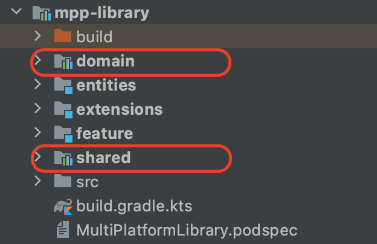
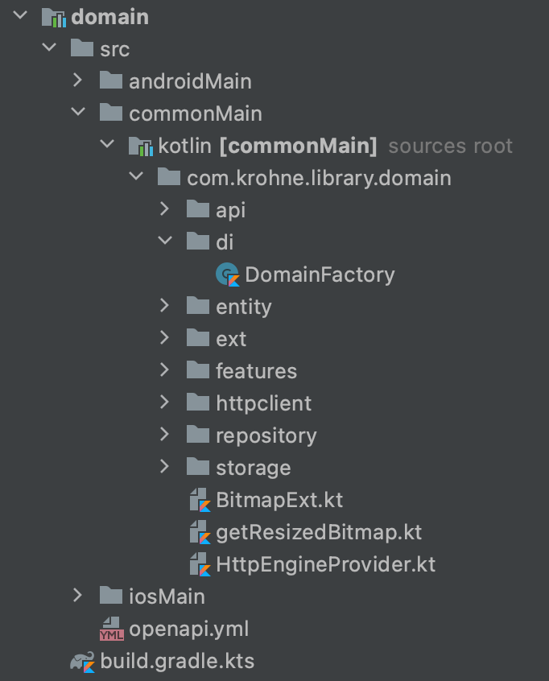
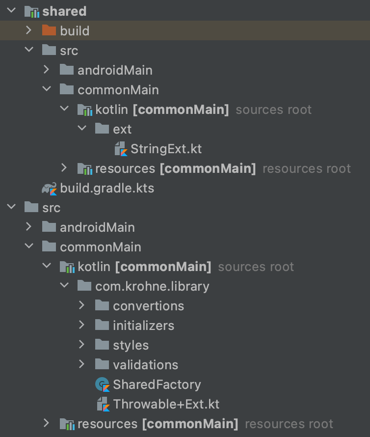

## Shared & Domain Factory

> Чтобы понять, что такое *Shared* и *Domain* Factory, нужно будет немного разобраться с подходом разделения ответственности и проброса необходимых зависимостей в проектах.

### Как было раньше?
У нас были такие модули как *domain* и *shared*, а также фабрики *DomainFactory* и *SharedFactory*.

Модуль *domain* включал в себя описания доменных сущностей, описание классов для работы с сервером, логику преобразования серверных ответов в те самые доменные сущности, с которыми могло работать приложение. Также в нём содержалась и доменная фабрика *DomainFactory*, которая создавала классы для работы с сетью, репозитории, управляющие данными, и производила настройку http-клиента. А также именно расширениями к *DomainFactory* реализовывались создания всех остальных фабрик для фичей.

Модуль *shared* содержал большое количество полезных расширений, вспомогательных методов, упрощений и прочих переиспользуемых между модулями вещей.

А внутри модуля *mpp-library* располагалась и *SharedFactory* (либо просто *Factory*, на разных старых проектах название может быть разным). Её предназначение было получить с натива все данные, необходимые для реализации *DomainFactory*, и, соответственно, *DomainFactory* на основе этих же данных могла реализовывать свои внутренние компоненты. Плюс *mpp-library* служила прослойкой для маппинга всех доменных сущностей в сущности фичей. Например, модель юзера могла быть и в модуле авторизации, и в модуле профилей. Но auth:User и profile:User - это были разные модели, и преобразование от доменной сущности domain:User (которую мы получали после преобразования ответа сервера) требовалось для каждой из них.

И чтобы в фичах мы могли спокойно кидать запросы, использовать модели данных и применять вспомогательные методы из *shared*, приходилось добавлять практически во всех фичах зависимости на *shared*.

> Поначалу всё шло неплохо. Производительность не сильно страдала. Проблемы начались тогда, когда мы имели уже объёмный проект, состоящий из 10-15 модулей с фичами. И в какой-то момент нам для одной из фичей надо было в *shared* добавить небольшой код или поправить реализацию уже имеющегося. Это приводило к тому, что на iOS начинали пересобираться абсолютно все зависящие на shared модули, а разработчик, поменявший одну строчку, мог ждать сборки iOS по 10 с лишним минут.

> И вторая большая проблема заключалась в том, что мы вынуждены были плодить множество сущностей. На примере всё того же юзера у нас была сетевая сущность юзера, которую присылал бэк, доменная сущность юзера, в которую мы преобразовывали сетевую, а далее для фичей авторизации и профиля — ещё по одной сущности, которые относятся уже к самим фичам, а они, в свою очередь, должны преобразовываться из доменных. Самый банальный пример — если на сервере добавили новое поле в сущности, которое нам нужно использовать, то его приходилось пробрасывать через все эти круги ада и тратить время.

### К чему мы пришли?

Из-за всего вышесказанного, от данного подхода было принято отказываться в сторону более нового - с учётом независимости фичи и проброса в неё внешних зависимостей.

> Если в рамках работы над проектом вам встречается модуль *domain*, *shared* или *DomainFactory*, то это проект, построенный на старом варианте архитектуры.
>
> Этот подход не актуален!
>
> В рамках поддержки существующих фичей, при невозможности изменения добавления зависимости от модуля на проброс зависимостей через интерфейсы, придётся использовать старый способ.
> При создании же новых фичей, даже с учётом старой архитектуры в этом проекте, их нужно реализовывать актуальным способом.

**Что изменилось:**

- Модуль *domain* упразднён!

  Сущность и модели у каждой фичи свои, в рамках модуля этой фичи. И они содержат достаточный набор данных для её работы. Но в случаях, когда одни и те же сущности должны использоваться между несколькими фичами, для того чтобы избежать дублирования, такие сущности выносятся в отдельный модуль и в зависимость добавляется именно он.

- *DomainFactory* и SharedFactory упразднены.

  Вместо них мы получаем зависимости напрямую через koin.

- Модуль *shared* упразднён.

  Подобные общие компоненты реализовываются внутри модуля *mpp-library*.

- Для реализации логики работы с данными или с API сервера используются репозитории. Каждая ViewModel описывает у себя интерфейс репозитория, покрывающий её нужды. Либо бывают случаи общего интерфейса репозитория на несколько ViewModel, но в рамках одной фичи. Реализация этого репозитория должна передаваться при создании ViewModel. Сами реализации создаются в модуле *mpp-library*, а он, как мы знаем, имеет информацию и о viewModels (т.к. *mpp-library* знает о других модулях), и о сетевом слое. Соответственно, в рамках него без проблем можно описать реализации этих интерфейсов и пробросить их в фабрику фичи, которая, в свою очередь, передаст реализацию во ViewModel. Это же помогает избежать пачки мапперов из сетевой сущности в доменную, из доменной в фичёвую.
