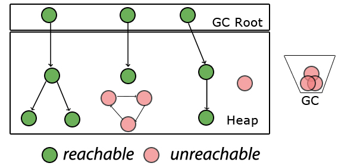

# Работа с памятью

Оперативная память (RAM - память с произвольным доступом) - используется центральным процессором, чтобы загрузить в нее операционную систему, как android, так и ios. При запуске приложения для него выделяется некоторый объем оперативной памяти, он называется памятью кучи (heap). При создании объекта (экземпляра класса) под него выделяется участок памяти в куче. Этот процесс осуществляется во время выполнения программы, поэтому такое выделение памяти называют динамическим. Созданный объект получает ссылку - переменную, содержащую адрес ячейки памяти, в которой он хранится.
Пример создания объекта на Kotlin:
```kotlin
class Cat {
    val name: String
}
val murzik = Cat()
```
Переменная murzik хранит ссылку на объект класса Cat.

Объекты, созданные в куче, имеют глобальный доступ и на них могут ссылаться из любой части приложения. По мере создания новых объектов количество доступной памяти уменьшается. Поэтому необходимо постоянно освобождать ранее выделенную память.
Для управления динамическим распределением памяти используется сборщик мусора — программный объект, который следит за выделением памяти и обеспечивает её своевременное освобождение. Сборщик мусора на андроиде (Garbage Collector) и механизм автоматического подсчета ссылок (Automatic Reference Counting) на iOS объединены общей целью, но подходят к решению этой задачи по-разному. Они должны находить мусор - неиспользуемые объекты - и освобождать от них память. 

## Однако что считается “мусором”?
Объект считается неиспользуемым, если он становится недостижим: это значит, что на него не остается сильных ссылок (подход ARC и GC), либо цепочка сильных ссылок, которая могла бы связать объект с другими объектами, обрывается (подход GC).



Вернёмся к переменной murzik, которая все еще хранит ссылку на объект класса Cat. Если присвоить переменной murzik значение null, она перестанет ссылаться на объект, хранящийся в памяти:

```kotlin
murzik = null
```

Объект класса Cat становится недостижим, мы больше не можем получить его по ссылке murzik. Теперь он может быть удален из памяти сборщиком мусора.

Рассмотрим каждый подход подробнее.

## Механизм автоматического подсчета ссылок
Каждый объект имеет счетчик, который хранит информацию о том, сколько ссылок указывает на объект. Когда ссылка уничтожается, счетчик уменьшается. Если значение счетчика равно нулю, то объект можно считать мусором. ARC не освободит экземпляр, если на него есть хотя бы одна сильная ссылка. Главным минусом такого подхода является сложность обеспечения точности счетчика. Также при таком подходе сложно выявлять циклические зависимости (когда два объекта больше не используются, но каждый из них ссылается на другой). Это приводит к утечкам памяти: такую память невозможно освободить и выделить под другие объекты.


[Наглядный пример цикла сильных ссылок на iOS](https://swiftbook.ru/content/languageguide/automatic-reference-counting/#strong-reference-cycles-between-class-instances)

## Подход Garbage Collector на андроид

В Андроид байт-код исполняет своя виртуальная java машина – ART (Android Runtime). Поэтому реализация сборщика мусора схожа с реализацией GC в JVM.

Его работа будет запущена в следующих случаях:
- когда возникнет условие нехватки памяти (невозможно провести операцию по выделению памяти)
- когда заполнение памяти кучи достигнет определенного лимита 
- когда сборщик мусора был вызван непосредственно из кода программы

[Как работает последовательный сборщик мусора (генерационный)](http://alexandr.logdown.com/posts/22570)
Такой сборщик мусора в своей работе использует модель stop-the-world, останавливая работу приложения на время, необходимое для полного прохождения цикла сборки мусора. Сборка мусора выполняется только одним потоком.

Также существует параллельный сборщик мусора **Concurrent Mark Sweep GC**
Выполняет часть работ по сборке мусора параллельно с основными потоками приложения.

**Алгоритм его работы можно описать так:**

- Объекты создаются в памяти;
- В момент, когда нужно запустить сборщик мусора приложение приостанавливается;
- Сборщик проходится по дереву объектов, помечая живые объекты;
- Сборщик проходится по всей памяти, находя все не отмеченные куски памяти и сохраняя их в «free list»;
- Когда новые объекты начинают создаваться, они создаются в памяти доступной во «free list».

**Минусы этого способа:**
- Приложение не работает, пока происходит сборка мусора;
- Время остановки напрямую зависит от размеров памяти и количества объектов

### Вернемся к подходу GC на андроид, что же он считает “мусором”?

Объекты, на которые отсутствуют ссылки, считаются мусором. Также живыми могут считаться только те объекты, до которых мы можем добраться посредством цепочки ссылок, начиная с корневой (Garbage Collector Root) - ссылки, непосредственно существующей в выполняемом коде. Если мы представим все объекты и ссылки между ними как дерево, то нам нужно будет пройти с корневых узлов (точек) по всем рёбрам. При этом узлы, до которых мы сможем добраться - не мусор, все остальные - мусор. Этот подход получил название “трассировка” (tracing). Существует несколько типов корневых точек:
- локальные переменные и параметры методов;
- активные потоки;
- статические переменные (так как на них ссылаются их классы)

Именно поэтому в андроид не возникает проблемы с утечкой памяти при возникновении циклических зависимостей. Взглянем на иллюстрацию, которая уже была приведена ранее:


Несколько объектов, изображенных на ней, больше не используются, но каждый из них ссылается на другой. Однако они недостижимы с помощью цепочки сильных ссылок, начинающейся от корневой ссылки сборщика мусора. Поэтому для него такие объекты будут считаться мусором и будут благополучно собраны.

[Подробнее про сборщики мусора на андроид](https://proandroiddev.com/collecting-the-garbage-a-brief-history-of-gc-over-android-versions-f7f5583e433c)

Однако утечка памяти на андроид может произойти в том случае, если мы сохраним ссылку на объект с коротким жизненным циклом в объекте с длинным жизненным циклом. Возникнет ситуация, когда первый объект больше не используется, но сборщик мусора не может удалить его из памяти, потому что на него ссылаются другие объекты.

[Подробная статья с примерами](https://proandroiddev.com/everything-you-need-to-know-about-memory-leaks-in-android-d7a59faaf46a)

Еще пример утечки памяти: приложение для социальной сети отображает фамилию, имя и рейтинг текущего пользователя на каждом экране приложения. Объект с профилем текущего пользователя существует с момента входа в аккаунт до момента выхода из него, и все экраны приложения обращаются за информацией к одному и тому же объекту. Этот объект также периодически обновляет данные с сервера, так как рейтинг может часто меняться. Необходимо, чтобы объект с профилем уведомлял текущее activity об обновлении рейтинга:
```kotlin
override fun onResume() {
	super.onResume()
	currentUser.addOnUserUpdateListener(this)
}
```
Как добиться в этой ситуации утечки памяти? Забыть отписаться от уведомлений в методе onPause:
```kotlin
override fun onPause() {
	super.onPause()
	/* Забудьте про следующую строчку и вы получите серьёзную утечку памяти */
	currentUser.removeOnUserUpdateListener(this)
}
```

Activity будет продолжать обновлять интерфейс каждый раз, когда профиль будет обновляться. Даже после того, как экран перестанет быть видим пользователю. Это может привести к видимому торможению интерфейса в момент обновления профиля — и не только на этом экране.

## Слабые ссылки
Для решения этой проблемы существуют слабые ссылки. Мы можем сохранять не только сильные ссылки на объекты, но и слабые. Объект, на который существуют только слабые ссылки, может быть удален в любой момент при вызове cборщика мусора, для этого не обязательно условие нехватки памяти. А ссылка перестанет ссылаться на объект и примет значение null.

В ARC существует точно такой же механизм создания слабых ссылок на объект. При присвоении объекту слабой ссылки счетчик сильных ссылок на него не увеличивается. Этот экземпляр может быть удален ARC из памяти, пока слабая ссылка все еще ссылается на него. После чего ARC автоматически присвоит слабой ссылке nil, когда экземпляр, на который она указывает, освобождается.

Если двум объектам нужно иметь ссылку друг на друга, объекту А (имеющему меньшую продолжительность жизни) следует иметь слабую ссылку на объект Б, который имеет большую продолжительность жизни, тогда как Б может иметь сильную ссылку на объект А.

**Пример:**
Есть приложение, которое позволяет пользователю загружать из сети изображения в высоком разрешении и просматривать их. Медиафайлы хранятся на сервере, откуда их можно получить с помощью GET-запроса. Пользователь нетерпелив, он не намерен ждать при каждом запуске приложения, пока загрузятся все файлы. Поэтому возникает идея сохранить файлы в памяти приложения в виде какой-либо структуры данных (список, мапа), чтобы потом без задержки показывать изображения пользователю. Структура данных будет создаваться как обычно, с помощью сильной ссылки. Перед загрузкой каждого медиафайла будет происходить проверка, находится ли это изображение в памяти, и если нет, то оно будет загружаться в список. Однако файлы декодированных изображений в формате Bitmap будут занимать много места, и если продолжить скачивание без возможности очистки этого списка, то приложение упадет с ошибкой нехватки памяти. Как быть? Создавать структуру данных с помощью слабой ссылки!

[Реальный кейс использования слабых ссылок в общем коде](https://kmm.icerock.dev/learning/libraries/moko/moko-units#%D0%BC%D0%BE%D0%B6%D0%BD%D0%BE-%D0%BB%D0%B8-%D0%BF%D0%B5%D1%80%D0%B5%D0%B4%D0%B0%D0%B2%D0%B0%D1%82%D1%8C-%D0%BB%D1%8F%D0%BC%D0%B1%D0%B4%D1%83-%D0%B2-unititem)

## Управление памятью в Kotlin Native
Осуществляется комбинированно с помощью автоматического подсчета ссылок на объекты (аналогично подходу ARC, работает в режиме реального времени) + с помощью сборщика мусора для циклических ссылок, основанный на алгоритме пробного удаления. Каждый запуск такого сборщика создаёт микропаузы в работе кода, поэтому частота его запуска строго определена.

Для Kotlin / Native был разработан набор ограничений, направленный на возможность обмена данными между потоками. Граф объекта должен быть сначала заморожен, чтобы предотвратить его изменение. Только после этого он может быть передан другим потокам.
[Подробнее в источнике](https://blog.jetbrains.com/kotlin/2021/05/kotlin-native-memory-management-update/)

[Работа с новой моделью памяти в Kotlin Native](https://habr.com/ru/post/578716/)


