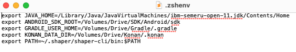
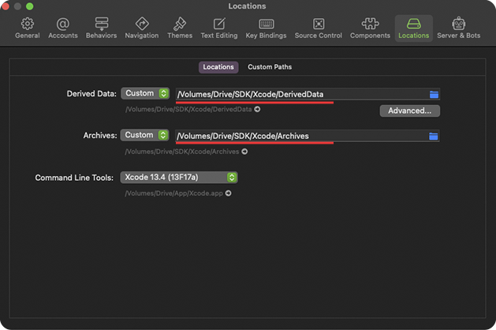

## Как перенести директории разработки на внешний диск

Иногда свободное пространство на системном диске ограничено сильнее, чем того хотелось бы, поэтому давайте рассмотрим как перенести директории разработки на внешний диск.

:::info
Скорость доступа к файлам внешнего носителя практически не будет отличаться, если подключение выполнено через USB 3.0/Thunderbolt интерфейс, а характеристики внешнего носителя на чтение запись начинаются от 450/300Мб/с, это связано с тем, что большинство файлов проектов и программ имеют малый объем и большие скорости накопителей не принесут ощутимого прироста производительности, но использование HDD для этих целей однозначно не рекомендуется.  
:::

## ВАЖНО ЗНАТЬ

После выполнения этапов данной инструкции функция **Восстановление окон после загрузки системы** для интерактивных оболочек работает некорректно, после восстановления приложения будут использовать пути установленные по-умолчанию, для таких приложений необходимо выполнить ручной перезапуск. Если вы знаете как исправить данную особенность, нажмите на ссылку внизу страницы и отправьте нам реквест с информацией.

#### Используемые директории

При разработке для мультиплатформы мы часто используем вот эти директории:

- проектов для android/kmm:  
  `~/AndroidStudioProjects`
- проектов для xcode:  
  `~/Documents/xCode`
- расположение файлов Gradle:  
  `~/.gradle`
- расположение файлов Kotlin-Native (где Gradle хранит версии Kotlin-Native):  
  `~/.konan`
- расположение Archive:  
  `/Library/Developer/Xcode/Archives`
- расположение DerivedData:  
  `/Library/Developer/Xcode/DerivedData`
- расположение Android SDK:  
  `/Library/Android/sdk`

#### Перенос директорий на внешний диск

На текущий момент у нас в системе есть два диска:

- Системный диск:  
  `/Volumes/MacDrive/`
- Внешний диск:  
  `/Volumes/ExternalDrive/`

#### Перенос проектов

Давайте начнем с простого и перенесем для начала директории проектов. Предлагаю создать на внешнем диске папку Projects, а в ней создать: Android, KMM, Xcode. Теперь перенесем наши проекты в них.

#### Перенос .konan

Подготовим директорию, которую будем в дальнейшем использовать, создадим папку Konan в корне внешнего диска. В терминале вводим:

`nano ~./zshenv`

В открывшемся файле добавляем строку:

`export KONAN_DATA_DIR=/Volumes/ExternalDrive/KONAN/.konan`

Для экономии времени можем перенести папку .konan из директории `~/.konan` в заранее созданную нами папку.

#### Перенос .gradle

Чтобы освободить пространство на диске, нам достаточно перенести файлы, которые загружает и кэширует Gradle. Прежде чем это сделать, аналогично предыдущему пункту создадим папку Gradle в корне внешнего диска. Теперь можно задать переменные путей, которые gradle будет использовать, для этого в терминале вводим:

`nano ~./zshenv`

В открывшемся файле добавляем:

`export GRADLE_USER_HOME=/Volumes/Drive/Gradle/.gradle`

:::warning  
Сейчас необходимо сделать очень важную вещь: удалить папки .gradle и .idea из директорий проектов, в противном случае при следующем открытии проекта файлы будут вновь загружены в директорию` /%USERNAME%/.gradle`  
В качестве альтернативного метода, можно сделать ре-импорт проектов.  :::

#### Перенос Android SDK

Запускаем Android Studio и идем в настройки Android SDK:

`Settings -> Appearance & Behavior -> System Settings -> Android SDK`

В строке Android SDK Location отображается текущий путь, где хранятся скачанные компоненты sdk. Нажимаем Edit, появившийся диалог позволяет настроить необходимые компонент и самое главное путь до них. Выбираем необходимые, а путь, где будем дальше хранить SDK, меняем на:

`/Volumes/ExternalDrive/SDK/Android/`

Нажимаем Next, подтверждаем изменения и ожидаем окончания загрузки нашего SDK. Если до этого он был уже скачан, то можно до выполнения этих шагов перенести файлы из директории по-умолчанию по нашему пути, тем самым сэкономив свое время.
По окончании настроек Android Studio запускаем терминал и открываем файл .zshenv, нам необходимо добавить переменную окружения для Android SDK. К уже имеющимся строкам добавляем:

`export ANDROID_SDK_ROOT=/Volumes/Drive/SDK/Android/`

После выполненных шагов, ваш файл должен иметь, примерно, такой вид:

#### Перенос Android Studio

Также на внешний диск мы можем перенести Android Studio, так как мы устанавливаем IDE при помощи JetBrains Toolbox, то нужно зайти в настройки Toolbox и сменить директорию установки, например на:

`/Volumes/ExternalDrive/Apps/JetBrains/Toolbox/`

Если Вы не снимали галочку с пункта: ***Хранить предыдущие версии инструментов для быстрого отката к ним***, то удаление Android Studio с системного диска и установка на внешний займет пару минут.

:::important

Предварительно не забудьте экспортировать свои настройки IDE (*File - Manage IDE Settings - Export Settings...*) в файл, чтобы восстановить их после установки.

:::

#### Перенос Xcode

Установить Xcode на другой носитель отличный от системного полностью - нельзя, привязка симуляторов и других необходимых зависимостей требует их наличия по пути по-умолчанию, но мы можем перенести установленное приложение Xcode из папки Программы, например, в нашу созданную папку App.

Если вы попытаетесь скомпилировать свои проекты, то обнаружите сообщение, что Xcode не найден по пути, который указан в окружении и необходимо указать актуальную директорию. Для этого в терминале вводим:

`sudo xcode-select --switch /Volumes/App/Xcode.app`

где (*/Volumes/App/Xcode.app*) путь до Xcode.app

#### Перенос Archive и Derived Data

Перенос данных директорий очень прост, создадим в корне внешнего диска папку Xcode, а в ней: Archive и DerivedData.

Следующий шаг - запустить Xcode и открыть Preference -> Вкладку Locations и изменить пути до Derived Data и Archives, на путь до созданных нами директорий.

#### Добавление значений переменных окружения в Xcode

Если сейчас мы попытаемся запустить какой-то из проектов мультиплатформы, то большинство наших изменений не будут видны для Xcode, чтобы добавить в него новые пути до необходимых компонентов и наши значения переменных окружения воспользуемся расширенным скриптом, который предоставляет [moko-doctor](https://github.com/icerockdev/moko-doctor). Данный скрипт находится в  файле [setup_xcode_environment_extended.sh](https://github.com/ExNDY/moko-doctor/blob/extended-moko-doctor/setup_xcode_environment_extended.sh)
Чтобы запустить необходимо  в терминале открыть директорию moko-doctor (рассмотрим вариант, без установки moko-doctor) и вызвать:

`./setup_xcode_environment_extended.sh`

Скрипт обнаружит настроенные пути и если необходимо предложит добавить недостающие значения для переменных окружения.

:::important
Важный момент: значения, полученные после выполнения всех шагов необходимо скопировать из файла `.zshenv` в `.zshrc`
.zshrc используется для интерактивных оболочек: в нашем случае, если не добавить значения переменных в этот файл, то, например, git будет использовать пути по-умолчанию и загрузит необходимые файлы по ним.
:::

#### Добавление значений переменных окружения в .zshrc

Используем самый удобный способ для связки .zshenv и .zshrc - добавим первый во второй в качестве источника данных. Для этого запускаем терминал и вводим:

`nano ~./zshrc`

И добавляем в файл строку:

`source ~./zshenv`

Теперь осталось только сохранить изменения в файле и перезагрузить систему. После перезапуска все изменения вступят в силу и наш перенос рабочих директорий на другой диск окончен.
