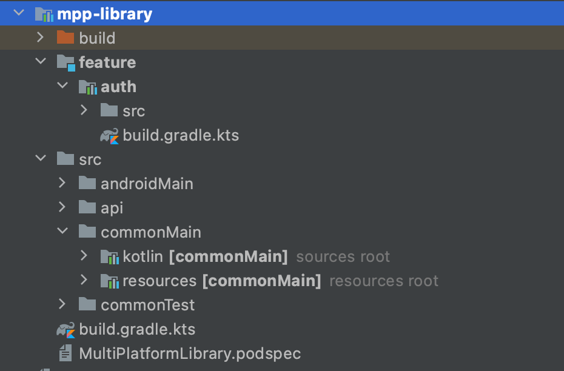
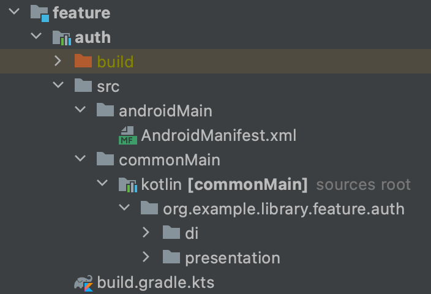
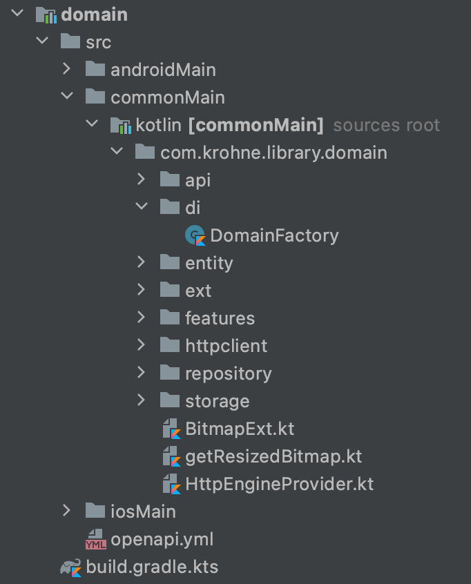
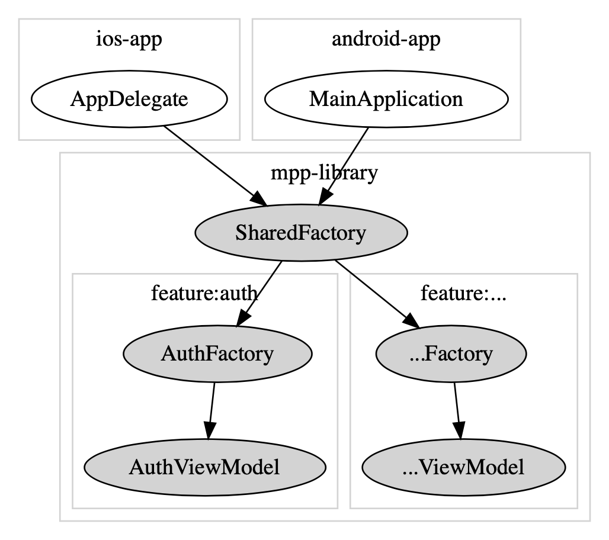
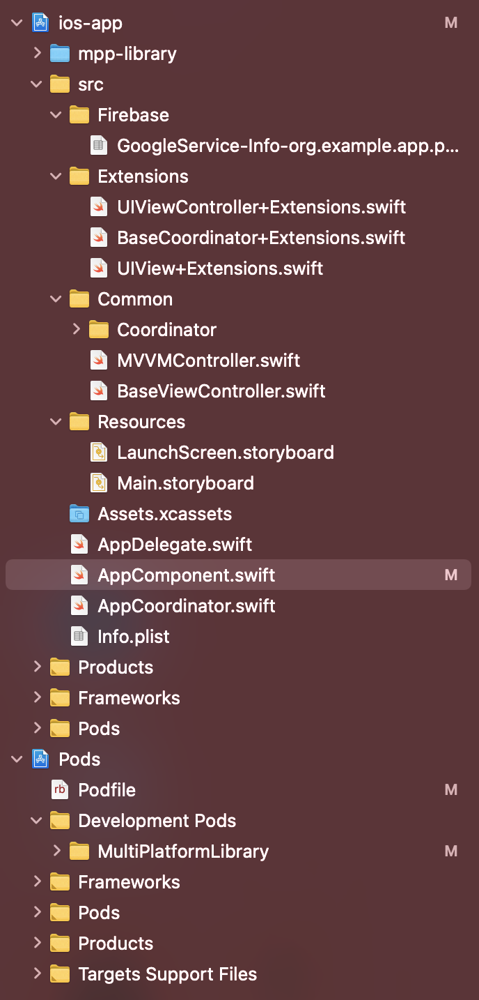

# 3. Устройство проекта

## Вводная

В данной статье разобран типовой KMM проект на базе [mobile-moko-boilerplate](https://gitlab.icerockdev.com/scl/boilerplate/mobile-moko-boilerplate). Внимание уделено каждому файлу и директории в проекте, дано пояснение ко всему - для чего используется, в каких случаях нужно вносить изменения, как работает.

После ознакомления с материалом вы узнаете:

1. Из каких частей состоит проект
1. Где находится конфигурация мультиплатформенного модуля
1. Как реализована интеграция мультиплатформенного модуля в iOS
1. Какие настройки применены к текущему проекту для мультиплатформенного модуля
1. Как устроена многомодульность на проекте
1. Как объявляются внешние зависимости (библиотеки)
1. Как настроен экспорт зависимостей в iOS фреймворк
1. Как реализован DI (Dependency Injection)
1. Как реализована навигация на android и iOS 

## Конфигурация сборки

Проект хранится в моно-репозитории, то есть в одном репозитории содержится и android и ios приложения, а также общая библиотека на Kotlin Multiplatform.

Проект использует несколько систем сборки:

1. [Gradle](https://gradle.org/) - система сборки для Android приложения и Kotlin библиотеки;
1. [Xcode](https://developer.apple.com/xcode/) - система сборки (и IDE) для iOS приложения.

Давайте разберемся с тем, как происходит сборка обеих платформ.

### Сборка Android приложения

Для сборки Android приложения нам достаточно Gradle системы сборки.

Когда мы нажимаем на кнопку Run в Android Studio по сути мы запускаем gradle задачу `assembleDevDebug` в gradle-проекте `android-app`. Это можно увидеть по логу, который отображается во вкладке `Build` при запуске.


Задача `assembleDevDebug` производит компиляцию только Debug типа сборки и только Dev [product flavour](https://developer.android.com/studio/build/build-variants). Для выполнения этой задачи требуется выполнить множество других задач, от которых данная задача зависит. Поэтому в логе сборки мы видим выполнение множества задач. При компиляции android приложения будет автоматически скомпилирован и модуль с общим Kotlin Multiplatform кодом (gradle проект `mpp-library`). Это происходит потому, что в `android-app` указана зависимость на проект `mpp-library` (будет разобрано подробнее позже).

### Сборка iOS приложения

Для сборки iOS приложения используются сразу обе системы - Xcode и Gradle, что, разумеется, увеличивает время сборки. Это также осложняет и анализ ошибок сборки, ведь ошибки могут быть как в разных системах сборки по отдельности, так и на стыке двух систем.

Когда мы нажимаем на кнопку Run в Xcode, начинается процесс сборки как и у любого другого iOS приложения через сам Xcode. Наш Xcode проект имеет зависимость на CocoaPod `MultiPlatformLibrary`, поэтому при компиляции приложения начнется и компиляция `MultiPlatformLibrary`.

Узнать подробнее о том, как происходит компиляция этой зависимости и подключение сторонних подов, вы можете в [разделе обучения](/learning/ios/pods).

После того, как локальный под будет скомпилирова, а все остальные зависимости "подцеплены" нашим приложением, произойдет запуск.  

## Структура проекта

Ознакомимся с содержимым в корне репозитория. 

`ls -lp`:
```bash
build-logic/
android-app/
ios-app/
mpp-library/
gradle/
build.gradle.kts
gradle.properties
gradlew
gradlew.bat
settings.gradle.kts
README.md
```

Кратко про каждый элемент, для понимания общей картины:

- `android-app/` - директория с исходным кодом Android приложения;
- `ios-app/` - директория с исходным кодом iOS приложения;
- `build-logic/` - директория с логикой для системы сборки Gradle;
- `mpp-library/` - директория с исходным кодом общей библиотеки на KMM;
- `gradle/` - специальная директория системы сборки Gradle, в которой лежит Gradle Wrapper;
- `build.gradle.kts` - файл конфигурации сборки корневого gradle проекта;
- `gradle.properties` - файл с опциями, которые передаются в Gradle проект при запуске;
- `gradlew` и `gradlew.bat` - скрипты для Unix и Windows соответственно, которые запускают Gradle используя Gradle Wrapper;
- `settings.gradle.kts` - файл настроек Gradle проекта;
- `README.md` - краткое описание содержимого репозитория и инструкция как собирать проект;

Далее разберем все блоки более детально.

## Root Gradle project

Следующая важная составляющая нашего проекта - корневой gradle проект. Как было сказано ранее - для сборки обеих платформ используется gradle. Для android только он, а для ios gradle является одной из билдсистем. Корневая директория нашего проекта по сути и является корневым gradle проектом. `android-app` и `mpp-library` подключаются к этому коревому проекту как подпроекты.

К коревому gradle проекту относятся:
- `build-logic` - композитно подключенный проект, несущий в себе логику сборки остальных подпроектов;
- `gradle.properties` - опции запуска gradle проекта;
- `settings.gradle.kts` - файл настроек;
- `build.gradle.kts` - файл конфигурации сборки.
- `gradle` - директория [Gradle Wrapper'а](/learning/gradle/gradle-wrapper) - специального скрипа, который автоматизирует процесс установки нужной версии gradle.
  
О том как обновить версию Gradle в проекте вы можете прочитать в [специальном разделе обучения](/learning/gradle/updating-versions). 

Больше файлов относящихся непосредственно к коревому gradle проекту в репозитории нет.

### [buildSrc](/learning/gradle/buildSrc) (устарело)

:::caution

Директория упразднена! 

На новых проектах вместо `buildSrc` используется `Version Catalogs`.

:::

`buildSrc` - [специальная директория Gradle](https://docs.gradle.org/current/userguide/organizing_gradle_projects.html#sec:build_sources). Она предназначена для реализации логики сборки, не привязанной к конкретному gradle модулю. По сути это исходники библиотеки, которая автоматически будет подгружена в gradle и все классы объявленные в этой библиотеке будут доступны в любом месте Gradle конфигурации (в `build.gradle.kts`).

В этой директории можно увидеть собственный `build.gradle.kts` и исходный код библиотеки. `build.gradle.kts` определяет как будет собираться данная библиотека и какие зависимости ей требуются. Исходный код библиотеки в нашем проекте содержит только один объект `Deps`, содержащий константы и зависимости, необходимые нашему проекту.

В `build.gradle.kts` можно увидеть подключение нескольких зависимостей:

```kotlin
dependencies {
    implementation("dev.icerock:mobile-multiplatform:0.9.2")
    implementation("org.jetbrains.kotlin:kotlin-gradle-plugin:1.4.32")
    implementation("com.android.tools.build:gradle:4.1.3")
}
```

В `Deps.kt` объявлен объект `Deps` с перечислением версий зависимостей и самих зависимостей в виде констант, для удобного обращения к ним в gradle конфигурации.

Ниже приведено пояснение ко всем составляющим данного объекта:

```kotlin
object Deps {
    // в начале перечисляются константами версии каждой из использующихся зависимостей. 
    // они приватные, так как используются данные константы только внутри самого Deps
    private const val materialVersion = "1.2.1"
    // ...

    // во вложенном объекте Android описываются версии используемых android sdk
    object Android {
        const val compileSdk = 30
        const val targetSdk = 30
        const val minSdk = 21
    }

    // во вложенном объекте Plugins содержатся объявления каждого используемого нами gradle плагина,
    // в специальном контейнере GradlePlugin (данный класс приходит от зависимости mobile-multiplatform-gradle-plugin)
    // https://github.com/icerockdev/mobile-multiplatform-gradle-plugin/blob/master/src/main/kotlin/GradlePlugin.kt#L10
    object Plugins {
        // мы можем объявить gradle плагин используя только id, в таком случае будет недоступно
        // подключение артефакта с данным плагином (для этого нужно указание свойства module)
        // такой подход используется для плагинов, которые подключаются с gradlePluginPortal, либо
        // содержатся в зависимостях, которые указаны в buildSrc/build.gradle.kts
        val androidApplication = GradlePlugin(id = "com.android.application")
        // для плагинов, которые требуют подключения дополнительных артефактов нужно указать свойство
        // module и в build.gradle.kts подключить в buildscript.dependencies
        val kotlinSerialization = GradlePlugin(
            id = "org.jetbrains.kotlin.plugin.serialization",
            module = "org.jetbrains.kotlin:kotlin-serialization:$kotlinxSerializationPluginVersion"
        )
        // ...
    }

    // вложенный объект Libs содержит объявления каждой внешней библиотеки
    object Libs {
        // в Android содержатся библиотеки относящиеся только к android, используются в android-app 
        // либо как зависимости androidMain sourceSet'а
        object Android {
            // объявление зависимости происходит в виде обычной строки
            const val appCompat = "androidx.appcompat:appcompat:$androidAppCompatVersion"
            // ...
            
            // в Tests указываются зависимости для тестов в android-app либо androidTest sourceSet'а
            object Tests {
                // объявление также происходит в виде обычной строки
                const val espressoCore = "androidx.test.espresso:espresso-core:$espressoCoreVersion"
                // ...
            }
        }

        // в MultiPlatform объекте содержатся объявления всех мультиплатформенных библиотек
        // используется в mpp-library и вложенных в нее модулях
        object MultiPlatform {
            // те зависимости, которые не предполагается использовать в Kotlin/Native export, 
            // указываются в виде простой строки. Указывается артефакт метаданных, по которому 
            // gradle найдет все артефакты для нужных таргетов  
            const val kotlinSerialization = 
                "org.jetbrains.kotlinx:kotlinx-serialization-core:$kotlinxSerializationVersion"
            // ...

            // те зависимости, которые будут экспортироваться в iOS framework, объявляются в виде
            // MultiPlatformLibrary контейнера (из mobile-multiplatform-gradle-plugin)
            // https://github.com/icerockdev/mobile-multiplatform-gradle-plugin/blob/master/src/main/kotlin/MultiPlatformLibrary.kt#L10
            // для простоты чаще всего используется преобразование из строки с путем до артефакта 
            // метаданных, через метод defaultMPL, с указанием в аргументах тех таргетов, которые 
            // нужно автоматически заполнить (заполнение идет согласно именованию стандартной 
            // публикации мультиплатформенных библиотек) 
            val mokoResources = "dev.icerock.moko:resources:$mokoResourcesVersion"
                .defaultMPL(ios = true)
            // ...

            // в Tests указываются зависимости для тестов в mpp-library и вложенных модулях
            object Tests {
                // зависимости указываются в виде строк
                const val kotlinTest = "org.jetbrains.kotlin:kotlin-test-common:$kotlinTestVersion"
                // ...
            }
        }

        // в Detekt указываются специфичные для detekt плагина зависимости
        object Detekt {
            // зависимости указываются в виде строк
            const val detektFormatting = "io.gitlab.arturbosch.detekt:detekt-formatting:$detektVersion"
        }
    }

    // в Modules указываются gradle модули нашего проекта
    object Modules {
        object Feature {
            // объявляются модули в виде контейнера MultiPlatformModule (из mobile-multiplatform-gradle-plugin)
            // https://github.com/icerockdev/mobile-multiplatform-gradle-plugin/blob/master/src/main/kotlin/MultiPlatformModule.kt#L10
            // в name указывается путь до gradle проекта, а в exported флаг нужно ли экспортировать 
            // классы данного модуля в iOS framework
            val auth = MultiPlatformModule(
                name = ":mpp-library:feature:auth",
                exported = true
            )
        }
    }
}
```

Данный класс определяет константы, которые мы будем использовать в `build.gradle.kts` всех gradle модулей, что сокращает вероятность ошибки и позволяет менять версии/пути до библиотек в одном месте.


### Version Catalogs

На новых проектах внутри директории `gradle` есть файл `libs.versions.toml`. Это список зависимостей, на основе которого gradle сгенерирует специальные свойства для доступа к зависимостям по именам со строгими типами, данный файл позволяет централизованно управлять зависимостями всего проекта.

Давайте посмотрим на этот файл:

```bash
# версии 
[versions]
materialVersion = "1.4.0"
recyclerViewVersion = "1.2.1"
swipeRefreshLayoutVersion = "1.1.0"
constraintLayoutVersion = "2.0.4"
lifecycleVersion = "2.3.1"
glideVersion = "4.12.0"
hiltVersion = "2.35"

# ...

# библиотеки с ссылками на версии
[libraries]
material = { module = "com.google.android.material:material", version.ref = "materialVersion" }
recyclerView = { module = "androidx.recyclerview:recyclerview", version.ref = "recyclerViewVersion" }
swipeRefreshLayout = { module = "androidx.swiperefreshlayout:swiperefreshlayout", version.ref = "swipeRefreshLayoutVersion" }
constraintLayout = { module = "androidx.constraintlayout:constraintlayout", version.ref = "constraintLayoutVersion" }
glide = { module = "com.github.bumptech.glide:glide", version.ref = "glideVersion" }
lifecycleViewModel = { module = "androidx.lifecycle:lifecycle-viewmodel-ktx", version.ref = "lifecycleVersion" }
lifecycleLivedata = { module = "androidx.lifecycle:lifecycle-livedata-ktx", version.ref = "lifecycleVersion" }
lifecycleRuntime = { module = "androidx.lifecycle:lifecycle-runtime-ktx", version.ref = "lifecycleVersion" }
lifecycleViewModelSavedState = { module = "androidx.lifecycle:lifecycle-viewmodel-savedstate", version.ref = "lifecycleVersion" }
lifecycleCommonJava8 = { module = "androidx.lifecycle:lifecycle-common-java8", version.ref = "lifecycleVersion" }
lifecycleServices = { module = "androidx.lifecycle:lifecycle-service", version.ref = "lifecycleVersion" }
lifecycleProcess = { module = "androidx.lifecycle:lifecycle-process", version.ref = "lifecycleVersion" }
lifecycleReactiveStreams = { module = "androidx.lifecycle:lifecycle-reactivestreams-ktx", version.ref = "lifecycleVersion" }
hilt = { module = "com.google.dagger:hilt-android", version.ref = "hiltVersion" }
hiltCompiler = { module = "com.google.dagger:hilt-android-compiler", version.ref = "hiltVersion" }

# ...
```

Это фича пришла с вместе с Gradle 7.0. Активация этой фичи происходит в файле `settings.gradle.kts`:

```kotlin
enableFeaturePreview("VERSION_CATALOGS")
```

Больше информации о Version Catalogs можете найти [тут](https://kmm.icerock.dev/learning/gradle/version-catalogs/).


:::note

Для сравнения можете посмотреть файл `Deps.kt` из директории `buildSrc/`, о которой мы говорили выше.

:::

### build-logic

`build-logic` - [композитный](https://kmm.icerock.dev/learning/gradle/composite-build) проект. Он предназначен для реализации логики сборки, не привязанной к конкретному gradle модулю.

В этой директории можно увидеть собственный `build.gradle.kts` и исходный код библиотеки. `build.gradle.kts` определяет как будет собираться данная библиотека и какие зависимости ей требуются. Исходный код библиотеки в нашем композитном билде содержит [convention plugins](https://kmm.icerock.dev/learning/gradle/convention-plugins), нужные для сборки основного Gradle проекта.

Внутри `build.gradle.kts` объявлены нужные зависимости:

```kotlin
dependencies {
    api("dev.icerock:mobile-multiplatform:0.12.0")
    api("org.jetbrains.kotlin:kotlin-gradle-plugin:1.5.21")
    api("com.android.tools.build:gradle:4.2.1")
    api("io.gitlab.arturbosch.detekt:detekt-gradle-plugin:1.15.0")
}
```

Он подключается внутри файла `settings.gradle.kts` командой:
```kotlin
includeBuild("build-logic")
```

### gradle.properties

Это файл с параметрами Gradle проекта:

```bash
org.gradle.jvmargs=-Xmx4096m
org.gradle.configureondemand=false
org.gradle.parallel=true
org.gradle.caching=true

kotlin.code.style=official

android.useAndroidX=true

kotlin.mpp.stability.nowarn=true

mobile.multiplatform.iosTargetWarning=false

VERSION_NAME=0.1.0
VERSION_CODE=1

xcodeproj=ios-app/ios-app.xcworkspace
```

Более подробней о параметрах Gradle вы можете прочитать в [разделе обучения](/learning/gradle/build-environment).

### settings.gradle.kts

Этот файл определяет настройки gradle проекта. здесь мы можем подключать под-проекты (вызовом include) и подключать другие gradle проекты, настраивая composite build (вызовом includeBuild)"

В нашем случае это `build-logic` (composite build), `android-app`, `mpp-library` и `mpp-library:feature:auth` (sub-projects).

Исходный код:
```kotlin
// подключение фичей (начиная с Gradle 7.0)
enableFeaturePreview("VERSION_CATALOGS")
enableFeaturePreview("TYPESAFE_PROJECT_ACCESSORS")

dependencyResolutionManagement {
    // репозитории, из которых будут загружаться зависимости проекта
    repositories {
        mavenCentral()
        google()

        jcenter {
            content {
                includeGroup("org.jetbrains.kotlinx")
            }
        }
    }
}

// В настройках тоже можно подключать плагины.
// Данный плагин является настройкой плагина Gradle Talaiot.
// Он отправляет статистику сборки в аналитическую базу данных Influx
// нашей компании.
plugins {
    id("dev.icerock.gradle.talaiot") version("3.+")
}

// подключение composite-build
includeBuild("build-logic")

// подключение подпроектов
include(":android-app")
include(":mpp-library")
include(":mpp-library:feature:auth")
```

Именно `settings.gradle.kts` иллюстрирует многомодульность нашего основного проекта.

### build.gradle.kts

```kotlin
buildscript {
    // репозитории, из которых будут загружаться зависимости проекта
    repositories {
        mavenCentral()
        google()
        gradlePluginPortal()
    }
    // добавление зависимостей в выполнение gradle скриптов
    dependencies {
        classpath("dev.icerock.moko:resources-generator:0.16.1")
        classpath("dev.icerock.moko:network-generator:0.16.0")
        classpath("dev.icerock.moko:units-generator:0.6.1")
        classpath("org.jetbrains.kotlin:kotlin-serialization:1.5.20")
        classpath("com.google.firebase:firebase-crashlytics-gradle:2.7.1")
        classpath("com.google.gms:google-services:4.3.8")
        classpath("com.google.dagger:hilt-android-gradle-plugin:2.35")
        classpath(":build-logic")
    }
}

allprojects {
    // принудительно использовать coroutines-native-mt версию ( необходима для многопоточности )
    configurations.configureEach {
        resolutionStrategy {
            val coroutines: MinimalExternalModuleDependency = rootProject.libs.coroutines.get()
            val forcedCoroutines: ModuleVersionSelector = DefaultModuleVersionSelector.newSelector(
                coroutines.module,
                coroutines.versionConstraint.requiredVersion
            )
            force(forcedCoroutines)
        }
    }
}

// таска на очистку билдов
tasks.register("clean", Delete::class).configure {
    group = "build"
    delete(rootProject.buildDir)
}
```
Подробнее о конфигурациях зависимостей вы можете прочитать в [разделе обучения](/learning/gradle/configuration).
## mpp-library



Оба приложения зависят от mpp-library, которая предоставляет доступ к ViewModel’и каждой фичи через SharedFactory.

### build.gradle.kts

Тут объявляются все зависимости и конфигурации нашей общей библиотеки. Давайте посмотрим что внутри.

```kotlin
// подключение плагинов
plugins {
    id("multiplatform-library-convention")
    id("detekt-convention")
    id("dev.icerock.mobile.multiplatform-resources")
    id("dev.icerock.mobile.multiplatform.ios-framework")
    id("dev.icerock.mobile.multiplatform-network-generator")
    id("kotlinx-serialization")
    id("kotlin-parcelize")
    id("dev.icerock.mobile.multiplatform.cocoapods")
}

// объявление зависимостей
dependencies {
    commonMainImplementation(libs.coroutines)

    commonMainImplementation(libs.kotlinSerialization)
    commonMainImplementation(libs.ktorClient)
    commonMainImplementation(libs.ktorClientLogging)

    androidMainImplementation(libs.lifecycleViewModel)

    commonMainApi(projects.mppLibrary.feature.auth)

    commonMainApi(libs.multiplatformSettings)
    commonMainApi(libs.napier)
    commonMainApi(libs.mokoParcelize)
    commonMainApi(libs.mokoResources)
    commonMainApi(libs.mokoMvvmCore)
    commonMainApi(libs.mokoMvvmLiveData)
    commonMainApi(libs.mokoMvvmState)
    commonMainApi(libs.mokoUnits)
    commonMainApi(libs.mokoFields)
    commonMainApi(libs.mokoNetwork)
    commonMainApi(libs.mokoErrors)
    commonMainApi(libs.mokoNetworkErrors)
    commonMainApi(libs.mokoCrashReportingCore)
    commonMainApi(libs.mokoCrashReportingCrashlytics)
    commonMainApi(libs.mokoCrashReportingNapier)

    commonTestImplementation(libs.mokoTestCore)
    commonTestImplementation(libs.mokoMvvmTest)
    commonTestImplementation(libs.mokoUnitsTest)
    commonTestImplementation(libs.multiplatformSettingsTest)
    commonTestImplementation(libs.ktorClientMock)
}

// идентификатор пакета ресурсов
multiplatformResources {
    multiplatformResourcesPackage = "org.example.library"
}

framework {
    // экспорты фичей в iOS фреймворк
    export(projects.mppLibrary.feature.auth)

    // экспорт либ в iOS фреймворк
    export(libs.multiplatformSettings)
    export(libs.napier)
    export(libs.mokoParcelize)
    export(libs.mokoResources)
    export(libs.mokoMvvmCore)
    export(libs.mokoMvvmLiveData)
    export(libs.mokoMvvmState)
    export(libs.mokoUnits)
    export(libs.mokoFields)
    export(libs.mokoNetwork)
    export(libs.mokoErrors)
    export(libs.mokoNetworkErrors)
    export(libs.mokoCrashReportingCore)
    export(libs.mokoCrashReportingCrashlytics)
    export(libs.mokoCrashReportingNapier)
}

// путь для подключения общей библиотеки 
// посредством Cocoa Pods
cocoaPods {
    podsProject = file("../ios-app/Pods/Pods.xcodeproj")
    pod("MCRCDynamicProxy", onlyLink = true)
}

// mokoNetwork
// подключение yml файла для генерации api
mokoNetwork {
    spec("news") {
        inputSpec = file("src/api/openapi.yml")
    }
}
```

### MultiplatformLibrary.podscpec

Более подробно об этом файле вы можете прочитать [тут](/learning/ios/pods#podspec).

### src
В папке `srs` находится исходный код общей библиотеки.


 - `androidMain` - директория, содержащая файл `AndroidManifest.xml`, в котором объявляется имя пакета `mpp-library` для Android-приложения;
 - `api` - директория, содержащая файл для генерации методов взаимодействия с API;
 - директория `commonMain` содержит директорию `kotlin`, в которой как раз и пишется вся бизнес-логика приложения; в директории `resources` находятся ресурсы, попавшие в проект через [moko-resources](https://github.com/icerockdev/moko-resources);
 - `commonTest` - директория, в которой находится исходный код тестов для общей библиотеки;

### feature's
Как мы видим mpp-library содержит в себе подпроект feature. 
Каждая фича в котором является Gradle-библиоткой, несущей в себе набор соответствующих моделей, view-моделей, фабрик и интерфейсов, которые ожидаются от родительского модуля. 



Каждая фича имеет однотипную структуру. Внутри `commonMain/kotlin/…` обычно находятся директории:
- `di` - директория, содержащая фабрику для создания View-моделей и все, что связано с инъекцией зависимостей;
- `model` - директория, содержащая все сущности (в основном data-классы и enum’ы) нужные в рамках данной view-модели, а также в которой определяются репозитории для хранения и взаимодействия с данными.
- `presentation` - директория, содержащая сами view-model'и и, возможно, фабрики юнитов (об этом поговорим дальше).

Пример фичей:
* Auth
* Settings
* List
и т.п

В файле `build.gradle.kts`, который находится в директории каждой фичи указаны все зависимости, нужные для данной фичи.

Посмотрим: 
```kotlin
// подключение плагинов
plugins {
    id("detekt-convention")
    id("multiplatform-library-convention")
}
// объявление зависимостей
dependencies {
    commonMainImplementation(libs.coroutines)

    androidMainImplementation(libs.lifecycleViewModel)

    // moko-mvvm & moko-resources
    commonMainImplementation(libs.mokoMvvmLiveData)
    commonMainImplementation(libs.mokoResources)
}
```

Т.к каждая фича является отдельной Gradle-библиотекой, то она обязана содержать файл `AndroidManifest.xml`, в котором объявляется уникальное имя для Android-приложения.


### Shared & Domain Factory

> Чтобы понять, что такое *Shared* и *Domain* Factory, нужно будет немного разобраться с подходом разделения ответственности и проброса необходимых зависимостей в проектах.

Мы стараемся делать фичи максимально независящими от контекста проекта. Иными словами — фича должна знать ровно тот набор информации, который ей нужен для корректной работы в рамках самой себя. При этом важно сократить до минимума её зависимости от каких либо других модулей. Делается это для ускорения сборки проекта. Наиболее критично такое сказывается на времени компиляции под iOS, когда проект уже разросся. Например, если 3 разных фичи имеют зависимость на какой-то один общий вспомогательный модуль, назовём его shared, то при любом изменении shared мы получим полную пересборку всех этих трёх модулей при сборке под iOS, в то время как на Android такого не будет.
Поэтому мы стремимся делать фичи полностью независимыми, кроме тех, которые меняются крайне редко!

> А как быть тогда с моделями, общими для всего проекта? 
> Как устроить работу с сетью, ведь она же должна быть общей для разных фичей?
> Как использовать вспомогательные расширения, они же могут быть общие для разных фичей?

Сейчас постараемся ответить на эти вопросы.

#### Как было раньше?
У нас были такие модули как *domain* и *shared*, а также фабрики *DomainFactory* и *SharedFactory*.


Модуль *domain* включал в себя описания доменных сущностей, описание классов для работы с сервером, логику преобразования серверных ответов в те самые доменные сущности, с которыми могло работать приложение. Также в нём содержалась и доменная фабрика *DomainFactory*, которая создавала классы для работы с сетью, репозитории, управляющие данными и производила настройку http-клиента. А также именно расширениями к *DomainFactory* реализовывались создания всех остальных фабрик для фичей.



Модуль *shared* содержал большое количество полезных расширений, вспомогательных методов, упрощений и прочих переиспользуемых между модулями вещей.

А внутри модуля *mpp-library* располагалась и *SharedFactory* (либо просто *Factory*, на разных старых проектах название может быть разным). Её предназначение было получить с натива все данные, необходимые для реализации *DomainFactory* и, соответственно, *DomainFactory* на основе этих же данных могла реализовывать свои внутренние компоненты. Плюс *mpp-library* служила прослойкой для маппинга всех доменных сущностей в сущности фичей. Например, модель юзера могла быть и в модуле авторизации и в модуле профилей. Но auth:User и profile:User - это были разные модели и преобразование от доменной сущности domain:User (который мы получали после преобразования ответа сервера) требовалось для каждой из них.


И чтобы в фичах мы могли спокойно кидать запросы, использовать модели данных и применять вспомогательные методы из *shared*, приходилось добавлять практически во всех фичах зависимости на *shared*.

> По началу всё шло неплохо. Производительность не сильно страдала. Проблемы начались тогда, когда мы имеем уже объёмный проект, состоящий из 10-15 модулей с фичами. И в какой-то момент нам для одной из фичей надо в *shared* добавить небольшой код или поправить реализацию уже имеющегося. Это приводило к тому, что на iOS начинают пересобираться абсолютно все зависящие на shared модули, а разработчик, поменявший одну строчку, мог ждать сборки iOS по 10 с лишним минут.

>И вторая большая проблема заключалась в том, что мы вынуждены были плодить множество сущностей. На примере всё того же юзера у нас была сетевая сущность юзера, которую присылал бэк, доменная сущность юзера, в которую мы преобразовывали сетевую, а далее для фичей авторизации и профиля — ещё по одной сущности, которые относятся уже к самим фичам, а они, в свою очередь, должны преобразовываться из доменных. Самый банальный пример — если на сервере добавляют новое поле в сущности, которое нам нужно использовать, то его приходилось пробрасывать через все эти круги ада и тратить время.

#### К чему мы пришли?

Из-за всего вышесказанного, от данного подхода было принято отказываться в сторону более нового - с учётом независимости фичи и проброса в неё внешних зависимостей.

> Если в рамках работы над проектом вам встречается модуль *domain*, *shared* или *DomainFactory*, то это проект, построенный на старом варианте архитектуры.
>  
> Этот подход не актуален!
> 
>  В рамках поддержки существующих фичей, при невозможности изменения добавления зависимости от модуля на проброс зависимостей через интерфейсы, придётся использовать старый способ. 
> При создании же новых фичей, даже с учётом старой архитектуры в этом проекте, их нужно реализовывать актуальным способом.

:::note

На текущий момент наиболее актуальным архитектурным подходом является тот, что представлен в рамках boilerplate-проекта, с которого мы начали разработку.

:::

**Что изменилось:**
- Модуль *domain* упразднён! 

  Сущность и модели у каждой фичи свои, в рамках модуля этой фичи. И они содержат достаточный набор данных для её работы. Но в случаях, когда одни и те же сущности должны использоваться между несколькими фичами, для того, чтобы избежать дублирования, такие сущности выносятся в отдельный модуль и в зависимость добавляется именно он.
- *DomainFactory* упразднена. 

  Её роль забирает *SharedFactory*, которая доступна с натива и находится в *mpp-library*. Через неё же можно с нативной стороны достучаться до всех необходимых фабрик фичей. Фабрики фичей всё также реализовываются как расширения, но уже к *SharedFactory*, а не к *DomainFactory*. Инициализация классов работы с API также происходит в SharedFactory.
- Модуль *shared* упразднён.

  Подобные общие компоненты реализовываются внутри модуля *mpp-library*.
- Для реализации логики работы с данными, либо с сервером используются репозитории. Каждая ViewModel описывает у себя интерфейс репозитория, покрывающий её нужды. Либо бывают случаи общего интерфейса репозитория на несколько ViewModel, но в рамках одной фичи. Реализация этого репозитория должна передаваться при создании ViewModel. Сами реализации создаются в модуле *mpp-library*, а он, как мы знаем, имеет информацию и о view-моделях (т.к. *mpp-library* знает о других модулях) и о сетевом слое. Соответственно в его рамках без проблем можно описать реализации этих интерфейсов и пробросить их в фабрику фичи, которая, в свою очередь, передаст реализацию во ViewModel. Это же помогает избежать пачки мапперов из сетевой сущности в доменную, из доменной в фичёвую.

### Структура проекта



На этой схеме показана структура проекта:

У нас есть два приложения, которые представляют уровень приложений:
- android-приложение, написанное на Kotlin
- ios-приложение, написанное на Swift,

Оба приложения зависят от mpp-library, которая обеспечивает доступ к ViewModel каждой фичи через SharedFactory.


## android-app

`android-app` - gradle проект с android приложением.

В нем подключен gradle плагин `com.android.application` (через константу `Deps.Plugins.androidApplication`) и описана вся конфигурация для сборки android приложения.

### Навигация в Android

## ios-app

`ios-app` - директория, в которой лежит Xcode проект iOS приложения.

### Устройство проекта



Как мы видим, к iOS проекту подключена директория `mpp-library` - это наша общая бизнес логика.
В директории `src` находится исходные код нашего приложения:
- `Firebase` - директория с plist файлом для настройки сервисов Firebase;
- `Extensions` - директория с расширениями классов;
-  `Common` - директория с общими UI/Logic элементами для всего iOS приложения;
-  `Resources` - директория с ресурсами (например, R.swift и прочее);
-  `Feature` - директория с фичами (еще не создана);

В директории `BuildConfigurations` лежат файлы конфигурации сборки проекта, подробнее о них вы можете прочитать [тут](/learning/ios/configuration).

### Входная точка приложения

Посмотрим на файл `AppDelegate.swift`:

```swift
// импорт UI библиотеки
import UIKit
// импорт нашей мультиплатформенной библиотеки
import MultiPlatformLibrary
// импорт внешних зависимостей
import MCRCStaticReporter
import FirebaseCore

@UIApplicationMain
class AppDelegate: NSObject, UIApplicationDelegate {
    
    // создание окна приложения
    var window: UIWindow?

    // переменная координатора
    private (set) var coordinator: AppCoordinator!

    func application(_ application: UIApplication, 
        didFinishLaunchingWithOptions launchOptions: [UIApplication.LaunchOptionsKey: Any]? = nil) -> Bool {
        
        // настройка сервисов
        FirebaseApp.configure()
        MokoFirebaseCrashlytics.setup()


        // Инициализация нашей SharedFactory, через синглтон AppComponent
        AppComponent.factory = SharedFactory(
            settings: AppleSettings(delegate: UserDefaults.standard),
            antilog: DebugAntilog(defaultTag: "MPP"),
            baseUrl: "https://newsapi.org/v2/"
        )

        // работа с координатором, об этом чуть позже
        coordinator = AppCoordinator.init(
            window: self.window!,
            factory: AppComponent.factory
        )
        coordinator.start()

        return true
    }
}
```
Файл `AppComponent.swift`:
```swift
import Foundation
import MultiPlatformLibrary

class AppComponent {
    static var factory: SharedFactory!
}
```

Класс AppDelegate является стартовой точкой приложения, это можно понять по атрибуту `@UIApplicationMain` перед классом. Именно в нем происходит настройка всех сторонних сервисов и создание экземпляра нашей SharedFactory, для последующего доступа к фабрикам фичей.

### Навигация в iOS

Мы поняли что является отправной точкой нашего приложения, а теперь нам нужно понять как построена навигация в iOS приложение и какие подходы при работе с ней мы используем.

Для этого можете ознакомиться со [статьей в разделе обучения](/learning/ios/navigation).

## master.sh

В корне проекта находится скрипт `master.sh`, содержащий в себе вспомогательный функционал.

Этот скрипт нужно запускать с конкретным параметром:

```bash 
./master.sh <param>
```

Параметры:
- `help` - выводит информацию о скрипте
- `clean_ide` - чистит файлы IDE
- `localize` - генерация локализованных строк, о которой вы можете прочитать [тут](/learning/tools/generate-localized-strings).

