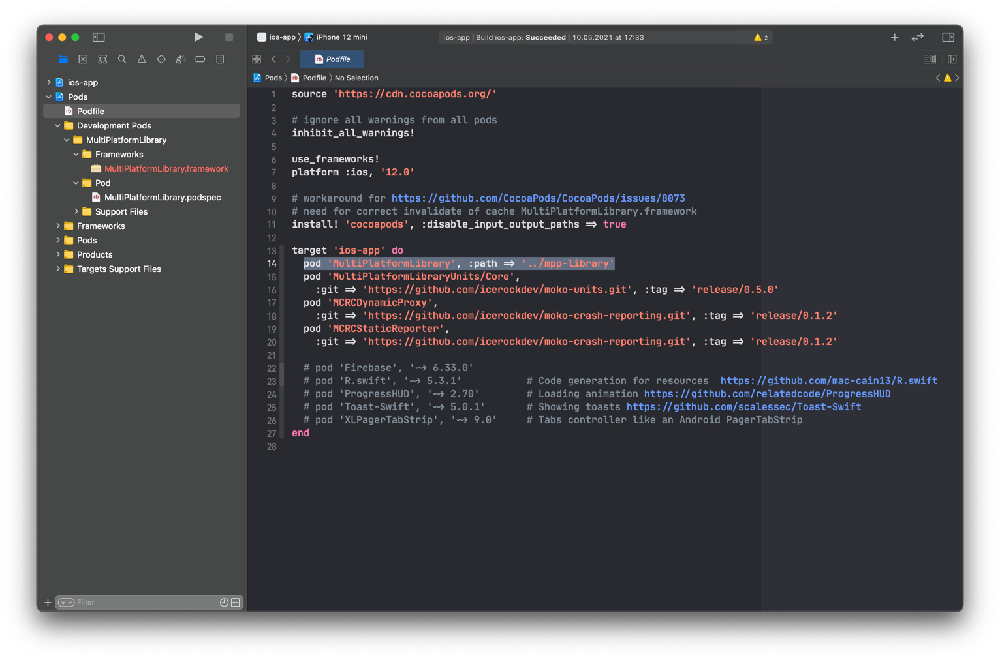

# 3. Устройство проекта

:::caution

Страница находится в разработке.

:::

## Вводная

В данной статье разобран типовой KMM проект на базе [mobile-moko-boilerplate](https://gitlab.icerockdev.com/scl/boilerplate/mobile-moko-boilerplate). Внимание уделено каждому файлу и директорию в проекте, дано пояснение ко всему - для чего используется, в каких случаях нужно вносить изменения, как работает.

После ознакомления с материалом вы узнаете:

1. Из каких частей состоит проект
1. Где находится конфигурация мультиплатформенного модуля
1. Как реализована интеграция мультиплатформенного модуля в iOS
1. Какие настройки применены к текущему проекту для мультиплатформенного модуля
1. Как устроена многомодульность на проекте
1. Как объявляются внешние зависимости (библиотеки)
1. Как настроен экспорт зависимостей в iOS фреймворк
1. Как реализован DI (Dependency Injection)
1. Как реализована навигация на android и iOS 

## Конфигурация сборки

Проект хранится в моно-репозитории, то есть в одном репозитории содержится и android и ios приложения, а также общая библиотека на Kotlin Multiplatform.

Проект использует несколько систем сборки:

1. [Gradle](https://gradle.org/) - система сборки для Android приложения и Kotlin библиотеки;
1. [Xcode](https://developer.apple.com/xcode/) - система сборки (и IDE) для iOS приложения.

Разберемся с тем как происходит сборка обеих платформ.

### Сборка Android приложения

Для сборки Android приложения нам достаточно Gradle системы сборки.

Когда мы нажимаем кнопку Run в Android Studio по сути мы запускаем gradle задачу `assembleDevDebug` в gradle-проекте `android-app`. Это можно увидеть по логу, который пишется на вкладке `Build` при запуске.


Задача `assembleDevDebug` производит компиляцию только Debug типа сборки и только Dev [product flavour](https://developer.android.com/studio/build/build-variants). Для выполнения данной задачи требуется выполнить множество других задач, от которых данная задача зависит. Поэтому в логе сборки мы видим выполнение множества задач. При компиляции android приложения будет автоматически скомпилирован и модуль с общим Kotlin Multiplatform кодом (gradle проект `mpp-library`). Это происходит потому что в `android-app` указана зависимость на проект `mpp-library` (будет разобрано подробнее позже).

### Сборка iOS приложения

Для сборки iOS приложения используются сразу обе системы - Xcode и Gradle, что разумеется увеличивает время сборки и осложняет анализ ошибок сборки, ведь ошибки могут быть по разным причинам в разных системах сборки или даже на стыке двух систем.

Когда мы нажимаем на кнопку Run в Xcode начинается процесс сборки как у любого другого iOS приложения через сам Xcode. Но наш Xcode проект имеет зависимость на `MultiPlatformLibrary` CocoaPod. Поэтому при компиляции приложения начнется и компиляция `MultiPlatformLibrary`, а данный CocoaPod имеет особенную реализацию - он не содержит исходного кода, а вместо фазы компиляции Source файлов, он имеет фазу запуска shell команды - именно в этой фазе происходит запуск Gradle для компиляции `MultiPlatformLibrary.framework` из Kotlin кода. Когда скрипт завершится Xcode продолжит сборку iOS проекта, уже с использованием готового скомпилированного фреймворка от Kotlin библиотеки.

Рассмотрим детальнее процесс. Для начала нужно посмотреть что происходит после установки зависимостей через [CocoaPods](https://cocoapods.org/). После установки зависимостеймы получаем помимо файла проекта `ios-app.xcodeproj` еще файл `ios-app.xcworkspace`. Разберемся в различиях:

- `ios-app.xcodeproj` - файл нашего ios проекта, содержит все настройки проекта, список файлов проекта, фазы сборки и прочее. В нем же указано что наш iOS проект теперь зависит от `Pods_ios_app.framework` - фреймворка подключающего все CocoaPods зависимости.
  
  При попытке скомпилировать проект через `ios-app.xcodeproj` мы получим ошибку о том что фрейворки, от которых зависит проект не найдены.
- `ios-app.xcworkspace` - файл с объединением нескольких Xcode проектов вместе - если открыть его в Xcode то мы увидим в левой панели не только `ios-app` проект, но и `Pods`, в котором находятся все необходимые для проекта зависимости. И при работе через `xcworkspace` мы можем успешно скомпилировать проект, так как зависимость `ios-app` проекта будет найдена в `Pods` проекте и автоматически будет произведена компиляция требуемых для `ios-app` зависимостей в `Pods`.
  

Теперь, понимая как `ios-app` связан с зависимостями, установленными CocoaPods, посмотрим детальнее на MultiPlatformLibrary CocoaPod. Находится данный Pod в `Pods/Development Pods/MultiPlatformLibrary`.

Только этот CocoaPod находится в `Development Pods` так как он единственный в `Podfile`, который подключен по локальному пути (`:path =>`). Все CocoaPod'ы, которые подключаются по локальному пути, будут находиться в `Development Pods` разделе, вместо `Pods`.



Из чего устроена данная зависимость:


Во первых в директории `Frameworks` отражается сам скомпилированный фреймворк -
`MultiPlatformLibrary.framework`.

А во вторых - `MultiPlatformLibrary.podspec`, который как раз и ищет CocoaPods при подключении через `:path =>` по пути `mpp-library/MultiPlatformLibrary.podspec`.

Podspec файл является описанием зависиомости для CocoaPods. В нем мы определяем имя, версию, и прочую метаинформацию о нашем пакете, исходные файлы и прочие настройки таргета, который будет сгенерирован в проекте `Pods` при `pod install`. В нашем `podspec` мы определили несколько важных моментов:

1. `spec.vendored_frameworks` - путь до заранее скомпилированного framework'а, который и будет предоставляться как зависимость `ios-app` проекту. Именно по этому пути Gradle складывает итоговый фреймворк при запуске любой из `syncMultiPlatformLibrary**` задач.
1. `spec.pod_target_xcconfig` - настройки конфигурации, которые по сути определяют переменные окружения, которые будут доступны нам во время выполнения сборки данного таргета. Мы определили имя библиотеки, без каких либо условий, а также указали переменную `GRADLE_TASK` которая имеет разные значения при разных условиях. Например `GRADLE_TASK[sdk=iphonesumulator*][config=*ebug]` означает, что указанное в правом блоке значение будет назначено в переменную окружения `GRADLE_TASK` в том случае, если мы производим сборку при использовании sdk начинающегося на `iphonesumulator`, а также config заканчивающегося на `ebug` - то есть `Debug`, `dev-debug`, `prod-debug` и так далее.
1. `spec.script_phases` - определяем специальную фазу сборки с запуском shell скрипта, в котором мы запускаем Gradle задачу, сохраненную в переменной окружения `GRADLE_TASK`. За счет условий обозначенных в `xcconfig` мы получим правильный подбор варианта компиляции в зависимости от того какую схему ios приложения мы собираем. Именно этот скрипт позволяет автоматически делать сборку общего модуля и не заставлять разработчика перед комплияцией ios проекта делать что либо дополнительное.

При выполнении `pod install` данный podspec файл считывается и на основе этой информации создается Target в проекте `Pods`:


В данном таргете мы можем увидеть что он отличается от других иконкой - это потому что он не содержит исходного кода, а вместо этого содержит кастомный скрипт.

Но `ios-app` не имеет прямой зависимости от `MultiPlatformLibrary` как видно по настройкам Xcode. Зависимость есть от `Pods-ios-app`. Это является оптимизацией количества изменений в файле основного проекта, сделанной CocoaPods. Все легко объясняется когда посмотрим на сам таргет `Pods-ios-app`.


Как видно данный таргет содержит в зависимостях все CocoaPods, а значит когда `ios-app` запрашивает сборку `Pods-ios-app`, тот затребует сборку всех этих зависимостей и в результате мы получим сборку всего что нам нужно.

После данного разбора у вас должно сформироваться представление о том как происходит компиляция ios приложения использующего Kotlin библиотеку с интеграцией через CocoaPods.

## Структура проекта

Ознакомимся с содержимым в корне репозитория. 

`ls -lp`:
```bash
buildSrc/
android-app/
ios-app/
mpp-library/
gradle/
build.gradle.kts
gradle.properties
gradlew
gradlew.bat
settings.gradle.kts
CONTRIBUTING.md
LICENSE.md
README.md
```

### buildSrc

`buildSrc` - [специальная директория Gradle](https://docs.gradle.org/current/userguide/organizing_gradle_projects.html#sec:build_sources). Она предназначена для реализации логики сборки, не привязанной к конкретному gradle модулю. По сути это исходники библиотеки, которая автоматически будет подгружена в gradle и все классы объявленные в этой библиотеке будут доступны в любом месте Gradle конфигурации (в `build.gradle.kts`, `settings.gradle.kts`).

Подробнее рассмотрим в специальном разделе.

### android-app

`android-app` - gradle проект с android приложением.

Подробнее также будет разобрано в специальном разделе.

### ios-app

`ios-app` - директория, в которой лежит Xcode проект ios приложения.

### mpp-library


### Gradle Wrapper
Из-за использования `Gradle Wrapper` нам не потребуется отдельно устанавливать gradle - нужная версия будет автоматически скачана в home директорию системы сборки - `~/.gradle`

## buildSrc

В этой директории можно увидеть собственный `build.gradle.kts`, который определяет как будет собираться данная библиотека (и какие зависимости ей требуются). А также исходный код библиотеки - в нашем проекте там только объект `Deps`, содержающий константы с зависимостями которые нужны нашему проекту.

В `build.gradle.kts` можно увидеть подключение нескольких зависимостей:

```kotlin
dependencies {
    implementation("dev.icerock:mobile-multiplatform:0.9.2")
    implementation("org.jetbrains.kotlin:kotlin-gradle-plugin:1.4.32")
    implementation("com.android.tools.build:gradle:4.1.3")
}
```

Эти зависимости будут также автоматически подключены и к самому Gradle проекту, поэтому плагины из этих зависимостей мы можем применять без добавления артефактов в classpath.

В `Deps.kt` объявлен объект `Deps` с перечислением версий зависимостей и самих зависимотей в виде констант, для удобного обращения к ним в gradle конфигурации.

## Gradle проект (multiplatform и android)

В нем подключен gradle плагин `com.android.application` (через константу `Deps.Plugins.androidApplication`) и описана вся конфигурация для сборки android приложения.

## Xcode проект (iOS)


## Компоненты в общем коде

> Есть где то видос или хорошая статья о SharedFactory и DomainFactory

Ага , просто столкнулся с тем что ранее я их не трогал но сейчас для того что бы идти дальше мне нужно сделать  authRepository, но сделать его в SharedFactory

иммет ли значение где делать factory initializers ?

Где еще нужно добавить для DomainFactory import что бы заработал , generated - горит красным .

## Навигация в Android

## Навигация в iOS

Прежде чем идти дальше немного остановимся на том, как построена навигация в iOS приложение и какие
подходы при работе с ней мы используем.

В основе навигации лежат координаторы. Каждый координатор покрывает логически связанный блок
функционала, который чаще всего состоит из нескольких экранов. При этом между собой они независимы и
отвечают только за цепочку переходов только внутри себя. Также имеют возможность получать настройку
действия, которое должно быть выполнено после завершения блока ответственности координатора.

Например.

Предположим, что у нас есть приложение, в котором имеется авторизация, просмотр списка новостей, с
возможностью перехода к детальному виду каждой новости, а со списка новостей можно попасть в раздел
настроек для конфигурации отображения новостей. Это разобьётся на 4 координатора:

- AppCoordinator
  - Стартовый координатор. Всегда является первой входной точкой, определяет, куда должен выполниться дальнейший переход при запуске приложения
  - Если юзер не авторизован - запустит координатор авторизации и в качестве completionHandler-а укажет ему переход на новости в случае успешной авторизации
  - Если юзер уже авторизован - запустит координатор просмотра новостей
- AuthCoordinator
  - Запустит процесс авторизации
  - Будет совершать переходы по всем требуемым шагам - например ввод логина/пароля, смс-кода, установки никнейма и т.п.
  - По итогу успешной авторизации вызовет переданный ему на вход completionHandler.
- NewsCoordinator
  - Отвечает за показ списка новостей
  - Реализовывает переход в детали конкретной новости внутри этого же координатора
  - При переходе в настройки создаёт координатор настроек, с качестве completionHandler-а может передать ему логику обновления своего списка новостей. Если в настройках изменились параметры - обновляет список
- SettingsCoordinator
  - Отвечает за работу с экраном настроек
  - При завершении работы и применении настроек вызывает completion, чтобы новости обновились

Именно координаторы реализуют интерфейс EventListener-ов вьюмоделей, о которых будет чуть ниже. Так
как вызов переходов завязан на бизнес-логику приложения, то инициатором этих переходов являются
именно вьюмодели. Поэтому координаторы выполняют связующую роль между тем, что происходит в логике
приложений и тем, как это должно отражаться пользователю.

Чтобы работать с координаторами было проще, используется базовый класс, от которого наследуются
остальные. Добавим его к нашему проекту.

Создадим в ios-проекте папку src/Coordinators и в ней файлик BaseCoordinator. Для начала докинем
туда пару протоколов:

```swift
protocol ChildCoordinable {
    var childCoordinators: [Coordinator] { get set }

    func addDependency(_ coordinator: Coordinator)
    func removeDependency(_ coordinator: Coordinator?)
}
```

ChildCoordinable - необходим для корректной работы с зависимостями от дочерних координаторов.
Необходимо не забывать добавлять зависимости на новый координаторы, очищать зависимость на
конкретный координатор и запоминать список тех координаторов, которые являются дочерними к текущему.

```swift
protocol Coordinator: class {
    var completionHandler: (() -> Void)? { get set }

    func start()
}
```

Coordinator - сам протокол координатора. По сути он должен иметь ровно две вещи - completionHandler,
который вызовется при завершении его логической зоны ответственности. И функцию start. При её вызове
он начинает запускать свой флоу таким образом, каким считает нужным.

И далее сам класс базового координатора, который реализует оба этих протокола:

```swift
class BaseCoordinator: NSObject, Coordinator, ChildCoordinable, UINavigationControllerDelegate {
    var childCoordinators: [Coordinator] = []
    var completionHandler: (() -> Void)?

    let window: UIWindow

    weak var navigationController: UINavigationController?

    init(window: UIWindow) {
        self.window = window
    }

    func start() {
    }

    func addDependency(_ coordinator: Coordinator) {
        for element in childCoordinators where element === coordinator {
            return
        }
        childCoordinators.append(coordinator)
    }

    func removeDependency(_ coordinator: Coordinator?) {
        guard
            childCoordinators.isEmpty == false,
            let coordinator = coordinator
        else { return }
        
        for (index, element) in childCoordinators.enumerated() where element === coordinator {
            
            childCoordinators.remove(at: index)
            break
            
        }
    }

    func currentViewController() -> UIViewController? {
        return self.navigationController?.topViewController?.presentedViewController ?? self.navigationController?.topViewController ?? self.navigationController
    }

    func popBack() {
        self.navigationController?.popViewController(animated: true)
    }
}
```

Для инициализации необходим только window. Также можно указать NavigationController с предыдущего
координатора, для сохранения общей навигации.

Добавление и удаление зависимостей нужны для корректной очистки связей и памяти при построении
цепочек координаторов.

Также есть вспомогательные методы, которые позволяют получить текущий контроллер -
currentViewController и совершить переход назад - popBack.

От проекта к проекту базовый координатор может изменяться, обеспечивая дополнительные нужды проекта.

Теперь, когда у нас есть базовый координатор, создадим на его основе стартовый координатор
приложения. Создаём рядом с AppDelegate файл для него, называем AppCoordinator:

```swift
import Foundation
import UIKit

class AppCoordinator: BaseCoordinator {
    // MARK:** - Overrides**
    override func start() {
        let vc = UIViewController()
        vc.view.backgroundColor = UIColor.green
        self.window.rootViewController = vc
    }
}
```

Пусть он пока будет совсем простой, создающий контроллер зелёного цвета и делает его главным экраном
window.

Теперь нам надо познакомить AddDelegate с его координатором. Идём в AppDelegate.swift

Добавим ему ссылку на координатор приложения:

private (set) var coordinator: AppCoordinator!

А в didFinishLaunchingWithOptions после создания SharedFactory добавим создание координатора и вызов
старта:

```swift
self.coordinator = AppCoordinator(
    window: self.window!
)
self.coordinator.start()
```

Готово. Собираем, запускаем и видим наш зелёный контроллер:

Теперь дальнейшая логика переходов зависит от текущего контроллера и действий юзера на нём. Но
зелёным прямоугольником мир не спасёшь и юзера не авторизуешь. Поэтому пора переходить к созданию
нашей первой фичи.
