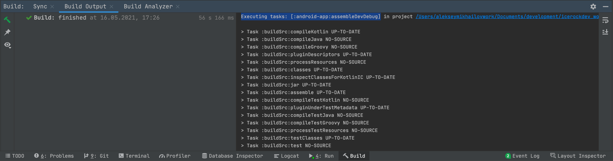
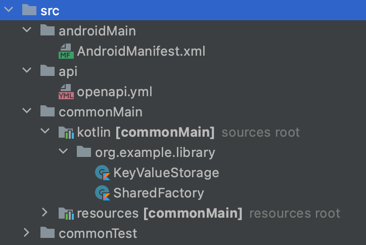
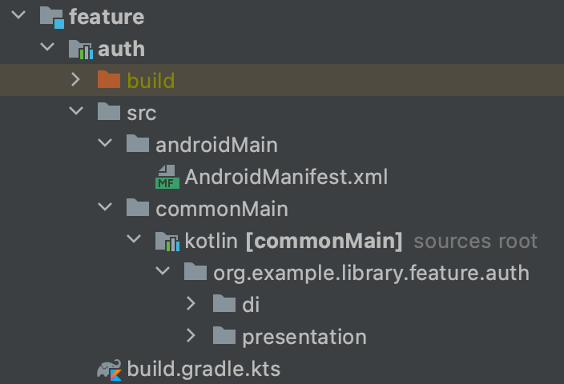
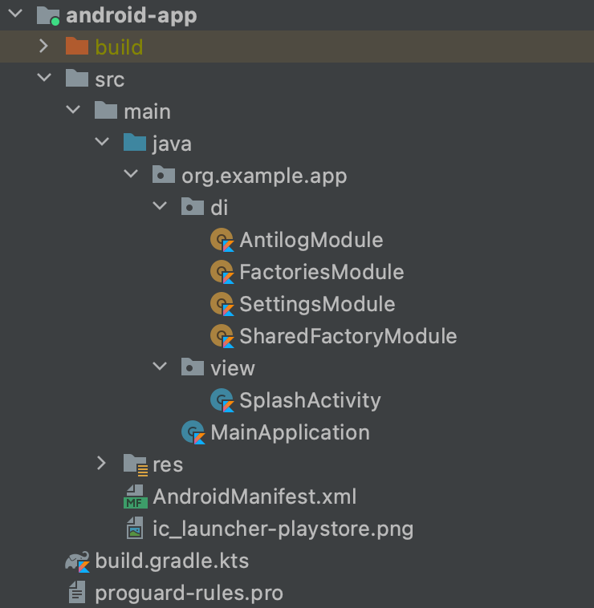

# Устройство типового проекта

## Вводная

В данной статье разобран типовой KMM проект на базе [mobile-moko-boilerplate](https://gitlab.icerockdev.com/scl/boilerplate/mobile-moko-boilerplate). Внимание уделено каждому файлу и директории в проекте, дано пояснение ко всему - для чего используется, в каких случаях нужно вносить изменения, как работает.

После ознакомления с материалом вы узнаете:

1. Из каких частей состоит проект
1. Где находится конфигурация мультиплатформенного модуля
1. Как реализована интеграция мультиплатформенного модуля в iOS
1. Какие настройки применены к текущему проекту для мультиплатформенного модуля
1. Как устроена многомодульность на проекте
1. Как объявляются внешние зависимости (библиотеки)
1. Как настроен экспорт зависимостей в iOS фреймворк
1. Как реализован DI (Dependency Injection)
1. Как реализована навигация на android и iOS 

## Конфигурация сборки

Проект хранится в моно-репозитории, то есть в одном репозитории содержится и android и ios приложения, а также общая библиотека на Kotlin Multiplatform.

Проект использует несколько систем сборки:

1. [Gradle](https://gradle.org/) - система сборки для Android приложения и Kotlin библиотеки;
1. [Xcode](https://developer.apple.com/xcode/) - система сборки (и IDE) для iOS приложения.

Давайте разберемся с тем, как происходит сборка обеих платформ.

### Сборка Android приложения

Для сборки Android приложения используется Gradle. При сборке через Android Studio запускается задача `assembleDevDebug`, которая компилирует Android-приложение и автоматически компилирует модуль `mpp-library`, так как `android:app` зависит от `mpp-library`.
Задача `assembleDevDebug` производит компиляцию только Debug типа сборки и только Dev [product flavour](https://developer.android.com/studio/build/build-variants). Для выполнения этой задачи требуется выполнить множество других задач, от которых данная задача зависит. Поэтому в логе сборки мы видим выполнение множества задач.



### Сборка iOS приложения

Для сборки iOS приложения используются обе системы - Xcode и Gradle, что, разумеется, увеличивает время сборки. Xcode проект имеет зависимость на pod `MultiPlatformLibrary`, поэтому при компиляции приложения происходит компиляция Kotlin-библиотеки через Gradle, а затем сборка iOS-приложения через Xcode.

Узнать подробнее о том, как происходит компиляция этой зависимости и подключение сторонних подов, вы можете в [разделе обучения](../learning/ios/pods).

## Структура проекта

Ознакомимся с содержимым в корне репозитория. 

```bash
build-logic/
android/
ios/
mpp-library/
gradle/
build.gradle.kts
gradle.properties
gradlew
gradlew.bat
settings.gradle.kts
README.md
master.sh
```

Кратко про каждый элемент, для понимания общей картины:

- `android/` - директория с Android-приложением и связанными модулями (app, uikit, utils)
- `ios-app/` - директория с исходным кодом iOS приложения
- `build-logic/` - директория с композитной сборкой для логики Gradle
- `mpp-library/` - директория с исходным кодом общей библиотеки на KMM
- `gradle/` - специальная директория системы сборки Gradle, в которой лежит Gradle Wrapper
- `gradle/libs.versions.toml` - Version Catalog для управления зависимостями
- `build.gradle.kts` - файл конфигурации сборки корневого gradle проекта
- `gradle.properties` - файл с опциями, которые передаются в Gradle проект при запуске
- `gradlew` и `gradlew.bat` - скрипты для Unix и Windows соответственно, которые запускают Gradle, используя Gradle Wrapper
- `settings.gradle.kts` - файл настроек Gradle проекта
- `README.md` - краткое описание содержимого репозитория и инструкция, как собирать проект.
- `master.sh` - вспомогательный скрипт

Далее разберем все блоки более детально.

## Root Gradle project

Корневая директория нашего проекта по сути и является корневым gradle проектом. `android-app` и `mpp-library` подключаются к этому корневому проекту как подпроекты.

Корневой Gradle-проект содержит:
- `build-logic` - [композитно](../learning/gradle/composite-build) подключенный проект, несущий в себе логику сборки остальных подпроектов
- `gradle.properties` - опции запуска gradle проекта
- `settings.gradle.kts` - настройки проекта
- `build.gradle.kts` - конфигурация сборки
- `gradle` - директория [Gradle Wrapper'а](../learning/gradle/gradle-wrapper) - специального скрипта, который автоматизирует процесс установки нужной версии gradle
  
О том, как обновить версию Gradle в проекте, вы можете прочитать в [специальном разделе обучения](../learning/gradle/updating-versions).

### [buildSrc](../learning/gradle/buildSrc) (устарело, но бывает на проектах)

Подробнее о legacy подходах в [нашей базе знаний](/learning/legacy/data-sharing)

### Version Catalogs

Начиная с Gradle 7.0, зависимости управляются через Version Catalog. Файл `gradle/libs.versions.toml` содержит версии и ссылки на библиотеки.
На его основе gradle сгенерирует специальные свойства для доступа к зависимостям по именам со строгими типами.

Давайте посмотрим на этот файл:

```toml
[versions]
kotlinVersion = "2.1.10"
androidGradleVersion = "8.9.1"
# ... другие версии

[libraries]
kotlinSerialization = { module = "org.jetbrains.kotlinx:kotlinx-serialization-json", version.ref = "kotlinxSerializationVersion" }
# ... другие библиотеки

[plugins]
kotlinGradlePlugin = { module = "org.jetbrains.kotlin:kotlin-gradle-plugin", version.ref = "kotlinVersion" }
# ... другие плагины
```

В `settings.gradle.kts` Version Catalog активируется по умолчанию через `dependencyResolutionManagement`.

```kotlin
enableFeaturePreview("VERSION_CATALOGS")
```

Больше информации о Version Catalogs можете найти [тут](../learning/gradle/version-catalogs).

### build-logic

`build-logic` - [композитный](../learning/gradle/composite-build) проект. Он предназначен для реализации логики сборки, не привязанной к конкретному gradle модулю.

В этой директории можно увидеть собственный `build.gradle.kts` и исходный код библиотеки. `build.gradle.kts` определяет, как будет собираться данная библиотека и какие зависимости ей требуются.
Исходный код библиотеки в нашем композитном билде содержит [convention plugins](../learning/gradle/convention-plugins), нужные для сборки основного Gradle проекта.

- `android-app-convention` - для Android-приложений
- `android-compose-convention` - для Android с Compose
- `multiplatform-library-convention` - для KMM-библиотек
- `detekt-convention` - для линтинга
- `skie-convention` - для iOS

Он подключается внутри файла `settings.gradle.kts` командой:
```kotlin
includeBuild("build-logic")
```

### gradle.properties

Это файл с параметрами Gradle проекта:

```bash
org.gradle.jvmargs=-Xmx4096m
org.gradle.configureondemand=false
org.gradle.parallel=true
org.gradle.caching=true

kotlin.code.style=official

android.useAndroidX=true

kotlin.mpp.stability.nowarn=true

mobile.multiplatform.iosTargetWarning=false

VERSION_NAME=0.1.0
VERSION_CODE=1

xcodeproj=ios-app/ios-app.xcworkspace
```

Более подробно о параметрах Gradle вы можете прочитать в [разделе обучения](../learning/gradle/build-environment).

### settings.gradle.kts

Здесь мы можем подключать под-проекты (вызовом include) и другие gradle проекты, настраивая composite build (вызовом includeBuild)"

В нашем случае это `build-logic` (composite build), `android-app`, `mpp-library` и `mpp-library:feature:auth` (sub-projects).

Исходный код:
```kotlin
enableFeaturePreview("TYPESAFE_PROJECT_ACCESSORS")

dependencyResolutionManagement {
    repositories {
        mavenCentral()
        google()
    }
}

rootProject.name = "mobile-moko-boilerplate"

includeBuild("build-logic")

include(":android-app")
include(":mpp-library")
include(":mpp-library:feature:auth")
```

Именно `settings.gradle.kts` иллюстрирует многомодульность нашего основного проекта.

### build.gradle.kts

```kotlin
buildscript {
    repositories {
        mavenCentral()
        google()
        gradlePluginPortal()
        maven(url = "https://jitpack.io")
    }

    dependencies {
        classpath(libs.mokoResourcesGeneratorGradle)
        classpath(libs.mokoNetworkGeneratorGradle)
        classpath(libs.mokoUnitsGeneratorGradle)
        classpath(libs.kotlinSerializationGradle)
        classpath(libs.hiltGradle)
        classpath(libs.firebaseCrashlyticsGradle)
        classpath(libs.googleServicesGradle)
        classpath(":build-logic")
    }
}

tasks.register("clean", Delete::class).configure {
    group = "build"
    delete(rootProject.layout.buildDirectory)
}
```
Подробнее о конфигурациях зависимостей вы можете прочитать в [разделе обучения](../learning/gradle/configuration).

## mpp-library

mpp-library содержит общий код для обеих платформ. Структура:

```
mpp-library/
├── build.gradle.kts
├── src/
│   ├── commonMain/kotlin/...
│   ├── androidMain/kotlin/...
│   ├── iosMain/kotlin/...
│   └── commonTest/kotlin/...
├── feature/
│   └── example/
└── utils/
```

### build.gradle.kts mpp-library

Тут объявляются все зависимости и конфигурации нашей общей библиотеки. Давайте посмотрим, что внутри.

```kotlin
// подключение плагинов
plugins {
    // convention-плагин, в котором происходит подключение android плагина,
    // kotlin multiplatform плагина и устанавливаются таргеты ios и android
    id("multiplatform-library-convention")

    // convention-плагин, в котором происходит подключение detekt плагина
    // и его настройка
    id("detekt-convention")

    // плагин для обеспечения доступа к ресурсам на iOS и Android
    // подробнее тут https://github.com/icerockdev/moko-resources
    id("dev.icerock.mobile.multiplatform-resources")

    // плагином для генерации сущностей и классов API 
    // из файла спецификаций OpenAPI (Swagger)
    // подробнее тут https://github.com/icerockdev/moko-network
    id("dev.icerock.mobile.multiplatform-network-generator")

    // плагин компилятора, который позволяет сериализовывать документ
    // предоставляю к нему доступ с разных платформ
    id("kotlinx-serialization")

    // плагин для настройки взаимодействия с CocoaPods
    id("org.jetbrains.kotlin.native.cocoapods")

    // генерирует Swift-обёртки над Kotlin-кодом, делая API нативнее для Swift
    id("skie-convention")
}

// Это блок конфигурации CocoaPods-интеграции для iOS. Он настраивает,
// как Kotlin Multiplatform Library будет предоставляться iOS-проекту через CocoaPods.
kotlin {
  cocoapods {
    authors = "IceRock Development"
    version = "1.0"
    name = "MultiPlatformLibrary"
    ios.deploymentTarget = "15.0"

    framework {
      baseName = "MultiPlatformLibrary"
      export(projects.mppLibrary.feature.example)
      export(libs.multiplatformSettings)
      # ... другие экспорты
    }
  }
}

dependencies {
    commonMainImplementation(libs.coroutines)

    commonMainImplementation(libs.kotlinSerialization)
    commonMainImplementation(libs.ktorClient)
    commonMainImplementation(libs.ktorClientLogging)

    androidMainImplementation(libs.multidex)
    androidMainImplementation(libs.lifecycleViewModel)

    commonMainApi(projects.mppLibrary.feature.auth)

    commonMainApi(libs.multiplatformSettings)
    # ... другие зависимости
}

// идентификатор пакета ресурсов
multiplatformResources {
  resourcesPackage = "org.example.library"
  resourcesClassName = "AppRes"
}

// подключение yml файла для генерации api
// подробнее тут https://github.com/icerockdev/moko-network
mokoNetwork {
  spec("serverApi") {
    inputSpec = file("src/api/openapi.yml")
    isInternal = true
  }
}
```

### MultiplatformLibrary.podscpec mpp-library

Более подробно об этом файле вы можете прочитать [тут](../learning/ios/pods#podspec).

### Структура mpp-library

- `feature/example` - пример фичи с di, model, presentation
- 'src' - исходный код общей библиотеки
- `utils` - общие утилиты (fields, paging, state, dateFormatting, logout)
- `test-utils` - утилиты для тестирования

### src mpp-library
В папке `srс` находится исходный код общей библиотеки.



 - `androidMain` - директория, содержащая платформенный di модуль
 - `api` - директория, содержащая файл для генерации методов взаимодействия с API
 - директория `commonMain` содержит директорию `kotlin`, в которой как раз и пишется вся бизнес-логика приложения, а в директории `moko-resources` находятся ресурсы, попавшие в проект через [moko-resources](https://github.com/icerockdev/moko-resources)
 - `commonTest` - директория, в которой находится исходный код тестов для общей библиотеки

### feature's mpp-library
Как мы видим, mpp-library содержит в себе подпроект feature. 
Каждая фича в котором является Gradle-библиоткой, несущей в себе набор соответствующих моделей, view-моделей, фабрик и интерфейсов, которые ожидаются от родительского модуля. 



Каждая фича имеет однотипную структуру. Внутри `commonMain/kotlin/…` обычно находятся директории:
- `di` - директория, содержащая Koin-модули для создания View-моделей и всего, что связано с инъекцией зависимостей
- `model` - директория, содержащая все сущности (в основном data-классы и enum’ы), нужные в рамках данной view-модели, в которой также определяются репозитории для хранения и взаимодействия с данными
- `presentation` - директория, содержащая сами view-model'и

Пример фичей:
* Auth
* Settings
* List
и т.п

В файле `build.gradle.kts`, который находится в директории каждой фичи указаны все зависимости, нужные для данной фичи.

Посмотрим: 
```kotlin
plugins {
  id("multiplatform-library-convention")
  id("feature-android-convention")
}

dependencies {
  commonMainApi(libs.moko.mvvm.flow)
  commonMainImplementation(libs.moko.resources)

  commonMainImplementation(platform(libs.koin.bom))
  commonMainImplementation(libs.koin.core)
}
```

### Shared & Domain Factory (устарело)

Подробнее о legacy подходах в [нашей базе знаний](/learning/legacy/data-sharing)


## android-app

`android-app` - Gradle проект с Android-приложением.



### build.gradle.kts android-app

В корне данного проекта находится свой `build.gradle.kts` файл:

```kotlin
plugins {
  id("android-app-convention")
  id("com.google.gms.google-services")
  id("com.google.firebase.crashlytics")
  id("android-compose-convention")
}

android {
  namespace = "org.example.app"

  defaultConfig {
    applicationId = "dev.icerock.boilerplate"

    versionCode = Integer.parseInt(project.property("VERSION_CODE") as String)
    versionName = project.property("VERSION_NAME") as String
  }
}

dependencies {
  implementation(libs.lifecycleRuntime)
  implementation(libs.splashScreen)

  //Navigation
  implementation(libs.navigationComponent)
  implementation(libs.navigationUIComponent)

  //Compose
  implementation(libs.compose.activity)
  implementation(libs.coil.compose)
  implementation(libs.moko.mvvm.flow.compose)
  implementation(libs.moko.resources.compose)

  //Firebase
  implementation(platform(libs.firebase.bom))
  implementation(libs.firebase.crashlytics)
  implementation(libs.moko.crashReporting.crashlytics)

  implementation(projects.mppLibrary)
  implementation(projects.android.utils)
  implementation(projects.android.uikit)
}
```

### Устройство android проекта

```
android/app/
├── build.gradle.kts
└── src/main/
    ├── kotlin/org/example/app/
    │   ├── feature/
    │   ├── model/
    │   ├── navigation/
    │   ├── AppAktivity.kt
    │   └── MAinApplication.kt
    │
    ├── res/
    ├── AndroidManifest.xml
    └── ic_launcher-playstore.png
```

### Навигация в Android

Для того чтобы понять, как устроена навигация в Android приложении, можете ознакомиться с соответствующей статьей в [разделе обучения](../learning/android/navigation).

## ios

### Корневой уровень

| Директория/Файл | Назначение                                                                   |
|---|------------------------------------------------------------------------------|
| `ios.xcworkspace/` | Xcode workspace (CocoaPods интеграция)                                       |
| `Podfile` | Зависимости CocoaPods (Firebase, MultiPlatformLibrary, R.swift, SwiftFormat) |
| `Podfile.lock` | Lock-файл зависимостей                                                       |
| `Pods/` | Локальные копии CocoaPods зависимостей                                       |
| `icerock.swiftformat` | Конфигурация SwiftFormat                                                     |
| `BuildConfigurations/` | Общие xcconfig файлы для debug/release сборок                                |


### ios/App/ — Основное iOS приложение

**Xcode проект:** `App/ios-app.xcodeproj/`

| Директория/Файл | Назначение |
|---|---|
| `src/` | Исходный код приложения |
| `BuildConfigurations/` | Конфигурации сборки приложения, подробнее можете прочитать [тут](../learning/ios/configuration) |
| `GoogleService/` | Google Service файлы (Firebase) |
| `R.generated.swift` | Автогенерированные ресурсы (R.swift) |
| `ios-app.xcodeproj/` | Xcode проект |

**src/ структура:**
- `AppDelegate.swift` — точка входа приложения
- `MobileApp.swift` — main app struct (SwiftUI)
- `Environment.swift` — environment configuration
- `Di/` — Koin dependency injection модули
- `Navigation/` — навигация приложения
- `Views/` — основные экраны
- `Utils/` — утилиты
- `Preview Content/` — превью компонентов
- `Resources/` — ресурсы (картинки, локализация)


### ios/DesignSystem/ — Дизайн-система (UIKit/SwiftUI библиотека)

**Xcode проект:** `DesignSystem/DesignSystem.xcodeproj/`

| Директория/Файл | Назначение |
|---|---|
| `src/` | Исходный код дизайн-системы |
| `objc/` | Objective-C врапперы (DesignSystem.h) |
| `BuildConfigurations/` | Конфигурации сборки |
| `DesignSystem.xcodeproj/` | Xcode проект |

**src/ структура:**
- `Atom/` — базовые компоненты (кнопки, тексты, иконки)
- `Alerts/` — диалоги и алерты
- `Theme/` — темы, цвета, шрифты
- `Navigation/` — навигационные компоненты
- `Modifiers/` — ViewModifiers
- `Utils/` — утилиты дизайн-системы
- `Resources/` — ресурсы дизайн-системы
- `Preview Content/` — превью компонентов


### Podfile

Podfile настраивает workspace с тремя схемами: **dev**, **stage**, **prod**, каждая с debug/release вариантами. Deployment target — iOS 16.4.

Основные зависимости:
- `MultiPlatformLibrary` — Kotlin Multiplatform модуль
- `FirebaseAnalytics`, `FirebaseMessaging`, `FirebaseCrashlytics` — Firebase
- `R.swift` — кодогенерация ресурсов
- `SwiftFormat/CLI` — линтер/форматтер Swift

### Входная точка приложения

Посмотрим на файл `AppDelegate.swift`:

```swift

import FirebaseCore
import FirebaseCrashlytics
import MultiPlatformLibrary
import UIKit

class AppDelegate: NSObject, UIApplicationDelegate {
    var window: UIWindow?

    func application(
        _: UIApplication,
        didFinishLaunchingWithOptions _: [UIApplication.LaunchOptionsKey: Any]? = nil
    ) -> Bool {
        FirebaseApp.configure()

        #if DEBUG
        Crashlytics.crashlytics().setCrashlyticsCollectionEnabled(false)
        #endif

        Koin.setup()

        RemoteNotificationsManager.shared.setup()

        return true
    }

    func application(_ application: UIApplication, didRegisterForRemoteNotificationsWithDeviceToken deviceToken: Data) {
        RemoteNotificationsManager.shared.updateDeviceToken(deviceToken)
    }
}
```

### Навигация в iOS

Навигация построена на SwiftUI Navigation

## master.sh

В корне проекта находится скрипт `master.sh`, содержащий в себе вспомогательный функционал.

Этот скрипт нужно запускать с конкретным параметром:

```bash 
./master.sh <param>
```

Параметры:
- `help` - выводит информацию о скрипте
- `clean_ide` - чистит файлы IDE
- `localize` - генерация локализованных строк, о которой вы можете прочитать [тут](./generate-localized-strings).

## Koin DI

В настоящее время на наших проектах с KMP для Dependency injection мы используем [Koin](https://github.com/InsertKoinIO/koin).
[Документация Koin](https://insert-koin.io).
Как именно он используется, можно посмотреть в [этой статье](https://kmm.icerock.dev/university/icerock-basics/di).

