# Запуск проекта

## 1. Вводная

Привет! Если ты это читаешь, значит, ты начинаешь погружаться в процессы мультиплатформенной разработки в IceRock.

Мы активно применяем и продвигаем этот подход с лета 2018 года. Основная его ценность для нас — возможность объединить бизнес-логику приложения в одном месте для обеих платформ. Вместо того чтобы отлаживать и реализовывать логику отдельно для iOS и Android, мы пишем общий код, который используют обе платформы. Соответственно, баги, связанные с некорректной логикой, не будут «мигрировать» с платформы на платформу. И не потребуется отвлекать разных разработчиков: проблемы в логике может исправить один человек в одном месте, починив сразу и iOS, и Android. Круто же!

При этом взаимодействие с пользователем остаётся 100% нативным. Доступен полный набор средств, которые предоставляют нативные SDK. Пользователь использует привычные элементы, и приложение ведёт себя так, как принято на каждой из платформ.

Обратная сторона медали — сложности на первых порах при вхождении в этот метод разработки. Для Android-разработчиков особо ничего не меняется: они могут использовать всё тот же Kotlin, модульность, Gradle, корутины и прочие вещи, незнакомые большинству iOS-ников. А iOS-разработчик, попадая впервые на мультиплатформенный проект, теряется от того, что в проект подцепляется какой-то мультиплатформенный «pod-чёрный-ящик». Внутри куча вьюмоделей на Kotlin, реализующих всю логику, а iOS-часть превращается в тонкую прослойку из SwiftUI-вьюх, которые просто биндятся к общим стейтам. Непонятно, откуда что берётся, и вопросов больше, чем ответов.

На самом же деле всё довольно просто и логично. Всё сгруппировано, разбито и структурировано. Но вникнуть в эту концепцию, приходя на уже живущий проект в активной разработке, сложно из-за большого объёма информации.

Поэтому мы сделали набор Codelabs, призванных помочь пройти по шагам по основным моментам, ежедневно встречающимся в нашей разработке. В них ты сможешь по очереди выполнять задания, наращивать функционал тестового проекта и изучать устройство проекта изнутри.

## 2. Настройка рабочего окружения

Для полноценной работы с KMM потребуется macOS, так как iOS-приложение (и iOS-версию Kotlin-библиотеки) можно скомпилировать только на macOS — это ограничение Apple (требуется Xcode, доступный только на macOS). На других платформах будет доступна только компиляция под Android. Код common-части писать и отлаживать можно, но без возможности проверить его работу под iOS.

Все нижеописанные инструкции будут выполнены на операционной системе macOS.

### 2.1. Git

Для всех разработчиков в компании Git требуется по умолчанию. Если он не установлен — нужно установить (описывать это подробно не будем).

### 2.2. JDK

Для работы с Kotlin Multiplatform потребуется установка Java Development Kit (JDK). Это требуется, так как компилятор Kotlin и билд-система Gradle работают на базе Java Virtual Machine.

Рекомендуется использовать JDK 17. Это актуальный стандарт для современных версий Android Studio и Gradle.

Наиболее стабильно с Kotlin Multiplatform работает JDK от Oracle. Для скачивания может потребоваться авторизация.

[Download Oracle JDK 17](https://www.oracle.com/java/technologies/downloads/#java17)

Также JDK можно скачать напрямую из Android Studio. Для этого в любом проекте откройте File (или Android Studio на macOS) > Settings > Build, Execution, Deployment > Build Tools > Gradle.

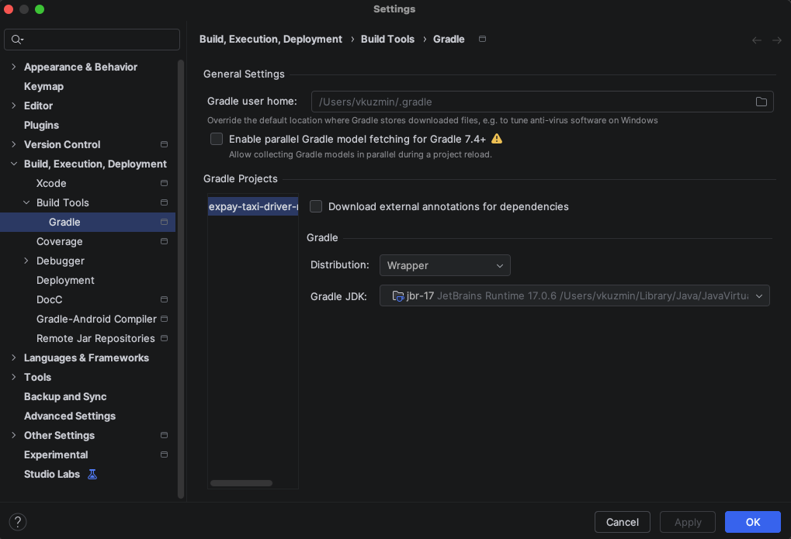

В разделе Gradle JDK вы увидите выпадающий список с текущей версией JDK. Нажмите на него. В самом низу списка выберите пункт "Download JDK..."

Если у вас M1 - вам нужно скачать Azul aarch64

После установки JDK требуется указать переменную окружения JAVA_HOME, чтобы все инструменты работали с правильной версией Java.

Сначала получим точный путь до JDK. Все версии лежат в директории ` /Library/Java/JavaVirtualMachines `. Введите в ` Terminal `:

```bash
open /Library/Java/JavaVirtualMachines
```

В открывшемся окне найдите нужную папку с JDK. Итоговый путь до домашней директории JDK выглядит примерно так:
` /Library/Java/JavaVirtualMachines/jdk-17.jdk/Contents/Home `
(минорная версия может отличаться, но мажорная должна соответствовать выбранной версии).

Остается только сохранить путь в переменные окружения. Делается это изменением файла ` ~/.zshenv ` (пример сделан на базе ` zsh `, так как для macOS это оболочка по умолчанию).

```bash
nano ~/.zshenv
```
или (для тех, кто использует Visual Studio Code):

```bash
code ~/.zshenv
```
В открывшемся редакторе добавляем строку:

```bash
export JAVA_HOME=/Library/Java/JavaVirtualMachines/jdk-VERSION.jdk/Contents/Home
```

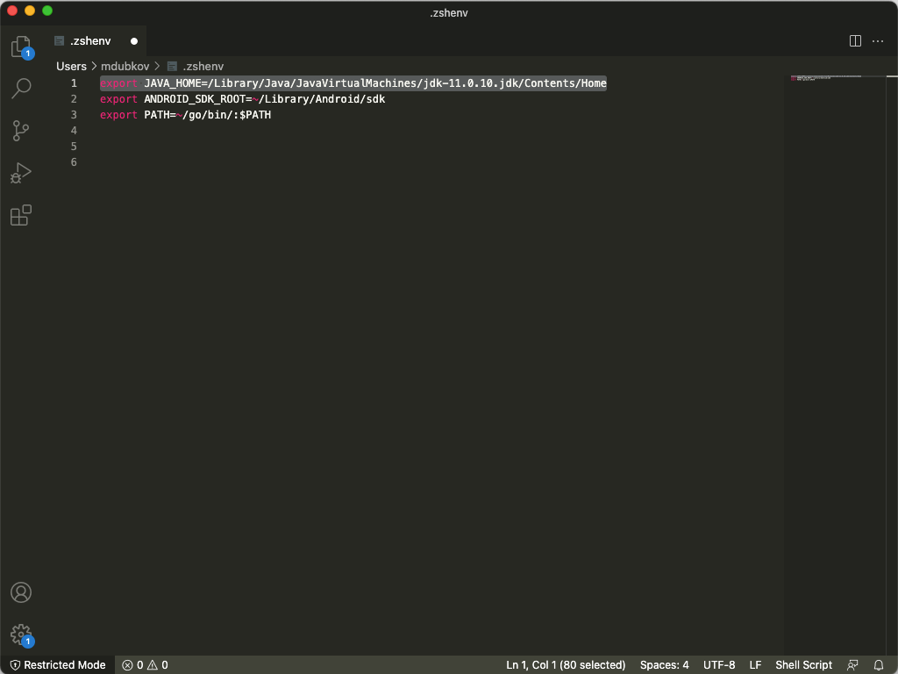

Если вы пользуетесь оболочкой bash, то вам нужно редактировать файл ` ~/.bash_profile `.

### 2.3. Android Studio

Для работы с Kotlin-кодом требуется IDE от JetBrains — IntelliJ IDEA или Android Studio. Команда Kotlin Multiplatform Mobile на данный момент [позиционирует Android Studio](https://kotlinlang.org/multiplatform/) как основную IDE, поэтому требуется установить её.

Для этого рекомендуем использовать [JetBrains Toolbox](https://www.jetbrains.com/toolbox-app/) — это приложение будет самостоятельно следить за актуальностью используемой версии IDE и позволяет легко устанавливать/обновлять все продукты JetBrains.

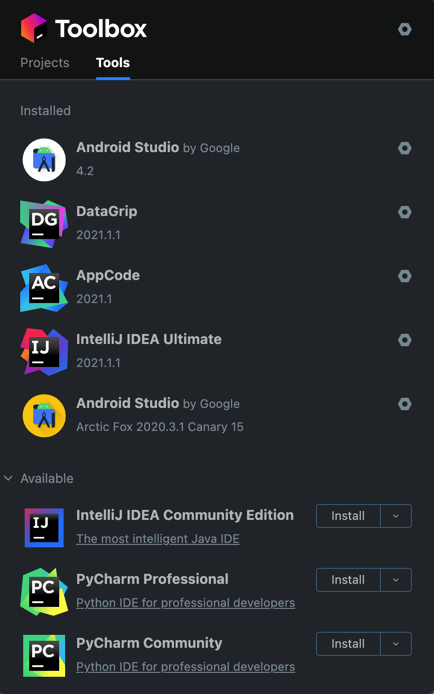

Для установки просто нажимаем Install напротив пункта ` Android Studio `.

При первом запуске будет произведена первичная настройка. Настройки делайте на свое усмотрение, но важно установить Android SDK последней версии.

После установки IDE требуется немного настроить. Во-первых, нужно исправить используемую JDK. Для этого заходим в настройки (меню справа внизу на Welcome Screen или File -> Settings внутри проекта).

Начиная с новых версий Android Studio, JDK Location указывается для конкретного проекта после его открытия: ` Android Studio -> Settings -> Build, Execution, Deployment -> Build Tools -> Gradle -> Gradle JDK `.

За счет этого выбора компиляция проектов через Android Studio будет производиться той же версией JDK, которую будет использовать и Xcode (если настроено верно). Это позволит использовать один Gradle Daemon для компиляции одного и того же проекта, более эффективно используя ресурсы. Если Android Studio и Xcode будут использовать разные JDK, то при компиляции вы получите два независимых Java-процесса, каждый из которых отнимет множество ресурсов (гигабайты памяти).

После установки Android Studio для удобства стоит указать переменную окружения ` ANDROID_SDK_ROOT `, чтобы не было необходимости открывать проект через IDE перед запуском в Xcode.

Если не указывать переменную окружения, то при попытке компиляции Kotlin-кода Gradle будет пытаться считать путь до Android SDK из файла local.properties в корне проекта. Если файла нет — будет ошибка. Android Studio создает этот файл автоматически, но чтобы не зависеть от факта "был ли открыт проект ранее", лучше прописать переменную.

Берем путь до Android SDK (обычно это ` ~/Library/Android/sdk `) и добавляем его в ` ~/.zshenv ` (или ` ~/.bash_profile `). Действуем по аналогии с ` JAVA_HOME `.

```bash
export ANDROID_SDK_ROOT=~/Library/Android/sdk
```

В старых версиях Android Studio (начиная с 4.2) иногда требовалось отключить флаг Preferences -> Experimental -> Do not build Gradle task during Gradle sync, чтобы задачи на сборку модулей появились во вкладке Gradle. В актуальных версиях эта проблема встречается реже, но все павно имейте это в виду.

Примечание: При указании путей в Android Studio не используйте символ ` ~ ` (тильда). С ней путь иногда определяется некорректно, и сборка падает. Используйте полные пути или переменные окружения.

#### Рекомендуемые плагины

Для комфортной работы с KMM-проектами рекомендуем установить следующие плагины:

- **Swift Support** — поддержка Swift-файлов в Android Studio
- **YAML** — подсветка и работа с YAML-конфигурациями
- **Shell Script** — подсветка и работа с shell-скриптами
- **Markdown** — работа с Markdown-файлами

Для установки перейдите в ` Settings -> Plugins -> Marketplace ` и найдите нужные плагины.

### 2.4. Xcode

Для компиляции iOS-приложения, а также Kotlin-библиотеки для iOS, потребуется Xcode. Вместо долгой загрузки из AppStore рекомендуем использовать [Xcodes](https://xcodes.dev/) — удобный менеджер версий Xcode с графическим интерфейсом.

#### Установка через Xcodes

Установить Xcodes можно через Homebrew:

```bash
brew install xcodes
```

После запуска Xcodes выберите нужную версию Xcode и нажмите Install. Скачивание происходит в фоновом режиме, а интерфейс показывает прогресс.

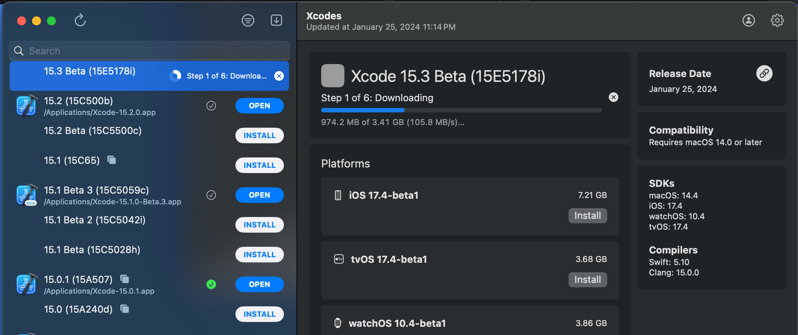

#### Установка Xcode Command Line Tools

После установки Xcode важно также установить ` Xcode Command Line Tools ` — они потребуются для компиляции Kotlin/Native.

```bash
xcode-select --install
```

Убедиться, что все успешно установлено, вы можете, запустив Xcode и зайдя в Settings -> Locations (в старых версиях — Preferences).

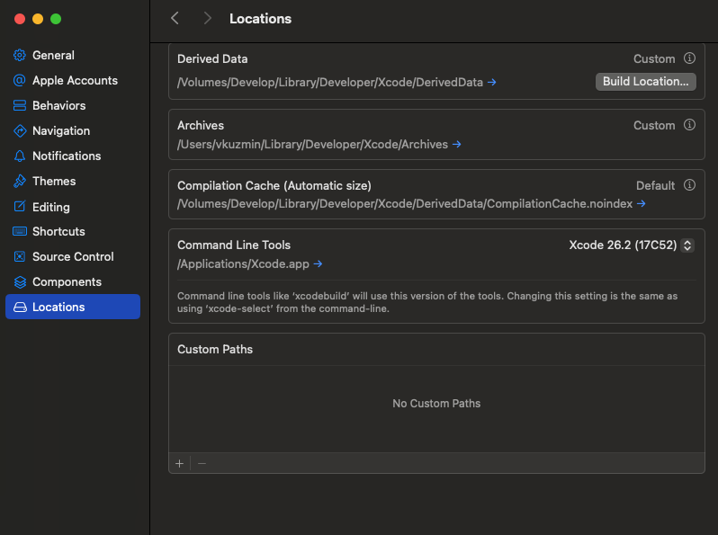

В выпадающем списке Command Line Tools должна быть указана версия инструментов (если установка не выполнена — поле будет пустым).

### 2.5. CocoaPods

Для работы с зависимостями на iOS мы используем CocoaPods, также Kotlin-модуль подключается в Xcode-проект через CocoaPods-интеграцию. Поэтому требуется установить актуальную версию CocoaPods.

Подробная документация об установке [доступна на официальном сайте](https://cocoapods.org/#install).

Чаще всего установка производится через Ruby gem:

```bash
sudo gem install cocoapods
```

Или через Homebrew (для тех, кто предпочитает его):

```bash
brew install cocoapods
```

### 2.6. xcpretty

Для удобного чтения вывода сборки в терминале рекомендуем установить [xcpretty](https://github.com/xcpretty/xcpretty) — инструмент для форматирования вывода Xcode build.

Установка через Ruby gem:

```bash
sudo gem install xcpretty
```

xcpretty автоматически используется в наших проектах при сборке через CocoaPods. Он делает вывод сборки читаемым и компактным.

### 2.7. Kotlin Multiplatform Mobile plugin

JetBrains предоставляет для Android Studio специальный [плагин Kotlin Multiplatform Mobile](https://plugins.jetbrains.com/plugin/14936-kotlin-multiplatform). Его возможности:

- Шаблоны для создания KMM-проекта / KMM-модуля.
- Запуск iOS-приложения из Android Studio.
- Отладка iOS-приложения из Android Studio (можно поставить брейкпоинты в common-коде на Kotlin, и при выполнении iOS-приложение остановится в этом месте).

Данный плагин доступен только на macOS (так как запуск и отладка iOS-приложения возможны только там).

Для установки нужно перейти в ` Settings -> Plugins -> Marketplace `, найти Kotlin Multiplatform Mobile, нажать ` Install ` и дождаться окончания загрузки.

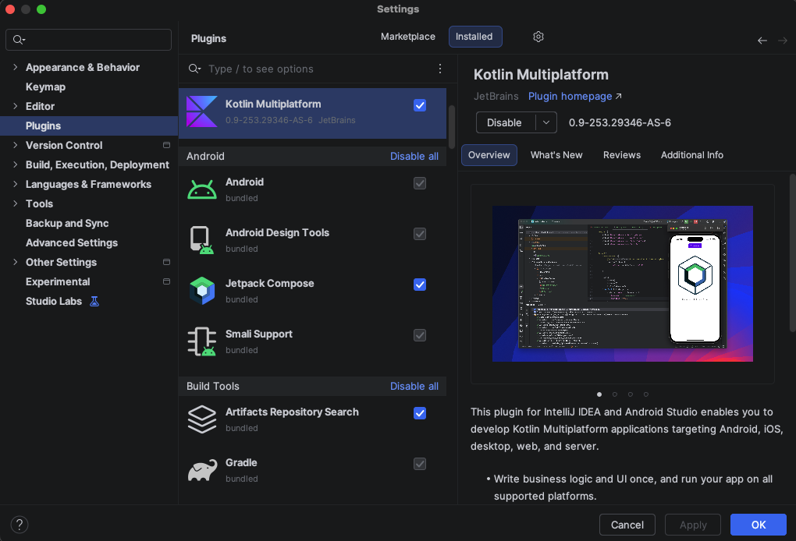

Важно понимать, что данный плагин не является обязательным требованием для работы с KMM. Вы можете разрабатывать приложения и без него, он нужен только для удобства отладки iOS-части.

При обновлениях Kotlin могут происходить ситуации, когда данный плагин ломает работу IDE (например, Gradle Sync не завершается). В таких случаях приходится вынужденно выключать плагин.

### 2.8. Xcode Kotlin plugin

Как альтернативу плагину для Android Studio, можно использовать Xcode Kotlin plugin для Xcode. Он предоставляет возможность ставить брейкпоинты в Kotlin-коде прямо из Xcode.

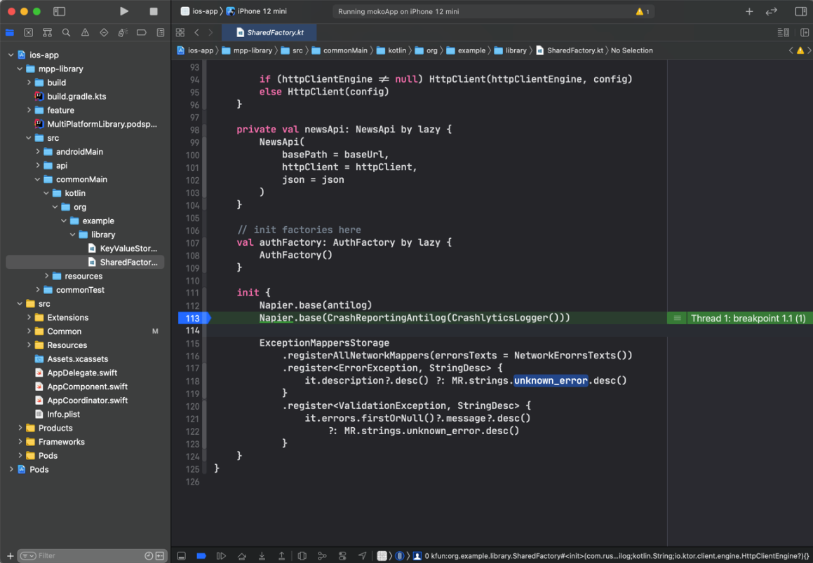

Для установки нужно скачать [актуальную версию с GitHub-репозитория](https://codelabs.kmp.icerock.dev/codelabs/kmm-icerock-onboarding-1-ru/index.html#1:~:text=%D0%B0%D0%BA%D1%82%D1%83%D0%B0%D0%BB%D1%8C%D0%BD%D1%83%D1%8E%20%D0%B2%D0%B5%D1%80%D1%81%D0%B8%D1%8E%20%D1%81%20master) проекта (разархивировать и запустить ./setup.sh).

После чего откройте Xcode и дайте разрешение использовать Kotlin-плагин (при запуске появится окно ` Load Bundle `).

После каждого обновления Xcode требуется повторно проводить операцию установки, скачивая актуализированную версию плагина.

После этого в проектах, где через folder-reference добавлены директории с Kotlin-кодом, можно открывать .kt файлы и ставить брейкпоинты, а дебаггер Xcode будет успешно на них останавливаться.

### 2.9. Проверка

Чтобы убедиться, что вы все правильно настроили, можете воспользоваться [утилитой kdoctor](https://github.com/Kotlin/kdoctor).

```bash
./doctor.sh
```

Новые переменные окружения появятся только после перезапуска сессии терминала.

### 2.10. Gradle Build Environment

Открыв файл ` gradle.properties `, расположенный в корневой папке проекта, можно увидеть параметры сборки.

- ` org.gradle.parallel ` — отвечает за параллельное выполнение задач (если задачи не зависят друг от друга).
- ` org.gradle.jvmargs ` — отвечает за запуск Java-машины и выделение ей памяти. При настройке стоит учитывать количество ОЗУ и оставлять пару резервных ГБ. Например, на устройстве с 16 ГБ можно поставить -Xmx8g.
- ` org.gradle.workers.max ` — отвечает за количество параллельных "воркеров" (по умолчанию равно количеству ядер CPU). Стоит оставить пару резервных ядер для комфортной работы. Например, на 8 ядрах можно оставить 6 воркеров.

С остальными параметрами можете ознакомиться [в документации Gradle](https://docs.gradle.org/current/userguide/build_environment.html).

Для комфортной работы вы можете изменить параметры Gradle глобально для всех проектов на вашем компьютере. Для этого перейдите в папку ` ~/.gradle `:

```bash
cd ~/.gradle
```

Нам нужен файл  ` gradle.properties `. Если его нет, создайте:

```bash
touch gradle.properties
```

Откройте его любым редактором. Вы можете объявить в этом файле любые настройки, которые будут приоритетнее, чем настройки конкретного проекта.

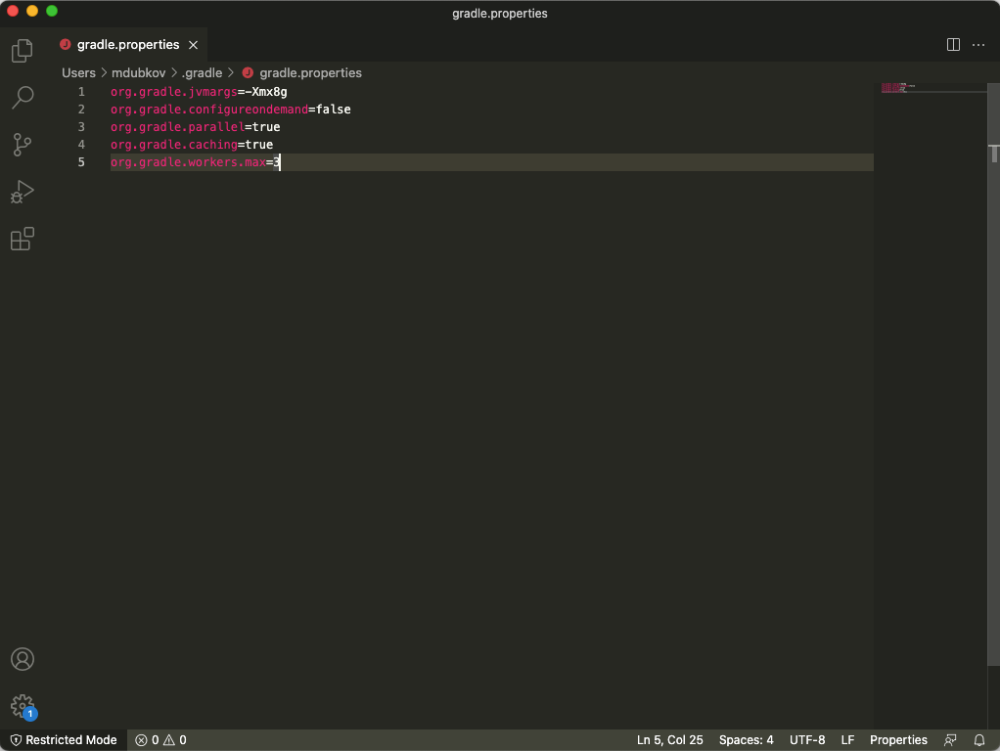

### 2.11. Настройка Detekt

Detekt — линтер для Kotlin-кода. На проектах используется конфигурация в `config/detekt.yml`.

#### Что отключено

```yaml
formatting:
  CommentSpacing: false                               # Отступы в комментариях
  ArgumentListWrapping: false                         # Перенос аргументов
  NoEmptyFirstLineInMethodBlock: false
  Filename: false                                     # Имя файла snake_case
  SpacingBetweenDeclarationsWithAnnotations: false
```

Эти правила отключены, так как они конфликтуют с форматированием IDE и создают много шума.

#### Активные правила

```yaml
style:
  ForbiddenComment:
    active: true
    comments:
      - 'FIXME:'
      - 'STOPSHIP:'
    allowedPatterns: 'TODO:'

exceptions:
  TooGenericExceptionCaught:
    active: true
```

Запрещены комментарии `FIXME:` и `STOPSHIP:`, но `TODO:` разрешены. Запрещено ловить общие исключения (`Error`, `RuntimeException`, `Throwable`).

#### Импорты

Правила работы с импортами:

- Используйте **явные импорты** (`import some.package.Class`)
- **Не используйте wildcard** импорты (`import some.package.*`)
- Импорты должны быть **отсортированы по алфавиту**

```kotlin
// Правильно
import android.os.Bundle
import androidx.lifecycle.ViewModel
import com.example.feature.auth.AuthViewModel

// Неправильно
import com.example.feature.auth.*  // Wildcard
import androidx.lifecycle.*        // Wildcard
```

### 2.12. Fastcheck — проверка перед коммитом

`fastcheck.sh` — скрипт, который обязательно нужно запускать перед пушем коммитов в репозиторий.

#### Что делает fastcheck.sh

- Запускает **detekt** (линтер Kotlin-кода) без тестов
- Собирает **Android dev debug** и запускает unit-тесты
- Запускает **iOS KMP тесты** для iosX64 и iosSimulatorArm64
- Собирает **iOS pod framework** (debug)
- Устанавливает pods и запускает **SwiftFormat lint**
- Собирает **iOS app scheme** ios-app-dev

#### Запуск

```bash
./fastcheck.sh
```

Если все проверки прошли успешно — можно пушить коммит. Если есть ошибки — исправьте их и запустите снова.

## 3. Создаем проект

В качестве отправной точки мы будем использовать наш шаблонный проект — ` mobile-moko-boilerplate `. Он используется на всех новых проектах для быстрого развёртывания и старта разработки. В нём уже подключены все минимально необходимые зависимости, имеется нужная структура папок и базовая настройка проекта.

Заходим на GitLab в репозиторий [https://gitlab.icerockdev.com/scl/boilerplate/mobile-moko-boilerplate](https://gitlab.icerockdev.com/scl/boilerplate/mobile-moko-boilerplate), делаем форк себе в профиль и клонируем его.

После клонирования открываем проект в Android Studio. Для этого запускаем IDE, выбираем ` File -> Open ` и указываем папку, в которую склонировали репозиторий. При первом открытии должно появиться следующее окно:

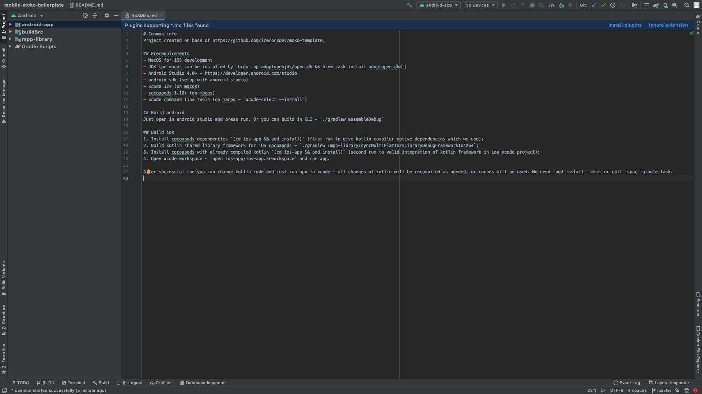

Также должен запуститься Gradle Sync. Если же этого не произошло, запустите его вручную.

Gradle Sync — это задача Gradle, которая просматривает все зависимости, перечисленные в файлах ` build.gradle `, и анализирует структуру проекта. Всё это нужно для корректной работы IDE.

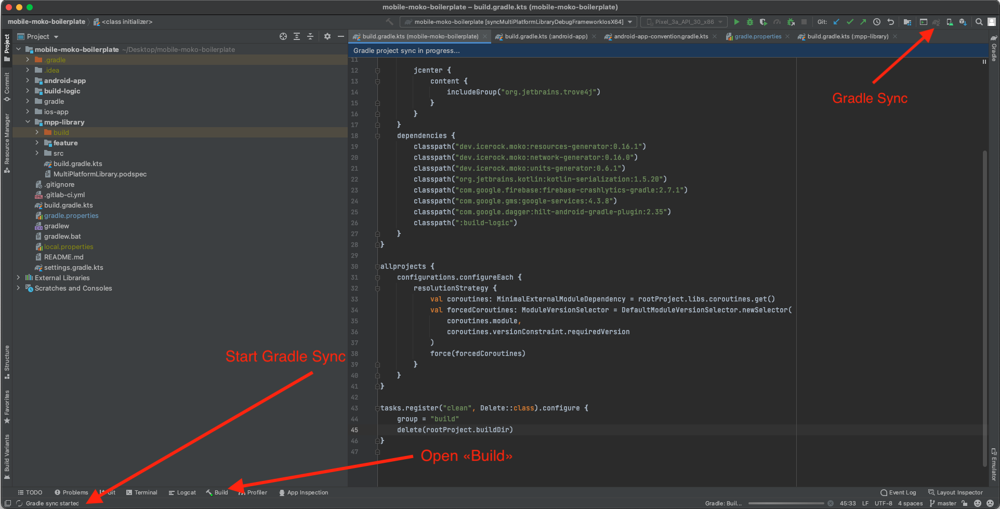

По умолчанию студия парсит каталоги и строит отображение как для Android-проекта. Но мы здесь будем работать не только с Android, но и с мультиплатформой. Поэтому переключаем отображение. Для этого слева нажимаем на выпадающий список (где написано Android) и выбираем вместо него Project:

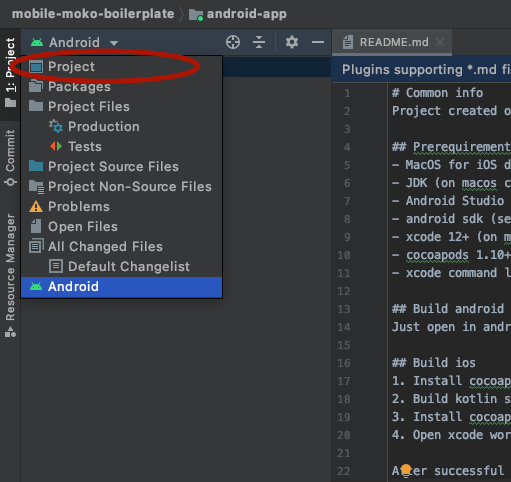

После этого структура папок немного изменится:

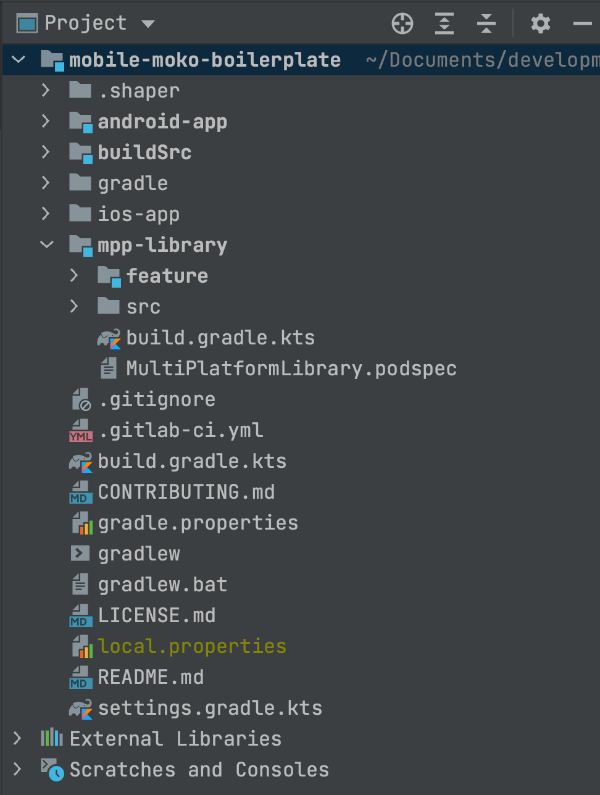

Дожидаемся успешного выполнения Gradle Sync, чтобы в нашем проекте появились нужные Tasks. Если же Gradle Sync завершился с ошибкой, читаем сообщение об ошибке и исправляем проблему.

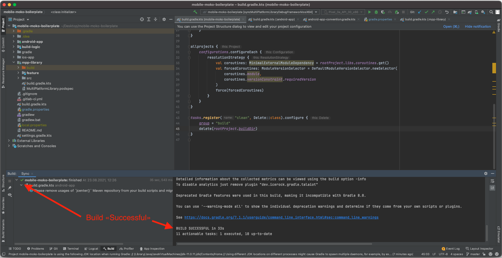

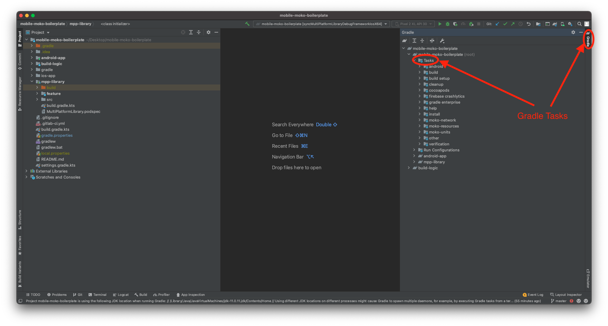

В следующей CodeLab мы познакомимся детальнее с устройством проекта, а в данной части разберемся, как запускать и отлаживать код на обеих платформах с установленным нами инструментарием.

Необходимо, чтобы в переменной окружения PATH были добавлены пути ` $HOME/bin ` и ` /usr/local/bin `. Без этого могут возникнуть проблемы при выполнении скриптов сборки.

## 4. Сборка Android

### Сборка и запуск

Запуск Android-приложения предельно прост: в Android Studio нужно нажать на кнопку Run (зеленый треугольник). Это
работает так же, как и при обычной разработке Android-приложения.

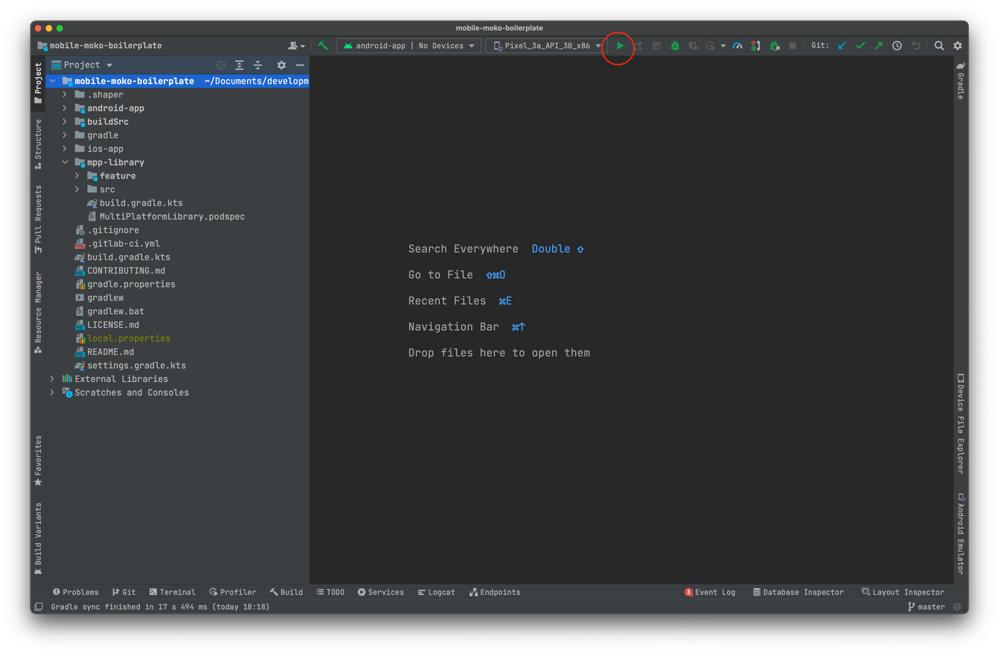

В результате произойдет сборка Android-версии общей библиотеки (mpp-library) и Android-приложения, а после этого
приложение запустится на выбранном устройстве или эмуляторе.

Если же нужно просто собрать проект без запуска, можно использовать соответствующие Gradle-задачи.

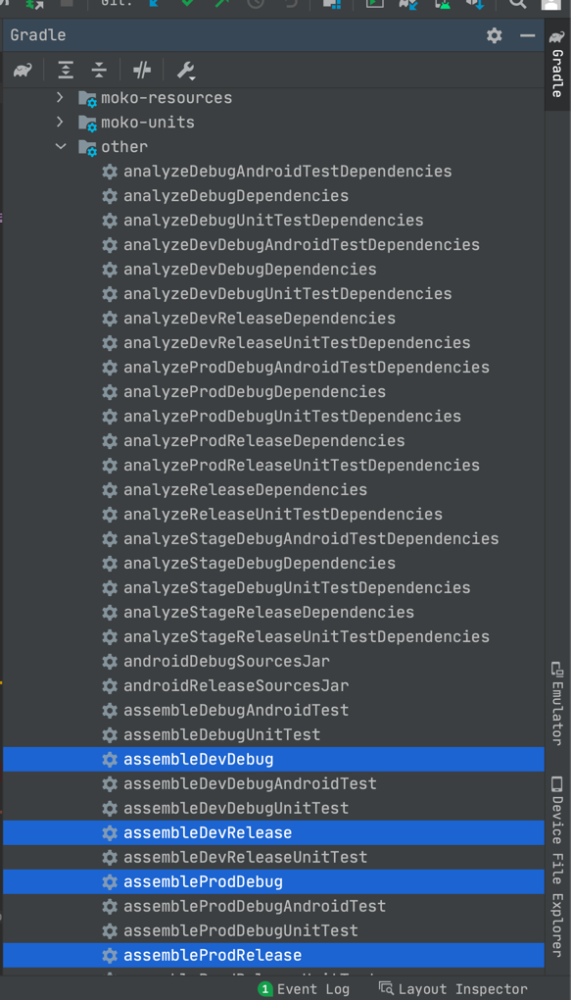

Все задачи, начинающиеся на assemble, отвечают за компиляцию проекта. Чаще всего требуется задача ` assembleDevDebug ` —
скомпилировать debug-сборку для dev-окружения. Debug-задачи выполняются заметно быстрее Release-версий, так как в них
нет оптимизаций кода и обфускации. Для разработки следует использовать именно Debug-версии.

### Выбор эмулятора

По умолчанию для запуска может быть выбран эмулятор ` Pixel_3a_API_30_x86 `. Чтобы выбрать другое устройство, нажмите на
выпадающий список с названием устройства рядом с кнопкой Run и выберите Device Manager (или перейдите через меню
` Tools -> Device Manager `).

В открывшемся окне в списке моделей устройств выберете нужный и нажмите ` New hardware profile... ` и настройте нужный
вам эмулятор.

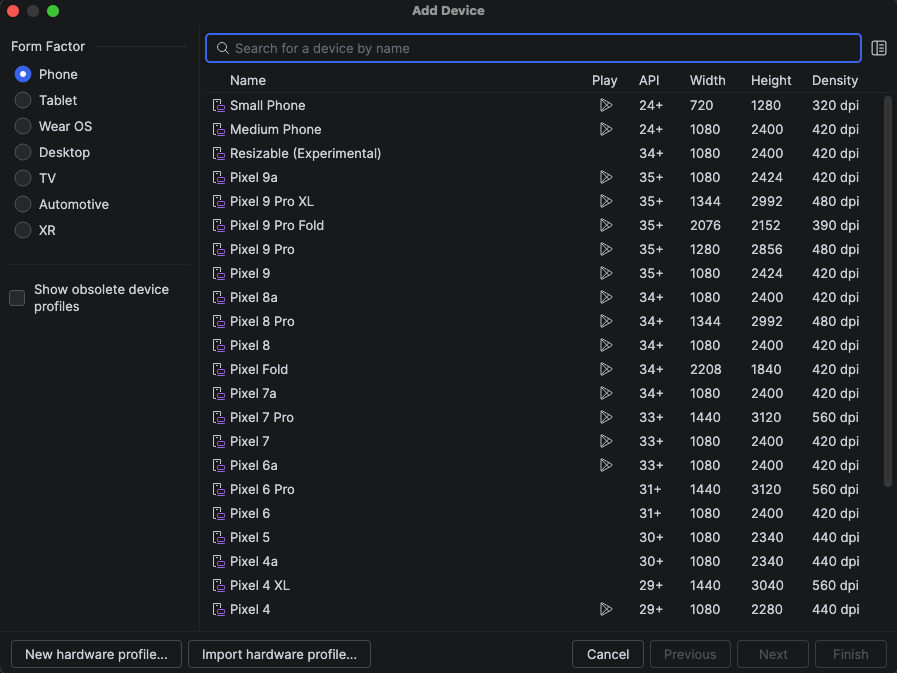

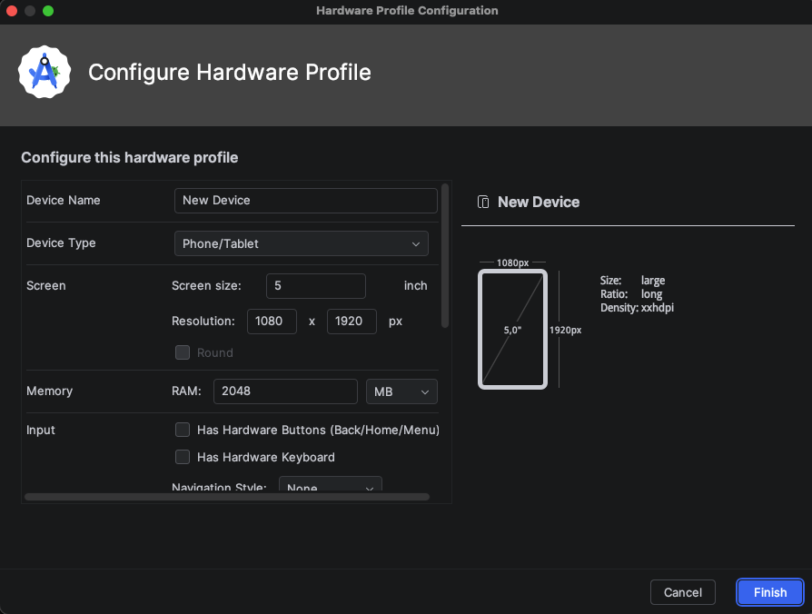

После создания эмулятор появится в списке доступных устройств для запуска.

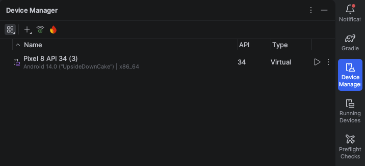

## 5. Отладка Android

Отладка Android-приложения и общего кода полностью аналогична процессу в обычной Android-разработке.

Для отладки Android-приложения или общего кода достаточно поставить брейкпоинт (точку останова) и запустить проект в
режиме Debug (иконка с изображением жука).

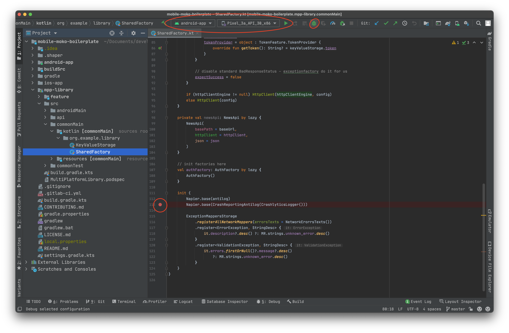

Когда выполнение программы остановится на брейкпоинте, откроется панель отладки. В ней можно будет изучить стек вызовов
и содержимое переменных в текущих фреймах.

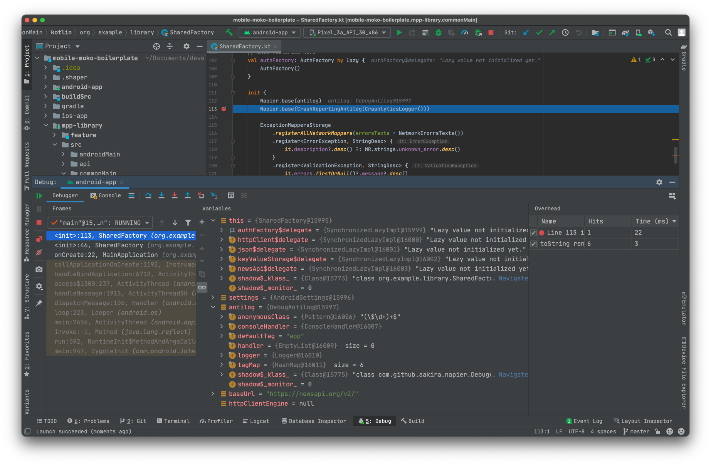

## 6. Сборка iOS

### Установка CocoaPods зависимостей

Перед первой компиляцией iOS-части требуется установить зависимости (они управляются через CocoaPods). Переходим в
директорию ios-app и выполняем команду:

```bash
cd ios-app
pod install
```

### Для владельцев M1 (Apple Silicon)

На маках с процессорами M1/M2/M3 при установке подов может возникнуть ошибка, связанная с библиотекой ffi. Для её
решения нужно запустить установку с флагом архитектуры x86_64 (эмуляция Intel).

Сначала установите ffi для нужной архитектуры:

```bash
sudo arch -x86_64 gem install ffi
```

Затем установите поды:

```bash
arch -x86_64 pod install
```

Чтобы не переключаться между IDE и терминалом, можно пользоваться терминалом прямо из Android Studio. Просто откройте
вкладку Terminal в нижней панели.

Первоначальная установка CocoaPods требуется для компиляции Kotlin-модуля, так как наш проект зависит от нативных
CocoaPods-модулей (детальнее об этом будет в следующей части).

### Компиляция MultiPlatformLibrary.framework (Kotlin-модуль для iOS)

Теперь, когда iOS-зависимости установлены, мы можем скомпилировать Kotlin-модуль для iOS. Для этого нужно запустить
Gradle-задачу ` syncMultiPlatformLibraryDebugFrameworkIosX64 `. Сделать это можно двумя способами:

Запустить в терминале команду:

```bash
./gradlew syncMultiPlatformLibraryDebugFrameworkIosX64
```

Найти задачу в Android Studio во вкладке Gradle и запустить её двойным кликом.

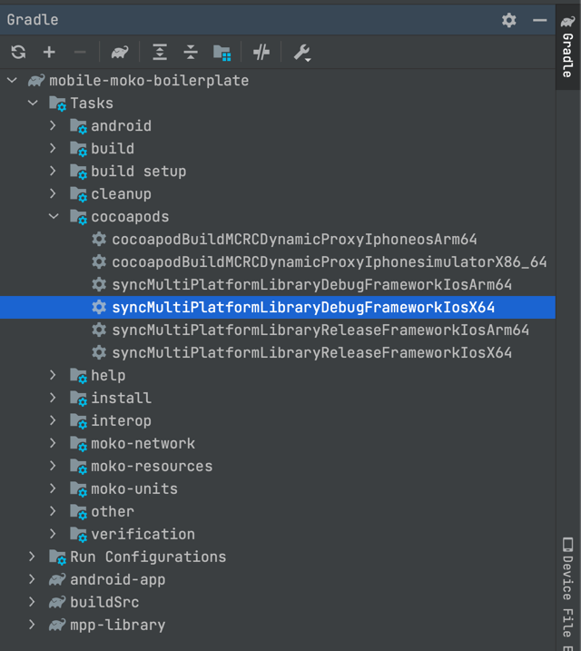

Примечание: Если вы используете Mac на Apple Silicon (M1/M2/M3) и планируете запускать приложение на эмуляторе, вам
может потребоваться задача для архитектуры IosSimulatorArm64: syncMultiPlatformLibraryDebugFrameworkIosSimulatorArm64.

Стоит попробовать оба варианта, чтобы выбрать удобный для себя.

Компиляция займет некоторое время, так как Kotlin/Native (компилятор Kotlin для нативных платформ) требует ресурсов на
первичную сборку. Пока идет процесс, можно ознакомиться со
статьей [Gradle для iOS-разработчиков](https://kmm.icerock.dev/learning/gradle/intro-gradle).

### Установка CocoaPods зависимостей вместе с MultiPlatformLibrary

После успешного завершения сборки фреймворка нужно повторно запустить установку CocoaPods:

```bash
cd ios-app
pod install
```

Это необходимо, потому что при первой установке файла ` MultiPlatformLibrary.framework ` еще не существовало (для его
компиляции требовались другие зависимости). CocoaPods не смог до конца настроить интеграцию: не добавил файл фреймворка
в проект и команду для линковки. Повторный запуск pod install после компиляции фреймворка исправит это.

Проверить успешность интеграции Kotlin-модуля в iOS-проект можно через Xcode:

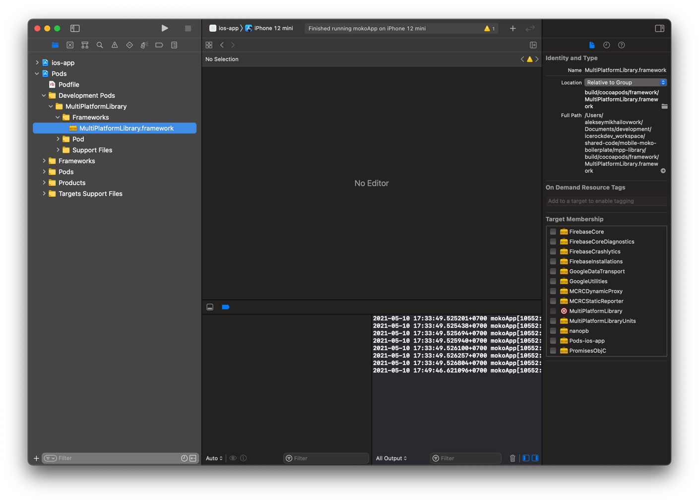

Если в директории ` Pods/Development Pods/MultiPlatformLibrary/Frameworks ` виден фреймворк — интеграция настроена верно. Если фреймворк отсутствует, убедитесь, что вы запустили pod install после компиляции задачи syncMultiPlatformLibrary.

Если возникают ошибки компиляции iOS-приложения, связанные с отсутствием MultiPlatformLibrary, проверьте интеграцию (наличие фреймворка по скриншоту выше), а также наличие самого файла фреймворка по пути
` mpp-library/build/cocoapods/framework/MultiPlatformLibrary.framework `.

### Запуск iOS-приложения

После успешной установки всех зависимостей можно открыть workspace в Xcode:

```bash
open ios-app/ios-app.xcworkspace
```

**Запуск на эмуляторе

Выбираем любой симулятор и запускаем проект нажатием на кнопку Run (Play).

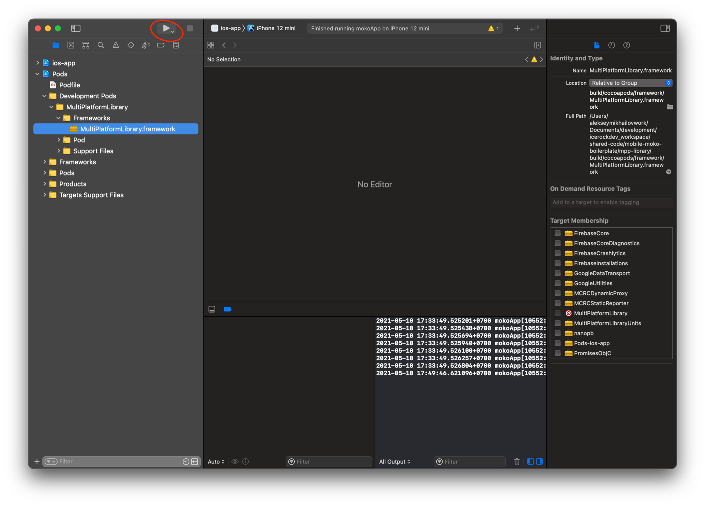

В результате увидим запущенное приложение.

**Запуск на реальном устройстве

При попытке запуска на реальном устройстве может появиться ошибка подписи (Signing).

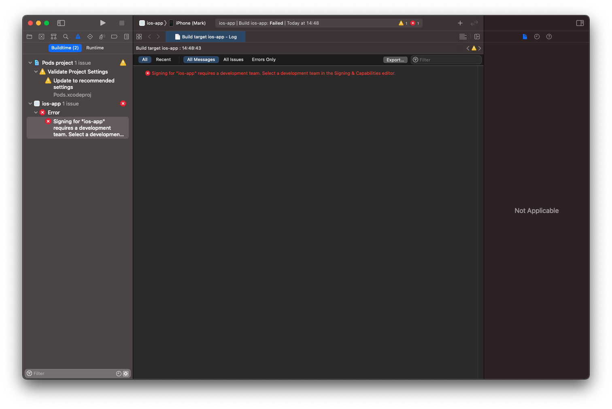

Для решения проблемы перейдите в настройки проекта: ` ios-app.xcodeproj -> Targets -> Signing & Capabilities `. Укажите
ваш ` Team ` и измените ` Bundle Identifier ` на уникальный.

Также может потребоваться изменить Bundle Identifier в настройках Firebase (в файле синхронизации) и внутри самого файла
конфигурации.

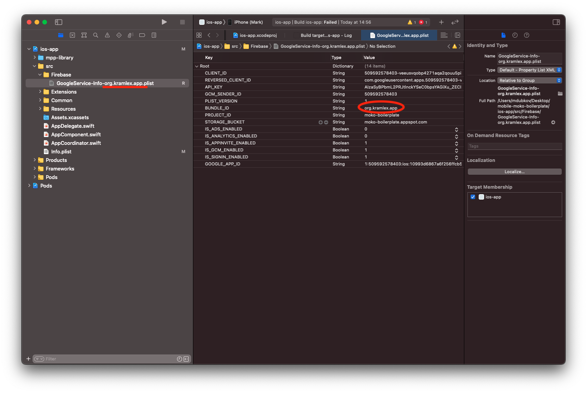

После этих действий пробуем запустить приложение на девайсе.

### Сборка напрямую из Android Studio

При использовании плагина ` Kotlin Multiplatform Mobile ` доступна возможность запускать iOS-приложение прямо из Android
Studio.

Данный способ не отменяет работы с CocoaPods, но может быть удобной альтернативой запуску через Xcode.

Для начала нужно настроить конфигурацию запуска. В Android Studio выбираем ` Edit Configurations `:

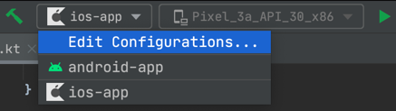

В открывшемся окне выбираем ` ios-app `. В настройках указываем:

- Xcode project scheme = mokoApp
- Execution target = желаемый симулятор или устройство.

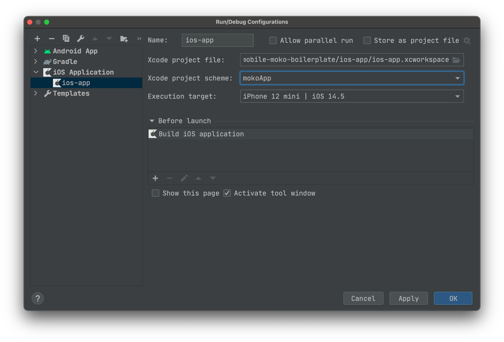

Нажимаем ` Apply `, выбираем конфигурацию ` ios-app ` и запускаем приложение.

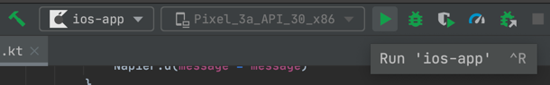

### Write-Compile-Debug цикл

Цикл разработки «пишем код -> компилируем -> запускаем» требует меньше действий, чем описано выше. После первичной
настройки зависимостей для проверки изменений в коде достаточно просто нажать ` Run ` в Xcode или Android Studio.
Интеграция через CocoaPods автоматически произведет компиляцию Kotlin-модуля, поэтому изменения в общей библиотеке и в
iOS-проекте будут учтены. Запуск ` pod install ` может потребоваться только при добавлении новых нативных зависимостей в
` Podfile `.

### Какой JDK использует Xcode?

Как мы уже выяснили, при нажатии на ` Run ` в Xcode запускается тот же самый процесс компиляции Kotlin/Native, что и в
Android Studio (например, задача syncMultiPlatformLibrary...). Это можно увидеть в ` Pods.xcodeproj -> Build Phases `.

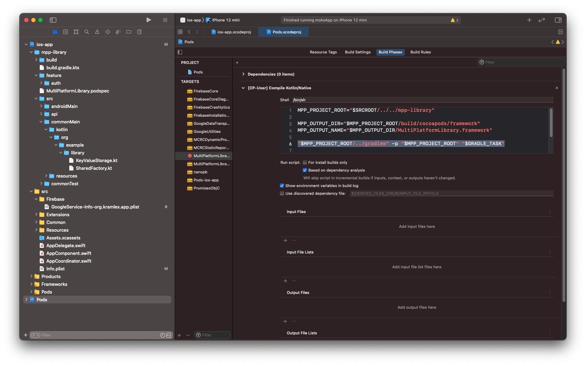
[Скриншот: xcode pods build phases]
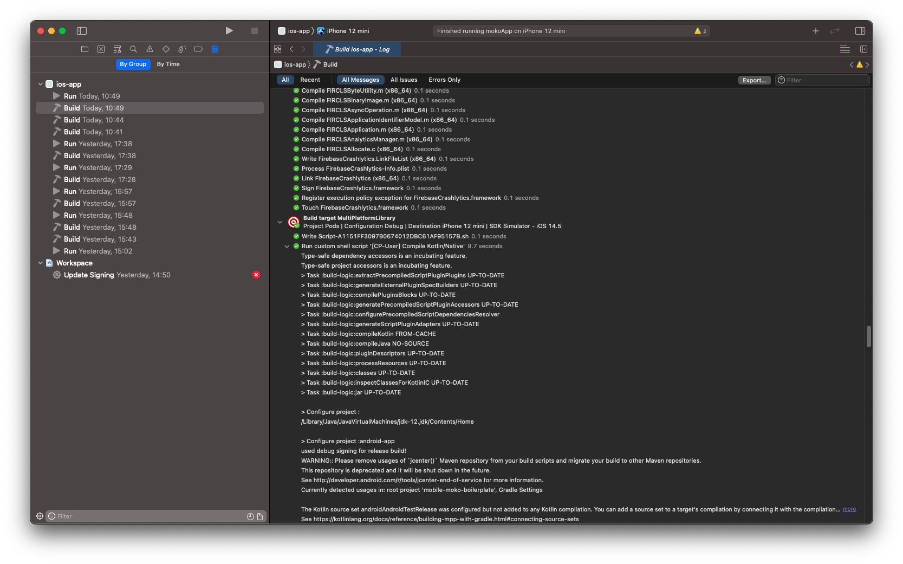

Тут можно проверить, какой JDK использует Xcode при запуске ` Gradle `.

Если вы откроете «Мониторинг системы» (` Activity Monitor `), то можете обнаружить несколько java-процессов. Если
процессов несколько, значит, при компиляции из Xcode и Android Studio запускаются разные Gradle Daemon'ы, каждый из
которых потребляет значительную часть ОЗУ. От такого дублирования нужно избавиться.

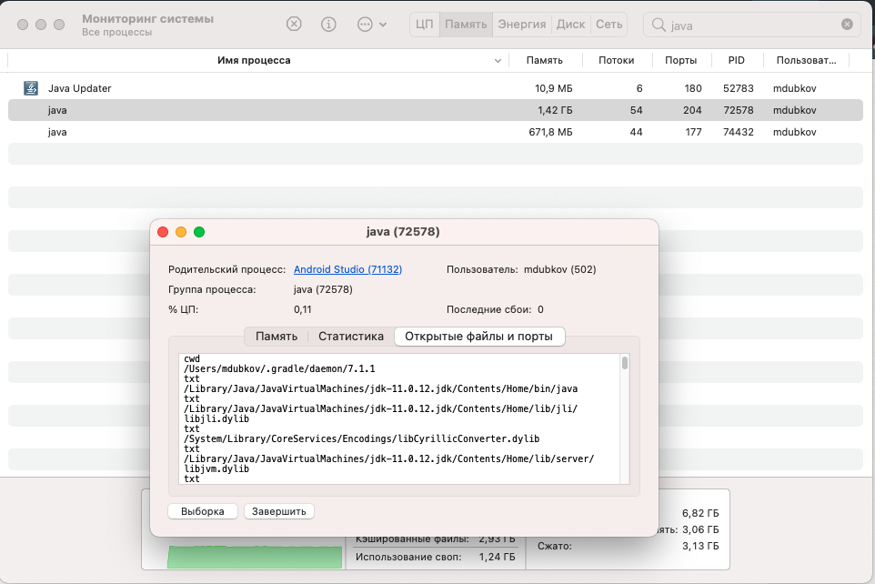

Для начала проверьте, какие версии JDK установлены:

```bash
/usr/libexec/java_home -V
```

Вывод будет похож на этот:

```text
Matching Java Virtual Machines (3):
17 (x86_64) "Oracle Corporation" - "Java SE 17" /Library/Java/JavaVirtualMachines/jdk-17.jdk/Contents/Home
11.0.12 (x86_64) "Oracle Corporation" - "Java SE 11.0.12" /Library/Java/JavaVirtualMachines/jdk-11.0.12.jdk/Contents/Home
```

Чтобы Xcode запускал Gradle Daemon с нужной версией JDK, а не со случайной, рекомендуется удалить лишние версии JDK из
` /Library/Java/JavaVirtualMachines `, оставив только ту, которая указана в вашей переменной ` JAVA_HOME `.

После этих действий в «Мониторинге системы» будет висеть только один java-процесс. Это означает, что билд-процессы в
Android Studio и Xcode используют общий Gradle Daemon.

Подробнее о Gradle Daemon можете [почитать тут](https://docs.gradle.org/current/userguide/gradle_daemon.html).

## 7. Отладка iOS

### Отладка с использованием Xcode

Благодаря установленному [плагину xcode-kotlin](https://github.com/touchlab/xcode-kotlin) мы можем ставить брейкпоинты в
Kotlin-коде прямо из Xcode. Для этого важно, чтобы файлы Kotlin-кода были добавлены в Xcode-проект через
folder-reference (ссылка на папку). В нашем проекте уже добавлена ссылка на директорию ` mpp-library `, где находятся
все мультиплатформенные модули.

Для примера откроем в Xcode файл ` mpp-library/src/commonMain/kotlin/org/example/library/SharedFactory.kt ` и поставим
брейкпоинт (кликнув на номер строки) в конструкторе класса на строке с инициализацией логгера ` Napier `:

```kotlin
Napier.base(CrashReportingAntilog(CrashlyticsLogger()))
```

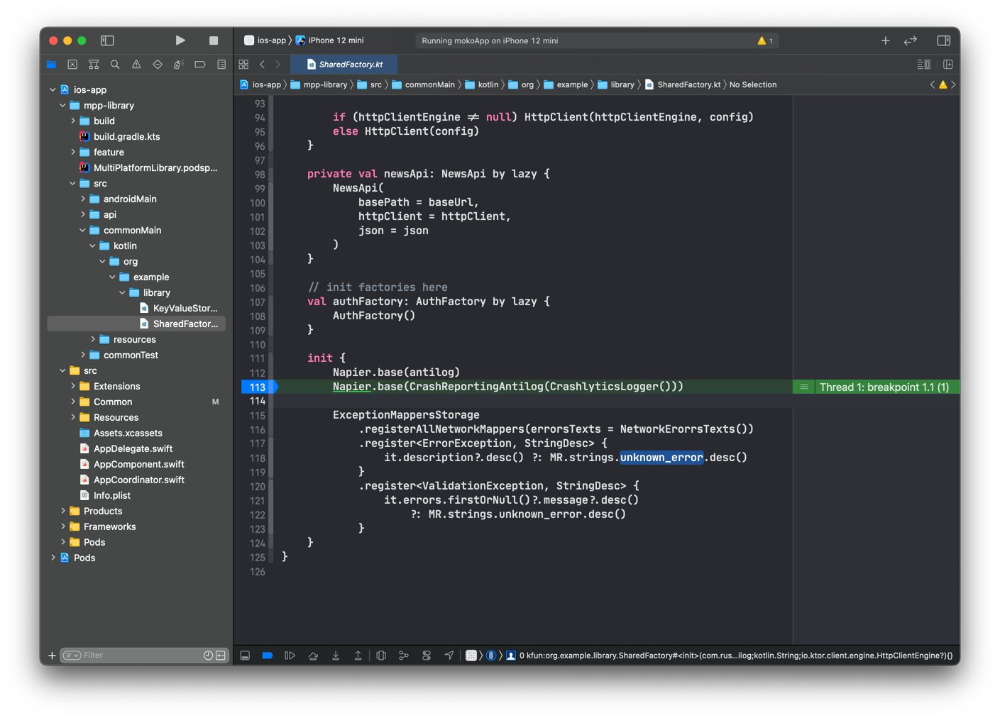

Запускаем приложение и сразу при старте получим остановку на этом брейкпоинте.

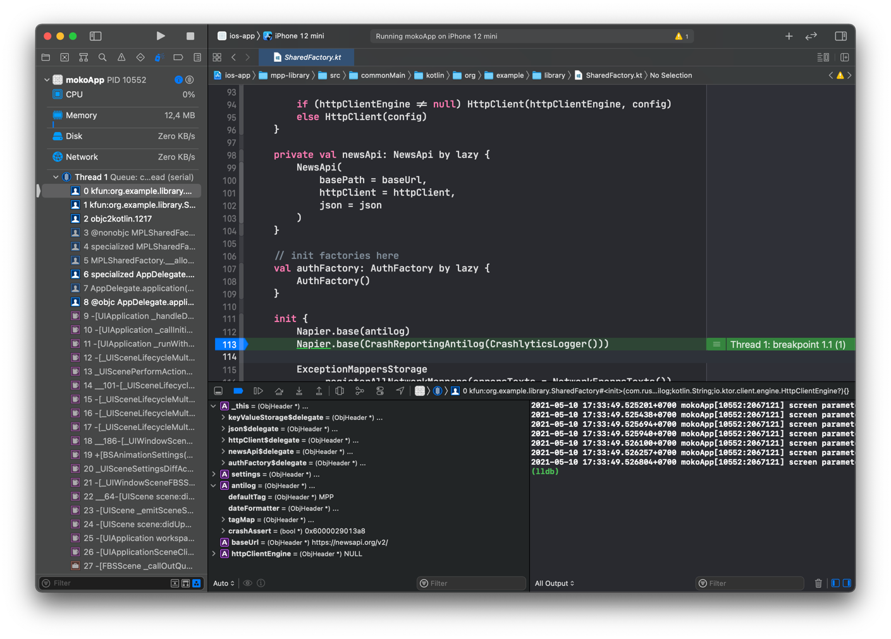

В отладчике виден стек вызовов (Kotlin-функции начинаются с префикса ` kfun `:), а также данные, доступные в текущем
фрейме для анализа:

- свойства текущего объекта в переменной ` _this `;
- аргументы конструктора: ` settings `, ` antilog `, ` baseUrl `, ` httpClientEngine `.

Внимание: Отладчик работает с Kotlin-кодом пока что нестабильно. Операции пошагового выполнения могут приводить к
неожиданным результатам, а команды LLDB (например, ` po `) могут вызывать краши. Ситуация улучшается с выходом новых
версий Kotlin.

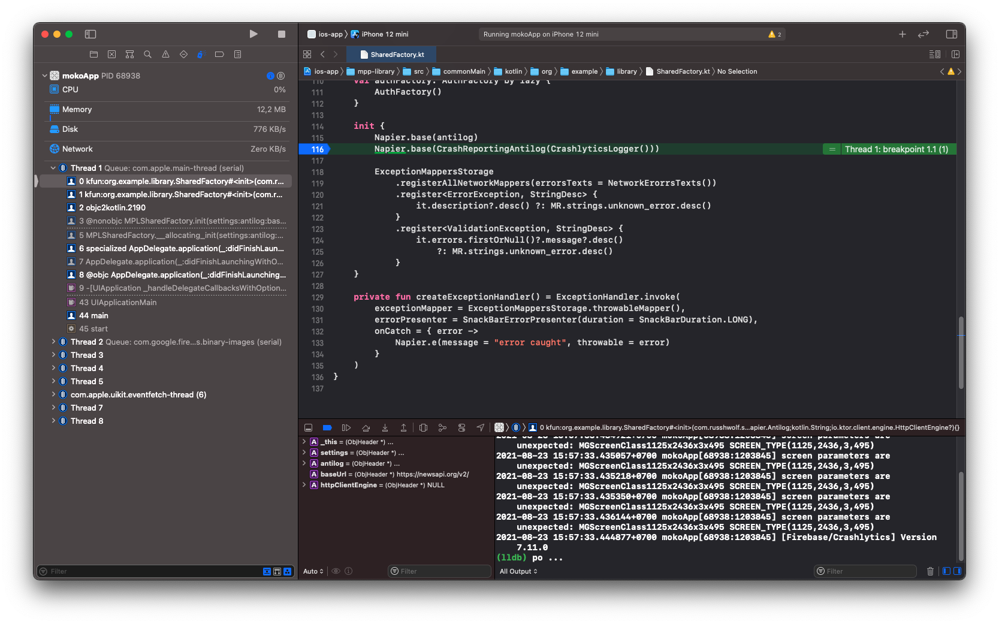

Подробнее об Advanced Debugging с Xcode
можно [почитать здесь](https://medium.com/headout-engineering/advanced-debugging-with-xcode-9eba2845232a).

### Отладка с использованием Android Studio

При использовании плагина Kotlin Multiplatform Mobile можно проводить отладку Kotlin-кода в iOS-приложении прямо из
Android Studio.

Для этого устанавливаем брейкпоинт (кликом справа от номера строки) на нужной строке:

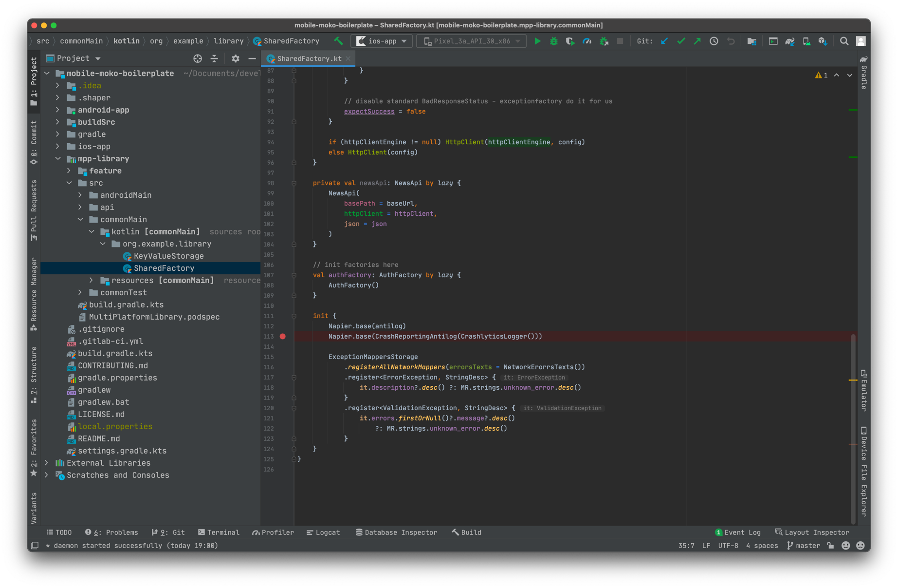

Затем запускаем приложение с помощью кнопки Debug (иконка жука):

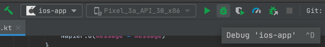

После запуска произойдет остановка на брейкпоинте. Мы увидим стек вызовов и данные текущего фрейма так же, как и в
Xcode.

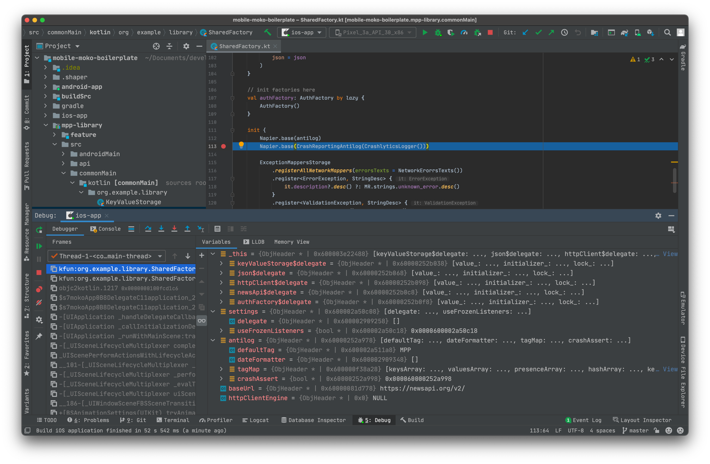

### Сравнение: Xcode vs Android Studio

У каждого подхода есть свои преимущества и недостатки:

Отладка через Xcode: Позволяет видеть данные фрейма не только Kotlin-части, но и Swift. Можно переключаться по стеку
вызовов в Swift-код и смотреть, что было передано в Kotlin при вызове.

Отладка через Android Studio: Swift-код при этом подходе недоступен для анализа, видна только Kotlin-часть. Однако в
Android Studio доступна полноценная навигация и анализ Kotlin-кода, которые недоступны в Xcode.

Каждый разработчик может выбрать инструмент, наиболее подходящий под его текущие задачи.

## 8. Запуск тестов

Тесты, написанные в Kotlin-модуле, запускаются в обоих окружениях — Android и iOS. Это позволяет выявлять проблемы,
специфичные для конкретной платформы.

Запуск тестов выполняется через Gradle-задачи:

- ` build ` — скомпилировать все платформы и запустить все проверки. Это самый долгий вариант, так как собираются все
  бинарники, даже те, что не требуются для тестов.
- ` test ` — запустить все тесты (скомпилировав только необходимые для этого бинарники).
- ` iosX64Test ` — запустить тесты только для iOS-платформы (симулятор x64).
- ` testDebugUnitTest ` — запустить тесты только для Android-платформы.

Попробуйте запустить тесты с помощью задачи ` test `:

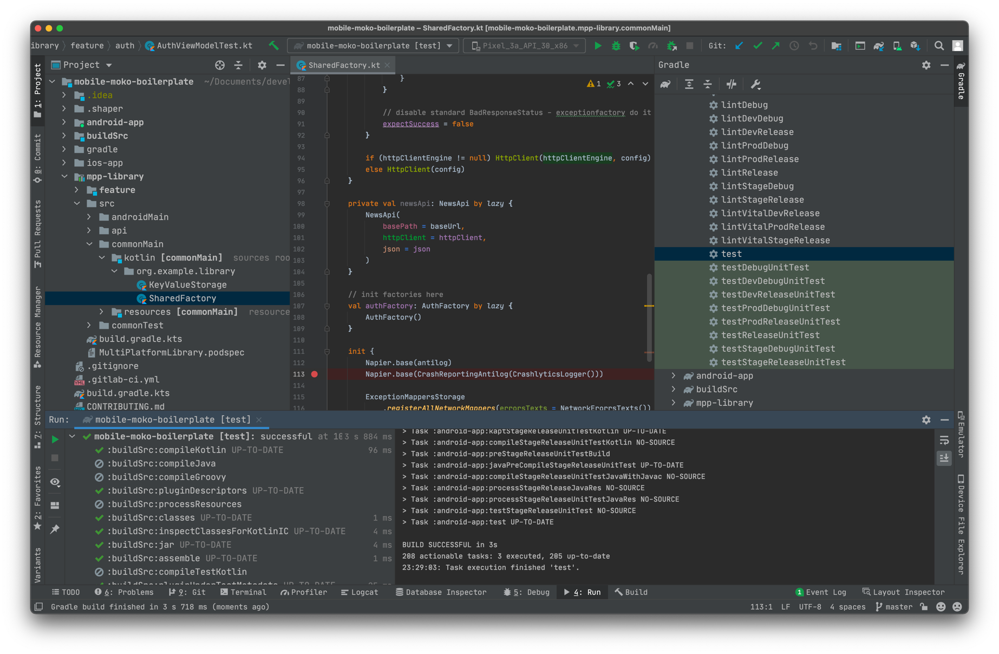

Помимо запуска через Gradle-задачи, можно запускать тесты точечно (отдельные классы или методы) прямо из редактора кода:

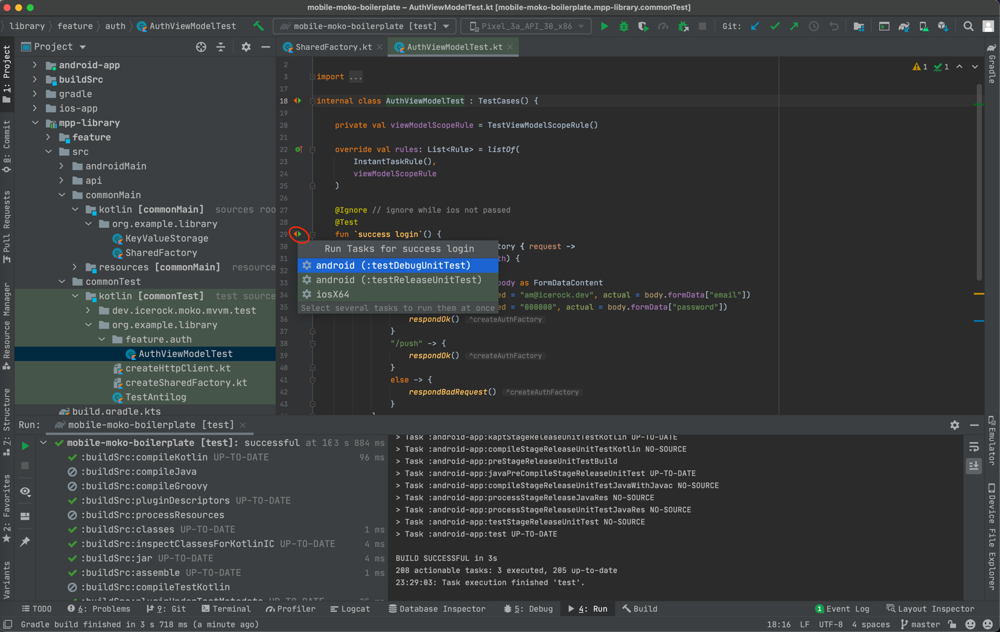

Подробнее о написании тестов мы поговорим в следующих Codelabs.

## 9. Итоги

И это успех) Мы выкачали и собрали мультиплатформенный проект с нуля. Аналогичным образом происходит работа со всеми
другими MPP-проектами в компании. Поэтому когда ты попадёшь на боевой проект, то уже точно будешь знать, как его
выкачать из репозитория, собрать и запустить у себя.
