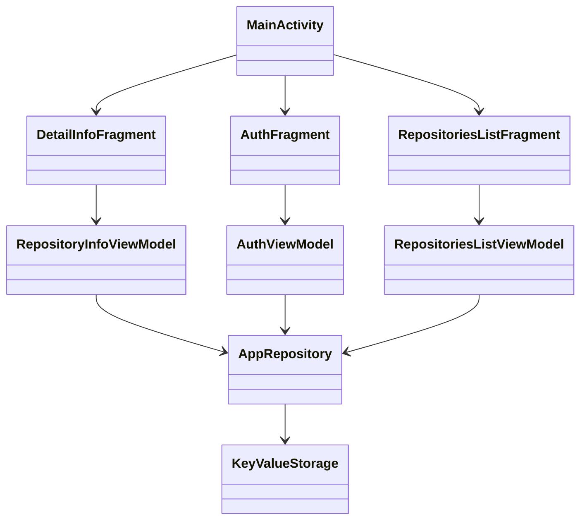

# Практическое задание

Нужно разработать android приложение для просмотра GitHub репозиториев.

Во время работы над практическим заданием настоятельно рекомендуем обращаться к разделу [Памятки для разработчика](../../university/memos/best-practices)

## Кликабельный прототип

<iframe width="361" height="850" src="//www.figma.com/embed?embed_host=share&url=https%3A%2F%2Fwww.figma.com%2Fproto%2FMh3ga5XAzyJNCY87NBp01G%2FGit_test%3Fnode-id%3D4%253A600%26scaling%3Dmin-zoom%26page-id%3D0%253A1%26starting-point-node-id%3D4%253A645" allowfullscreen></iframe>

## Функциональные требования

1. Авторизация пользователя (personal access token)
1. Просмотр списка репозиториев пользователя (первые 10)
1. Просмотр детальной информации выбранного репозитория
    1. статистика (forks, stars, watchers)
    1. ссылка на web страницу репозитория
    1. лицензия
    1. readme

## Технические требования

1. Реализация на Kotlin
2. Использовать XML Layouts для UI
3. Использовать Kotlin Gradle DSL
4. Использовать Retrofit для работы с REST API
5. Использовать `RecyclerView` для отображения списка
6. Использовать `ConstraintLayout` для экрана детальной информации
7. Использовать Android Navigation Component для переходов между экранами
8. Использовать View Binding для связывания верстки с кодом
9. Экраны делать с помощью `Fragment` (подход Single Activity)
10. Использовать `Coroutines` для асинхронности и многопоточности
11. Использовать [Kotlinx.Serialization](https://github.com/Kotlin/kotlinx.serialization) для парсинга json
12. Использовать `ViewModel` для реализации логики экранов
13. Использовать `LiveData` / `StateFlow` для обновления данных на UI
14. Использовать Dagger Hilt для внедрения зависимостей
15. Сохранять токен авторизации в хранилище устройства - `SharedPreferences`
16. Корректно обрабатывать ситуации "загрузка данных", "ошибка загрузки", "пустой список"
17. Корректно обрабатывать смену конфигурации
18. На экране авторизации использовать Actions для перехода на экран списка репозиториев и показа ошибки
19. При перезапуске приложения авторизация должна сохраняться
20. Использовать локализацию для всех строк, показываемых пользователю
21. Использовать векторную графику везде, где это возможно
22. Обеспечить поддержку Android API 21

## Классы Android-приложения

```kotlin
    
    class MainActivity: AppCompatActivity {
        // TODO:
    }

    class AuthFragment: Fragment {
        // TODO:
    }

    class RepositoriesListFragment: Fragment {
       // TODO:
    }

    class DetailInfoFragment: Fragment {
       // TODO:
    }

   class AuthViewModel {
      val token: MutableLiveData<String>
      val state: LiveData<State>
      val actions: Flow<Action>

      fun onSignButtonPressed() {
          // TODO:
      }
      
      sealed interface State {
         object Idle : State
         object Loading : State
         data class InvalidInput(val reason: String) : State
      }
      
      sealed interface Action {
         data class ShowError(val message: String) : Action
         object RouteToMain : Action
      }

      // TODO:
   }

   class RepositoryInfoViewModel {
      val state: LiveData<State>

      sealed interface State {
         object Loading : State
         data class Error(val error: String) : State

         data class Loaded(
            val githubRepo: Repo,
            val readmeState: ReadmeState
         ) : State
      }

      sealed interface ReadmeState {
         object Loading : ReadmeState
         object Empty : ReadmeState
         data class Error(val error: String) : ReadmeState
         data class Loaded(val markdown: String) : ReadmeState
      }

      // TODO:
   }
   
   class RepositoriesListViewModel {
      val state: LiveData<State>
      
      sealed interface State {
         object Loading : State
         data class Loaded(val repos: List<Repo>) : State
         data class Error(val error: String) : State
         object Empty : State
      }

      // TODO:
   }

   class AppRepository {
      suspend fun getRepositories(): List<Repo> {
         // TODO:
      }

      suspend fun getRepository(repoId: String): RepoDetails {
         // TODO:
      }

      suspend fun getRepositoryReadme(ownerName: String, repositoryName: String, branchName: String): String {
         // TODO:
      }
      
      suspend fun signIn(token: String): UserInfo {
         // TODO:
      }

      // TODO:
   }

   class KeyValueStorage {
      var authToken: String?
   }
```

## Диаграмма классов

При реализации нужно придерживаться следующей диаграммы:



## Материалы

1. [GitHub REST API](https://docs.github.com/en/rest)
1. [GitHub Basic Authorization](https://docs.github.com/en/rest/overview/other-authentication-methods#basic-authentication)
1. [GitHub user repositories](https://docs.github.com/en/rest/reference/repos#list-repositories-for-a-user)
1. [Kotlinx.Serialization guide](https://github.com/Kotlin/kotlinx.serialization/blob/master/docs/basic-serialization.md#json-decoding)
1. [Интеграция Kotlinx.Serialization и Retrofit](https://github.com/JakeWharton/retrofit2-kotlinx-serialization-converter)
1. [Дизайн](https://www.figma.com/file/Mh3ga5XAzyJNCY87NBp01G)
