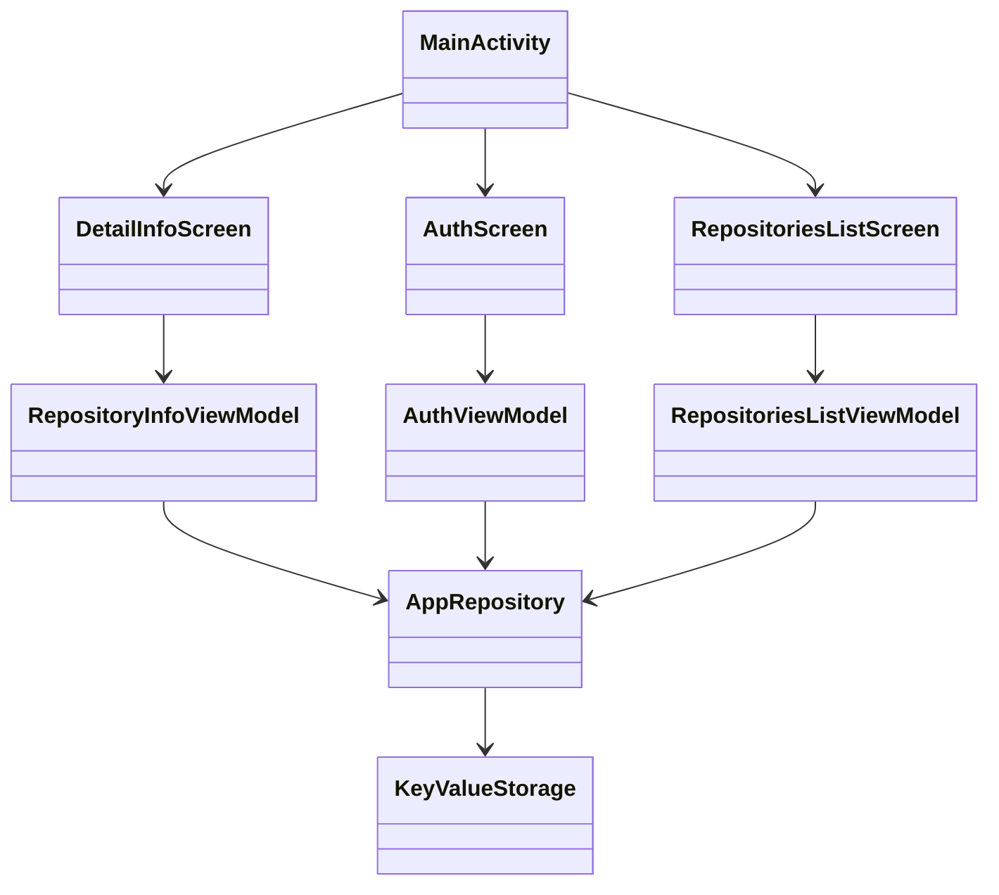

# Практическое задание

Нужно разработать android приложение для просмотра GitHub репозиториев.

Во время работы над практическим заданием настоятельно рекомендуем обращаться к разделу [Памятки для разработчика](../../university/memos/best-practices)

## Кликабельный прототип

<iframe width="361" height="850" src="//www.figma.com/embed?embed_host=share&url=https%3A%2F%2Fwww.figma.com%2Fproto%2FMh3ga5XAzyJNCY87NBp01G%2FGit_test%3Fnode-id%3D4%253A600%26scaling%3Dmin-zoom%26page-id%3D0%253A1%26starting-point-node-id%3D4%253A645" allowfullscreen></iframe>

## Функциональные требования

1. Авторизация пользователя (personal access token)
1. Просмотр списка репозиториев пользователя (первые 10)
1. Просмотр детальной информации выбранного репозитория
    1. статистика (forks, stars, watchers)
    1. ссылка на web страницу репозитория
    1. лицензия
    1. readme

## Технические требования

1. Реализация на Kotlin
1. Использовать Jetpack Compose для UI
1. Использовать Kotlin Gradle DSL
1. Использовать Ktor Client для работы с REST API
1. Использовать LazyColumn для отображения списка
1. Использовать Jetpack Navigation для переходов между экранами
1. Использовать Coroutines для асинхронности и многопоточности
1. Использовать [Kotlinx.Serialization](https://github.com/Kotlin/kotlinx.serialization) для парсинга json
1. Использовать ViewModel для реализации логики экранов
1. Использовать StateFlow для обновления данных на UI
1. Использовать Koin для внедрения зависимостей
1. Сохранять токен авторизации в хранилище устройства - SharedPreferences
1. Корректно обрабатывать ситуации "загрузка данных", "ошибка загрузки", "пустой список"
1. Корректно обрабатывать смену конфигурации
1. При перезапуске приложения авторизация должна сохраняться
1. Использовать локализацию для всех строк, показываемых пользователю
1. Использовать векторную графику везде, где это возможно
1. Обеспечить поддержку Android API 26

## Файлы Android-приложения

```kotlin
    
    class MainActivity: AppCompatActivity {
        // TODO:
    }

    @Composable
    fun AuthScreen() {
        // TODO:
    }

    @Composable
    fun RepositoriesListScreen() {
       // TODO:
    }

    @Composable
    fun DetailInfoScreen() {
       // TODO:
    }

   class AuthViewModel {
      val token: MutableStateFlow<String>
      val state: StateFlow<State>
      val actions: Flow<Action>

      fun onSignButtonPressed() {
          // TODO:
      }
      
      sealed interface State {
         object Idle : State
         object Loading : State
         data class InvalidInput(val reason: String) : State
      }
      
      sealed interface Action {
         data class ShowError(val message: String) : Action
         object RouteToMain : Action
      }

      // TODO:
   }

   class RepositoryInfoViewModel {
      val state: StateFlow<State>

      sealed interface State {
         object Loading : State
         data class Error(val error: String) : State

         data class Loaded(
            val githubRepo: Repo,
            val readmeState: ReadmeState
         ) : State
      }

      sealed interface ReadmeState {
         object Loading : ReadmeState
         object Empty : ReadmeState
         data class Error(val error: String) : ReadmeState
         data class Loaded(val markdown: String) : ReadmeState
      }

      // TODO:
   }
   
   class RepositoriesListViewModel {
      val state: StateFlow<State>
      
      sealed interface State {
         object Loading : State
         data class Loaded(val repos: List<Repo>) : State
         data class Error(val error: String) : State
         object Empty : State
      }

      // TODO:
   }

   class AppRepository {
      suspend fun getRepositories(): List<Repo> {
         // TODO:
      }

      suspend fun getRepository(repoId: String): RepoDetails {
         // TODO:
      }

      suspend fun getRepositoryReadme(ownerName: String, repositoryName: String, branchName: String): String {
         // TODO:
      }
      
      suspend fun signIn(token: String): UserInfo {
         // TODO:
      }

      // TODO:
   }

   class KeyValueStorage {
      var authToken: String?
   }
```

## Диаграмма классов

При реализации нужно придерживаться следующей диаграммы:


```mermaid
    classDiagram

    class MainActivity:::android
    class AuthScreen:::android
    class RepositoriesListScreen:::android
    class DetailInfoScreen:::android
    
    class AuthViewModel:::android

    class RepositoryInfoViewModel:::android

    class RepositoriesListViewModel:::android

    class AppRepository:::android
    class KeyValueStorage:::android
    
    MainActivity --> AuthScreen
    MainActivity --> RepositoriesListScreen
    MainActivity --> DetailInfoScreen
    
    AuthScreen --> AuthViewModel
    RepositoriesListScreen --> RepositoriesListViewModel
    DetailInfoScreen --> RepositoryInfoViewModel
    
    RepositoryInfoViewModel --> AppRepository
    AuthViewModel --> AppRepository
    RepositoriesListViewModel --> AppRepository
    
    AppRepository --> KeyValueStorage
```


## Материалы

1. [GitHub REST API](https://docs.github.com/en/rest)
1. [GitHub Basic Authorization](https://docs.github.com/en/rest/overview/other-authentication-methods#basic-authentication)
1. [GitHub user repositories](https://docs.github.com/en/rest/reference/repos#list-repositories-for-a-user)
1. [Kotlinx.Serialization guide](https://github.com/Kotlin/kotlinx.serialization/blob/master/docs/basic-serialization.md#json-decoding)
1. [Интеграция Kotlinx.Serialization и Ktor](https://ktor.io/docs/client-serialization.html)
1. [Дизайн](https://www.figma.com/file/Mh3ga5XAzyJNCY87NBp01G)
