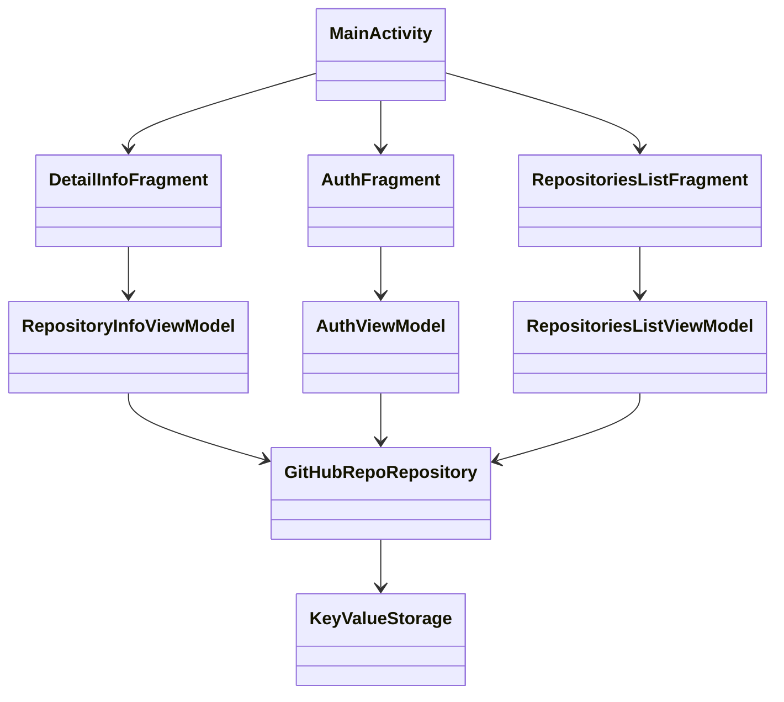

# Практическое задание

Нужно разработать android приложение для просмотра GitHub репозиториев.

Во время работы над практическим заданием настоятельно рекомендуем обращаться к
разделу [Памятки для разработчика](/university/memos/function)

## Кликабельный прототип

<iframe width="361" height="850" src="//www.figma.com/embed?embed_host=share&url=https%3A%2F%2Fwww.figma.com%2Fproto%2FMh3ga5XAzyJNCY87NBp01G%2FGit_test%3Fnode-id%3D4%253A600%26scaling%3Dmin-zoom%26page-id%3D0%253A1%26starting-point-node-id%3D4%253A645" allowfullscreen></iframe>

## Функциональные требования

1. Авторизация пользователя (personal access token)
1. Просмотр списка репозиториев пользователя (первые 10)
1. Просмотр детальной информации выбранного репозитория
    1. описание
    1. статистика (forks, stars, watchers)
    1. ссылка на web страницу репозитория
    1. лицензия

## Технические требования

1. Реализация на Kotlin
1. Использовать XML Layouts для UI
1. Использовать Kotlin Gradle DSL
1. Использовать Retrofit для работы с REST API
1. Использовать RecyclerView для отображения списка
1. Использовать ConstraintLayout для экрана детальной информации
1. Использовать Android Navigation Component для переходов между экранами
1. Экраны делать с помощью Fragment (подход Single Activity)
1. Использовать Coroutines для асинхронности и многопоточности
1. Использовать [Kotlinx.Serialization](https://github.com/Kotlin/kotlinx.serialization) для парсинга json
1. Использовать ViewModel для реализации логики экранов
1. Использовать LiveData / StateFlow для обновления данных на UI
1. Использовать Dagger Hilt для внедрения зависимостей
1. Сохранять токен авторизации в хранилище устройства - SharedPreferences
1. Корректно обрабатывать ситуации "загрузка данных", "ошибка загрузки", "пустой список"
1. Корректно обрабатывать смену конфигурации
1. При перезапуске приложения авторизация должна сохраняться

## Классы Android-приложения

```kotlin
    
    class MainActivity: AppCompatActivity() {
        // TODO:
    }

    class AuthFragment: Fragment(R.id.auth_framgent) {
        // TODO:
    }

    class RepositoriesListFragment: Fragment(R.id.repo_list_framgent) {
       // TODO:
    }

    class DetailInfoFragment: Fragment(R.id.repo_info_framgent) {
       // TODO:
    }

   class AuthViewModel {
      val token: MutableLiveData<String>
      val state: LiveData<AuthState>
      val actions: Flow<AuthAction>
      fun onSignButtonPressed() {
          // TODO:
      }
      
      sealed interface AuthState {
         object Idle : AuthState
         object Loading : AuthState
         object InvalidInput : AuthState
      }
      
      sealed interface AuthAction {
         object ShowError : AuthAction
         object RouteToMain : AuthAction
      }

      // TODO:
   }

   class RepositoryInfoViewModel {
      val state: LiveData<State>

      sealed interface State {
         object Loading : State
         object Error : State

         data class DataAvailable(
            val githubRepo: RepoEntity,
            val readmeState: ReadmeState
         ) : State

         sealed interface ReadmeState {
            object Loading : ReadmeState
            object Empty : ReadmeState
            data class Error(val error: String) : ReadmeState
            data class Loaded(val markdown: String) : ReadmeState
         }
      }

      // TODO:
   }
   
   class RepositoriesListViewModel {
      val state: LiveData<State>
      
      sealed interface State {
         object Loading : State
         object ListLoaded : State
         object Error : State
         object Empty : State
      }

      // TODO:
   }

   class AppRepository {
      suspend fun getRepositories(): List<RepoEntity> {
         // TODO:
      }

      suspend fun getRepository(repoId: String): RepoDetailsEntity {
         // TODO:
      }

      suspend fun getRepositoryReadme(ownerName: String, repositoryName: String, branchName: String): RepoReadme {
         // TODO:
      }
      
      suspend fun signIn(token: String): UserInfo {
         // TODO:
      }

      // TODO:
   }

   class KeyValueStorage {
      var authToken: String?
      var userName: String?
   }

```

## Диаграмма классов

При реализации нужно придерживаться следующей диаграммы:



По диаграмме важно понять что нужно использовать MVVM подход с хранением состояния в виде `sealed interface`, например:

```kotlin
sealed interface State {
    object Loading : State
    data class Loaded(val repo: RepoEntity, val readmeState: ReadmeState) : State

    sealed interface ReadmeState {
        object Loading : ReadmeState
        object Empty : ReadmeState
        data class Error(val error: String) : ReadmeState
        data class Loaded(val markdown: String) : ReadmeState
    }
}
```

Из-за ограничений mermaid на диаграмме не удалось отразить схему с учетом возможностей kotlin, но пример выше должен
помочь вам сориентироваться.

## Материалы

1. [GitHub REST API](https://docs.github.com/en/rest)
1. [GitHub Basic Authorization](https://docs.github.com/en/rest/overview/other-authentication-methods#basic-authentication)
1. [GitHub user repositories](https://docs.github.com/en/rest/reference/repos#list-repositories-for-a-user)
1. [Kotlinx.Serialization guide](https://github.com/Kotlin/kotlinx.serialization/blob/master/docs/basic-serialization.md#json-decoding)
1. [Интеграция Kotlinx.Serialization и Retrofit](https://github.com/JakeWharton/retrofit2-kotlinx-serialization-converter)
1. [Дизайн](https://www.figma.com/file/Mh3ga5XAzyJNCY87NBp01G)
