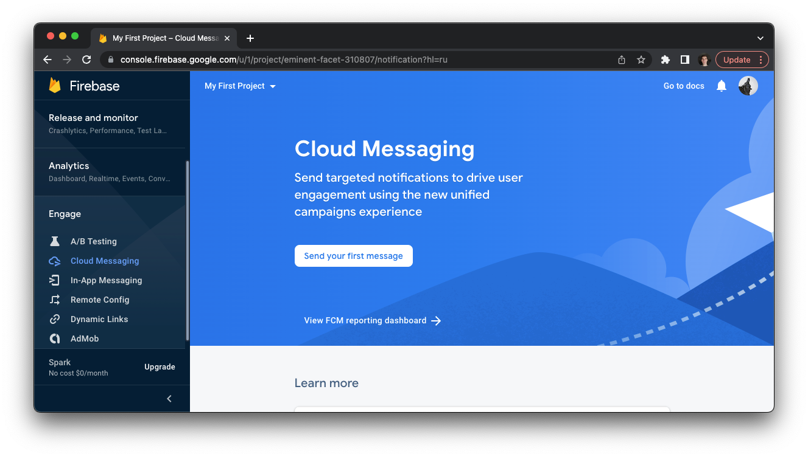
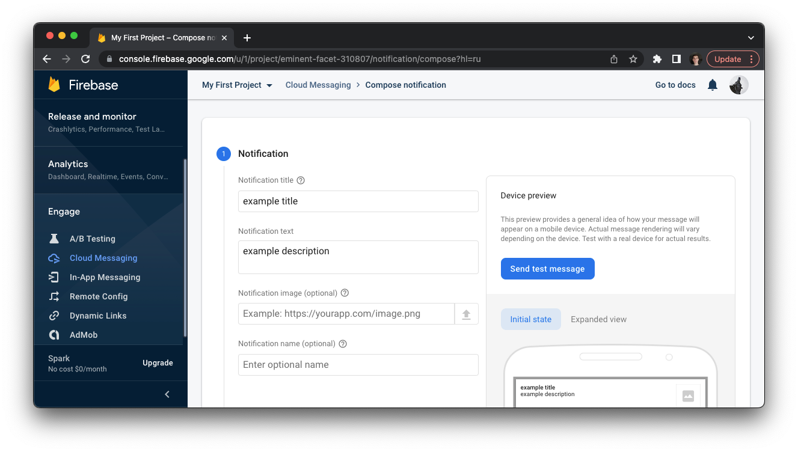
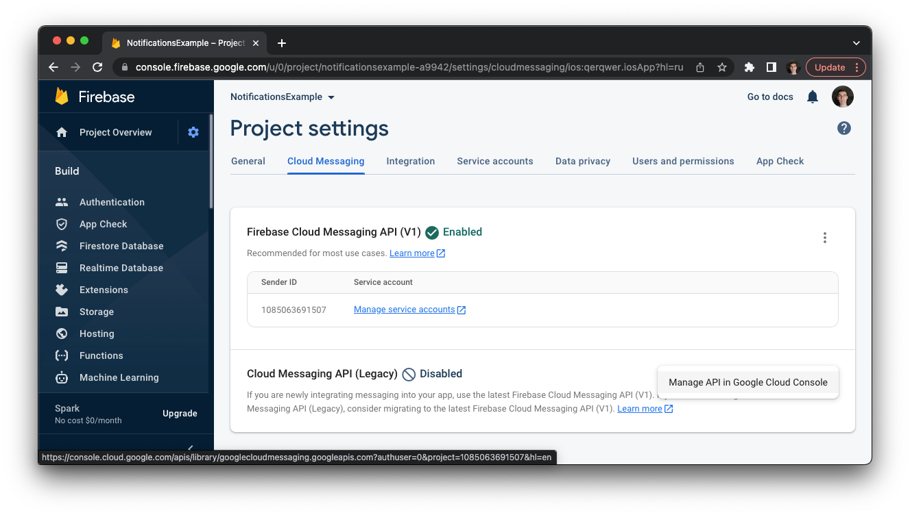
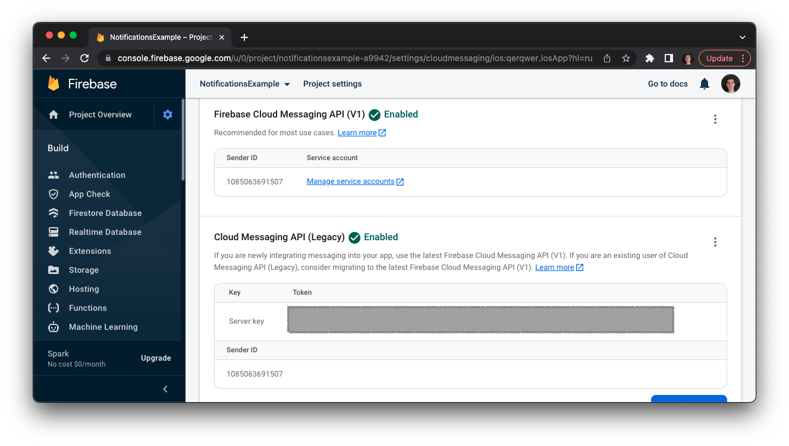
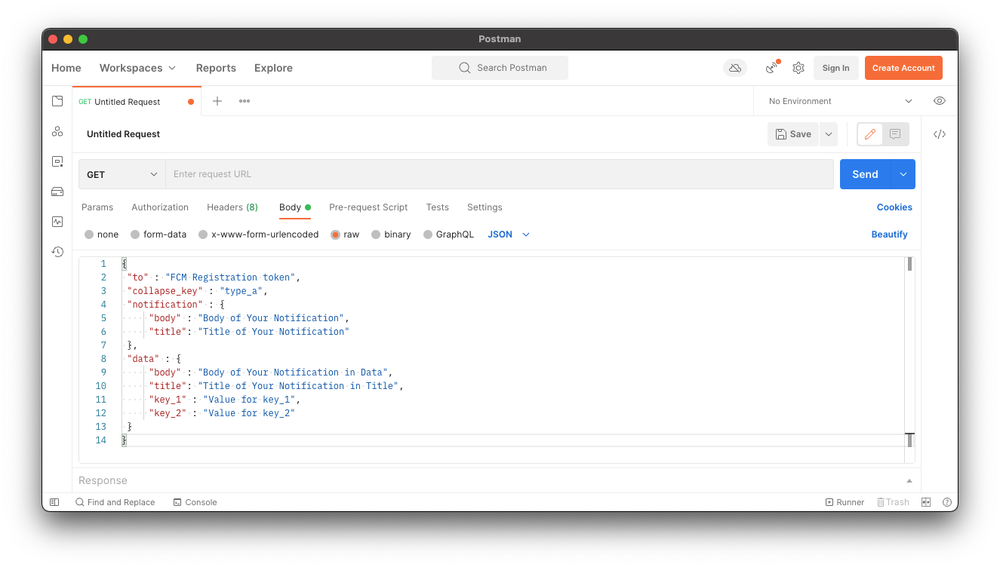

# Тестирование

## Firebase Console
Тестировать отправку запросов можно используя [Firebase Console](https://console.firebase.google.com/u/0/?hl=ru)




Однако пуши, отправленные через Firebase Console, по неизвестной причине не всегда доходят, поэтому тестировать пуши лучше не через консоль, а отправляя POST-запросы. Сделать это можно, например, через Postman.

## Cloud Messaging API (Legacy)
Чтобы посылать запросы на `https://fcm.googleapis.com` нам необходимо как-то авторизоваться. Это можно сделать при помощи токена, который можно получить подключив `Cloud Messaging API (Legacy)`



Теперь, у нас есть токен, который мы можем использовать для авторизации в запросах:


## Postman
[Postman](https://www.postman.com/downloads/) - это приложение, позволяющие посылать различные запросы. C его помощью мы будем тестировать отправку пушей. 

Создадим новый запрос типа `POST` и `URL = https://fcm.googleapis.com/fcm/send`


Далее, добавим `JSON body` запроса:
```json
{
 "to" : "FCM Registration token",
 "collapse_key" : "type_a",
 "notification" : {
     "body" : "Body of Your Notification",
     "title": "Title of Your Notification"
 },
 "data" : {
     "body" : "Body of Your Notification in Data",
     "title": "Title of Your Notification in Title",
     "key_1" : "Value for key_1",
     "key_2" : "Value for key_2"
 }
}
```
Не забудте заменить `FCM Registration token` на реальный токен устройстова.



Теперь добавим `header` авторизации со значением `Server key` из `Cloud Messaging API (Legacy)`


Результат запроса:

