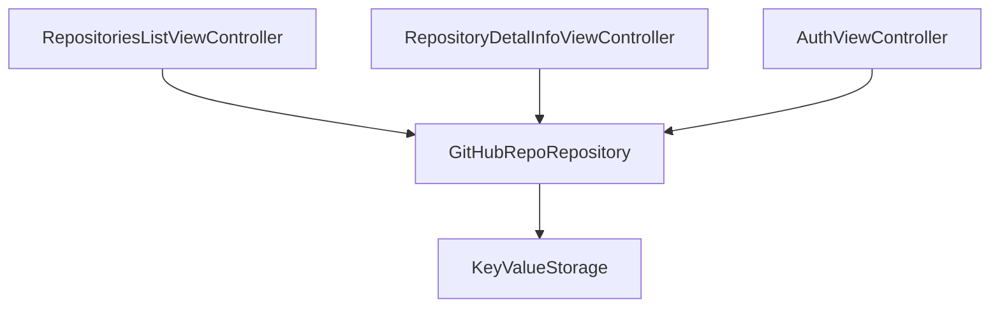

# Практическое задание

Нужно разработать iOS приложение для просмотра GitHub репозиториев.

<iframe width="360" height="800" src="//www.figma.com/embed?embed_host=share&url=https%3A%2F%2Fwww.figma.com%2Fproto%2FMh3ga5XAzyJNCY87NBp01G%2FGit_test%3Fnode-id%3D4%253A600%26scaling%3Dmin-zoom%26page-id%3D0%253A1%26starting-point-node-id%3D4%253A645" allowfullscreen></iframe>

Во время работы над практическим заданием настоятельно рекомендуем обращаться к
разделу [Памятки для разработчика](/university/memos/function)

Функциональные возможности:

1. Авторизация пользователя (username + personal access token)
1. Просмотр списка репозиториев пользователя (первые 10)
1. Просмотр детальной информации выбранного репозитория
    1. описание
    1. статистика (forks, stars, watchers)
    1. ссылка на web страницу репозитория
    1. лицензия

Технические требования:

1. Реализация на Swift
1. Использовать Interface Builder
1. Использовать Alamofire для работы с REST API
1. Использовать UITableView для отображения списка
1. Использовать Constraints для экрана детальной информации
1. Использовать переходы между ViewController'ами через push, а не через seque
1. Использовать Codable для парсинга json
1. Корректно обрабатывать ситуации "загрузка данных", "ошибка загрузки", "пустой список"
1. Корректно обрабатывать смену ориентации экрана

Граф зависимостей компонентов приложения друг от друга:

Материалы:
1. [GitHub REST API](https://docs.github.com/en/rest)
1. [GitHub Basic Authorization](https://docs.github.com/en/rest/overview/other-authentication-methods#basic-authentication)
1. [GitHub user repositories](https://docs.github.com/en/rest/reference/repos#list-repositories-for-a-user)
1. [Интеграция Alamofire](https://github.com/Alamofire/Alamofire)
1. [Дизайн](https://www.figma.com/file/XmpoCqkdWTGb2NGdR2bgiQ/Git_test-iOS)
