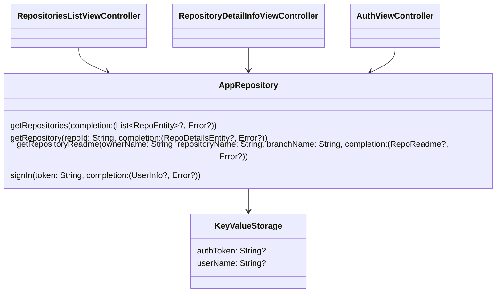

# Практическое задание

Нужно разработать iOS приложение для просмотра GitHub репозиториев.

Во время работы над практическим заданием настоятельно рекомендуем обращаться к
разделу [Памятки для разработчика](/university/memos/function)

## Кликабельный прототип

<iframe width="376" height="870" src="//www.figma.com/embed?embed_host=share&url=https%3A%2F%2Fwww.figma.com%2Fproto%2FXmpoCqkdWTGb2NGdR2bgiQ%2FGit_test-iOS%3Fnode-id%3D1%253A744%26scaling%3Dmin-zoom%26page-id%3D0%253A1%26starting-point-node-id%3D1%253A729" allowfullscreen></iframe>

## Функциональные требования

1. Авторизация пользователя (personal access token)
1. Просмотр списка репозиториев пользователя (первые 10)
1. Просмотр детальной информации выбранного репозитория
    1. описание
    1. статистика (forks, stars, watchers)
    1. ссылка на web страницу репозитория
    1. лицензия

## Технические требования

1. Реализация на Swift
1. Использовать Interface Builder
1. Использовать Alamofire для работы с REST API
1. Использовать UITableView для отображения списка
1. Использовать Constraints для экрана детальной информации
1. Использовать переходы между ViewController'ами через push, а не через seque
1. Использовать Codable для парсинга json
1. Сохранять токен авторизации в хранилище устройства - NSUserDefaults
1. Корректно обрабатывать ситуации "загрузка данных", "ошибка загрузки", "пустой список"
1. Корректно обрабатывать смену ориентации экрана

## Диаграмма классов

В отличии от android в iOS у нас нет сильной необходимости применять MVVM и реактивные хранилища состояния. 
iOS приложение не пересоздает экраны и позволяет передавать между экранами объекты, поэтому предлагаем не усложнять 
решение. 

Сделаем 3 экрана. С авторизации на список репозиториев переход делаем после успешного выполнения запроса 
авторизации (обращением к репозиторию), а с списка репозиториев на детальный вид репозитория переходить будем передавая 
сущность репозитория.

Все 3 экрана будут напрямую работать с репозиторием и обновлять свое внутренее состояние при получении ответов от 
репозитория.

## Материалы

1. [GitHub REST API](https://docs.github.com/en/rest)
1. [GitHub Basic Authorization](https://docs.github.com/en/rest/overview/other-authentication-methods#basic-authentication)
1. [GitHub user repositories](https://docs.github.com/en/rest/reference/repos#list-repositories-for-a-user)
1. [Интеграция Alamofire](https://github.com/Alamofire/Alamofire)
1. [Дизайн](https://www.figma.com/file/XmpoCqkdWTGb2NGdR2bgiQ)
