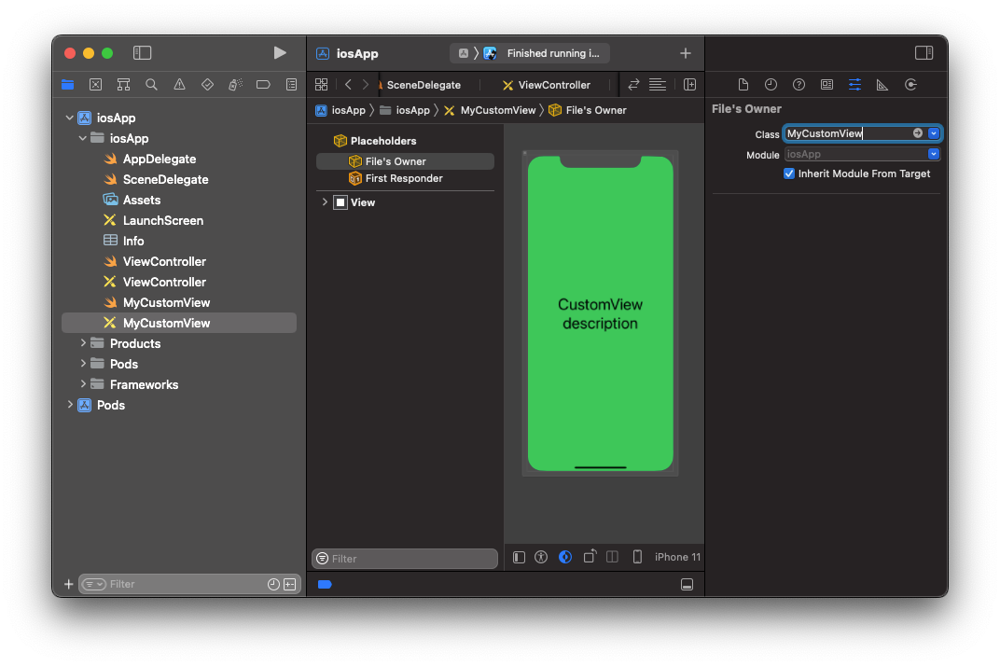
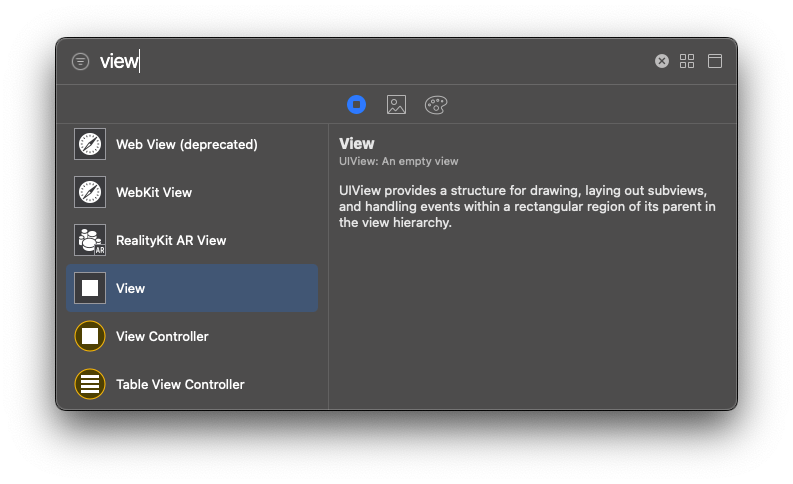
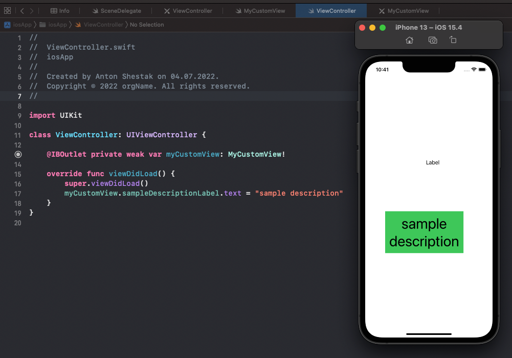

# UI и навигация
## UI и навигация
Создавать UI и навигацию на iOS можно по-разному: можно использовать `.storyboard`, `.xib` или вообще описать все в коде.  
В реальных проектах мы крайне редко будем использовать `Storyboard` и `Seque`, значительно чаще для верстки используется `.xib` а навигация происходит через код. Поэтому с ней нужно попрактиковаться.  

Для начала, советуем вам ознакомиться со всеми подходами для навигации и верстки:
- обратите внимание на памятки: [Как удалить Storyboard](../memos/remove-storyboard) и [Как прейти от SwiftUI к UIKit](../memos/swiftui-to-uikit), они могут пригодиться вам в будущем.
- [статья-сравнение](https://putkovdimi.medium.com/%D0%BF%D0%BE%D0%B4%D1%85%D0%BE%D0%B4%D1%8B-%D0%BA-%D1%80%D0%B5%D0%B0%D0%BB%D0%B8%D0%B7%D0%B0%D1%86%D0%B8%D0%B8-ui-%D0%B2-swift-22de5f1662f4) `.xib`, `.storyboard` и code для UI
- [статья](https://habr.com/ru/company/mobileup/blog/456086/) о плюсах и минусах `.storyboard`
- [видео](https://www.youtube.com/watch?v=lRfCAYaGldg) о том, как добавить `NavigationController` программно
- [статья](https://medium.com/@felicity.johnson.mail/pushing-popping-dismissing-viewcontrollers-a30e98731df5) про навигацию внутри `NavigationController`
- второй пункт [статьи](https://levelup.gitconnected.com/uinavigation-controller-and-uinavigationbar-in-swift-ff3532fd58b6) про настройку `NavigationBar`
- [статья](https://imjhk03.github.io/posts/create-viewcontroller-from-xib/) про то, как создавать `.xib` и `ViewController` и связывать их друг с другом
- Чтобы сразу создать связанные `.xib` и `.swift` файлы, нужно выбрать типом создаваемого файла ***Cocoa Touch Class*** и в следующем меню выбрать пункт ***Also create xib file*** и указать родителя нашего нового контроллера

## CustomView
`CustomView` - отдельная вьюха для использования на нескольких экранах.  
Например, в случае отсутствия интернет-соединения в приложении нужно показать какую-нибудь картинку, надпись - "Нет интернета" и кнопку - "Refresh". Поскольку интернет может пропасть на любом экране приложения - нам нужно добавить все эти вьюхи (картинку, поле и кнопку) на каждый экран - такое откровенное дублирование захламляет код и сильно усложняет его поддержку.  
Вместо этого мы можем сверстать отдельную `ErrorView` и подключить ее на все экраны, где она нужна. 

### Instructions
Создайте новую `View` и добавьте на неё какую-нибудь вьюху, например - `UILabel`.


Создайте новый `Swift File` со следующим содержанием:
```swift
class MyCustomView: UIView {
    
    @IBOutlet weak var sampleDescriptionLabel: UILabel!
    
    override init(frame: CGRect) {
        super.init(frame: frame)
        commonInit()
    }
    
    required init?(coder aDecoder: NSCoder) {
        super.init(coder: aDecoder)
        commonInit()
    }
    
    func commonInit() {
        let viewFromXib = Bundle.main.loadNibNamed(String(describing: type(of: self)), owner: self, options: nil)!.first as! UIView
        viewFromXib.frame = self.bounds
        addSubview(viewFromXib)
    }
}
```
Укажите `Class` для `File's Owner` вьюхе, которую вы только что создали


Теперь добавьте новую `View` на `ViewController` и укажите ей класс - `MyCustomView`


Кастомная вьюха готова, мы можем обращаться ко всем ее публичным аутлетам и настраивать как нам нужно 


## Особенности UITableViewController
На практике `UITableViewController` не используется, потому что таблица лежит в корне и это не позволяет добавлять другие вью на экран. Чтобы убедиться в этом, создайте контроллер-наследник `UITableViewController` и попробуйте добавить несколько вьюшек 

Подход для решения задачи, когда на экране должна быть таблица и другие элементы:
- создать обычный `UIViewController`
- создать `UITableView` и задать ей в коде `datasource`
- создать остальные, необходимые на экране элементы

## Практическое задание

Создайте проект, где будет 2 экрана, объединенные `UINavigationController`.  
Стартовый экран будет просто с кнопкой по центру, при нажатии будем переходить на второй. На втором - таблица.
Попрактикуйтесь в разных способах создания экранов:
- стартовый создайте используя одинаковые имена для `.xib` и `.swift` файлов 
- второй экран создайте используя разные имена для `.xib` и `.swift` файлов, свяжите их вручную
