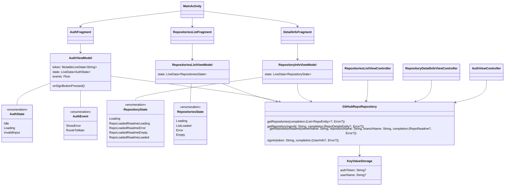

# Практическое задание

Нужно объединить ранее сделанные Android и iOS приложения в единый репозиторий, добавить модуль общего кода и перенести из Android и iOS логику работы с сетью и хранением токена в общий код

Во время работы над практическим заданием настоятельно рекомендуем обращаться к разделу [Памятки для разработчика](/university/memos/function)

Функциональные возможности остаются те же самые
1. Авторизация пользователя (personal access token)
1. Просмотр списка репозиториев пользователя (первые 10)
1. Просмотр детальной информации выбранного репозитория
    1. описание
    1. статистика (forks, stars, watchers)
    1. ссылка на web страницу репозитория
    1. лицензия

Технические требования:
1. Использовать multiplatform-settings для работы с хранилищем устройства
1. Логика хранения данных должна находиться в common коде
1. Логика работы с сетью должна находиться в common коде
1. Для работы с сетью использовать Ktor Client
1. При перезапуске приложения авторизация должна сохраняться

## Структуры приложения 

```kotlin
   
   // Классы common кода 
   
   class GitHubRepoRepository {
      fun getRepositories(completion: (List<RepoEntity?>, Error?) -> Unit) {
         // TODO:
      }
      
      fun getRepository(repoId: String, completion: (RepoDetailsEntity?, Error?) -> Unit) {
         // TODO:
      }
      
      fun getRepositoryReadme(ownerName: String, repositoryName: String, branchName: String, completion: (RepoReadme?, Error?) -> Unit) {
         // TODO:
      }
      
      fun signIn(token: String, completion: (UserInfo?, Error?) -> Unit) {
         // TODO:
      }
   }
   
   class KeyValueStorage {
      var authToken: String?
      var userName: String?
   }
   
   // Классы Android-приложения


   class MainActivity: AppCompatActivity() {
      // TODO:
   }

   class AuthFragment: Fragment(R.id.auth_framgent) {
      // TODO:
   }

   class RepositoriesListFragment: Fragment(R.id.repo_list_framgent) {
      // TODO:
   }

   class DetailInfoFragment: Fragment(R.id.repo_info_framgent) {
      // TODO:
   }

   class AuthViewModel {
      val token: MutableLiveData<String>
      val state: LiveData<AuthState>
      val events: Flow<AuthEvent>
      fun onSignButtonPressed() {
         // TODO:
      }

      sealed class AuthState {
         object Idle: AuthState()
         object Loading: AuthState()
         object InvalidInput: AuthState()
      }

      sealed class AuthEvent {
         object ShowError: AuthEvent()
         object RouteToMain: AuthEvent()
      }

      // TODO:
   }

   class RepositoryInfoViewModel {
      val state: LiveData<RepositoryState>

      sealed class RepositoryState {
         object Loading: RepositoryState()
         object RepoLoadedReadmeLoading: RepositoryState()
         object RepoLoadedReadmeError: RepositoryState()
         object RepoLoadedReadmeEmpty: RepositoryState()
         object RepoLoadedReadmeLoaded: RepositoryState()
      }

      // TODO:
   }

   class RepositoriesListViewModel {
      val state: LiveData<RepositoriesState>

      sealed class RepositoriesState {
         object Loading: PincodeCreationState()
         object ListLoaded: PincodeCreationState()
         object Error: PincodeCreationState()
         object Empty: PincodeCreationState()
      }

      // TODO:
   }

   // классы iOS-приложения 

   class RepositoriesListViewController: UIViewController {
      // TODO:
   }

   class RepositoryDetailInfoViewController: UIViewController {
      // TODO:
   }

   class AuthViewController: UIViewController {
      // TODO:
   }

```


## Граф зависимостей KMM приложения:

На графе отображена зависимость компонентов KMM приложения друг от друга, цветами выделены подграфы:  
Фиолетовый - Common, Зеленый - Android, Синий - iOS



Материалы:
1. [GitHub REST API](https://docs.github.com/en/rest)
1. [GitHub Basic Authorization](https://docs.github.com/en/rest/overview/other-authentication-methods#basic-authentication)
1. [GitHub user repositories](https://docs.github.com/en/rest/reference/repos#list-repositories-for-a-user)
1. [Kotlinx.Serialization guide](https://github.com/Kotlin/kotlinx.serialization/blob/master/docs/basic-serialization.md#json-decoding)
1. [Подключение Ktor Client](https://ktor.io/docs/gradle.html)
1. [Настройке запросов в Ktor Client](https://ktor.io/docs/request.html)
1. [multiplatform-settings](https://github.com/russhwolf/multiplatform-settings)
1. [Android Дизайн](https://www.figma.com/file/Mh3ga5XAzyJNCY87NBp01G/Git_test)
1. [iOS Дизайн](https://www.figma.com/file/XmpoCqkdWTGb2NGdR2bgiQ/Git_test-iOS)