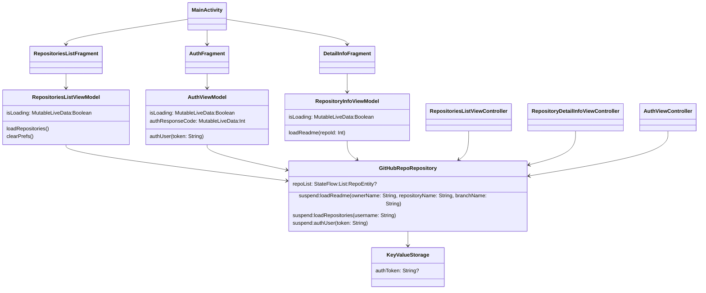

# Практическое задание

Нужно разработать мульитплатформенное приложение для просмотра GitHub репозиториев.

<iframe width="360" height="800" src="//www.figma.com/embed?embed_host=share&url=https%3A%2F%2Fwww.figma.com%2Fproto%2FMh3ga5XAzyJNCY87NBp01G%2FGit_test%3Fnode-id%3D4%253A600%26scaling%3Dmin-zoom%26page-id%3D0%253A1%26starting-point-node-id%3D4%253A645" allowfullscreen></iframe>

Во время работы над практическим заданием настоятельно рекомендуем обращаться к разделу [Памятки для разработчика](/university/memos/function)

Функциональные возможности:
1. Авторизация пользователя (personal access token)
1. Просмотр списка репозиториев пользователя (первые 10)
1. Просмотр детальной информации выбранного репозитория
    1. описание
    1. статистика (forks, stars, watchers)
    1. ссылка на web страницу репозитория
    1. лицензия

Технические требования:
1. Сохранять токен авторизации в хранилище устройства: SharedPreferences для Android и NSUserDefaults для iOS. Работу с хранилищем делегировать классу KeyValueStorage
1. Использовать multiplatform-settings для работы с хранилищем устройства
1. Логика хранения данных должна находиться в common коде
1. Логика работы с сетью должна находиться в common коде
1. Для работы с сетью использовать Ktor Client

## Граф зависимостей KMM приложения:

На графе отображена зависимость компонентов KMM приложения друг от друга, цветами выделены подграфы:  
Фиолетовый - Common, Зеленый - Android, Синий - iOS

Материалы:
1. [GitHub REST API](https://docs.github.com/en/rest)
1. [GitHub Basic Authorization](https://docs.github.com/en/rest/overview/other-authentication-methods#basic-authentication)
1. [GitHub user repositories](https://docs.github.com/en/rest/reference/repos#list-repositories-for-a-user)
1. [Kotlinx.Serialization guide](https://github.com/Kotlin/kotlinx.serialization/blob/master/docs/basic-serialization.md#json-decoding)
1. [Подключение Ktor Client](https://ktor.io/docs/gradle.html)
1. [Настройке запросов в Ktor Client](https://ktor.io/docs/request.html)
1. [multiplatform-settings](https://github.com/russhwolf/multiplatform-settings)
1. [Android Дизайн](https://www.figma.com/file/Mh3ga5XAzyJNCY87NBp01G/Git_test)
1. [iOS Дизайн](https://www.figma.com/file/XmpoCqkdWTGb2NGdR2bgiQ/Git_test-iOS)