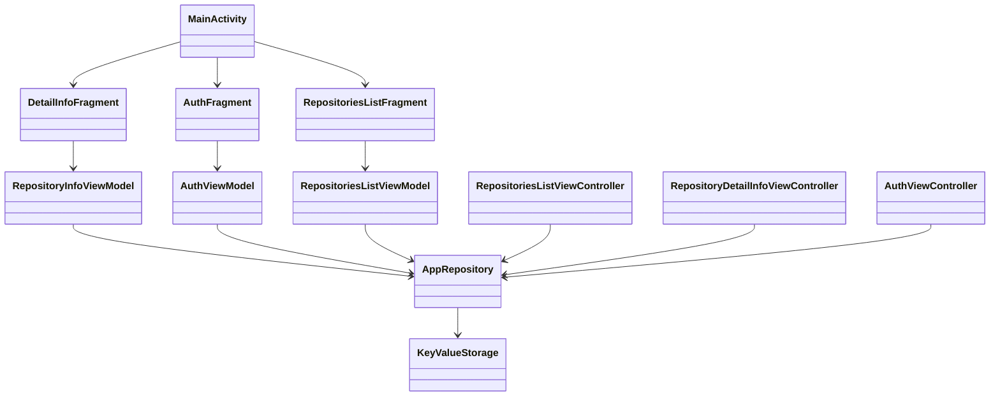

# Практическое задание

Нужно объединить ранее сделанные Android и iOS приложения в единый репозиторий, добавить модуль общего кода и перенести из Android и iOS логику работы с сетью и хранением токена в общий код

Во время работы над практическим заданием настоятельно рекомендуем обращаться к разделу [Памятки для разработчика](../memos/function)

## Функциональные возможности

Остаются те же самые:

1. Авторизация пользователя (personal access token)
1. Просмотр списка репозиториев пользователя (первые 10)
1. Просмотр детальной информации выбранного репозитория
    1. описание
    1. статистика (forks, stars, watchers)
    1. ссылка на web страницу репозитория
    1. лицензия

## Технические требования

1. Использовать multiplatform-settings для работы с хранилищем устройства
1. Логика хранения данных должна находиться в common коде
1. Логика работы с сетью должна находиться в common коде
1. Для работы с сетью использовать Ktor Client
1. При перезапуске приложения авторизация должна сохраняться
1. Использовать локализацию для всех строк, показываемых пользователю
1. Использовать векторную графику везде, где это возможно
1. Обеспечить поддержку Android API 21
1. Обеспечить поддержку iOS 13.0

## Классы приложения 

Чтобы использовать `suspend` функции в общем коде, необходимо добавить аннотацию `@Throws`. Благодаря этой аннотации, компилятор Kotlin/Native сгенерирует функцию с `completion` для iOS

common code:
```kotlin
class AppRepository {
   
   @Throws(Exception::class)
   suspend fun getRepositories(): List<Repo> {
      // TODO:
   }

   @Throws(Exception::class)
   suspend fun getRepository(repoId: String): RepoDetails {
      // TODO:
   }

   @Throws(Exception::class)
   suspend fun getRepositoryReadme(
      ownerName: String,
      repositoryName: String,
      branchName: String
   ): String {
      // TODO:
   }

   @Throws(Exception::class)
   suspend fun signIn(token: String): UserInfo {
      // TODO:
   }

   // TODO:
}

class KeyValueStorage {
   var authToken: String?
   var userName: String?
}
```

android app:
```kotlin
class MainActivity: AppCompatActivity {
   // TODO:
}

class AuthFragment: Fragment {
   // TODO:
}

class RepositoriesListFragment: Fragment {
   // TODO:
}

class DetailInfoFragment: Fragment {
   // TODO:
}

class AuthViewModel {
   val token: MutableLiveData<String>
   val state: LiveData<State>
   val actions: Flow<Action>

   fun onSignButtonPressed() {
         // TODO:
   }
   
   sealed interface State {
      object Idle : State
      object Loading : State
      data class InvalidInput(val reason: String) : State
   }
   
   sealed interface Action {
      data class ShowError(val message: String) : Action
      object RouteToMain : Action
   }

   // TODO:
}

class RepositoryInfoViewModel {
   val state: LiveData<State>

   sealed interface State {
      object Loading : State
      data class Error(val error: String) : State

      data class Loaded(
         val githubRepo: Repo,
         val readmeState: ReadmeState
      ) : State
   }

   sealed interface ReadmeState {
      object Loading : ReadmeState
      object Empty : ReadmeState
      data class Error(val error: String) : ReadmeState
      data class Loaded(val markdown: String) : ReadmeState
   }

   // TODO:
}

class RepositoriesListViewModel {
   val state: LiveData<State>
   
   sealed interface State {
      object Loading : State
      data class Loaded(val repos: List<Repo>) : State
      data class Error(val error: String) : State
      object Empty : State
   }

   // TODO:
}
```

ios app:
```swift
class RepositoriesListViewController: UIViewController {
   // TODO:
}

class RepositoryDetailInfoViewController: UIViewController {
   // TODO:
}

class AuthViewController: UIViewController {
   // TODO:
}
```


## Диаграмма классов

На графе отображена зависимость компонентов KMM приложения друг от друга, цветами выделены подграфы:  
Фиолетовый - Common, Зеленый - Android, Синий - iOS



Материалы:
1. [GitHub REST API](https://docs.github.com/en/rest)
1. [GitHub Basic Authorization](https://docs.github.com/en/rest/overview/other-authentication-methods#basic-authentication)
1. [GitHub user repositories](https://docs.github.com/en/rest/reference/repos#list-repositories-for-a-user)
1. [Kotlinx.Serialization guide](https://github.com/Kotlin/kotlinx.serialization/blob/master/docs/basic-serialization.md#json-decoding)
1. [Подключение Ktor Client](https://ktor.io/docs/gradle.html)
1. [Настройке запросов в Ktor Client](https://ktor.io/docs/request.html)
1. [multiplatform-settings](https://github.com/russhwolf/multiplatform-settings)
1. [Android Дизайн](https://www.figma.com/file/Mh3ga5XAzyJNCY87NBp01G/Git_test)
1. [iOS Дизайн](https://www.figma.com/file/XmpoCqkdWTGb2NGdR2bgiQ/Git_test-iOS)