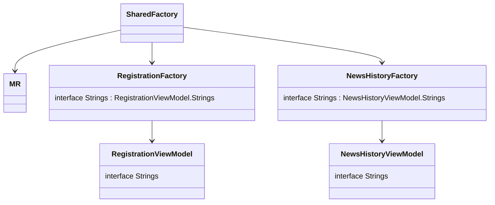

# Внедрение зависимостей и ресурсов

## Dependency inversion - инверсия зависимостей 
### Введение
Как мы уже разобрали в блоке [многомодульность](multimodularity), нам нужно разбить проект на модули и обеспечить их минимальную связанность, чтобы скорость сборки не уменьшалась с ростом проекта (особенно на `iOS`)  
Так как модули не знают друг про друга, но приложение целостное и оно должно использовать: 
- один общий источник данных
- одинаковые строчки локализации
- одинаковые картинки 
- и т.д.

Поэтому, нам нужно обеспечить передачу некоторых общих компонентов и классов во все модули. Использовать один общий модуль для таких компонентов мы не можем, это также описывалось в блоке [многомодульность](multimodularity).  
В этом случае нам подойдет вариант с обратной зависимостью:
- модули не зависят от каких-то компонент
- необходимые модулю компоненты будут предоставляться извне
- модули не знают, кто именно передаст им компоненты и как они будут реализованы

Это называется [Dependency inversion](https://habr.com/ru/post/313796/) - инверсия зависимостей.

### Пример
Допустим, мы делаем фичу авторизации.  
Для авторизации нам нужно: отправить запрос на сервер с номером телефона и кодом авторизации.  
За логику работы с сетью у нас отвечает общий для всех модулей репозиторий. Поэтому, в фиче авторизации объявляем интерфейс с функцией `signIn`:

```kotlin
interface AuthRepository {
   suspend fun signIn(
      phoneNumber: Int,
      authCode: Long
   ): Int
}
```
А в конструкторе `AuthViewModel` объявляем поле, типа этого интерфейса:
```kotlin
class AuthViewModel(
   //...
   repository: AuthRepository,
   //...
) 
```
Таким образом вьюмодель как бы объявляет: мне для работы нужен кто-то, кто реализует интерфейс `AuthRepository`, потому что у него есть нужный мне метод `signIn`. Мне абсолютно не важно, кто и как будет его реализовывать.  
В классе общего репозитория реализуем интерфейс `AuthRepository` и, при создании фичи будем передавать объект общего репозитория.

## DI на проектах

### Теория

Для создания конкретной вьюмодели нам нужно будет предоставить ей кучу разных зависимостей, большую часть этих зависимостей можно настроить внутри модуля

Для этого мы делаем фабрики вьюмоделей для каждого модуля.
Внутри фабрики будет метод - создай мне вьюмодель такую-то (т.к. в фиче может быть несколько экранов и несколько вьюмоделей)
И там же будет настройка и проброс всего, что нужно этим вьюмоделям. Т.е нам не придется по месту использования вьюмодели(экранчик) пробрасывать все ее аргументы, просто скажем фабрике - создай мне вьюмодель

Цель в том, чтобы получить вьюмодель можно было следующим образом: `SharedFactory.authFactory.createAuthViewModel()`


На уровне фичи, для удобства использования этой фичи должны обозначит некую фабрику объектов этой фичи
Есть `authFactory`, ей передаем настройки самой фичи:

Потом от объекта этой фабрики мы уже говорим: создай мне вьюмодель такую, сякую и тд. Смысл в том, чтобы для создания вьюмодели не приходилось постоянно производить получение репозитория, строк локализации и тд, потому что мы один раз запарились с этим и все засунули в фабрику. 

Далее, уровень mppLibrary - уровень, который объединяет все фичи.
Наша цель в проектировании mppLibrary - сделать аналогию работы с фабрикой. Чтобы работать с mppLibrary было также просто, как и работать с одной фичей. Чтобы не надо было искать каждую из фич и настраивать на уровне приложения, чтобы можно было просто сказать: общая логика, дайка мне вьюмодель.  
***Как это достигается?***  
Мы на уровне mppLibrary создаем свою фабрику, которая производит настройку фабрик всех остальных фичей теми параметрами, которые доступны на уровне общего кода. Занимается этим - `SharedFactory`.  
Таким образм, наружу, на платформу, предоставляется еще более простой вариант: ***Чтобы создать фабрику общей логики, из которой потом что хочешь можно получить, надо передать вон только требования `SharedFactory`, то, что она хочет узнать непосредственно от платформы***
*** 
***

### Пример

Пока не обращайте внимание на `eventsDispatcher` и `exceptionHandler` - о них вы узнаете после изучения `moko-mvvm` и `moko-errors`. Смысл в том, что они общие для всех фичей и вьюмоделей, поэтому мы их вынесли в фабрику.

`AuthViewModel.kt`
```kotlin
class AuthViewModel(
   override val eventsDispatcher: EventsDispatcher<EventsListener>,
   val exceptionHandler: ExceptionHandler,
   private val repository: AuthRepository,
   private val strings: Strings
) {
   interface Strings {
      val authDescription: StringDesc
   }
}
```
Во вьюмодели объявляем интерфейс строк, которые нам понадобятся. Ни один модуль на них не завязан, поэтому можно спокойно их обновлять и изменять. В каждую фичу строчки будут прокидываться непосредственно в `runtime`. 

Рядом с `viewModel` создаем интерфейс репозитория: 
`AuthRepository.kt`
```kotlin
interface AuthRepository {
   suspend fun signIn(
      phoneNumber: Int,
      authCode: Long
   ): Int
}
```

Теперь создадим фабрику фичи:
```kotlin
class AuthFactory(
   private val createExceptionHandler: () -> ExceptionHandler,
   private val repository: AuthRepository,
   private val strings: Strings
) {

   fun createAuthRepository(
      eventsDispatcher: EventsDispatcher<AuthViewModel.EventsListener>
   ) = AuthViewModel(
      eventsDispatcher = eventsDispatcher,
      exceptionHandler = createExceptionHandler(),
      repository = repository,
      strings = strings,
      id = id
   )

   interface Strings : AuthViewModel.Strings
}
```

Для всех фич общими будут: `createExceptionHandler`, `repository`, `strings`
Одна фабрика будет создавать все фичи для конкретного модуля

Теперь конструктор самой фабрики, здесь мы прокидываем `createExceptionHandler`, `repository` и строки локализации
```kotlin
internal fun authFactory(
   private val createExceptionHandler: () -> ExceptionHandler,
   private val repository: AuthRepository,
   private val strings: Strings
): AuthFactory {
   return AuthFactory(
      repository = repository,
      strings = object : AuthFactory.Strings {
         override val authDescription: StringDesc =
            MR.strings.auth_description.desc()
      }
   )
}
```

В `SharedFactory` мы уже создаем все фабрики фичей, как видите, передавая им только `createExceptionHandler` и `repository`, потому что они также общие для всех фичей и создаются непосредственно в `SharedFactory`
`SharedFactory.kt`:
```kotlin
val authFactory: AuthFactory by lazy {
   AuthFactory(
      createExceptionHandler = ::createExceptionHandler,
      repository = Repository
   )
}
```

конструктор самой главной фабрики `SharedFactory.kt`: 
```kotlin
class SharedFactory internal constructor(
    settings: Settings,
    antilogs: List<Antilog>,
    databaseDriverFactory: DatabaseDriverFactory,
    repositoryCoroutineScope: CoroutineScope
)
```
Передаем уже то, что устанавливается на на платформе.  
Таким образом, чтобы на платформе начать использовать общий код, нужно всего лишь передать вот эти четыре параметра для инициализации `SharedFactory`: 
- `settings`
- `antilogs`
- `databaseDriverFactory`
- `repositoryCoroutineScope`

И создать каждую фабрику фичи, для нее нужна будет реализация функции `createExceptionHandler`, о которой вы узнаете позже из `moko-errors`, а также создать объект `Repository`

***
***
***
***

Для создания конкретной вьюмодели нам нужно будет предоставить ей кучу зависимостей, но большую часть этих зависимостей можно настроить внутри модуля 

Также, для каждого модуля есть своя `factory`. Её задача - создавать уже настроенные объекты фичи

У каждого модуля есть своя фактори.  
Задача фактори - создавать объекты фичи сразу настроенные, чтобы в них уже были все необходимые зависимости. 
То же самое косается и фабрик, у них также есть свои требования наружу.

Главная фабрика в проекте и его стартовая точка - это `SharedFactory`, она объединяет все остальные фабрики фичей и свзяывает их друг с другом. Через `SharedFactory` можно получить все, что нужно из общего кода.   Модуль `mppLibrary` единственный, который знает обо всех фичах в приложении. Именно он соединяет каждую фичу межу собой.

Последние настройки, которые требуются общему коду - это настройки `SharedFactory`, которая настраивается уже на платформе 

Пример параметров, которые необходимы `SharedFactory`: 
- адрес сервера (чтобы платформы своими инструментами могли регулировать dev/stage/prod)
- multiplatform-settings
- оповещение, что разлогинились


конструктор ШФ - то, что нужно общей логике от внешнего мира, чтобы работать

через ШФ можно получить все из общего кода 

Про SharedFactory, про фактори фичей и тд

SF - обладает всеми фактори фичей, умеет их создавать предоставляя им зависимости
фактори фичей - умеют создавать все то, что им надо - вьюмодели и тд
ресурсы - тоже зависимость. Фича говорит- вот интерфейс, вот эти ресурсы мне нужны снаружи

Shared видит что нужны такие ресурсы, делает реализацию интерфейса и передает в фичу

1. Шаблоном создаем ViewModel
1. Если нужны какие-то мультиплатформенные строчки - делаем интерфейс Strings, там объявляем переменные строк, которые нам нужны
   ```kotlin
        interface Strings {
             val examplePlaceholder: StringDesc
             val examplePlaceholder2: StringDesc
        }
   ```
   И в конструкторе просим реализацию этого интерфейса, SharedFactory при создании нашей VM прокинет нам необходимые строчки
1. Рядом с классом VM создаем интерфейс с созвучным фиче названием: RegistrationRepository. Там мы описываем все методы для работы с данными, которые нужны нашей вьюмодели 
1. В едином классе Repository мы добавляем, что реализуем в том числе и этот интерфейс RegistrationRepository, реализуем все методы, которые хочет эта вьюмодель и передаем ей в качестве репозитория себя: таким образом, класс репозитория у нас один, в нем реализованы все методы для работы с данными, которые нужны вьюмоделям. Но каждая вьюмодель видит только те методы, которые описаны в ее интерфейсе репозитория 

Например: вьюмодели RegistrationViewModel для своей работы нужны методы:
- sendCode(phoneNumber: String) - чтобы сервер отправил код подтверждения на телефон юзеру
- confirmCode(code: String) - чтобы сервер проверил, правильный ли введен код подтверждения
- saveUser(password: String) - чтобы завершить регистрацию и сохранить юзера на сервере

Соответственно, будет создан интерфейс:
```kotlin
interface RegistrationRepository {
    suspend fun sendCode(
       phoneNumber: String
    ): Int

    suspend fun confirmCode(
       code: String
    )

   suspend fun saveUser(
       password: String
    ): User
}

```




## Библиотека moko-resources

[github](https://github.com/icerockdev/moko-resources)

отправить читать ридми

Описать что делают, как помогают на мульиплатформе

рассказать про master.sh, какие есть параметры, как найти гуглтаблицу по файлу

задание: подключить библиотеку к проекту, вынести общие ресурсы

## master.sh

Для локализации мы используем интеграцию с google sheets т.к. можно передать заказчику и он сможет сам задать строчки 