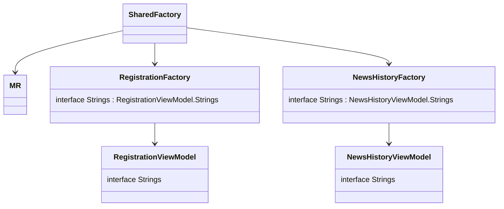

# Внедрение зависимостей и ресурсов

## Dependency inversion - инверсия зависисмостей 
### Введение
Как мы уже разобрали в блоке [многомодульность](multimodularity), нам нужно разбить проект на модули и обеспечить их минимальную связанность, чтобы скорость сборки не уменьшалась с ростом проекта (особенно на `iOS`)  
Так как модули не знают друг про друга, но приложение целостное и оно должно использовать: 
- один общий источник данных
- одинаковые строчки локализации
- одинаковые картинки 
- и т.д.

Поэтому, нам нужно обеспечить передачу некоторых общих компонентов и классов во все модули. Использовать один общий модуль для таких компонентов мы не можем, это также описывалось в блоке [многомодульность](multimodularity).  
В этом случае нам подойдет вариант с обратной зависимостью:
- модули не зависят от каких-то компонент
- необходимые модулю компоненты будут предоставляься извне
- модули не знают, кто именно передаст им компоненты и как они будут реализованы

Это называется [Dependency inversion](https://habr.com/ru/post/313796/) - инверсия зависимостей.

### Пример
Допустим, мы делаем фичу авторизации.  
Для авторизации нам нужно: отправить запрос на сервер с номером телефона и кодом авторизации.  
За логику работы с сетью у нас отвечает общий репозиторий. Поэтому, в фиче авторизации объявляем интерфейс с функцией `signIn`:

```kotlin
interface AuthRepository {
   suspend fun signIn(
      phoneNumber: Int,
      authCode: Long,
   ): Int
}
```
А в конструкторе `AuthViewModel` объявляем поле, типа этого интерфеса:
```kotlin
class AuthViewModel(
   //...
   repository: AuthRepository,
   //...
) 
```
Таким образом вьюмодель как бы объявляет: мне для работы нужен кто-то, кто реализует интерфейс `AuthRepository`, потому что у него есть нужный мне метод `signIn`. Мне абсолютно не важно, кто и как будет его реализовывать.  
В классе общего репозитория реализуем интерфейс `AuthRepository` и, при создании фичи будем передавать объект общего репозитория.

***

## Заголовок переобозвать !!!!!!!!!!!!!!!!!!!

Цель - не настраивать фичи сразу при создании, потому что тогда будет огромный констркутор

Для этого - стараться максимально все прятать: 

Есть фича Авторизации

упростим пока задачу, нам нужны будут только строчки и репозиторий для работы с сервером
`AuthViewModel.kt`
```kotlin
class ManualRegistrationViewModel(
   private val repository: MerchantRegistrationRepository,
   private val strings: Strings
){
   interface Strings {
      val authDescription: StringDesc
   }
}
```
Во вьюмодели объявляем интерфейс строк, которые нам понадобятся 

Рядом с `viewModel` создаем интерфейс репозитория: 
`AuthRepository.kt`
```kotlin
interface AuthRepository {
   suspend fun signIn(
      phoneNumber: Int,
      authCode: Long,
   ): Int
}
```


Для создания конкретной вьюмодели нам нужно будет предоставить ей кучу зависимостей, но большую часть этих зависимостей можно настроить внутри модуля 


Также, для каждого модуля есть своя `factory`. Её задача - создавать уже настроенные объекты фичи

У каждого модуля есть своя фактори.  
Задача фактори - создавать объекты фичи сразу настроенные, чтобы в них уже были все необходимые зависимости. 
То же самое косается и фабрик, у них также есть свои требования наружу.

Главная фабрика в проекте и его стартовая точка - это `SharedFactory`, она объединяет все остальные фабрики фичей и свзяывает их друг с другом. Через `SharedFactory` можно получить все, что нужно из общего кода.   Модуль `mppLibrary` единственный, который знает обо всех фичах в приложении. Именно он соединяет каждую фичу межу собой.

Последние настройки, которые требуются общему коду - это настройки `SharedFactory`, которая настраивается уже на платформе 

Пример параметров, которые необходимы `SharedFactory`: 
- адрес сервера (чтобы платформы своими инструментами могли регулировать dev/stage/prod)
- multiplatform-settings
- оповещение, что разлогинились


конструктор ШФ - то, что нужно общей логике от внешнего мира, чтобы работать

через ШФ можно получить все из общего кода 

Про SharedFactory, про фактори фичей и тд

SF - обладает всеми фактори фичей, умеет их создавать предоставляя им зависимости
фактори фичей - умеют создавать все то, что им надо - вьюмодели и тд
ресурсы - тоже зависимость. Фича говорит- вот интерфейс, вот эти ресурсы мне нужны снаружи

Shared видит что нужны такие ресурсы, делает реализацию интерфейса и передает в фичу

1. Шаблоном создаем ViewModel
1. Если нужны какие-то мультиплатформенные строчки - делаем интерфейс Strings, там объявляем переменные строк, которые нам нужны
   ```kotlin
        interface Strings {
             val examplePlaceholder: StringDesc
             val examplePlaceholder2: StringDesc
        }
   ```
   И в конструкторе просим реализацию этого интерфейса, SharedFactory при создании нашей VM прокинет нам необходимые строчки
1. Рядом с классом VM создаем интерфейс с созвучным фиче названием: RegistrationRepository. Там мы описываем все методы для работы с данными, которые нужны нашей вьюмодели 
1. В едином классе Repository мы добавляем, что реализуем в том числе и этот интерфейс RegistrationRepository, реализуем все методы, которые хочет эта вьюмодель и передаем ей в качестве репозитория себя: таким образом, класс репозитория у нас один, в нем реализованы все методы для работы с данными, которые нужны вьюмоделям. Но каждая вьюмодель видит только те методы, которые описаны в ее интерфейсе репозитория 

Например: вьюмодели RegistrationViewModel для своей работы нужны методы:
- sendCode(phoneNumber: String) - чтобы сервер отправил код подтверждения на телефон юзеру
- confirmCode(code: String) - чтобы сервер проверил, правильный ли введен код подтверждения
- saveUser(password: String) - чтобы завершить регистрацию и сохранить юзера на сервере

Соответственно, будет создан интерфейс:
```kotlin
interface RegistrationRepository {
    suspend fun sendCode(
       phoneNumber: String
    ): Int

    suspend fun confirmCode(
       code: String
    )

   suspend fun saveUser(
       password: String
    ): User
}

```




## Библиотека moko-resources

[github](https://github.com/icerockdev/moko-resources)

отправить читать ридми

Описать что делают, как помогают на мульиплатформе

рассказать про master.sh, какие есть параметры, как найти гуглтаблицу по файлу

задание: подключить библиотеку к проекту, вынести общие ресурсы

## master.sh

Для локализации мы используем интеграцию с google sheets т.к. можно передать заказчику и он сможет сам задать строчки 