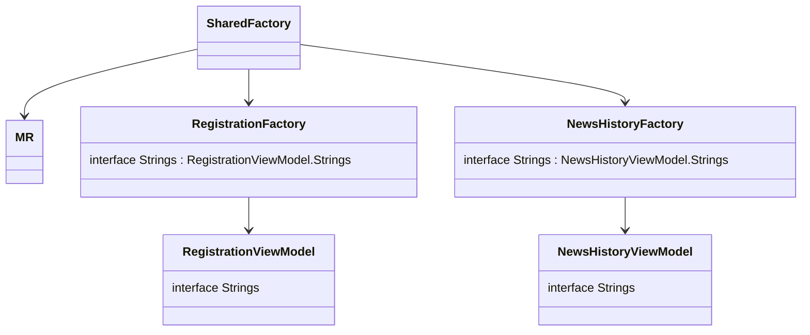

# Внедрение зависимостей и ресурсов

Про SharedFactory, про фактори фичей и тд

SF - обладает всеми фактори фичей, умеет их создавать предоставляя им зависимости
фактори фичей - умеют создавать все то, что им надо - вьюмодели и тд
ресурсы - тоже зависисмость. Фича говорит- вот интерфейс, вот эти ресурсы мне нужны снаружи

Shared видит что нужны такие ресурсы, делает реализацию интерфейса и передает в фичу

1. Шаблоном создаем ViewModel
1. Если нужны какие-то мультиплатформенные строчки - делаем интерфейс Strings, там объявляем переменные строк, которые нам нужны
   ```kotlin
        interface Strings {
             val examplePlaceholder: StringDesc
             val examplePlaceholder2: StringDesc
        }
   ```
   И в конструкторе просим реализацию этого интерфейса, SharedFactory при создании нашей VM прокинет нам необходимые строчки
1. Рядом с классом VM создаем интерфейс с созвучным фиче названием: RegistrationRepository. Там мы описываем все методы для работы с данными, которые нужны нашей вьюмодели 
1. В едином классе Repository мы добавляем, что реализуем в том числе и этот интерфейс RegistrationRepository, реализуем все методы, которые хочет эта вьюмодель и передаем ей в качестве репозитория себя: таким образом, класс репозитория у нас один, в нем реализованы все методы для работы с данными, которые нужны вьюмоделям. Но каждая вьюмодель видит только те методы, которые описаны в ее интерфейсе репозитория 

Например: вьюмодели RegistrationViewModel для своей работы нужены методы:
- sendCode(phoneNumber: String) - чтобы сервер отправил код подтверждения на телефон юзеру
- confirmCode(code: String) - чтобы сервер проверил, правильный ли введен код подтверждения
- saveUser(password: String) - чтобы завершить регистрацию и сохранить юзера на сервере

Соответственно, будет создан интерфейс:
```kotlin
interface RegistrationRepository {
    suspend fun sendCode(
       phoneNumber: String
    ): Int

    suspend fun confirmCode(
       code: String
    )

   suspend fun saveUser(
       password: String
    ): User
}

```




## Библиотека moko-resources

[github](https://github.com/icerockdev/moko-resources)

отправить читать ридми

Описать что делают, как помогают на мульиплатформе

рассказать про master.sh, какие есть параметры, как найти гуглтаблицу по файлу

задание: подключить библиотеку к проекту, вынести общие ресурсы

## master.sh

Для локализации мы используем интеграцию с google sheets т.к. можно передать заказчику и он сможет сам задать строчки 