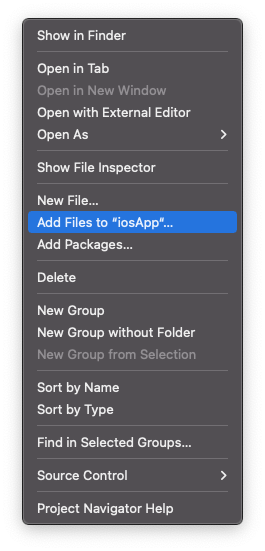
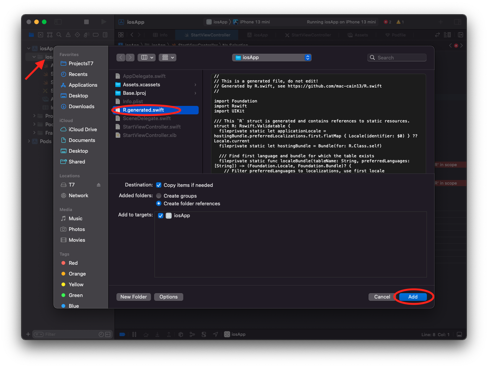

# Ресурсы на iOS

## R.swift
Для доступа к ресурсам на iOS мы используем библиотеку [R.swift](https://github.com/mac-cain13/R.swift). Она позволяет получить доступ ко всем ресурсам приложения, используя сгенерированный класс `R`. С полным список ресурсов, с которыми можно работать используя эту библиотеку, вы можете ознакомиться по [ссылке](https://github.com/mac-cain13/R.swift#features).  

## Инструкция по подключению
- [installation](https://github.com/mac-cain13/R.swift#installation)
- добавьте под `pod 'R.swift'`
- вызовите команду `pod install`
- добавьте скрипт для генерации `R` класса 
- соберите проект `command + B`
- добавьте `R.generated.swift` к файлам проекта
- 
- 

Когда вы добавили картинки, цвета и другие ресурсы в `Assets`, вы можете получить к ним доступ через `R.swift`, например: `R.image.somethingImage()`.

Некоторые ресурсы, такие как цвета, `R.swift` возвращает `nullable`. В этом случае `guard` обработку делать не нужно, потому что раз `R.swift` предоставил доступ к переменной, значит смог ее сгенерировать на основе цвета.  

Поэтому, чтобы узнать о том, что при наличии переменной ресурса самого ресурса нет - можно использовать форскаст. Если все таки произойдет ошибка - мы будем разбираться в причине(почему ресурс, который мы ожидали, отсутствует на устройстве), а если бы мы обработали `null` - то не узнали бы, что происходит такая ошибка.

## Практическое задание
- Используйте проект, готовый после раздела [Навигация между экранами](./navigation#практическое-задание)
- Подключите `R.swift` к iOS приложению
- Используйте `R.swift` для доступа ко всем ресурсам (строки, картинки, цвета) в iOS приложении
- Убедитесь что все работает