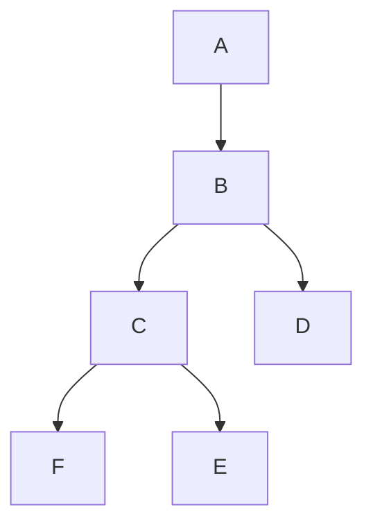

# Многомодульность

## Многомодульность
Мы в IceRock придерживаемся подхода многомодульности.  

- ***Что такое многомодульность?***
    - В `gradle` многомодульность - это когда один `gradle`-проект состоит из нескольких других `gradle`-проектов, которые имеют друг с другом связи и вместе собираются в некоторое приложение. 
    - В `iOS-мире` многомодульность - это когда проект разбит по отдельным библиотекам(фреймворкам). Есть таргет приложения, а есть отдельные таргеты библиотек, которые как-то там подключены к приложению, как-то между собой связаны и т.д.
  
  И там и там многомодульность ускоряет время сборки проекта, а также позволяет переиспользовать функционал модулей между проектами. В наших проектах многомодульность на `iOS` не используется, поэтому далее мы всегда будем говорить о многомодульности для `gradle`-проектов.
  
- ***Что такое модуль?***
    - Модуль - это объединенные одной задачей классы, функции, интерфейсы, структуры и тд., объединенные в один `gradle`-проект. Модули могут зависеть от других модулей, однако делать это нужно только тогда, когда это действительно необходимо.  
      Модуль знает о других модулях только то, что ему нужно для корректной работы в рамках самого себя.   

- ***Примеры модулей:***
  - `common` код - мультиплатформенный модуль
  - фичи приложения - отдельные модули
  - модуль с общими моделями для разных фичей

- ***Зачем вообще эти модули? Пусть бы все лежало в одном месте?***
  - Причина - время сборки `iOS`-приложения, [видео-описание](https://youtu.be/kO8RDq6OoV4?t=1429) проблемы

Начнем с разбора процесса сборки проекта для `iOS` и `Android`.
    
## Сборка Android

За сборку на `Android` отвечает `Gradle` и компилятор `Kotlin/JVM`. `Gradle` умеет хранить кеш уже собранного ранее модуля. Ориентируясь на это, он может определять какие модули действительно изменились или зависят от изменившихся. `Kotlin/JVM` поддерживает инкрементальную компиляцию.  

Если в двух словах, то это похоже на кеши гредла, только он хранит свои собственные, промежуточные файлы компиляции. Гредлу эти файлы недоступны, он по ним не сможет сделать никаких выводов. Почитать подробнее можно [тут](https://blog.jetbrains.com/kotlin/2020/09/the-dark-secrets-of-fast-compilation-for-kotlin/). Таким образом, ориентируясь на них, и на то, какие изменения были сделаны (в `public` или `private api`) `Kotlin/JVM` может пересобирать только реально изменившийся файл и добавлять его к уже собранным файлам. Те, кто от него зависят будут пересобраны только в случае изменений в `public api`.

Рассмотрим, как происходит компиляция `Android-проекта`. Градл, получив команду скомпилировать проект (задача `:assembleDevDebug` для `Build Variant: devDebug`) выполняет следующие действия, используя компилятор `Kotlin/JVM`:
- проверяет `input`-директории, убеждается, что они вообще есть. Если нет - пропустит задачу с причиной: `no source files`
- смотрит, есть ли у него в кеше результат для этого набора файлов? Если есть - возвращает результат
- если кеша не оказалось, пойдет вызывать `:assembleDevDebug` для компилятора `Kotlin/JVM`, передавая следующие параметры: какие файлы нужно компилировать, путь до директории, в которой можно хранить промежуточные файлы компиляции, путь до директории, где будет находится результат компиляции и тд. 
- вызывается компилятор `Kotlin/JVM`. Перед компиляцией каждого файла, который ему сказал скомпилировать `Gradle` он проверяет, есть ли в его директории промежуточных файлов компиляции для этого проекта, результат для нужного файла. Если нужный файлик есть - берет его, если файла нет или он изменился - компилирует.
- когда все закончил - отдает гредлу результат

## Сборка iOS  

Сборкой `Kotlin-кода` для `iOS` приложения  вместе с `Gradle` занимается `Kotlin/Native`, который не поддерживает инкрементальную компиляцию. По сути, мы собираем библиотеку "Общий код", которую будем подключать к `iOS` приложению. Во время сборки `iOS` приложения мы можем ориентироваться только на кеши гредла и на статические кеши компилятора `Kotlin/Native`.  

***Для начала разберем, как происходит сборка с нуля:*** 
1. Так как мы собираем библиотеку - она состоит из модулей фичи, зависимостей и прочих. Все эти модули сначала компилируются в `kLib` (`gradle task` - `:compileKotlinIosX64`). Это промежуточные файлы компиляции, они не содержат в себе итоговый бинарник. Это то, из чего `Kotlin/Native` впоследствии будет собирать итоговый `framework`.
1. После сборки каждого `kLib` градл сохраняет себе её кеш по хешу исходников. 
1. Когда все `kLib`-ы собраны, градл запускает таску `:linkFramework` собирать итоговый бинарник. `Kotlin/Native` начинает собирать итоговый бинарник: сначала собирает бинарник каждого `kLib` и кеширует его себе. Это и есть его статический кеш.
1. Затем компилятор линкует все полученные бинарники в один итоговый, для конкретной системы и возвращает результат гредлу

***Как происходят последующие сборки:***
1. градл подряд для всех модулей запускает задачи (`:compileKotlinIosX64` или `:compileKotlinIosArm64`) для компиляци `kLib` 
1. если по текущему хешу модуля не лежит никакой `kLib`, значит модуль изменился и надо сделать новый `kLib`
1. `Kotlin/Native` делает новую `kLib`, если градл не смог взять ее из кеша. Далее отдает ее гредлу, тот сохраняет ее себе по новому хешу
1. когда собрались все `kLib`, градл запускает задачку(`:linkFramework`): собирать `framework`(библиотеку) и передает все актуальные `kLib`
1. `Kotlin/Native` по хешу пришедших `kLib` определяет, есть у него для нее закешированный собранный бинарник или нет, если есть - берет его, если нет - собирает и сохраняет себе по новому хешу `kLib`. Потом из всех бинарников собирает итоговый 

## Пример
У нас есть 6 модулей. Модулю `A` для компиляции нужен модуль `B`, которому, в свою очередь, нужны `C` и `D`, а модулю `C` нужны `F` и `E`. Зависимости модулей друг от друга также представлены на графе:

Посмотрим, как будет происходить сборка приложения для `iOS` и `Android` в двух случаях:
- Разработчик сделал изменение в `public api` модуля `F`. Например, в публичной функции какого-нибудь класса модуля F, которую, соответственно, могут использовать за пределами файла, в котором она объявлена  
- Разработчик сделал изменение в `private api` модуля `F`.Например, в приватной функции какого-нибудь класса модуля F, которая, соответственно, может быть использована только в файле, в котором она объявлена

| api | Платформа | Выводы gradle | Выводы компилятора | Какие модули будут собираться | Время сборки |
|---|---|---|---|---|---|
| private |	Android | source-файлы изменились, значит нельзя ориентироваться на то, что я (gradle) собрал ранее. Hash модуля `F` изменился, пойду дам задачу компилятору `Kotlin/JVM`, чтобы собрал модуль `F`. После того, как компилятор соберет модуль `F`, я скажу ему собирать все модули, которые зависят от `F`, т.к. он изменился, это: `С`, `B` и `A` (задача компиляции для каждого модуля своя) | Первая задача, которую я (Kotlin/JVM) получил от гредла - компилировать модуль `F`. Ориентируясь на свои кеши инкрементальной компиляции я вижу, что изменения коснулись лишь одного файла, сами изменения находятся в `private api`. Поэтому, я пересоберу только этот файлик в модуле `F` и верну его гредлу. После этого, по очереди получу задачи компилировать модули `С`, `B` и `A`. Перекомпиливать их я не буду, потому что по своим кешам вижу, что модули не изменились, верну кеши.| Один файл из модуля `F` | очень быстро
| public | Android | Вывод точно такой же, как выше | Если в модуле `F` произошло добавление нового `public api`, которое еще нигде не используется, то пересоберется только изменившийся файл, в который оно добавилось. Если же произошло удаление или изменение `public api`, которое использовалось в каком-то другом модуле, то вместе с изменившимся файлом пересоберутся и все те, которые используют это изменившееся `public api` | Как минимум изменившийся файл модуля `F`, как максимум еще файлы других модулей, где используется изменившееся `public api`| быстро |
| public/private | iOS | Вывод аналогичный тому, что выше, только вызываться будет компилятор `Kotlin/Native` | Получил от `gradle` задачу собирать модуль `F`. Собрал, отдал, получил по очереди задачи собирать зависящие на `F` модули: `A`, `B`, `C` | `A`, `B`, `C`, `F` | медленно

## Как разбить проект на модули?
Как правило, модули в проектах - это либо фичи, либо какие-то модели данных и классы, которые используют разные фичи, разберем каждый из них: 

  - ***Фича***
    - фича подразумевает под собой какую-то часть логики приложения, поэтому новая фича - это всегда новый модуль. Например, приложение социальной сети имеет следующие фичи:
      - авторизации (все, что связано со входом приложение: регистрация, логин, сброс пароля и тд)
      - лента новостей и все действия с ней 
      - профиль и все действия с ним
      - настройки приложения 
      - и т.д
    
    Важно понимать, что фича - это не всегда один экран. Поэтому зачастую модуль ≠ экран.  
    Чтобы было проще проектировать фичи и понимать, что должно находиться в ней постарайтесь представить, как будет выглядеть приложение, если из него целиком убрать модуль какой-нибудь фичи. Если в приложении не осталось ничего, что как-то напоминает логику убранной фичи - значит фича спроектирована правильно.  
    Последнее замечание - модуль фичи никогда не должен ссылаться на модули других фичей, потому что тогда в разбиении проекта на модули не будет никакой пользы.

- ***Функционал, общий для нескольких фичей***  
    Часто так бывает, что какая-то модель данных нужна нескольким фичам сразу, например: класс `WallPost` - какой-либо пост в социальной сети, пригодится как в фиче новостей, так и в фиче просмотра конкретной страницы, потому что посты могут быть и там и там.
  
    Что следует выносить в общий модуль, а что предоставлять фиче как `Dependency injection`: 
    - Если видите, что какая-то структура или модель данных понадобится нескольким фичам, вынесите её в новый модуль
    - Если вы в процессе разработки подцепляете в модуле `A` модуль `B`, чтобы использовать какую-то его модель данных - сразу выносите эту модель в один модуль
    - Если то, что мы хотим использовать в нескольких фичах реализуется без зависимостей на другие модули - выносите в модуль. (упрощает DI: не надо никаких новых интерфейсов, не надо ничего никуда прокидывать и тд) 
    - Если в этом функционале есть какие-то зависимости от других модулей, то такой функионал следует подключать в mppLibrary к нужным фичам как `Dependency injection` или `Dependency inversion`   
    - Также, следите за тем, чтобы модули не зависели от тех, которые часто меняются. Например, если в модуле будут лежать строки локализации, которые стабильно пополняются и меняются на протяжении всей разработки проекта. Это приведет к тому, что зависящий от него модуль будет пересобираться каждый раз, когда добавляется или исчезает строка локализации 

## Shaper
Любое приложение - это набор фичей. Значит, часто приходится добавлять новые.  
Проблема - когда требуется создать новую фичу, то нужно сделать множество рутинных действий:

1. Создать директорию под новую фичу
1. Скопировать с другой фичи `build.gradle` для новой
1. Завести директорию `src/commonMain/kotlin` со структурой пакетов по `packageId` модуля
    1. `di`
    1. `model`
    1. `presentation`
1. Завести `src/androidMain/AndroidManifest.xml` с указанием там уникального `packageId`
1. Добавить `include` фичи в `settings.gradle` 
1. Подключить фичу в `mpp-library`

Это только начало создания фичи, далее потребуется создать `layout`-файлы, `Fragment`-ы для `Android`, `ViewController`-ы для `iOS` и многое другое.  
Чтобы не заниматься этим каждый раз вручную, мы в IceRock сделали генератор, который позволяет создать фичу, модуль, фрагмент, контроллер и прочее всего в несколько кликов!

Генератор - [Shaper](https://github.com/icerockdev/shaper/)

## Практика
- Используйте проект, созданный в разделе [Шаблон для новых проектов](./mobile-moko-boilerplate#практическое-задание)
- Добавьте две фичи вашего приложения (это заготовки на будущее, пока не переносите код из практики 3его блока)
  - **фича авторизации** - добавьте её в проект вручную
  - **фича репозиториев** - её добавьте в проект при помощи [shaper](https://github.com/icerockdev/shaper/), используйте [шаблон](https://gitlab.icerockdev.com/scl/boilerplate/mobile-shaper-templates/-/blob/master/kmm/kmm-feature.yaml) для создания новой фичи. Рекомендуем сначала попробовать сделать это самостоятельно, не пользуясь [Памяткой](../memos/shaper).
- Перенесите классы репозитория в новый проект (ориентируйтесь на практику 3его блока)
- Убедитесь, что проект компилируется
