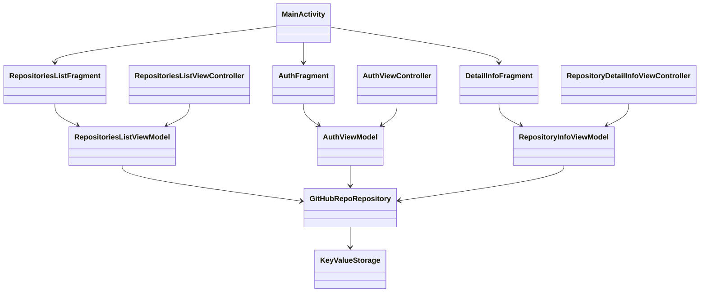

# Практическое задание
Нужно разработать мультиплатформенное приложение для просмотра GitHub репозиториев.

<iframe width="360" height="800" src="//www.figma.com/embed?embed_host=share&url=https%3A%2F%2Fwww.figma.com%2Fproto%2FMh3ga5XAzyJNCY87NBp01G%2FGit_test%3Fnode-id%3D4%253A600%26scaling%3Dmin-zoom%26page-id%3D0%253A1%26starting-point-node-id%3D4%253A645" allowfullscreen></iframe>

Во время работы над практическим заданием настоятельно рекомендуем обращаться к разделу [Памятки для разработчика](../../university/memos/best-practices)

## Функциональные возможности

1. Авторизация пользователя (personal access token)
1. Просмотр списка репозиториев пользователя (первые 10)
1. Просмотр детальной информации выбранного репозитория
    1. статистика (forks, stars, watchers)
    1. ссылка на web страницу репозитория
    1. лицензия
    1. readme

## Технические требования

1. В качестве шаблонного проекта использовать `mobile-moko-boilerplate`
2. После настройки нового проекта по [инструкции](https://confluence.icerockdev.com/pages/viewpage.action?pageId=69437109) он должен успешно проходить CI
3. Создать отдельные модули для: `common` кода, фичи авторизации, и фичи репозитория. 
4. Сохранять токен авторизации в хранилище устройства: `SharedPreferences` для `Android` и `NSUserDefaults` для `iOS`. Работу с хранилищем делегировать классу `KeyValueStorage`
5. Использовать `multiplatform-settings` для работы с хранилищем устройства
6. Использовать `moko-mvvm` для внедрения всех ее возможностей, о которых вы узнали [статьи](../../learning/libraries/moko/moko-mvvm) 
7. Использовать `moko-resources` для использования строк локализации приложения
8. Использовать `moko-units` для реализации списка репозиториев 
9. Вся логика должна находиться в `common` коде   
10. Навигация на `iOS` должна быть реализована используя `AppCoordinator`, без `storyboards`   
11. Логика хранения данных должна находиться в `common` коде
12. Логика работы с сетью должна находиться в `common` коде
13. Для работы с сетью использовать `Ktor Client`
14. При перезапуске приложения авторизация должна сохраняться
15. Использовать локализацию для всех строк, показываемых пользователю
16. Использовать векторную графику везде, где это возможно
17. Обеспечить поддержку Android API 21
18. Обеспечить поддержку iOS 13.0

## Классы приложения

### mpp-library
```kotlin
class AppRepository {
   
   @Throws(Exception::class)
   suspend fun getRepositories(): List<Repo> {
      // TODO:
   }

   @Throws(Exception::class)
   suspend fun getRepository(repoId: String): RepoDetails {
      // TODO:
   }

   @Throws(Exception::class)
   suspend fun getRepositoryReadme(
      ownerName: String,
      repositoryName: String,
      branchName: String
   ): String {
      // TODO:
   }

   @Throws(Exception::class)
   suspend fun signIn(token: String): UserInfo {
      // TODO:
   }

   // TODO:
}

class KeyValueStorage {
   var authToken: String?
   var userName: String?
}
```

### mpp-library-feature-auth
```kotlin
class AuthViewModel {
   val token: MutableLiveData<String>
   val state: LiveData<State>
   val actions: Flow<Action>

   fun onSignButtonPressed() {
         // TODO:
   }
   
   sealed interface State {
      object Idle : State
      object Loading : State
      data class InvalidInput(val reason: String) : State
   }
   
   sealed interface Action {
      data class ShowError(val message: String) : Action
      object RouteToMain : Action
   }

   // TODO:
}
```

### mpp-library-feature-repo
```kotlin
class RepositoryInfoViewModel {
   val state: LiveData<State>

   sealed interface State {
      object Loading : State
      data class Error(val error: String) : State

      data class Loaded(
         val githubRepo: Repo,
         val readmeState: ReadmeState
      ) : State
   }

   sealed interface ReadmeState {
      object Loading : ReadmeState
      object Empty : ReadmeState
      data class Error(val error: String) : ReadmeState
      data class Loaded(val markdown: String) : ReadmeState
   }

   // TODO:
}

class RepositoriesListViewModel {
   val state: LiveData<State>
   
   sealed interface State {
      object Loading : State
      data class Loaded(val repos: List<Repo>) : State
      data class Error(val error: String) : State
      object Empty : State
   }

   // TODO:
}
```

### android-app
```kotlin
class MainActivity: AppCompatActivity {
   // TODO:
}

class AuthFragment: Fragment {
   // TODO:
}

class RepositoriesListFragment: Fragment {
   // TODO:
}

class DetailInfoFragment: Fragment {
   // TODO:
}
```

### ios-app
```swift
class RepositoriesListViewController: UIViewController {
   // TODO:
}

class RepositoryDetailInfoViewController: UIViewController {
   // TODO:
}

class AuthViewController: UIViewController {
   // TODO:
}
```

## Диаграмма классов

На графе отображена зависимость компонентов KMM приложения друг от друга, цветами выделены подграфы:  
Фиолетовый - Common, Зеленый - Android, Синий - iOS



## Материалы

1. [mobile-moko-boilerplate](https://gitlab.icerockdev.com/scl/boilerplate/mobile-moko-boilerplate)
   - [инструкция](https://confluence.icerockdev.com/pages/viewpage.action?pageId=69437109) по созданию и настройке проекта на основе `mobile-moko-boilerplate`
2. [GitHub REST API](https://docs.github.com/en/rest)
3. [GitHub Basic Authorization](https://docs.github.com/en/rest/overview/other-authentication-methods#basic-authentication)
4. [GitHub user repositories](https://docs.github.com/en/rest/reference/repos#list-repositories-for-a-user)
5. [Kotlinx.Serialization guide](https://github.com/Kotlin/kotlinx.serialization/blob/master/docs/basic-serialization.md#json-decoding)
6. [Подключение Ktor Client](https://ktor.io/docs/gradle.html)
7. [Настройке запросов в Ktor Client](https://ktor.io/docs/request.html)
8. [multiplatform-settings](https://github.com/russhwolf/multiplatform-settings)
9. [Android Дизайн](https://www.figma.com/file/Mh3ga5XAzyJNCY87NBp01G/Git_test)
10. [iOS Дизайн](https://www.figma.com/file/XmpoCqkdWTGb2NGdR2bgiQ/Git_test-iOS)