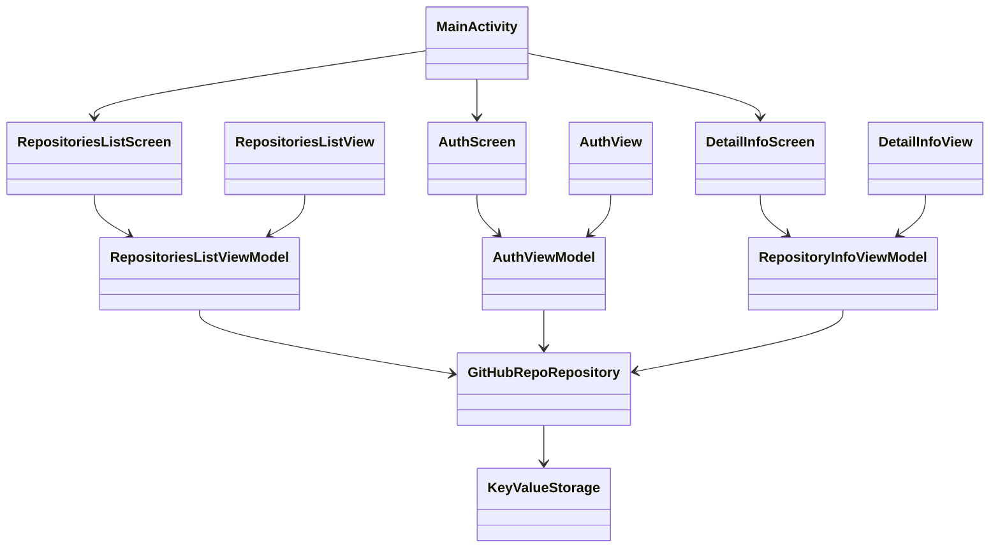

# Практическое задание
Нужно разработать мультиплатформенное приложение для просмотра GitHub репозиториев.

<iframe width="360" height="800" src="//www.figma.com/embed?embed_host=share&url=https%3A%2F%2Fwww.figma.com%2Fproto%2FMh3ga5XAzyJNCY87NBp01G%2FGit_test%3Fnode-id%3D4%253A600%26scaling%3Dmin-zoom%26page-id%3D0%253A1%26starting-point-node-id%3D4%253A645" allowfullscreen></iframe>

Во время работы над практическим заданием настоятельно рекомендуем обращаться к разделу [Памятки для разработчика](../../university/memos/best-practices)

## Функциональные возможности

1. Авторизация пользователя (personal access token)
1. Просмотр списка репозиториев пользователя (первые 10)
1. Просмотр детальной информации выбранного репозитория
    1. статистика (forks, stars, watchers)
    1. ссылка на web страницу репозитория
    1. лицензия
    1. readme

## Технические требования

1. В качестве шаблонного проекта использовать `mobile-moko-boilerplate`
2. После настройки нового проекта по [инструкции](https://confluence.icerockdev.com/pages/viewpage.action?pageId=69437109) он должен успешно проходить CI
3. Создать отдельные модули для: `common` кода, фичи авторизации, и фичи репозитория. 
4. Сохранять токен авторизации в хранилище устройства: `SharedPreferences` для `Android` и `NSUserDefaults` для `iOS`. Работу с хранилищем делегировать классу `KeyValueStorage`
5. Использовать `multiplatform-settings` для работы с хранилищем устройства
6. Использовать `moko-mvvm` для внедрения всех ее возможностей, о которых вы узнали из [статьи](../../learning/libraries/moko/moko-mvvm) 
7. Использовать `moko-resources` для использования строк локализации приложения
8. Использовать `moko-units` для реализации списка репозиториев 
9. Использовать `ExceptionMappersStorage` из `moko-errors` (не используйте `ExceptionHandler`)
10. Вся логика должна находиться в `common` коде
11. Используйте Koin для внедрения зависимостей
12. Навигация на `iOS` должна быть реализована используя `AppCoordinator`, без `storyboards`   
13. Логика хранения данных должна находиться в `common` коде
14. Логика работы с сетью должна находиться в `common` коде
15. Для работы с сетью использовать `Ktor Client`
16. Используйте доменные сущности, вместо сетевых
17. При перезапуске приложения авторизация должна сохраняться
18. Использовать локализацию для всех строк, показываемых пользователю
19. Использовать векторную графику везде, где это возможно
20. Обеспечить поддержку Android API 21
21. Локализовать проект используя `sheets-localizations-generator`
    - обеспечьте поддержку русского и английского языков
22. Обеспечить поддержку iOS 13.0
23. UI на Android реализовать на Jetpack Compose, на iOS — на SwiftUI

## Классы приложения

### mpp-library
```kotlin
class AppRepository {
   
   @Throws(Exception::class)
   suspend fun getRepositories(): List<Repo> {
      // TODO:
   }

   @Throws(Exception::class)
   suspend fun getRepository(repoId: String): RepoDetails {
      // TODO:
   }

   @Throws(Exception::class)
   suspend fun getRepositoryReadme(
      ownerName: String,
      repositoryName: String,
      branchName: String
   ): String {
      // TODO:
   }

   @Throws(Exception::class)
   suspend fun signIn(token: String): UserInfo {
      // TODO:
   }

   // TODO:
}

class KeyValueStorage {
   var authToken: String?
}
```

### mpp-library-feature-auth
```kotlin
class AuthViewModel(
    private val repository: AppRepository,
) : ViewModel() {
   val token: CMutableStateFlow<String> = MutableStateFlow("").cMutableStateFlow()
   val state: CStateFlow<State> // TODO: инициализация с начальным состоянием

   private val _actions: Channel<Actions> = Channel()
   val actions: CFlow<Actions> = _actions.receiveAsFlow().cFlow()

   fun onSignButtonPressed() {
         // TODO:
   }
   
   sealed interface State {
      data object Idle : State
      data object Loading : State
      data class InvalidInput(val reason: StringDesc) : State
   }
   
   sealed interface Actions {
      data class ShowError(val message: StringDesc) : Actions
      data object RouteToMain : Actions
   }

   // TODO:
}
```

### mpp-library-feature-repo
```kotlin
class RepositoryInfoViewModel(
    private val repository: AppRepository,
) : ViewModel() {
   val state: CStateFlow<State> // TODO: инициализация

   sealed interface State {
      data object Loading : State
      data class Error(val error: StringDesc) : State

      data class Loaded(
         val githubRepo: Repo,
         val readmeState: ReadmeState
      ) : State
   }

   sealed interface ReadmeState {
      data object Loading : ReadmeState
      data object Empty : ReadmeState
      data class Error(val error: StringDesc) : ReadmeState
      data class Loaded(val markdown: String) : ReadmeState
   }

   // TODO:
}

class RepositoriesListViewModel(
    private val repository: AppRepository,
) : ViewModel() {
   val state: CStateFlow<State> // TODO: инициализация
   
   sealed interface State {
      data object Loading : State
      data class Loaded(val repos: List<Repo>) : State
      data class Error(val error: StringDesc) : State
      data object Empty : State
   }

   // TODO:
}
```

### android-app
```kotlin
@AndroidEntryPoint
class MainActivity : FragmentActivity() {
   override fun onCreate(savedInstanceState: Bundle?) {
      super.onCreate(savedInstanceState)
      setContent {
         AppNavHost()
      }
   }
}

@Composable
fun AuthScreen(
   viewModel: AuthViewModel = koinViewModel()
) {
   // TODO: экран авторизации
}

@Composable
fun RepositoriesListScreen(
   viewModel: RepositoriesListViewModel = koinViewModel()
) {
   // TODO: список репозиториев
}

@Composable
fun DetailInfoScreen(
   viewModel: RepositoryInfoViewModel = koinViewModel()
) {
   // TODO: детальная информация о репозитории
}
```

### ios-app
```swift
@main
struct MobileApp: App {
   var body: some Scene {
      WindowGroup {
         AuthView()
      }
   }
}

struct AuthView: View {
   @ViewModelWrapper private var viewModel: AuthViewModel = Koin.instance.getAuthViewModel(params: ...)

   var body: some View {
      // TODO: экран авторизации
   }
}

struct RepositoriesListView: View {
   @ViewModelWrapper private var viewModel: RepositoriesListViewModel = Koin.instance.getRepositoriesListViewModel()

   var body: some View {
      // TODO: список репозиториев
   }
}

struct DetailInfoView: View {
   @ViewModelWrapper private var viewModel: RepositoryInfoViewModel = Koin.instance.getRepositoryInfoViewModel(params: ...)

   var body: some View {
      // TODO: детальная информация о репозитории
   }
}
```

## Диаграмма классов

На графе отображена зависимость компонентов KMP приложения друг от друга, цветами выделены подграфы:  
Фиолетовый - Common, Зеленый - Android, Синий - iOS


```mermaid
classDiagram
class AuthViewModel:::common
   
class RepositoryInfoViewModel:::common
   
class RepositoriesListViewModel:::common
   
class GitHubRepoRepository:::common
class KeyValueStorage:::common

class MainActivity:::android
class AuthScreen:::android
class RepositoriesListScreen:::android
class DetailInfoScreen:::android
class AuthView:::ios
class RepositoriesListView:::ios
class DetailInfoView:::ios

MainActivity --> AuthScreen
MainActivity --> RepositoriesListScreen
MainActivity --> DetailInfoScreen
AuthScreen --> AuthViewModel
RepositoriesListScreen --> RepositoriesListViewModel
DetailInfoScreen --> RepositoryInfoViewModel
   
RepositoriesListViewModel --> GitHubRepoRepository
AuthViewModel --> GitHubRepoRepository
RepositoryInfoViewModel --> GitHubRepoRepository
       
AuthView --> AuthViewModel
RepositoriesListView --> RepositoriesListViewModel
DetailInfoView --> RepositoryInfoViewModel
GitHubRepoRepository --> KeyValueStorage
```

## Материалы

1. [mobile-moko-boilerplate](https://gitlab.icerockdev.com/scl/boilerplate/mobile-moko-boilerplate)
   - [инструкция](https://confluence.icerockdev.com/pages/viewpage.action?pageId=69437109) по созданию и настройке проекта на основе `mobile-moko-boilerplate`
2. [GitHub REST API](https://docs.github.com/en/rest)
3. [GitHub Basic Authorization](https://docs.github.com/en/rest/overview/other-authentication-methods#basic-authentication)
4. [GitHub user repositories](https://docs.github.com/en/rest/reference/repos#list-repositories-for-a-user)
5. [Kotlinx.Serialization guide](https://github.com/Kotlin/kotlinx.serialization/blob/master/docs/basic-serialization.md#json-decoding)
6. [Подключение Ktor Client](https://ktor.io/docs/gradle.html)
7. [Настройке запросов в Ktor Client](https://ktor.io/docs/request.html)
8. [multiplatform-settings](https://github.com/russhwolf/multiplatform-settings)
9. [Koin](https://github.com/InsertKoinIO/koin)
10. [Android Дизайн](https://www.figma.com/file/Mh3ga5XAzyJNCY87NBp01G/Git_test)
11. [iOS Дизайн](https://www.figma.com/file/XmpoCqkdWTGb2NGdR2bgiQ/Git_test-iOS)
