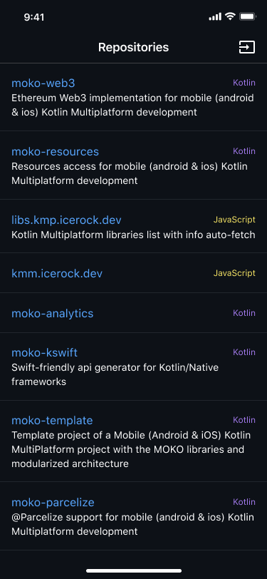
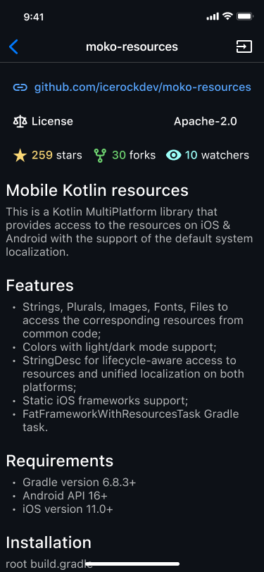
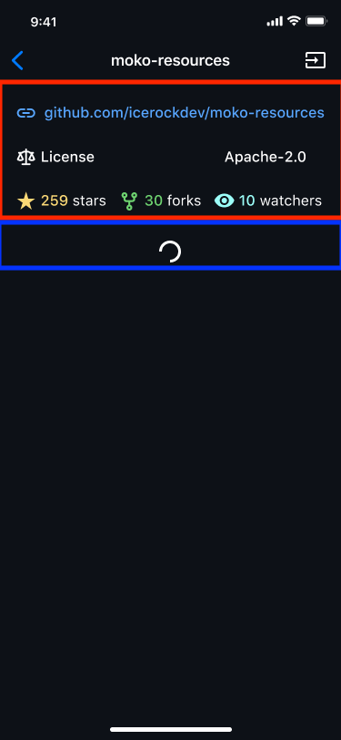

# Построение экранов вертикальными списками

В мобильных приложениях наиболее распространен интерфейс с вертикальной прокруткой (scroll) экрана. Это связано с форм-фактором устройств и количеством контента, который нужно показывать пользователю.

Для реализации таких экранов используются два подхода:
- `RecyclerView`/`UITableView` с переиспользованием элементов при прокрутке - этот подход используется в любой ленте или списке однотипных элементов;
- `ScrollView`/`UIScrollView` с ручной версткой содержимого, которое должно быть в scroll. Данный подход используется чаще всего на экранах с где контент не является набором однотипных элементов, но не влезает на экран устройства полностью.

| `RecyclerView` / `UITableView` | `ScrollView` / `UIScrollView` |
| ----- | ----- |
|  |  |

Первый вариант экранов, с однотипными списками элементов, достаточно очевидно как можно использовать с общей логикой - собираем список с данными в `ViewModel`, а на UI передаем эти данные в `Adapter`/`DataSource`. 

Для второго же предполагается много ручной работы по верстке UI под конкретное расположение элементов и выдачу данных из `ViewModel` отдельными полями.

Мы используем подход по построению практически любого экрана с вертикальной прокруткой через первый вариант - `RecyclerView`/`UITableView`. Аналогичный подход используют Airbnb в своей библиотеке [epoxy](https://github.com/airbnb/epoxy).

Это позволяет нам контролировать содержимое экрана из общей логики, частично управляя и расположением и видимостью элементов на UI. По сути экран бьется на строки - вертикальные блоки, которые мы назвали `Unit` (элемент). Разберем приведенный выше пример, вот как можно разбить на блоки:

|  |  |
| ----- | ----- |
|  |  |

## moko-units

Библиотека [moko-units](https://github.com/icerockdev/moko-units) позволяет нам реализовать описанный выше подход с управлением составом отображаемых на UI блоков из общего кода. Со стороны каждой платформы интеграция очень простая и стандартная. Вся основная работа состоит в том, чтобы сверстать все блоки и прописать логику их создания из `sealed interface` находящегося в общем коде.

Посмотрите видео материал с подробным пояснением причин обобщения реализации между платформами и принципами работы.

<iframe src="//www.youtube.com/embed/ES6lHIwp5Jw?list=PL6yFiPOVXVUi90sQ66dtmuXP-1-TeHwl5" frameborder="0" allowfullscreen width="675" height="380"></iframe>

## Практическое задание
- Используйте проект, готовый после раздела [Ресурсы на iOS](./ios-resources#практическое-задание)
- Подключите `moko-units`
- Реализуйте логику построения списков в общем коде (только для списка репозиториев)
- iOS и Android приложения должны работать
