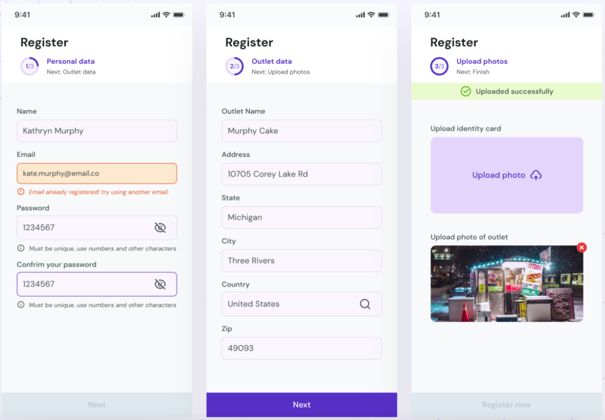

# Вводная

Поздравляем! Вы прошли первые 4 блока, теперь вы не только знаете как применять KMM на практике, но, также, знакомы с основными подходами разработки, используемыми в IceRock.  
Начиная с этого блока вы будете изучать решение типовых задач, с которыми обязательно предстоит столкнуться на проектах. Также, вы будете добавлять новый и обновлять старый функционал в своем GitHub-приложении.  

В этом блоке вы разберетесь с реализацией форм ввода - элемента, без которого не обходится практически ни одно приложение, а также 
- Что стоит учитывать при реализации форм ввода
- Использование библиотеки moko-fields, для упрощения реализации форм ввода
- Использование библиотеки moko-errors, для отображения пользователю информации об ошибке
- Использование библиотеки moko-network, для получения от сервера ошибок валидации полей (те случаи, которые мы не можем проверить без сервера)

## Примеры форм ввода:

