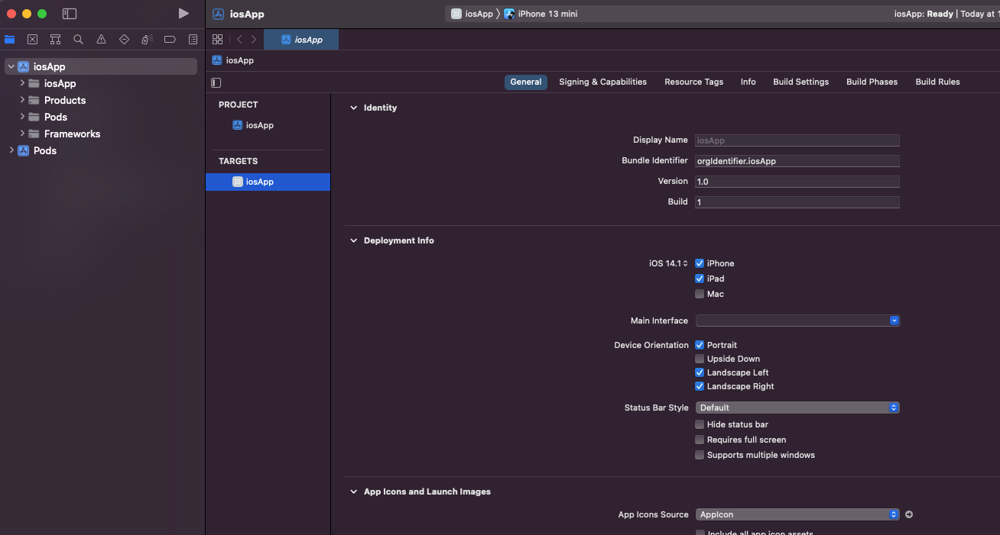
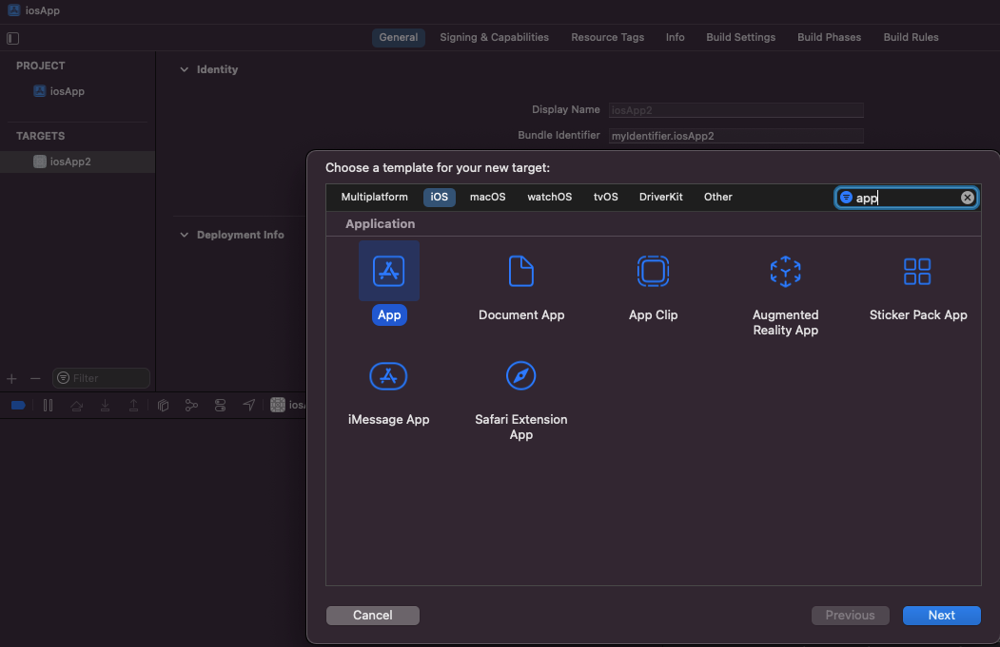
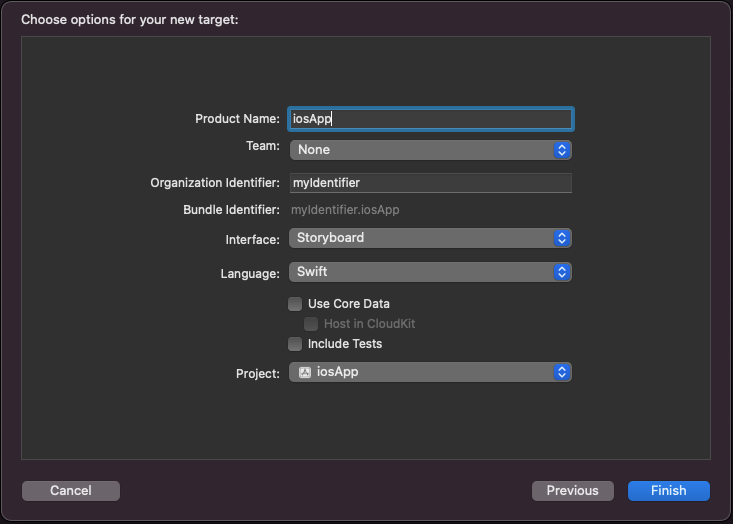

# Downgrade from SwiftUI and Storyboard

## Переход со SwiftUI на UIKit
Если вы создаете проект по [инструкции](https://kotlinlang.org/docs/kmm-create-first-app.html), то заметите, что iOS приложение создастся используя SwiftUI, а на UIKit.

Чтобы использовать UIKit, вместо SwiftUI выполните следующие шаги: 
1. Удалите существующий target.

1. Создать новый target - App (кнопка плюс в столбце targets).

1. Название таргета можно выбрать любое, однако, если назовете не iosApp, то обновите название тагрета еще и в Podfile. Также, убедитесь, что выбираете interface - Storyboard, а не SwiftUI.

   
## Избавление от Storyboard
Вам может понадобиться избавиться еще и от Storyboard, для этого выполните действия по [инструкции](https://medium.com/swift-productions/ios-start-a-project-without-storyboard-xcode-12-253d785af5e7#:~:text=Navigate%20to%20the%20Info.,it%20with%20the%20minus%20button)
