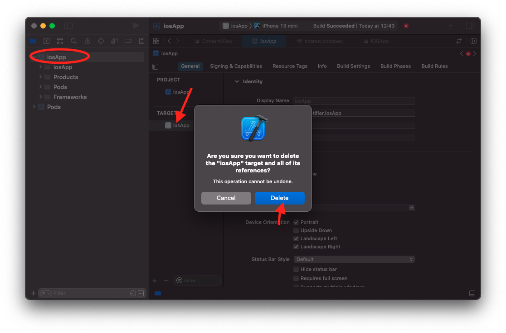
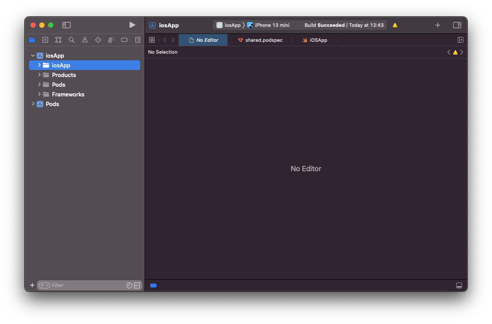
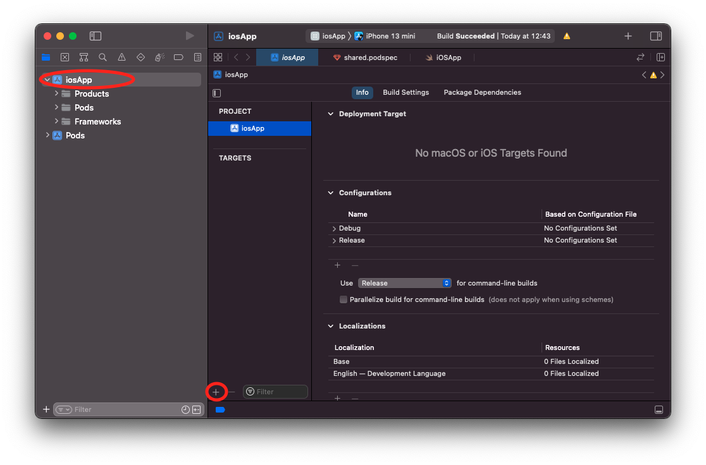
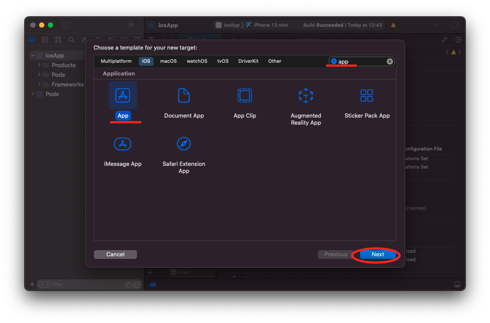
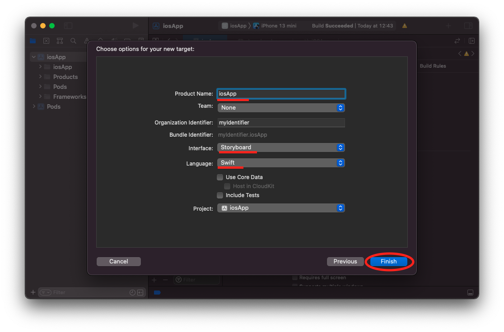

# Как прейти от SwiftUI к UIKit

Если вы создаете проект по [инструкции](https://kotlinlang.org/docs/kmm-create-first-app.html), то заметите, что iOS приложение создастся используя SwiftUI, а на UIKit.

Чтобы использовать UIKit, вместо SwiftUI выполните следующие шаги: 
1. Удалите существующий target.

   
1. Удалите сами файлы тагрета


1. Создать новый target



1. Название таргета можно выбрать любое, однако, если назовете не iosApp, то обновите название тагрета еще и в Podfile.
    ```
    target 'iosApp' do
      use_frameworks!
      platform :ios, '14.1'
      pod 'shared', :path => '../shared'
    end
    ```
1. Также, убедитесь, что выбираете interface - Storyboard, а не SwiftUI.
